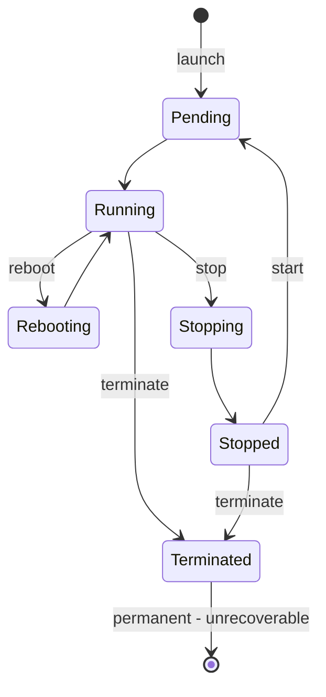
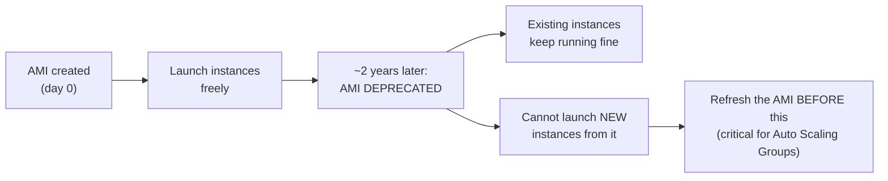
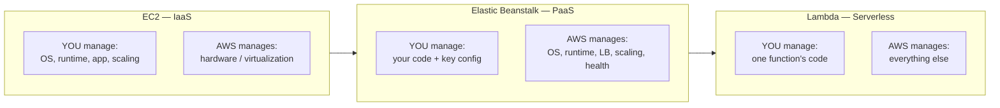
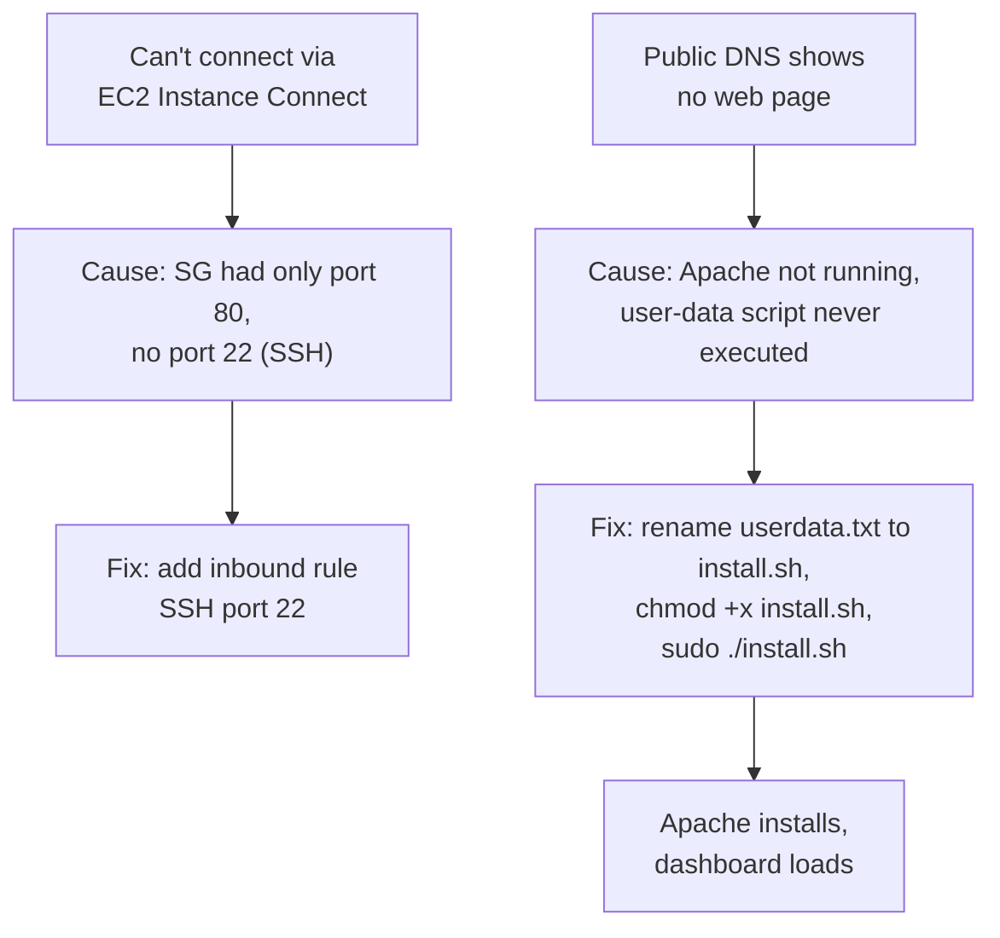
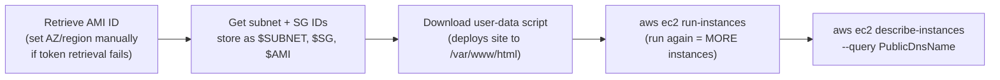
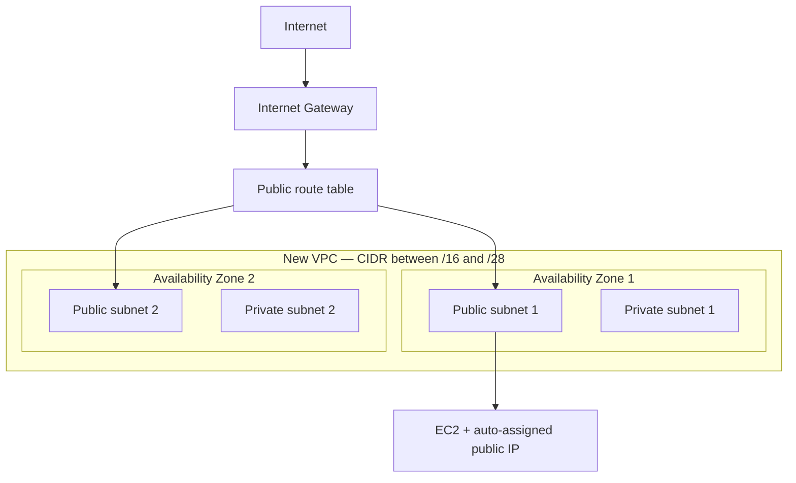
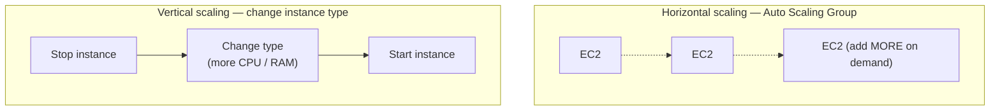
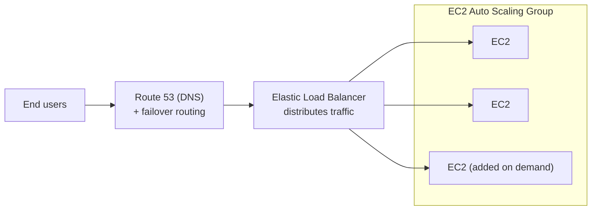

# Lecture Notes — June 10, 2026
**Cohort 3 | Project CloudIgnite**
**Topics:** EC2 Instance Lifecycle & Management, AMI Deprecation, AWS Elastic Beanstalk, EC2 Launch via Console & CLI, VPC/Security Group Troubleshooting, Intro to Elastic Load Balancing & Auto Scaling
**Duration:** ~3 hours

---

## Key Takeaways
- **EC2 lifecycle states:** pending → running → stopping → stopped → terminated; **terminated is permanent and unrecoverable**
- **Billing in stopped state:** no compute charge, but **EBS storage still billed**; also billed during the brief "stopping" transition
- **Instance Store vs EBS:** Instance Store is ephemeral (data lost on stop/restart); EBS is persistent (preserved across stop/start)
- **IP behavior:** Public IP changes on every stop/start; **Elastic IP** is a static, reassignable public IP
- **AMI deprecation:** custom AMIs deprecated ~2 years after creation; existing instances keep running, but new launches are blocked (critical to refresh AMI in time for ASGs)
- **Elastic Beanstalk** = PaaS: AWS manages OS, runtime, scaling; you upload code; **no additional charge** — pay only for underlying EC2/EBS/RDS
- **Modifying instance type:** must stop the instance first; new type's architecture must be compatible
- **Security Group = instance-level stateful firewall** (default deny inbound); NACL = subnet-level stateless

---

## Table of Contents
1. [EC2 Instance Lifecycle & States](#1-ec2-instance-lifecycle--states)
2. [Billing Implications of Instance States](#2-billing-implications-of-instance-states)
3. [Data Persistence: Instance Store vs EBS](#3-data-persistence-instance-store-vs-ebs)
4. [Public IP Behavior & Elastic IP](#4-public-ip-behavior--elastic-ip)
5. [Modifying an EC2 Instance](#5-modifying-an-ec2-instance)
6. [AMI Deprecation](#6-ami-deprecation)
7. [Checkpoint Quiz Recap](#7-checkpoint-quiz-recap)
8. [AWS Elastic Beanstalk](#8-aws-elastic-beanstalk)
9. [Lab: Launching EC2 via Console & Troubleshooting LAMP Deployment](#9-lab-launching-ec2-via-console--troubleshooting-lamp-deployment)
10. [Launching EC2 via AWS CLI](#10-launching-ec2-via-aws-cli)
11. [Challenge Lab: New VPC + EC2 + Security Group Troubleshooting](#11-challenge-lab-new-vpc--ec2--security-group-troubleshooting)
12. [Intro: Elastic Load Balancing, Auto Scaling, Route 53](#12-intro-elastic-load-balancing-auto-scaling-route-53)
13. [CLF-C02 Exam Relevance Summary](#13-clf-c02-exam-relevance-summary)

---

## 1. EC2 Instance Lifecycle & States

- **Pending** → instance is launching; takes time before it becomes available.
- **Running** → instance is active and usable.
- From running, you can: **reboot**, **stop**, or **terminate**.
- **Reboot** → goes through a temporary "rebooting" state before returning to "running" (not instant).
- **Stop** → goes through a temporary "stopping" state before reaching "stopped" (not instant).
- **Terminate** → instance enters "terminated" state — **this is permanent and unrecoverable**.
- From a **stopped** state, you can either **start** the instance again or **terminate** it.

#### Visual: EC2 instance lifecycle (state machine)
*Follow the arrows: reboot and stop are recoverable; **terminate is a one-way door**.*



### Instance Hibernation
- Hibernation = instance consumes very little power (not fully running), but RAM state is **preserved**.
- On resume, the instance starts faster and resumes exactly where it left off (in-memory state preserved).
- **Not available for all instance types** — has specific requirements (see Section 5).

---

## 2. Billing Implications of Instance States

| State | Do you pay? |
|---|---|
| Running | ✅ Yes (compute charges) |
| Stopping | ✅ Yes — billed for the transition period (even if it's just seconds/a minute) |
| Stopped | ✅ Yes for **EBS volume storage** (not for compute) |
| Terminated | ❌ No (instance is gone — by default, root EBS volume is also deleted unless configured otherwise) |

**Key takeaway:** Even a *stopped* instance generates EBS storage cost.

---

## 3. Data Persistence: Instance Store vs EBS

| Storage Type | Persistence Behavior |
|---|---|
| **Instance Store** | Temporary. Data is **lost** if instance is stopped/restarted. |
| **EBS (Elastic Block Store)** | Persistent. Data is **preserved** across stop/start. |

### Termination & EBS
- By default, the **root EBS volume is deleted on termination**.
- This is controlled by the **"Delete on Termination"** setting:
  - Set to **Yes** → EBS volume deleted when instance terminates.
  - Set to **No** → EBS volume is retained after termination.

---

## 4. Public IP Behavior & Elastic IP

- A normal **public IP address changes** every time you stop and start an instance (it's automatically reassigned).
- If you need a **static** IP that persists across stop/start and can be **reassigned to different instances**, use an **Elastic IP**.

> **Checkpoint Q&A:** An engineer rebooted an instance and it worked fine. After stopping and restarting it the next day (instance shows "running"), users can't access the app.
> **Answer:** The **public IP address changed** after stop/start — users were likely still using the old IP/DNS.

---

## 5. Modifying an EC2 Instance

### Why design for quick start/stop?
- Supports **horizontal scalability** (Auto Scaling Groups need to launch/terminate instances quickly).
- Faster OS upgrades, faster repair, cost savings.

### Steps to change instance type
1. **Stop** the instance first (cannot resize while running).
2. Modify via:
   - AWS Management Console (Actions → Instance Settings → Change Instance Type), **or**
   - AWS CLI command to change instance type (e.g., to `m4.large`).

### Conditions to modify instance type
1. Instance must be **stopped**.
2. New instance type's **architecture must be compatible** (e.g., both must support 64-bit).
3. (For hibernation specifically) Instance **must have an EBS root volume** — otherwise RAM state can't be preserved.

### OS/Software Updates
- You are responsible for periodically updating OS, security patches, and tools.
- Can use **AWS Systems Manager** and **OpsWorks** to manage/automate updates.

---

## 6. AMI Deprecation

- **AMI (Amazon Machine Image)** = a template used to quickly launch EC2 instances (includes OS, configuration, etc.).
- AMI sources: provided by **AWS**, **shared by other users**, or **created by you**.
- **Custom AMIs are deprecated ~2 years after creation date.**
- Effect of deprecation:
  - Existing instances launched from that AMI **continue to run fine** — no issue.
  - You **cannot launch new instances** using a deprecated AMI.
  - You must update/refresh your AMI before it deprecates, especially important for **Auto Scaling Groups** that rely on AMIs to launch new instances.

#### Visual: AMI deprecation timeline
*Deprecation does not break running instances — it only blocks new launches, which is why ASGs need a fresh AMI in time.*



---

## 7. Checkpoint Quiz Recap

| Question | Answer |
|---|---|
| Template used to launch EC2 instances | **AMI** |
| Acts as a firewall at the **instance** level (vs. subnet level) | **Security Group** (NACL = subnet level) |
| IP type that is static and reassignable between instances | **Elastic IP** |
| Purpose of an Instance Profile | Assigns an **IAM role to an EC2 instance** |
| What is the cost of using Elastic Beanstalk? | **No additional charge** — you only pay for underlying resources used (EC2, EBS, RDS, etc.) |

---

## 8. AWS Elastic Beanstalk

### Conceptual Comparison

| Service | Type | Who manages OS/runtime? | Deployment unit |
|---|---|---|---|
| **EC2** | IaaS (Infrastructure as a Service) | You (full responsibility) | Full VM — you configure OS, runtime, app |
| **Elastic Beanstalk** | PaaS (Platform as a Service) | AWS manages OS + app environment | Complete server/application (you just upload code) |
| **Lambda** | PaaS / Serverless | AWS manages everything | Small unit of code (single function/task) |

#### Visual: Who manages what — IaaS vs. PaaS vs. Serverless
*Moving left → right, AWS takes over more of the stack and you manage less.*



### What Elastic Beanstalk Does
- You choose the OS/language stack (e.g., Red Hat Linux, Node.js, Java) — **AWS installs, patches, and maintains it**.
- AWS handles: OS upgrades, security patches, language runtime/interpreter, application server, load balancing, auto scaling, and health monitoring.
- You retain control over key configuration: EC2 instance type, database choice, auto-scaling settings, load balancer options.

### Supported Languages/Platforms
Java, .NET, PHP, Node.js, Python, Ruby, Go, and **Docker** (containers).

### Benefits
- Increased **developer productivity** (focus only on code).
- Built-in **scalability**.
- **Reduced management complexity** (no manual patching/upgrades of OS or runtime).

### Cost Model
- **No charge for Elastic Beanstalk itself** — you only pay for the underlying AWS resources it provisions (EC2, EBS, RDS, etc.).

### Auto Scaling Group (brief mention)
- Scales the **number of EC2 instances** (horizontal scaling) — not CPU/RAM of a single instance.
- Triggers can be based on CPU usage, network traffic, queue length, etc.

---

## 9. Lab: Launching EC2 via Console & Troubleshooting LAMP Deployment

**Scenario:** A bakery (Sophia/Frank/Martha's business) previously had a **static website** (for displaying info only). They now want an **online ordering system**, which requires a dynamic backend → decided to use a **LAMP stack** (**L**inux, **A**pache, **M**ariaDB, **P**HP).

Sophia attempted deployment via a **user data script** (for repeatability) but something went wrong — this lab is the troubleshooting exercise.

### Steps to Launch EC2 (Console)
1. **Launch Instance** → name/tag it (e.g., "bastion host").
2. Choose **AMI**: Amazon Linux.
3. Choose **instance type**: T3.micro.
4. **Key pair**: "Proceed without a key pair" (not recommended, but used for lab purposes).
5. **Network settings**:
   - Select the **correct VPC** (e.g., "Lab VPC", not default).
   - Use **public subnet**.
   - Enable **auto-assign public IP**.
   - Create a new **security group** — keep the SSH (port 22) rule.
6. **Storage**: Default EBS GP3 volume, 8 GB.
7. **Advanced Details**: ⚠️ **Set the Instance Profile** — critical step, easy to skip, hard to fix later if missed.
8. Launch instance → wait for status checks (System status check + Instance status check) to turn **green**.

### Connecting to the Instance
- Use **EC2 Instance Connect** (not SSM Session Manager) — this works over **SSH (port 22)** under the hood.
- Requires **port 22 open** in the security group's inbound rules.

### Troubleshooting Misconfigured Instance (Challenge)
**Problem 1:** Couldn't connect via Instance Connect.
- **Cause:** Security group only had port 80 open, no port 22.
- **Fix:** Add inbound rule for SSH (port 22).

**Problem 2:** Public DNS didn't load a web page.
- **Cause:** Web server (Apache) wasn't actually running — user data script hadn't executed.
- **Fix:**
  1. Download/locate the user data script (it was a `.txt` file).
  2. Rename `userdata.txt` → `install.sh` (text files can't be executed directly — must be a script).
  3. Give execute permission: `chmod +x install.sh`
  4. Run with elevated privileges: `sudo ./install.sh`
- Result: Apache installs and dashboard becomes accessible.

> **Key concept:** User data = a bash script that runs on first boot. Must have execute permission and proper file extension/handling to run.

#### Visual: LAMP lab troubleshooting (two failures, two fixes)
*Connectivity problems trace to the security group; a blank page traces to the user-data script never running.*



---

## 10. Launching EC2 via AWS CLI

### Workflow

#### Visual: CLI launch workflow (overview before the steps)
*Gather the IDs into variables first, then a single `run-instances` call creates the server; describe it to get the public DNS.*



1. **Retrieve AMI ID** dynamically (newer metadata retrieval requires a token — may need to **set values manually** if the automated script fails):
   ```bash
   # If automated retrieval fails, set manually:
   export AZ=us-west-2a
   export region=us-west-2
   ```
2. **Retrieve subnet ID** and **security group ID** — store in environment variables (`$SUBNET`, `$SG`, `$AMI`, etc.) so you don't need to re-type them.
3. **Download the user data script** (prepared by AWS) — this script downloads a `.zip`/`.gz` file and extracts it to `/var/www/html` to deploy a basic website.
4. **Launch the instance**:
   ```bash
   aws ec2 run-instances \
     --image-id $AMI \
     --subnet-id $SUBNET \
     --security-group-ids $SG \
     --user-data file://userdata.txt \
     --instance-type t3.micro \
     --tag-specifications 'ResourceType=instance,Tags=[{Key=Name,Value=web-server}]' \
     --query 'Instances[0].InstanceId'
   ```
   - Running this command **multiple times launches multiple separate instances** (does not overwrite/replace existing ones).

5. **Describe instances**:
   ```bash
   # All instances
   aws ec2 describe-instances

   # Specific instance
   aws ec2 describe-instances --instance-ids <instance-id>

   # Get just the public DNS name (text output)
   aws ec2 describe-instances --instance-ids <instance-id> \
     --query 'Reservations[0].Instances[0].PublicDnsName' --output text
   ```

### Practical Takeaways
- CLI launches are **faster and repeatable** compared to clicking through the console — can be saved as a **bash script** for future use.
- Use `--query` with JSONPath-like syntax to extract specific fields (e.g., Public DNS, Public IP) from CLI JSON output.
- Watch out for **unexpected newlines** when copying multi-line commands — they can break execution.

---

## 11. Challenge Lab: New VPC + EC2 + Security Group Troubleshooting

**Task:** Use the Management Console to:
1. Create a **new VPC** (with new subnets).
2. Launch a **T3.micro EC2 instance** in the new VPC's public subnet with **auto-assigned public IP**.
3. Use **user data** to install/start HTTP service (Apache) and set correct permissions on the web root.
4. Use **GP2** storage (not GP3, per challenge requirements).
5. Configure security so you can connect via **SSH**.
6. Create `projects.html`, move it to `/var/www/html/`, and verify via browser.

### VPC Creation Notes
- Used **"VPC and more"** option — automatically creates:
  - Internet Gateway
  - Route tables (public/private)
  - Subnets (2 public, 2 private)
- **CIDR block**: Must be between **/16 and /28**.
  - A **/22** CIDR → ~1,000 available IP addresses (smaller number = larger range).
  - Smaller CIDR number = **more** IPs available; larger CIDR number = **fewer** IPs.
- **NAT Gateway**: set to **None** for this lab (not required).
- **S3 Gateway Endpoint**: not needed for this lab — used only when you want private connectivity between EC2 and S3 without going over the public internet. (A "request limit exceeded" error appeared because of this — safe to ignore if everything else succeeds.)

#### Visual: What "VPC and more" builds for you
*One option auto-creates the Internet Gateway, route tables, and 2 public + 2 private subnets across two AZs. (Smaller CIDR number = MORE IPs.)*



### Security Group Setup
- Create a **new security group** explicitly associated with the **new ("Challenge") VPC** — NOT the default VPC's security group.
- Add inbound rules:
  - **SSH (port 22)** — Anywhere (IPv4)
  - **HTTP (port 80)** — Anywhere (IPv4)
- **Outbound rule**: Leave as default — **Allow all traffic**. Do not restrict/remove the default outbound rule, or connectivity will break.

### Common Troubleshooting Issues Encountered
| Symptom | Root Cause | Fix |
|---|---|---|
| Can't connect via Instance Connect | Editing the **wrong security group** (default instead of the new "web server" SG) | Identify the SG actually attached to the instance (check instance's Security tab) and edit **that one** |
| No public IP shown | Auto-assign public IP wasn't enabled at launch | Actions → Networking → Manage IP Addresses → enable Auto-assign Public IP → Save → refresh |
| Port 80/22 "not open" even after adding rules | Outbound rule had been **deleted/misconfigured** | Outbound rule must allow **all traffic**; re-add inbound rules for SSH (22) and HTTP (80) |
| Webpage doesn't load `projects.html` | Forgot to specify the file path | Append `/projects.html` to the public IP/DNS in the browser URL |

---

## 12. Intro: Elastic Load Balancing, Auto Scaling, Route 53

### Elastic Load Balancing (ELB)
- Sits **between end users and backend servers**.
- **Distributes incoming traffic** across multiple EC2 instances (could be 5, 10, 100+ servers).
- Types to be covered later: **Application Load Balancer**, **Network Load Balancer**, etc.

### EC2 Auto Scaling Group
- Automatically **adds or removes EC2 instances** based on demand (traffic spikes/drops).
- Scaling can be triggered by:
  - **Traffic/load** (e.g., CPU usage, network bandwidth)
  - **Time** (scheduled scaling — e.g., higher traffic during business hours)
  - **Events** (e.g., queue depth)
- Example use case: handling a flash-sale traffic spike (e.g., "11.11" or "12.12" sales) — scale out during the event, scale back in afterward.
- **Benefits**: fault tolerance, high availability, better performance, and cost optimization (pay only for extra capacity while needed).
- Important distinction: Auto Scaling **adds more instances (horizontal scaling)** — it does **not** increase RAM/CPU of an existing instance (that would require **stopping the instance and changing instance type** — vertical scaling).

#### Visual: Horizontal vs. vertical scaling
*ASG scales OUT by adding identical instances (no downtime); going bigger (vertical) means stopping ONE instance and changing its type.*



- New instances in an Auto Scaling Group are launched from a configured **AMI** (the AMI must be kept up to date — ties back to AMI deprecation in Section 6).

### Route 53 (brief mention)
- AWS's **DNS service**.
- Will cover **failover routing** — automatically redirects traffic to a secondary/backup server if the primary server fails.

#### Visual: How the three services fit together
*Route 53 resolves the name and can fail over; the load balancer spreads requests; the Auto Scaling Group adds/removes the instances behind it.*



### Troubleshooting Knowledge Base — Upcoming Focus Categories
1. **Compute**
2. **Automation/Optimization**
3. **Networking**

---

## 13. CLF-C02 Exam Relevance Summary

This session is **heavily relevant** to the CLF-C02 exam, particularly under the **Cloud Technology and Services** and **Cloud Concepts** domains.

- **EC2 instance lifecycle & billing** (Section 1–2): Commonly tested — understand that you're billed for "stopping" time and for EBS storage even when an instance is stopped, and that "terminated" is irreversible.
- **Instance Store vs. EBS** (Section 3): Classic exam topic — know which storage type is ephemeral vs. persistent.
- **Elastic IP vs. dynamic public IP** (Section 4): Frequently tested distinction.
- **Security Group vs. NACL** (Section 7): One of the most commonly tested comparisons — **Security Group = instance-level stateful firewall**, **NACL = subnet-level stateless firewall**.
- **Instance Profile / IAM roles for EC2** (Section 7): Tested concept — how EC2 instances securely access other AWS services without hardcoded credentials.
- **AMI and AMI deprecation** (Section 6): Understand AMIs as templates and their role in Auto Scaling.
- **Elastic Beanstalk** (Section 8): Core PaaS service — exam often tests **IaaS (EC2) vs. PaaS (Elastic Beanstalk) vs. Serverless (Lambda)** distinctions, and that **Elastic Beanstalk itself has no additional cost**.
- **VPC fundamentals** (Section 11): Subnets, CIDR block sizing (/16–/28), Internet Gateway, route tables, NAT Gateway, and VPC endpoints (S3 Gateway Endpoint) are all exam-relevant networking topics.
- **Elastic Load Balancing & Auto Scaling Group** (Section 12): Core **high availability, elasticity, and cost-optimization** concepts — strongly aligned with the AWS Well-Architected Framework pillars (Reliability, Performance Efficiency, Cost Optimization) covered in earlier sessions.
- **Route 53 & failover routing** (Section 12): Will be tested as part of high-availability architecture questions.

**Practical/Lab content** (AWS CLI commands, security group troubleshooting, user data scripts) is less likely to appear directly on the CLF-C02 (which is conceptual/foundational), but builds the hands-on familiarity needed for later associate-level certifications and reinforces understanding of the underlying concepts that **are** tested.

---

*Notes generated from lecture transcript dated June 10, 2026 (Cohort 3: Project CloudIgnite). Instructor mentioned the target exam date is in July 2026 — review priority should shift toward consolidating concepts covered so far.*