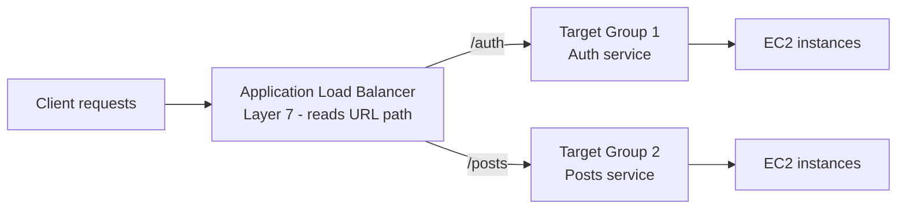
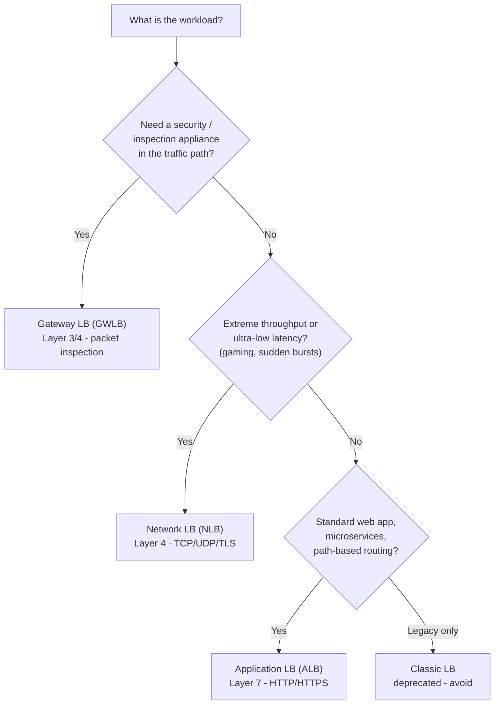
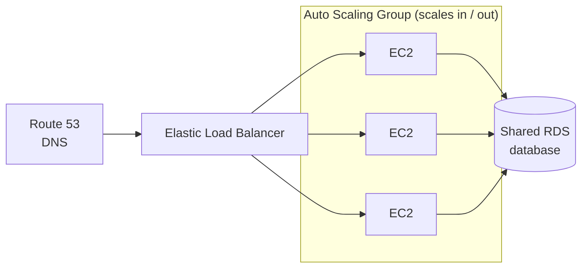
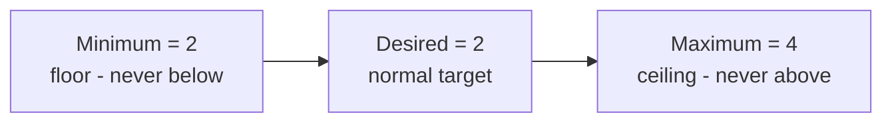
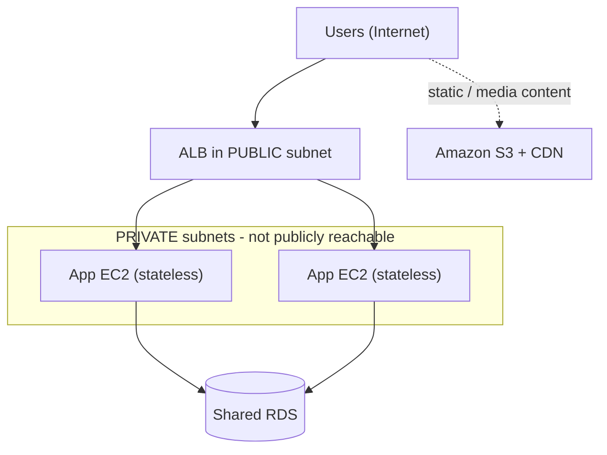
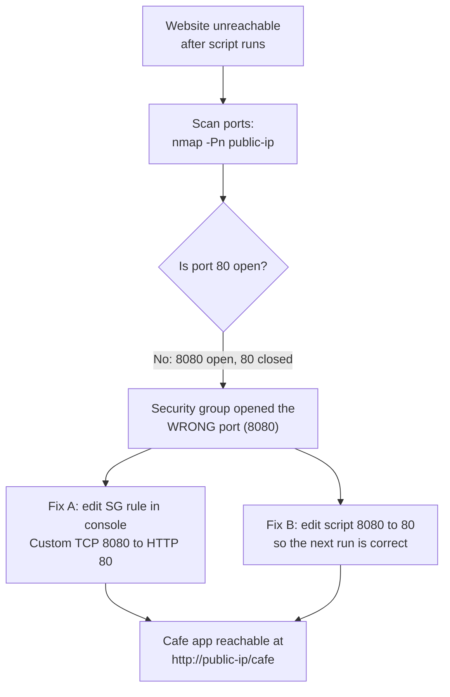
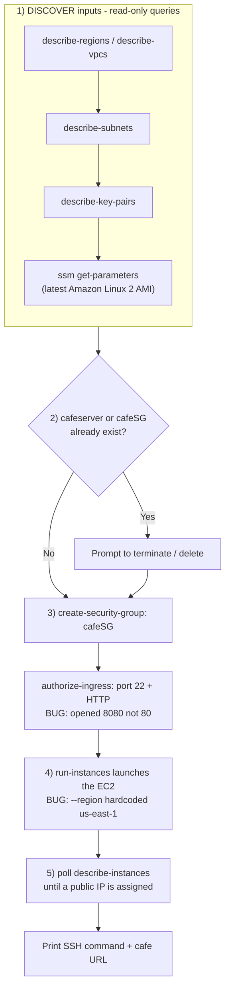
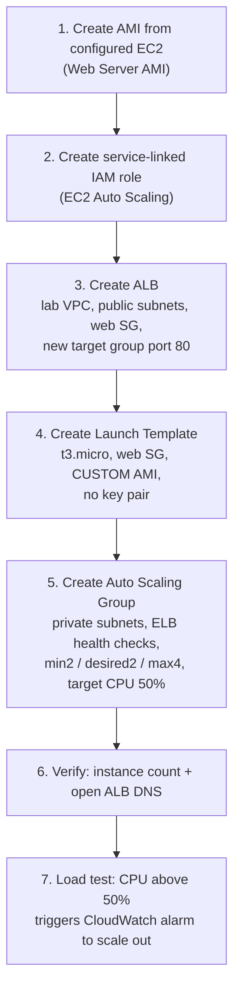

# Lecture Notes — June 11, 2026
**Cohort 3 | Project CloudIgnite**
**Topics:** Elastic Load Balancing (deep dive), Auto Scaling Groups, Lab 173 (EC2 LAMP deployment troubleshooting script), Lab 174 (ALB + Auto Scaling Group build with load testing)
**Duration:** ~3 hours

---

## Key Takeaways
- **ELB types:** ALB (L7, HTTP/HTTPS, path-based routing), NLB (L4, TCP/UDP, extreme performance/low latency), GWLB (L3/4, third-party security appliances), CLB (legacy — avoid)
- **Auto Scaling Group (ASG)** maintains desired instance count and scales in/out based on demand; pairs with ELB for high availability
- **ASG capacity:** **Minimum** (floor), **Desired** (target), **Maximum** (ceiling)
- **Shared database (RDS)** is critical — ASG instances are ephemeral, so data must live in centralized storage to survive scale-in
- **Decoupled architecture:** ALB in public subnets, application servers in **private subnets** (not directly reachable)
- **AMI → Launch Template → ASG:** the custom AMI in the launch template makes new instances identical
- **CloudWatch alarms** (e.g., CPU > 50%) trigger ASG scaling actions
- **Service-linked IAM role for Auto Scaling** may be required for ASG + CloudWatch integration to work

---

## Table of Contents
1. [Elastic Load Balancing (ELB) – Deep Dive](#1-elastic-load-balancing-elb--deep-dive)
2. [Auto Scaling Groups (ASG)](#2-auto-scaling-groups-asg)
3. [Decoupled / Scalable Architecture Concepts](#3-decoupled--scalable-architecture-concepts)
4. [Lab 173 – Troubleshooting the LAMP EC2 Deployment Script](#4-lab-173--troubleshooting-the-lamp-ec2-deployment-script)
5. [Annotated Walkthrough of `create-ec2.txt`](#5-annotated-walkthrough-of-create-ec2txt)
6. [Lab 174 – Building an Auto Scaling Group Behind an ALB](#6-lab-174--building-an-auto-scaling-group-behind-an-alb)
7. [Useful Vim/Nano & CLI Commands Used Today](#7-useful-vimnano--cli-commands-used-today)
8. [CLF-C02 Exam Relevance Summary](#8-clf-c02-exam-relevance-summary)

---

## 1. Elastic Load Balancing (ELB) – Deep Dive

ELB distributes incoming application traffic across multiple targets (EC2 instances, containers, IP addresses) in one or more Availability Zones, increasing fault tolerance and availability.

### Types of Load Balancers

| Type | OSI Layer | Protocols | Best Use Case | Notes |
|---|---|---|---|---|
| **Application Load Balancer (ALB)** | Layer 7 | HTTP, HTTPS, gRPC | Normal web applications, microservices, path/host-based routing | Most commonly used in labs; supports path-based routing, native IPv6, deletion protection, enhanced metrics, target health checks |
| **Network Load Balancer (NLB)** | Layer 4 | TCP, UDP, TLS | Extreme performance, gaming servers, sudden traffic bursts (hundreds of thousands of requests/sec) | Faster than ALB but fewer features |
| **Gateway Load Balancer (GWLB)** | Layer 3/4 | IP | Routing traffic to third-party virtual security/inspection appliances | Used for packet inspection before traffic reaches the server |
| **Classic Load Balancer (CLB)** | Legacy | HTTP/HTTPS/TCP | N/A – deprecated | Legacy; mixed features of ALB+NLB; not used in modern deployments |

### Key ALB Features
- Path-based routing (e.g., `/auth` → instance group 1, `/posts` → instance group 2 — supports microservice architectures)
- Health checks: continuously monitors whether EC2 instances are healthy (hardware failures, app crashes, etc.)
- TLS termination: ALB decrypts incoming traffic so backend servers don't need to handle SSL/TLS overhead
- Active-active design across multiple EC2 instances/AZs

#### Visual: ALB path-based routing (microservices)
*Layer 7 lets the ALB read the URL path and send each route to a different target group.*



### Scenario-Based Selection Rule of Thumb
- Normal website → **ALB**
- Massive sudden traffic bursts / gaming / extreme low-latency → **NLB**
- Need to route traffic through a security appliance for packet inspection → **GWLB**
- Legacy systems only → CLB (avoid for new designs)

#### Visual: Which load balancer should I choose?
*Walk top-down; the first "Yes" gives you the right load balancer for the scenario.*



---

## 2. Auto Scaling Groups (ASG)

### Why ASGs Are Needed
ELB alone only *distributes* traffic across existing instances — it does not add or remove instances. **Auto Scaling Groups** maintain the desired number of EC2 instances and automatically scale in/out based on demand.

### Typical Architecture Flow
```
Route 53 (DNS) → Elastic Load Balancer → EC2 Instances (in an Auto Scaling Group) → RDS (shared database)
```

#### Visual: The classic scalable web tier
*Traffic fans out across instances that scale in/out, but they all share one RDS so no data is lost when an instance is terminated.*



### Why a Shared Database (RDS) Matters
- If application data is stored locally on an individual EC2 instance, and the ASG terminates that instance during scale-in, the data is **lost**.
- Best practice: use a centralized **RDS** database so all EC2 instances (regardless of which ones are added/removed) share consistent data.

### Scaling Policy Types
- **Target tracking scaling policy** – e.g., maintain CPU utilization at 50%; if CPU > 50%, ASG launches more instances
- Based on number of requests
- Based on a CloudWatch alarm
- **Scheduled scaling** – e.g., scale down overnight in regions with predictably low traffic (example given: Malaysia midnight–8 AM)

### Capacity Settings
- **Minimum capacity** – the floor; ASG will never go below this number of instances
- **Desired capacity** – the target number of instances under normal conditions
- **Maximum capacity** – the ceiling; ASG will never exceed this number

*Lab 174 example values: Minimum = 2, Desired = 2, Maximum = 4, Target Tracking on CPU Utilization = 50%*

#### Visual: The capacity band (floor → target → ceiling)
*Scale-out adds instances up toward Maximum; scale-in removes them down to Minimum. The ASG always stays inside this band.*



---

## 3. Decoupled / Scalable Architecture Concepts

- **Decoupling**: Client requests go to the Load Balancer first, not directly to application servers. Application servers can live in **private subnets** (not publicly reachable).
- **Stateless application design**: Because ASG can terminate instances at any time during scale-in, instances should not store unique/critical data locally — use a shared database (RDS) or external storage.
- **Microservices**: Different EC2 instances/target groups can handle different responsibilities, with the ALB routing based on URL path.
- **Large-scale event example (e.g., a major sporting event with massive concurrent traffic)**: typically requires a *combination* of services — Auto Scaling, CDN/caching (e.g., Redis/Memcached), edge locations, and possibly serverless compute — not just a single load balancer.
- Static/media content (video, images, audio) is generally better served via **Amazon S3 + CDN** rather than from application servers.

#### Visual: Decoupled architecture (public vs. private subnets)
*Only the load balancer is public; stateless app servers sit in private subnets, share an RDS, and offload static media to S3 + CDN.*



---

## 4. Lab 173 – Troubleshooting the LAMP EC2 Deployment Script

### Lab Setup Steps
1. Connect to a **CLI host** EC2 instance using **EC2 Instance Connect**.
2. Configure AWS CLI with `aws configure`:
   - Access Key ID
   - Secret Access Key
   - Default region
   - Output format (JSON)
   - (Credentials normally come from IAM — in real environments, retrieved via IAM user access keys)
3. Locate the provided script `create-lamp-instance...sh` and create a backup copy before editing.
4. Use `vim` (with `:set number` to show line numbers) to review the script.

### Issue 1: Hardcoded/Incorrect Region
- The script contained a hardcoded region (`us-east-1`) that did not match the actual working region (`us-west-2`).
- **Fix**: Edit the script in vim and replace the hardcoded region string with the `$region` variable that the script already derives dynamically, so the script becomes region-agnostic.

### Issue 2: Wrong Port in Security Group (8080 vs 80)
- After running the script successfully, the resulting website was unreachable.
- Used **`nmap`** to scan open ports on the public IP:
  - `sudo yum install -y nmap` (or similar package manager command)
  - `nmap -Pn <public-ip>` → scans all ports, showing port 22 and 8080 open, but **port 80 closed**
- Root cause: The script opened port **8080** instead of port **80** in the security group ingress rule.
- **Two ways to fix**:
  1. Edit the security group inbound rule directly in the AWS console — change the rule type from "Custom TCP / 8080" to **HTTP (port 80)**.
  2. Edit the script itself (change `8080` → `80`) so the security group is created correctly the *next* time the script runs — avoids needing to fix it manually in the console afterward.
- Once port 80 is open, the LAMP "Cafe" web app becomes accessible at: `http://<public-ip>/cafe`

#### Visual: Port troubleshooting flow (8080 vs. 80)
*When the site is unreachable, scan the ports first — a closed port 80 points straight to a wrong security-group rule.*



### Additional Notes from the Lab
- HTTPS will **not** work simply by opening port 443 in the security group — an SSL/TLS certificate must also be installed/configured on the server.
- The outbound rule should remain "All traffic" (default) — no change needed.
- If an EC2 instance is **terminated**, it cannot be recovered (unlike "stopped," which can be restarted).

---

## 5. Annotated Walkthrough of `create-ec2.txt`

This is the AWS-provided automation script used in Lab 173 to provision a "Cafe" LAMP EC2 instance. Below is a section-by-section breakdown:

| Section | Purpose |
|---|---|
| **Shebang (`#!/bin/bash`)** | Declares the script should run using the bash shell |
| **Hardcoded values** | Sets `instanceType="t3.small"` and `profile="default"` |
| **Region/VPC discovery loop** | Uses `aws ec2 describe-regions` and `aws ec2 describe-vpcs` to find the region and VPC tagged `Cafe VPC` |
| **Subnet lookup** | Uses `aws ec2 describe-subnets` to find the subnet tagged `Cafe Public Subnet 1` |
| **Key pair lookup** | Uses `aws ec2 describe-key-pairs` to retrieve the existing SSH key pair name |
| **AMI lookup** | Uses `aws ssm get-parameters` to fetch the latest Amazon Linux 2 AMI ID via the public SSM parameter `/aws/service/ami-amazon-linux-latest/amzn2-ami-hvm-x86_64-gp2` |
| **Existing instance check** | Uses `aws ec2 describe-instances` to check if an instance tagged `cafeserver` is already running; if so, prompts the user to terminate it (`aws ec2 terminate-instances` + `aws ec2 wait instance-terminated`) |
| **Existing security group check** | Uses `aws ec2 describe-security-groups` to check for an existing `cafeSG`; prompts to delete it if found |
| **Security group creation** | `aws ec2 create-security-group` creates a new `cafeSG` group in the discovered VPC |
| **Inbound rule configuration** | `aws ec2 authorize-security-group-ingress` opens **port 22** (SSH) and a port for HTTP — *this is the line where the bug was: it opened port `8080` instead of `80`* |
| **Instance launch** | `aws ec2 run-instances` launches the EC2 instance using: the discovered AMI ID, instance type, subnet, security group, an IAM instance profile (`LabInstanceProfile`), user data script, and key pair — *this is the line where the bug was: `--region us-east-1` was hardcoded instead of using the `$region` variable* |
| **Result extraction** | Parses the JSON output with `python -m json.tool` to extract the new `instanceId` |
| **Public IP polling loop** | Repeatedly calls `aws ec2 describe-instances` until a public IP is assigned |
| **Final output** | Prints SSH connection command and the web app URL: `http://<public-ip>/cafe/` |

**Key takeaways for understanding automation scripts:**
- Most of the script's logic is dedicated to *discovering* required resource IDs (VPC, subnet, AMI, key pair, security group) dynamically via CLI queries rather than hardcoding them.
- Only the final `aws ec2 run-instances` command actually creates the resource — everything before it gathers the inputs needed for that command.
- Scripts like this are idempotent-aware: they check for and optionally clean up pre-existing resources (instance + security group) before re-running.

#### Visual: How `create-ec2.txt` actually runs
*Almost everything is discovery and safety checks; only one command (run-instances) creates the server. The two lab bugs are flagged in red text.*



---

## 6. Lab 174 – Building an Auto Scaling Group Behind an ALB

### High-Level Steps
1. **Create an AMI** from the existing configured EC2 instance (Actions → Image and templates → Create image). This "Web Server AMI" is later used to launch identical new instances.
2. **Create a service-linked IAM role for Auto Scaling** (IAM → Roles → Create role → AWS service → use case = EC2 Auto Scaling). This may be required for the ASG to function correctly with CloudWatch alarms.
3. **Create an Application Load Balancer**:
   - Choose **Application Load Balancer** (not Network or Gateway)
   - Name it (e.g., `Lab ELB`)
   - Network mapping: select the **lab VPC** (not default VPC), both Availability Zones, and **public subnets**
   - Security group: use the existing **web security group** (not default)
   - Create a new **target group** (target type = instances, protocol HTTP, port 80)
   - Note/copy the ALB's **DNS name** — this is the URL used to test the app
4. **Create a Launch Template**:
   - Provide name/description
   - Instance type: `t3.micro`
   - Do **not** include a key pair in the launch template
   - Select the **web security group**
   - Select the **custom AMI** created in step 1 (critical — easy to miss this step)
5. **Create the Auto Scaling Group** from the launch template:
   - Network: lab VPC, **private subnets** (1 and 2) — application instances run in private subnets behind the ALB
   - Attach to the **existing load balancer** → select the target group created above
   - Enable **Elastic Load Balancing health checks**
   - Set capacity: Minimum = 2, Desired = 2, Maximum = 4
   - Scaling policy: **target tracking**, metric = CPU Utilization, target = 50%
   - Add a tag: Key = `Name`, Value = e.g. `lab instance`
6. **Verify**:
   - After creation, check EC2 console — instance count should increase to match the ASG's desired capacity
   - Open the ALB's DNS name in a browser to confirm the app is reachable
7. **Load Testing**:
   - The lab's web app includes a "load test" button that artificially raises CPU utilization (observed reaching ~70%+)
   - In **CloudWatch → Alarms**, an alarm should trigger once CPU exceeds the 50% target, causing the ASG to launch additional instances (scale-out)
   - May take a few minutes for the alarm state to update — refresh periodically

#### Visual: Lab 174 build pipeline
*Each step feeds the next; the custom AMI in the launch template is the easy-to-miss link that makes new instances identical.*



### Troubleshooting Notes from the Lab
- If no CloudWatch alarm appears after load testing, it may be related to the **service role for Auto Scaling** not being created correctly — recreating the ASG (delete and re-create) sometimes resolves it.
- "RAID error" / red warning messages during ASG creation were generally non-blocking — instances still launched successfully.

---

## 7. Useful Vim/Nano & CLI Commands Used Today

| Command | Purpose |
|---|---|
| `vim -O <file>` or `vi <file>` | Open file for editing (preferred over `view` for editing) |
| `:set number` | Show line numbers in vim |
| `i` | Enter insert (edit) mode |
| `Esc` | Exit insert mode back to normal mode |
| `:wq` or `:wq!` | Save and quit |
| `:q!` | Quit without saving |
| `gg` | Go to beginning of file |
| `G` (Shift+G) | Go to end of file |
| `gg` then `v` then `G` | Select entire file content (for copying) |
| `nano <file>` | Alternative, simpler text editor |
| `./<script>.sh` | Execute a bash script (tab-completion: press `Tab` to autocomplete filenames) |
| `nmap -Pn <ip>` | Scan all ports on a host (useful for verifying security group rules) |
| `aws configure` | Set up AWS CLI credentials, region, and output format |
| `aws ec2 describe-regions` | List all AWS regions |
| `aws ec2 describe-vpcs --filters ...` | Find a VPC by tag |
| `aws ssm get-parameters --names <ami-param>` | Retrieve latest AMI ID via SSM public parameters |
| `aws ec2 run-instances ...` | Launch a new EC2 instance |
| `aws ec2 wait instance-terminated ...` | Pause script execution until an instance is fully terminated |

---

## 8. CLF-C02 Exam Relevance Summary

This session is **highly relevant** to the CLF-C02 exam, particularly under the **Cloud Technology and Services** and **Cloud Architecture Design Principles** domains.

| Topic | CLF-C02 Relevance |
|---|---|
| **Elastic Load Balancing types (ALB/NLB/GWLB/CLB)** | Frequently tested — know which load balancer fits which scenario (web apps → ALB; gaming/high throughput → NLB; appliance/security inspection → GWLB; CLB = legacy, avoid) |
| **Layer 4 vs Layer 7** | Tests OSI model knowledge in context of NLB vs ALB |
| **Auto Scaling Groups** | Core elasticity/scalability concept — min/desired/max capacity, target tracking policies, scheduled scaling |
| **Scaling for cost optimization** | Aligns with the AWS Well-Architected Framework's Cost Optimization and Performance Efficiency pillars (scale down during low-traffic periods) |
| **Decoupled architecture / shared database (RDS)** | Reinforces statelessness and high availability best practices (Reliability pillar of WAF) |
| **Security Groups (stateful, instance-level)** | A recurring exam distinction (Security Groups vs. NACLs); today reinforced through hands-on troubleshooting of inbound rules |
| **IAM Roles (service-linked roles for Auto Scaling)** | IAM is a core CLF-C02 domain — understanding that AWS services often need IAM roles to interact with other services |
| **AWS CLI & `aws configure`** | Practical skill area — CLF-C02 expects familiarity with the existence and purpose of AWS CLI, though deep CLI scripting is more relevant to higher-level certifications |
| **AMIs (Amazon Machine Images)** | Core EC2 concept — creating custom AMIs to launch consistent instances, used heavily in Auto Scaling launch templates |
| **CloudWatch Alarms** | Monitoring/observability — part of the Management & Governance service category tested on the exam |
| **Route 53 in the scaling architecture diagram** | DNS routing as part of overall traffic flow — useful for understanding end-to-end request paths |
| **Public vs. private subnets** | VPC architecture fundamentals — application servers in private subnets behind a public-facing load balancer is a classic exam scenario |

**Bottom line**: Today's lecture ties together several CLF-C02 "Cloud Architecture" pillars into one coherent picture — ELB + ASG + RDS + VPC subnetting — which is a very common pattern in exam scenario questions (e.g., "A company needs a fault-tolerant, scalable web application...").