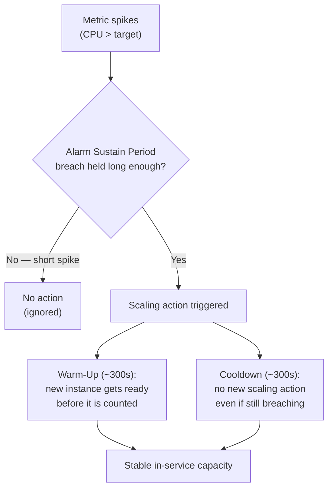
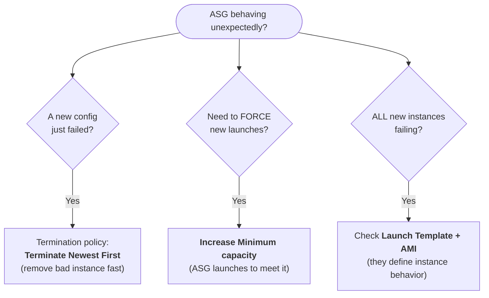
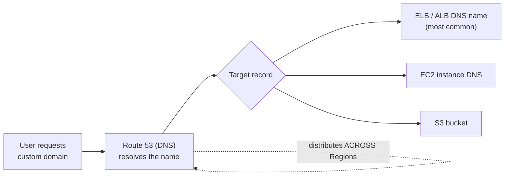
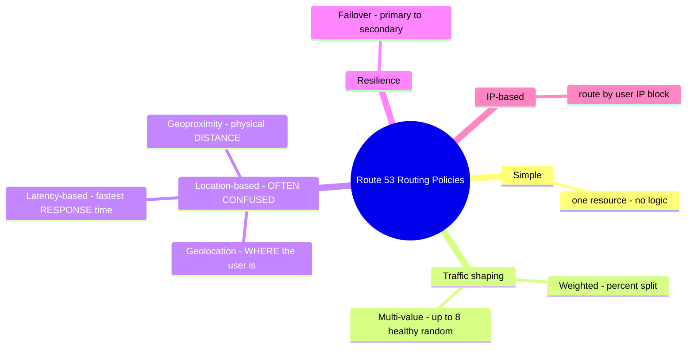
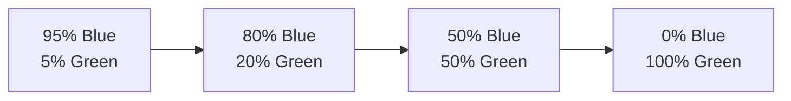
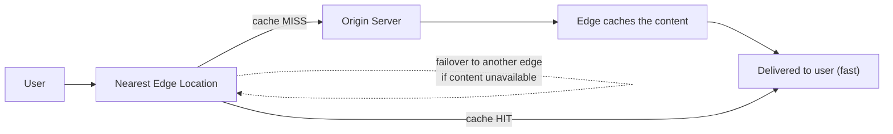
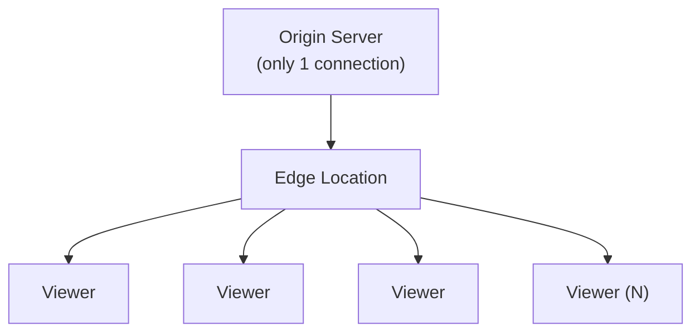
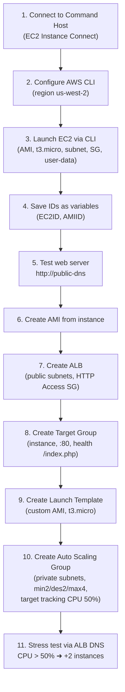

# Lecture Notes — June 12, 2026
**Cohort 3 | Project CloudIgnite**
**Topics:** EC2 Auto Scaling (deep dive), Amazon Route 53, Amazon CloudFront, Lab 175 (CLI-based Auto Scaling lab)
**Duration:** ~3 hours

---

## Key Takeaways
- **ASG anti-thrashing guards:** cooldown period, warm-up period, alarm sustain period (default ~300s each)
- **ASG termination policy "Terminate Newest First"** — useful when a new server config fails and must be removed quickly
- **To force ASG to launch new instances** → increase the **minimum capacity** (ASG launches to meet the new floor)
- **If all newly launched ASG instances are failing** → the issue is in the **Launch Template and/or AMI** (they define instance config/behavior)
- **Route 53 = AWS DNS service**; can distribute traffic across **regions** (ALB only distributes **within** a region)
- **Route 53 routing policies:** Simple, Weighted, Latency-based, Failover, **Geolocation** (user's location), **Geoproximity** (physical distance), Multi-value, IP-based
- **Geolocation vs Geoproximity vs Latency** (commonly confused): Geolocation = where the user is; Geoproximity = physical distance; Latency = measured response time
- **Amazon CloudFront = AWS CDN:** uses global edge locations + regional edge caches to deliver static/dynamic content faster and reduce origin load

---

## Table of Contents
1. [EC2 Auto Scaling – Continued Concepts](#1-ec2-auto-scaling--continued-concepts)
2. [Amazon Route 53](#2-amazon-route-53)
3. [Amazon CloudFront (CDN)](#3-amazon-cloudfront-cdn)
4. [Lab 175 – CLI-Based Auto Scaling Lab](#4-lab-175--cli-based-auto-scaling-lab)
5. [Checkpoint Questions Recap](#5-checkpoint-questions-recap)
6. [Announcements / Logistics](#6-announcements--logistics)
7. [CLF-C02 Exam Relevance Summary](#7-clf-c02-exam-relevance-summary)

---

## 1. EC2 Auto Scaling – Continued Concepts

### Steady-State Group
- An Auto Scaling Group where **Minimum = Maximum = Desired** capacity.
- If an instance becomes unhealthy, Auto Scaling **automatically replaces it** with a new instance — this is a core self-healing benefit of ASG.
- Mentioned use case: maintaining a steady-state NAT server in each Availability Zone — instructor noted this would be **expensive** and recommended instead using a **single NAT Gateway in one public subnet**, shared across instances.

### Avoiding "Thrashing" (Repeated Scale In/Out)
Three mechanisms to prevent unnecessary repeated scaling actions:

| Mechanism | Description |
|---|---|
| **Alarm Sustain Period** | The CloudWatch alarm must remain in breach for a specified duration before triggering a scaling action — avoids reacting to short spikes. |
| **Cooldown Period** | After a scaling event completes, no new scaling action is triggered for a set time (e.g., 300 seconds) — even if scaling conditions are still met. |
| **Warm-Up Period** | After a new instance launches, it is given time to become fully ready/configured before it's counted as "in service" for scaling decisions (default: 300 seconds). |

#### Visual: How the three guards prevent "thrashing"
*Read left-to-right: a spike must survive each gate before — and after — a scaling action.*



### Termination Policies & Scaling Behavior
- **"Newest Instance First"** termination policy: useful when a **new server configuration fails** and needs to be removed quickly from the ASG.
- To **force new instances to launch**: increase the **minimum capacity** of the ASG — ASG will automatically launch instances to meet the new minimum.
- If **all newly launched instances are failing**: the issue is likely in the **Launch Template** and/or the **AMI** — these define instance configuration/behavior and should be reviewed/updated.

#### Visual: ASG troubleshooting decision tree
*Match the symptom on the left to the corrective action on the right.*



### Upcoming Challenge
- "Auto-Scaling Prediction Challenge" assigned as self-study before Monday; will be discussed in the following session.

---

## 2. Amazon Route 53

### Overview
- Route 53 = **AWS's DNS (Domain Name System) service**.
- Functions:
  - Register/purchase domain names
  - Resolve domain names to IP addresses
  - Connect infrastructure and **distribute traffic across Regions** (a key difference vs. Application Load Balancer, which only distributes traffic *within* a single Region)
  - Supports high availability and low latency

### Architecture Concept
- Users request a custom domain → request goes to Route 53 → Route 53 resolves to a target DNS name (commonly an **ELB DNS name**, but can also be an **EC2 instance DNS name**).

#### Visual: How a request flows through Route 53
*Note the dashed loop: Route 53 can spread traffic **across Regions** — an ALB only balances **within** one Region.*



### Routing Policies
| Policy | Description |
|---|---|
| **Simple** | Basic single-resource routing (no special logic) |
| **Weighted** | Distribute traffic by percentage across multiple resources (e.g., 10% to Server A, 90% to Server B) — useful when servers have different capacities |
| **Latency-based** | Routes traffic to the resource/region with the **lowest latency** for the user — not necessarily the geographically closest server |
| **Failover** | Primary/secondary setup — if primary fails, traffic automatically routes to secondary |
| **Geolocation** | Routes based on the **user's geographic location** (e.g., users from Southeast Asia → Malaysia server) |
| **Geoproximity** | Routes to the **physically closest** resource (based on distance) |
| **Multi-value answer** | Returns up to 8 healthy records selected at random; includes health checking |
| **IP-based** | Routes based on the **user's IP address** to a specific endpoint |

> ⚠️ **Most emphasized for exam-style questions:** Weighted, Failover, Geolocation, and Geoproximity (esp. distinguishing Geolocation vs. Geoproximity vs. Latency-based — these are commonly confused).
>
> - **Geolocation** = based on *where the request originates* (user's location)
> - **Geoproximity** = based on *physical distance* to resources
> - **Latency-based** = based on *measured response time*, not physical distance

#### Visual: The 8 routing policies (grouped) — focus on the confused trio
*The pink branch is the most commonly tested distinction. Anchor each to its single keyword.*



### Practical Use Case: Blue-Green Deployment
- Two environments exist (e.g., "blue" = current, "green" = new).
- Route 53 (weighted routing) can **gradually shift traffic** from blue to green (e.g., 5% → 10% → 20% → 50% → 100%) instead of an instant cutover — reduces risk when rolling out new features.

#### Visual: Blue-green traffic shift via weighted routing
*Each step moves a little more traffic to Green; roll back instantly by re-weighting if Green misbehaves.*



### Route 53 Targets
- Route 53 can route/connect to: **Elastic Load Balancers (ALB)**, **EC2 instances**, and **S3 buckets**.

---

## 3. Amazon CloudFront (CDN)

### Overview
- CloudFront = AWS **Content Delivery Network (CDN)** service that speeds up distribution of **static and dynamic** web content.
- Delivers content via a global network of **Edge Locations** (data centers around the world) plus **Regional Edge Caches**.

### Key Features
- Security
- High availability / scalability
- Real-time metrics and logging
- Continuous deployment
- Cost-effectiveness (at scale)

### Use Cases
- Fast & secure website delivery
- Accelerating dynamic content delivery / APIs
- Live and on-demand video streaming
- Distributing software patches and updates

### Architecture / Flow
- Users **never connect directly to the origin server**.
- Request flow: **User → Edge Location → Origin Server → Edge Location (cache) → User**.
- For **live streaming**: the origin server maintains a connection only with the edge location (not with every individual viewer). The edge location then fans out the stream to all users. This greatly **reduces the number of connections the origin server must manage**.
- Edge locations have **failover** — if content isn't available at the nearest edge, the request is served from another edge location → improves both latency *and* availability.

#### Visual: CloudFront request flow (cache hit vs. miss)
*Users never touch the origin directly — the edge serves cached content and only fetches from origin on a miss.*



#### Visual: Why streaming scales — edge fan-out
*The origin keeps **one** connection to the edge; the edge fans the stream out to every viewer, slashing origin load.*



### Cost Factors
CloudFront pricing is based on:
- Request type
- Geographic location of the edge location
- Amount of data transferred out of the AWS network

> Cost-saving logic: fewer EC2 instances are needed to handle direct connections because CloudFront edge locations absorb most of the traffic — slight increase in CDN cost can be offset by reduced compute needs and improved user experience.

---

## 4. Lab 175 – CLI-Based Auto Scaling Lab

**Goal:** Recreate a scalable web server setup using the AWS CLI, then build an Auto Scaling Group with a Launch Template and Application Load Balancer.

### High-Level Steps
1. **Connect to the Command Host** instance via **EC2 Instance Connect** (not SSH client).
   - If connection fails: check that the **Security Group allows SSH**.
2. **Configure AWS CLI** (`aws configure`) — region was pre-set to **us-west-2**; access key/secret key fields could be left blank (already configured).
3. **Launch a new EC2 instance via CLI** using a prepared command including:
   - `--image-id` (AMI ID)
   - `--instance-type t3.micro`
   - `--key-name`
   - `--subnet-id`
   - `--security-group-ids` (HTTP Access security group)
   - `--region us-west-2`
   - **User data**: a bash script that runs automatically on launch (sets up the web server via the authorized script).
   - **Tip:** if the CLI command is on a single line, use `\` (backslash) line continuations after each parameter, or write the whole command on one line — avoid stray line breaks/spaces, which cause query errors.
4. **Save important IDs/values as shell variables** (e.g., `EC2ID=<instance-id>`, `AMIID=<ami-id>`) to avoid repeatedly copying long IDs.
5. **Retrieve the public DNS name** of the new instance via a CLI query using the instance ID; test the web server in a browser using `http://<public-dns>` (note: must use **HTTP**, not HTTPS, and try **Incognito mode** if cached results interfere).
6. **Create an AMI** from the running "web server" instance (CLI step ~25) — save the resulting **AMI ID** as a variable for later use.
7. **Create an Application Load Balancer (ALB)**:
   - Internet-facing, IPv4
   - VPC = Lab VPC
   - Subnets = Availability Zone 1 & 2 **public subnets**
   - Security Group = HTTP Access (not default)
8. **Create a Target Group**:
   - Target type = **Instance**
   - Protocol HTTP, Port 80
   - **Health check path = `/index.php`**
9. **Create a Launch Template**:
   - Use the **custom AMI** created in step 6
   - Instance type = **t3.micro**
   - Security Group = HTTP Access
   - Default storage settings (gp2) are fine
10. **Create an Auto Scaling Group from the Launch Template**:
    - VPC = Lab VPC, Subnets = **private subnet 1 & 2**
    - Attach the existing ALB and select the target group created above
    - Enable **ELB health checks**
    - **Desired capacity = 2, Minimum = 2, Maximum = 4**
    - Scaling policy = **Target Tracking**, metric = **CPU Utilization at 50%**
    - Instance warm-up = default **300 seconds**
    - Tag: Name = `web app`
11. **Test Auto Scaling**: use the load balancer's DNS name to access the "Start Stress / Stop Stress" test page. Generating CPU load triggers the **CloudWatch alarm** (CPU > 50%) → ASG launches **two additional EC2 instances**.

#### Visual: Lab 175 build pipeline (dependency order)
*Each block depends on the one before it — this is why a fault in the original instance/AMI propagates to every ASG instance.*



### Common Troubleshooting Notes from the Lab
- **"502 Bad Gateway"** errors typically trace back to a problem with the **original EC2 instance/AMI** — since the launch template and ASG instances are duplicated from it, errors propagate downstream.

  #### Visual: Why one bad AMI breaks everything downstream

  ```mermaid
  flowchart LR
      AMI["Faulty original<br/>instance / AMI"] --> LT["Launch Template<br/>(copies the AMI)"] --> ASG["ASG instances<br/>(all duplicates)"] --> ERR["502 Bad Gateway<br/>downstream"]
  ```
- CLI query errors are often caused by: missing backslashes for line continuation, missing spaces between parameters, or unintended line breaks.
- Scaling actions are **not instantaneous** — there's a delay before new instances appear after an alarm triggers.

---

## 5. Checkpoint Questions Recap

| Question | Answer / Concept |
|---|---|
| New server config might fail — which termination policy lets you quickly remove it? | **Terminate newest instance first** |
| How to force a new EC2 instance to launch in an ASG? | **Increase the minimum capacity** |
| All newly created ASG instances are failing — what should be checked? | **Launch Template and AMI** |
| Three ways to avoid scaling "thrashing"? | **Cooldown period, Warm-up period, Alarm sustain period** |
| Blue-green deployment, gradually shift traffic — which Route 53 policy? | **Weighted routing policy** |
| Scaling policy that reacts based on the *size* of a CloudWatch alarm breach? | **Step scaling policy** |
| Route users to the closest *region* — which Route 53 policy? | **Geolocation** (note: instructor initially second-guessed this vs. Geoproximity, but confirmed Geolocation as the answer) |
| Users complain of slow response after geolocation routing — which policy addresses this? | **Latency-based routing** |
| AWS service that speeds up content delivery via edge locations (CDN)? | **Amazon CloudFront** |
| ELB type to distribute requests to EC2 instances in a VPC? | **Application Load Balancer (ALB)** — Classic Load Balancer (option 4) is legacy/deprecated |
| ALB component that checks for incoming connection requests from clients? | **Listener** |

---

## 6. Announcements / Logistics
- Office hours tomorrow: **9 AM – 6 PM** for lab troubleshooting/questions.
- Lab 175 will be repeated/continued the next day for anyone who didn't finish.
- A Route 53 **failover routing** lab and a **business scenario lab** are planned for Monday (before break).
- Possible public holiday on Wednesday — to be confirmed Monday.

---

## 7. CLF-C02 Exam Relevance Summary

This session's content maps strongly to **Domain 3: Cloud Technology and Services** (compute, networking, and content delivery), with some overlap into **Domain 1: Cloud Concepts** (scalability/elasticity, high availability).

Relevant exam topics covered:
- **EC2 Auto Scaling**: scaling policies (target tracking, step scaling), cooldown/warm-up/alarm sustain periods, termination policies, launch templates, and the relationship between minimum/maximum/desired capacity. These are frequently tested concepts for understanding *elasticity* and *high availability*.
- **Amazon Route 53**: DNS fundamentals and the various routing policies (simple, weighted, latency-based, failover, geolocation, geoproximity, multi-value, IP-based). The exam commonly tests the *differences* between these policies — especially geolocation vs. geoproximity vs. latency-based.
- **Amazon CloudFront**: CDN concepts, edge locations, use cases (static/dynamic content, streaming, software distribution), and how CDNs improve performance and reduce origin server load — a key example of AWS global infrastructure benefits.
- **Elastic Load Balancing (ALB)**: distinguishing ALB from legacy load balancer types, and ALB components (listeners, target groups, health checks).
- **AWS CLI**: practical exposure to using the CLI for resource provisioning (EC2 instances, AMIs) — supports understanding of programmatic access to AWS resources (relevant to Domain 3's coverage of deployment and management methods).
- **AWS Global Infrastructure** (Regions, Availability Zones, Edge Locations): reinforced through the Route 53 cross-region routing and CloudFront edge location discussions.

**High-priority review items for CLF-C02:**
- ASG cooldown vs. warm-up vs. alarm sustain period
- Route 53 routing policy differences (esp. geolocation vs. geoproximity vs. latency)
- CloudFront edge locations and why they reduce latency/improve availability
- ALB vs. Classic Load Balancer (CLB is legacy)