# Lecture Notes — June 13, 2026
**Cohort 3 | Project CloudIgnite**
**Topics:** S3 Static Website Hosting, IAM Users & Policies, EC2 Provisioning via Scripts, Security Groups & Troubleshooting, Application Load Balancer (ALB), Launch Templates & AMIs, Auto Scaling Groups, CloudWatch Alarms
**Duration:** ~3 hours

---

## Key Takeaways
- **IAM user has NO access** until BOTH login credentials AND a policy are attached (creating the user alone is not enough)
- **AWS access = Access Key ID + Secret Access Key**; the secret is shown **only once** at creation and cannot be retrieved later
- **S3 buckets are private by default**; public access requires disabling Block Public Access + enabling ACLs + bucket policy
- **S3 static website endpoint:** `http://<bucket>.s3-website-<region>.amazonaws.com`
- **`aws s3 sync`** uploads only changed files (preferred for automation); `aws s3 cp --recursive` re-uploads everything
- **AMIs are region-specific** — an AMI valid in one region will not work in another
- **Security Group = instance-level stateful firewall**; common ports: SSH=22, HTTP=80, HTTPS=443 (default inbound = deny)
- **IAM Roles / Instance Profiles** = preferred way to give EC2 AWS access (no stored credentials, temporary auto-rotated keys)

---

## Table of Contents
1. [IAM Users, Credentials & Policies](#1-iam-users-credentials--policies)
2. [S3 Static Website Hosting](#2-s3-static-website-hosting)
3. [Working in the Terminal (vim, bash scripts, sync vs cp)](#3-working-in-the-terminal)
4. [Lab 173 — Provisioning EC2 with a Script + Troubleshooting](#4-lab-173--provisioning-ec2-with-a-script--troubleshooting)
5. [Lab 174 — Load Balancing & Auto Scaling](#5-lab-174--load-balancing--auto-scaling)
6. [Lab 175 — Building an AMI via CLI + Auto Scaling](#6-lab-175--building-an-ami-via-cli--auto-scaling)
7. [Command Cheat Sheet](#7-command-cheat-sheet)
8. [CLF-C02 Exam Relevance Summary](#8-clf-c02-exam-relevance-summary)
9. [Visual Summaries (Master Mind Map · Revision · 5-Minute)](#9-visual-summaries-master-mind-map--revision--5-minute)

---

## 1. IAM Users, Credentials & Policies

### What was done
- Created an **IAM user** from the CLI. Creating a user **does not** create login credentials — by itself the user cannot sign in.
- Created a **login profile (console password)** for the user (example password used in lab: `training123!`).
- Logged in as the IAM user using an **Incognito window**, the **Account ID**, the username, and the password.
- Initially the user could see **no S3 buckets** even though a bucket existed — because the user had **no permissions** yet.
- Attached the AWS managed policy **`AmazonS3FullAccess`** to the user. After refreshing, the user could see and access the bucket.

### Visual: IAM access flow

An IAM user has **no abilities** until credentials *and* a policy are added. Left branch = authentication (sign-in), right branch = authorization (permissions).

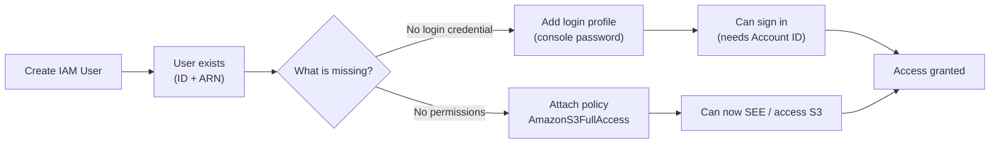

### Key concepts
- **IAM User** = an identity for a person/app. Has a **User ID** and a **User ARN** (Amazon Resource Name).
- **Credentials are separate from the user:** console password (for sign-in) and access keys (for CLI/API) must be added explicitly.
- **Policies grant permissions.** A user with no policy attached can do nothing. `AmazonS3FullAccess` is an AWS **managed policy**.
- **Account ID** is required (along with username/password) to sign in as an IAM user.
- Troubleshooting note: an "is not authorized to perform..." error means the identity lacks the required permission/policy.

> **CLF-C02 relevance — HIGH (Domain: Security & Compliance):** IAM users, the principle that permissions come from attached policies, AWS managed vs. customer managed policies, ARNs, and the least-privilege idea are all core exam topics. The "create user → no access → attach policy → access granted" flow is a textbook IAM illustration.

---

## 2. S3 Static Website Hosting

### What was done (in order)
1. **Created an S3 bucket** — bucket names must be **globally unique** (instructor appended their name + a number).
2. **Made the bucket public:**
   - Went to **Permissions → Block Public Access → Edit → uncheck → Save**.
   - Set **Object Ownership → ACLs enabled**.
   - Edited the **bucket policy** (by default a bucket policy does not allow public access).
3. **Prepared website files:** extracted a provided archive (`tar -x`) containing `index.html`, CSS, and images.
4. **Enabled static website hosting** on the bucket via CLI.
5. **Uploaded the site** using `aws s3 cp <folder> s3://<bucket> --recursive --acl public-read`.
   - `--recursive` walks subfolders; `--acl public-read` makes files publicly readable.
6. **Verified upload** with `aws s3 ls s3://<bucket>`.
7. **Tested the site** at the S3 website endpoint:
   `http://<bucket-name>.s3-website-<region>.amazonaws.com` (region in lab was `us-west-2`).

### Visual: S3 static-site deploy pipeline

The bucket starts **private**; steps 2–4 are the "open it up" group, then files are uploaded and tested.

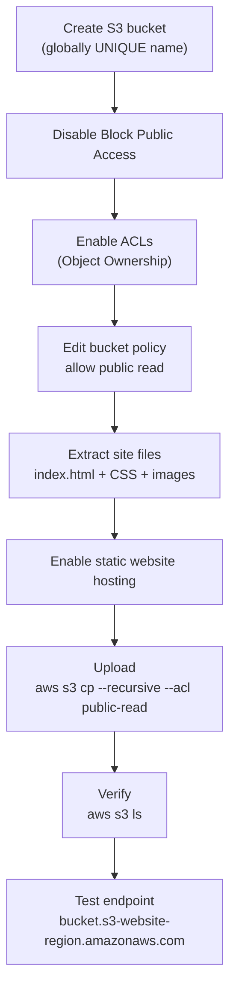

### Improving the workflow
- Wrapped the upload command in a **bash script** (e.g. `update-website.sh`) so the site can be re-deployed by running one script instead of retyping commands.
  - Script must start with the shebang `#!/bin/bash` on its own line, then the command.
  - Made it executable with `chmod +x` and ran it with `./update-website.sh`.
- **Tip:** keep the deploy script **outside** the website folder (moved to home directory) so the script itself isn't uploaded to the bucket.
- **`cp` vs `sync`:** switching from `aws s3 cp` to `aws s3 sync` only uploads **modified** files. Unchanged files are skipped → faster and avoids unnecessary uploads.

### Visual: `cp` vs `sync`

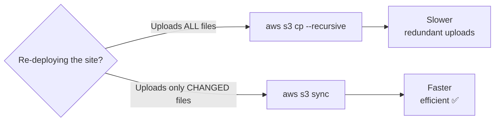

### Key concepts
- S3 bucket names are **globally unique**.
- **By default S3 buckets are private** — public access requires turning off Block Public Access, enabling ACLs, and/or a bucket policy.
- S3 can host a **static website** (HTML/CSS/JS/images) — no server required.

> **CLF-C02 relevance — HIGH (Domains: Cloud Technology & Services, Security):** Amazon S3 fundamentals, static website hosting, the default-private security posture, Block Public Access, bucket policies/ACLs, and global bucket naming are all on the exam. (Note: CLF-C02 is conceptual — you won't type CLI commands, but you must know *what* S3 does and its security defaults.)

---

## 3. Working in the Terminal

### vim / vi quick reference (used to edit `index.html`)
- Open a file: `vi index.html`
- Enter insert mode: press `i`
- Find & replace **entire file**: `:%s/oldword/newword/g`
  - **Common mistake demonstrated:** without the leading `%`, `:s/.../.../g` only changes the **current line**, which produced a confusing "pattern not found" situation. Use `%` to apply across the whole file.
- Save & quit: `:wq`
- `Ctrl-F` does **not** search in vim — use the `:%s` substitute command instead.

### Connecting to EC2 & configuring the CLI
- Connected to instances via **EC2 Instance Connect** (browser-based) and **SSM Session Manager**.
- Configured the CLI with `aws configure`, supplying **Access Key**, **Secret Key**, **default region** (`us-west-2`), and **output format** (`json`).
  - **Important:** the **secret access key is only shown once** at creation time — it cannot be retrieved later.
  - Troubleshooting: pasting the *entire* block instead of just the secret key, or deleting lines of a bootstrap/user-data script, broke the credentials and required **stopping and restarting the lab**.

> **CLF-C02 relevance — MEDIUM:** Knowing that AWS access = **Access Key ID + Secret Access Key**, that the secret is shown only once, and that EC2 connectivity options exist (Instance Connect, Session Manager) supports the Security and Cloud Technology domains. vim/bash specifics are **not** exam material (operational skill only).

---

## 4. Lab 173 — Provisioning EC2 with a Script + Troubleshooting

### What was done
Walked through a provided shell script that **creates an EC2 instance** end to end, then deliberately fixed three planted "issues."

**What the script does, step by step:**
- Finds the current **region** and prints status.
- Sets the **instance type** (default `t3.small`; can be changed to `t3.micro`).
- Uses a **default instance profile**.
- Discovers the **VPC ID** by querying existing running EC2 instances across regions (this could also be hard-coded from the console).
- Uses the VPC ID to find the **subnet** (filtered by name, e.g. `cafe public subnet 1`).
- Finds the **key pair** (for SSH) and the **AMI ID** (image).
- Checks for an **existing instance with the same name** and **terminates** it if found (script won't succeed if one already exists).
- Checks for / deletes an existing **security group**, then creates a **new security group** with two inbound rules:
  - SSH on **port 22**
  - Web on **port 80** ← *(planted bug: was set to 8080)*
- Creates the **EC2 instance**.

### Visual: EC2 provisioning script flow

The two diamonds make the script *idempotent* — it deletes any existing instance/security group before creating new ones.

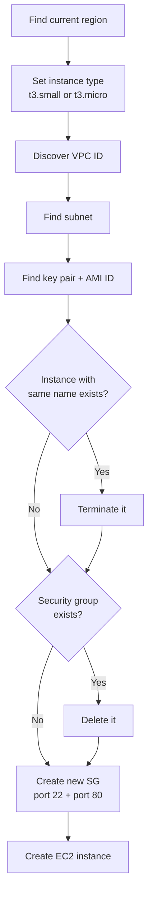

### The three planted issues & fixes
| Issue | Symptom | Fix |
|------|---------|-----|
| **1. Invalid region** | Instance creation fails because the **AMI doesn't exist** in the hard-coded region | Replace the literal region with the script's `$region` variable (region was set to `us-west-2`, AMI only valid there) |
| **2. Wrong web port** | Website unreachable; `nmap` shows **8080 open, 80 closed** | Change the security-group inbound rule from **8080 → 80** (fixed in the EC2 Security Group inbound rules) |
| **3. App test** | Verify by placing an order via the web app | Open the public URL `/cafe`, go to menu/order history, submit an order successfully |

### Troubleshooting tool: `nmap`
- Installed `nmap` and scanned the instance's **public IP** to see which ports were open: `nmap -Pn <public-ip>`.
- Confirmed port 22 + 8080 open (and 80 closed) → diagnosed the security-group misconfiguration.

### Visual: Troubleshooting decision tree

Match each **symptom → root cause → fix**.

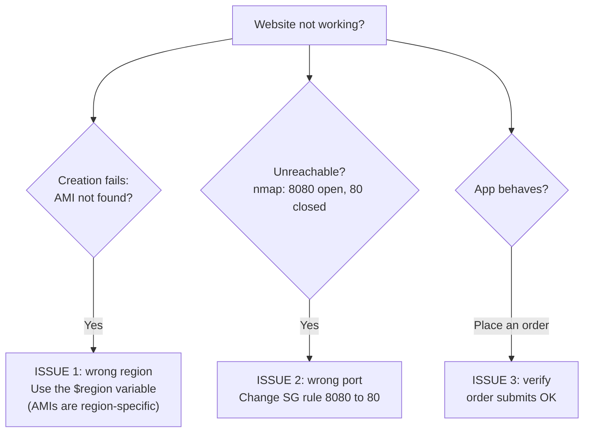

### Key concepts
- **AMIs are region-specific** — an AMI ID valid in one region won't work in another.
- **Security groups** act as virtual firewalls; inbound rules must open the correct ports (22 for SSH, 80 for HTTP).
- **EC2 instance types** (e.g., `t3.micro`, `t3.small`) determine compute size.
- **User data** scripts run at launch to bootstrap the instance.

> **CLF-C02 relevance — HIGH (Domains: Cloud Technology, Security):** EC2 instances and instance types, **AMIs**, **security groups as instance-level firewalls**, VPCs/subnets, and key pairs are all heavily tested. The "AMI is region-specific" fact and "open the right port in the security group" troubleshooting are very exam-relevant concepts (presented conceptually, not as CLI).

---

## 5. Lab 174 — Load Balancing & Auto Scaling

### What was done (the high-availability pattern)
1. **Create an AMI** from a configured EC2 instance (*Actions → Image and templates → Create image*). The AMI captures the same configuration/software — effectively duplicating the instance.
2. **Create an Application Load Balancer (ALB):**
   - Type: **Application Load Balancer**, scheme IPv4, placed in the **lab VPC** across **two Availability Zones**.
   - Attach the **Web security group** (not the default).
   - Create a **Target Group** (type: instance, **HTTP : 80**, with health checks). Note the **DNS name** of the ALB for later access.
3. **Create a Launch Template:**
   - Based on the **custom AMI** (e.g., `web server AMI`).
   - Instance type **t3.micro**, **Web security group**.
4. **Create an Auto Scaling Group (ASG):**
   - Uses the launch template; placed in the **VPC** across **private subnets 1 & 2**.
   - **Why private subnets?** End users should **not** talk directly to EC2 instances — only the **load balancer** communicates with them. (Public subnets are an option if direct public access is wanted.)
   - Attach to the **existing load balancer** + **target group**.
   - **Capacity:** minimum **2**, desired **2**, maximum **4** (max must be ≥ desired).
   - **Scaling policy:** **Target Tracking** on **CPU utilization 50%**, instance **warm-up 300s**.
   - Added a **tag** (e.g., name = `lab instance`).

### Visual: Highly-available architecture

Users only ever reach the **public** ALB; EC2 instances stay in **private subnets**. Dependency chain: `AMI → Launch Template → Auto Scaling Group → EC2`.

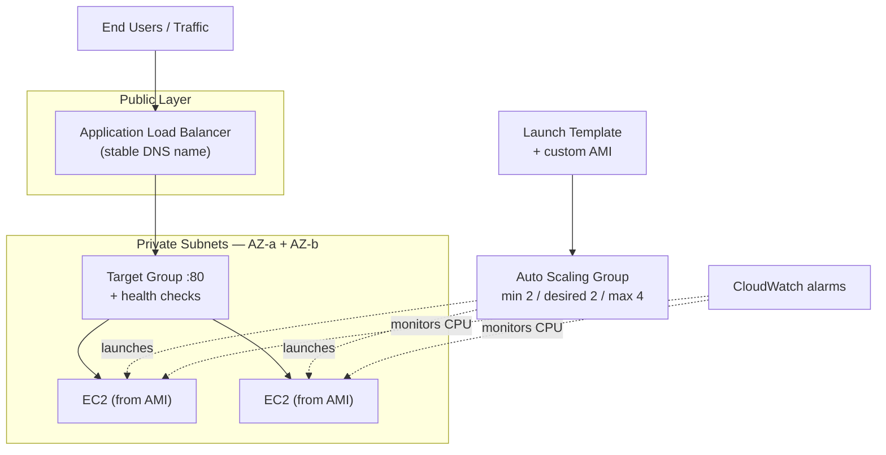

### Testing auto scaling
- After creation, the ASG automatically launched **2 instances** in the private subnets; verified **2 healthy** targets in the target group.
- Accessed the app via the **ALB DNS name**, then clicked **"Load Test"** to simulate CPU load (~70–80%).
- Because CPU exceeded the 50% target, **CloudWatch alarms** fired (a "high" alarm and a "low" alarm), and after the warm-up period the ASG launched **2 more** instances (total **4 healthy**).

### Visual: The elasticity cycle

Trace this loop clockwise — the system self-corrects to keep CPU near the 50% target.

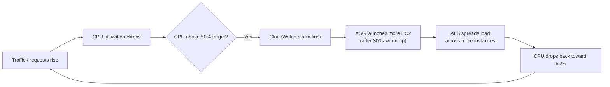

### Key concepts
- **Elastic Load Balancing (ALB)** distributes incoming traffic across multiple instances and is reached via a stable **DNS name**.
- **Auto Scaling Group** automatically adds/removes instances based on demand (min/desired/max).
- **Target Tracking scaling** keeps a metric (CPU 50%) at target.
- **CloudWatch** monitors metrics and triggers **alarms** that drive scaling actions.
- **Architecture best practice:** ALB in public-facing layer; EC2 instances in **private subnets** for security; multi-AZ for high availability.
- **Launch Template + AMI** = repeatable, identical instance configuration.

> **CLF-C02 relevance — VERY HIGH (Domains: Cloud Technology, Billing/Cost & Reliability concepts):** Elastic Load Balancing, EC2 Auto Scaling, CloudWatch monitoring/alarms, Availability Zones & high availability, AMIs and launch templates, and the **elasticity / scale-out** value proposition are central CLF-C02 topics. The public-ALB / private-EC2 design also reflects the **Well-Architected** security & reliability pillars.

---

## 6. Lab 175 — Building an AMI via CLI + Auto Scaling

### What was done
Same overall architecture as Lab 174, but the **AMI is created from the CLI** instead of the console.

1. Connected via **EC2 Instance Connect**; found the region from **instance metadata** (`us-west-2`).
2. Ran `aws configure` — **no access keys needed here** (the instance used an attached **role/instance profile**); just set region + output.
3. Used a **run-instances** CLI command, editing the query with the correct **key name, AMI ID, HTTP access (security group), and subnet ID** from the instance **Details** pane.
4. Saved the new instance ID into an **environment variable** (`EC2_ID=...`) for reuse instead of copying it repeatedly.
5. Retrieved the instance's **DNS name** via CLI and confirmed the page loaded.
6. **Created an AMI from the CLI** using the instance ID variable.
7. Then repeated the **Lab 174 pattern**: ALB → Target Group → Launch Template (using the CLI-built AMI) → Auto Scaling Group (private subnets, target tracking 50% CPU).
8. Ran the **stress/load test** via the **ALB DNS name** and watched **CloudWatch** enter alarm, triggering more instances.

### Troubleshooting highlights
- "Provided region name / session token does not support it" and credential-validation errors came from **pasting the whole credential block** or **deleting user-data lines** — fixed by re-running `aws configure` correctly or **stopping/restarting** the lab (allow ~5 min).
- Stress test must target the **ALB DNS name**, not an individual instance, for scaling to behave correctly.

### Real-world framing (instructor's explanation)
- A **load test only simulates** load; in production the load is **real user traffic / request volume**.
- If an instance can serve ~500 users and traffic suddenly spikes to ~10,000, a single instance can't cope → requests fail / instance goes out of service.
- **Auto Scaling** solves this by automatically launching more instances when CPU/traffic rises, so you never have to scale manually.

### Key concepts
- **Instance metadata** can supply info like the current region.
- **IAM roles / instance profiles** let an EC2 instance call AWS APIs **without stored access keys** (more secure than embedding keys).
- **AMIs can be created from the console *or* the CLI**.
- Auto Scaling = **elasticity**: match capacity to demand automatically.

### Visual: Access keys vs IAM roles

Left = something you *store* (riskier); right = something *attached* to the instance (safer). Lab 175 used a **role** — no keys typed.

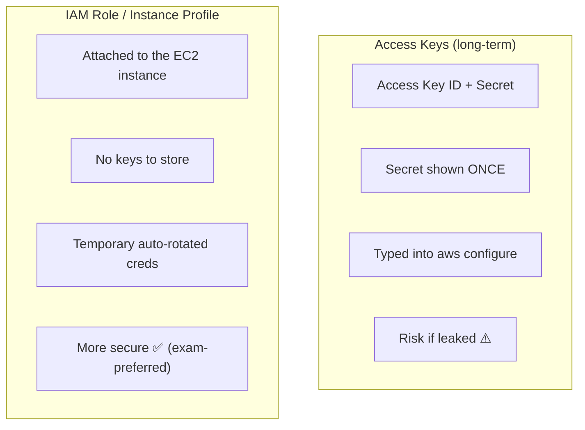

> **CLF-C02 relevance — VERY HIGH (Domains: Security, Cloud Technology):** **IAM roles for EC2 (instance profiles)** vs. long-term access keys is an important exam security concept ("use roles instead of hard-coding credentials"). Auto Scaling for elasticity, CloudWatch alarms, and the cost/reliability benefit of scaling to demand are all directly tested.

---

## 7. Command Cheat Sheet

> Operational reference from the labs. **Not required for CLF-C02** (the exam is conceptual), but useful for the hands-on work.

```bash
# IAM (CLI)
aws iam create-user --user-name <name>
aws iam create-login-profile --user-name <name> --password '<pwd>'
aws iam attach-user-policy --user-name <name> --policy-arn arn:aws:iam::aws:policy/AmazonS3FullAccess

# S3 static website
aws s3 cp <local-folder> s3://<bucket> --recursive --acl public-read
aws s3 sync <local-folder> s3://<bucket>        # uploads only changed files
aws s3 ls s3://<bucket>                          # list/verify
# Website endpoint: http://<bucket>.s3-website-<region>.amazonaws.com

# CLI config
aws configure                                    # access key, secret key, region, output(json)

# Troubleshooting / networking
nmap -Pn <public-ip>                             # check which ports are open

# Deploy script pattern (update-website.sh)
#!/bin/bash
aws s3 sync <local-folder> s3://<bucket> --acl public-read
# chmod +x update-website.sh  &&  ./update-website.sh

# Reuse an instance ID
EC2_ID=<instance-id>
```

### vim survival kit
| Action | Keys |
|--------|------|
| Insert mode | `i` |
| Replace across whole file | `:%s/old/new/g` |
| Replace current line only | `:s/old/new/g` |
| Save & quit | `:wq` |
| Show line numbers | `:set number` |

---

## 8. CLF-C02 Exam Relevance Summary

**Yes — a large portion of this lecture maps directly to CLF-C02 objectives.** The exam is **conceptual** (multiple choice), so focus on *what each service does and why*, not the CLI syntax.

### Visual: Lecture topics → exam domains

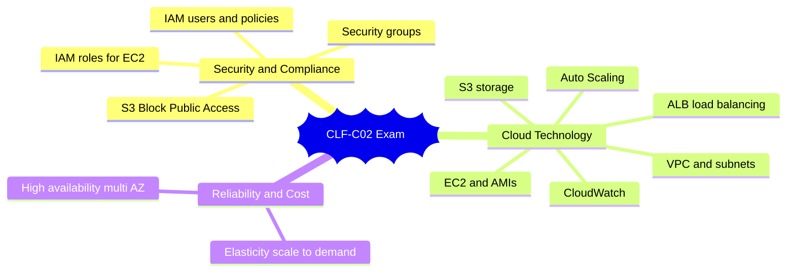

| Topic from lecture | CLF-C02 Domain | Relevance | What to actually study for the exam |
|---|---|---|---|
| IAM users, policies, ARNs, managed policies | Security & Compliance | 🟢 High | Identities get permissions only via policies; managed vs. customer policies; least privilege |
| IAM roles / instance profiles for EC2 | Security & Compliance | 🟢 High | Use **roles** instead of hard-coded access keys; secret key shown only once |
| Amazon S3 (storage, static hosting, defaults) | Cloud Technology & Services | 🟢 High | S3 is object storage; buckets **private by default**; global unique names; static website hosting |
| S3 Block Public Access / bucket policies / ACLs | Security & Compliance | 🟢 High | How public access is controlled; secure defaults |
| EC2 instances, instance types, AMIs | Cloud Technology & Services | 🟢 High | Compute basics; **AMIs are region-specific**; instance sizing |
| Security groups (ports 22/80) | Security & Compliance | 🟢 High | Instance-level virtual firewall; inbound/outbound rules |
| VPC, subnets, public vs. private subnets | Cloud Technology & Services | 🟢 High | Network isolation; keep app tier private, LB public |
| Elastic Load Balancing (ALB) | Cloud Technology & Services | 🟢 Very High | Distributes traffic; high availability across AZs |
| EC2 Auto Scaling (min/desired/max, target tracking) | Cloud Technology + Cost/Reliability | 🟢 Very High | **Elasticity** — scale to demand automatically; cost efficiency |
| Amazon CloudWatch (metrics & alarms) | Cloud Technology & Services | 🟢 High | Monitoring; alarms trigger scaling actions |
| Availability Zones / High Availability design | Cloud Technology + Well-Architected | 🟢 High | Multi-AZ for resilience; reliability pillar |
| Launch templates | Cloud Technology & Services | 🟡 Medium | Repeatable instance configuration |
| vim / bash / nmap / aws configure syntax | — | 🔴 Not tested | Operational skills only; no command memorization needed |

### One-line takeaway
The session is essentially a **hands-on tour of a classic highly-available web architecture**: *IAM-secured access → S3 for static content → EC2 behind an Application Load Balancer → Auto Scaling driven by CloudWatch alarms, with app servers in private subnets.* Almost every building block is a named CLF-C02 service — learn the **concepts and security defaults**, and you'll be covering real exam content.

---

## 9. Visual Summaries

Three big-picture diagrams to wrap up your review.

### Master Mind Map (whole lecture on one page)

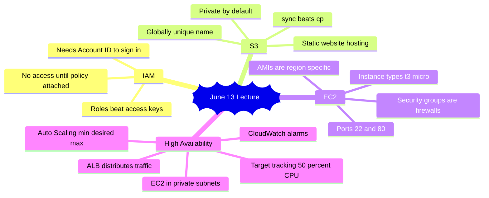

### Exam Revision Diagram (critical concepts + traps)

Cover the right box and explain *why each misconception is false* using the left box.

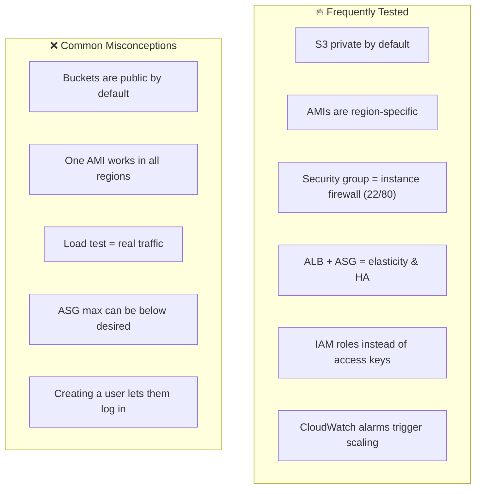

### Teach Me in 5 Minutes (visual summary)

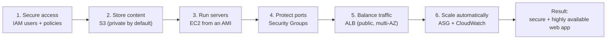

**The story in one breath:** *You secure who gets in (IAM), store your site (S3), run it on servers (EC2) locked down by firewalls (security groups), put a load balancer in front (ALB), and let Auto Scaling + CloudWatch add servers when traffic spikes — keeping the app fast, secure, and always on.*

---

*Notes generated for post-lecture review. Lab numbers and example values (bucket names, passwords, IPs) are from the live session and are illustrative only.*
