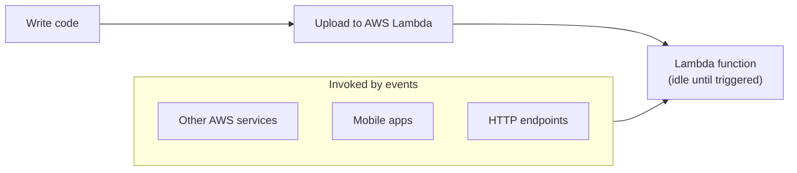
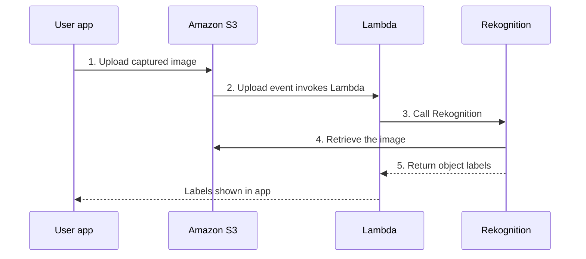
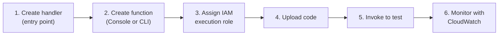
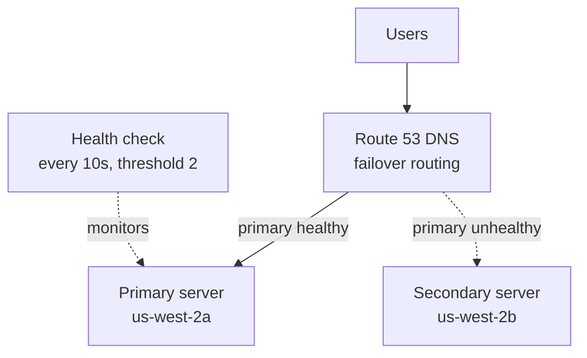
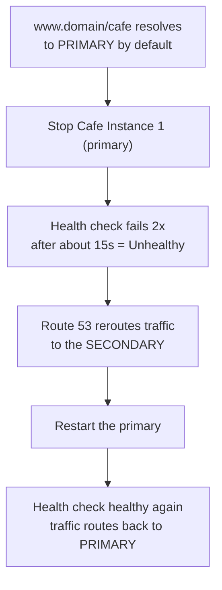
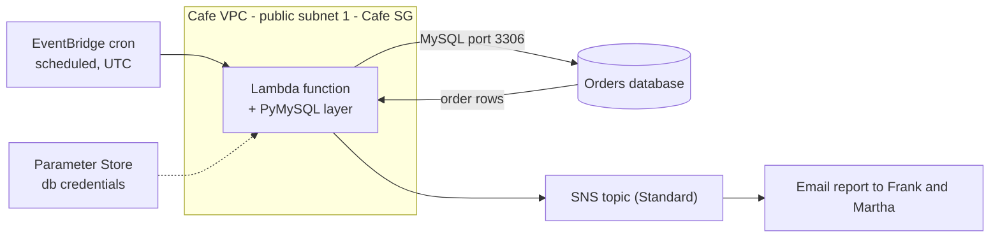
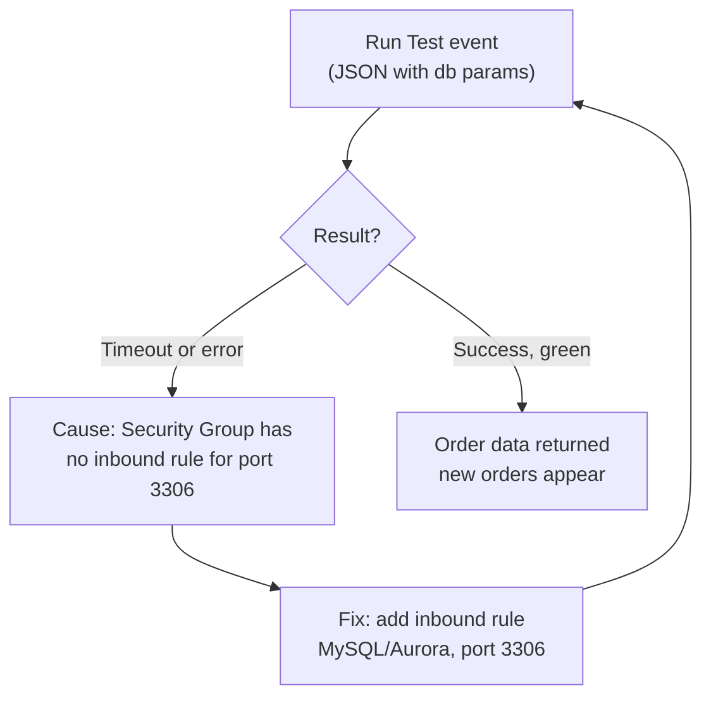
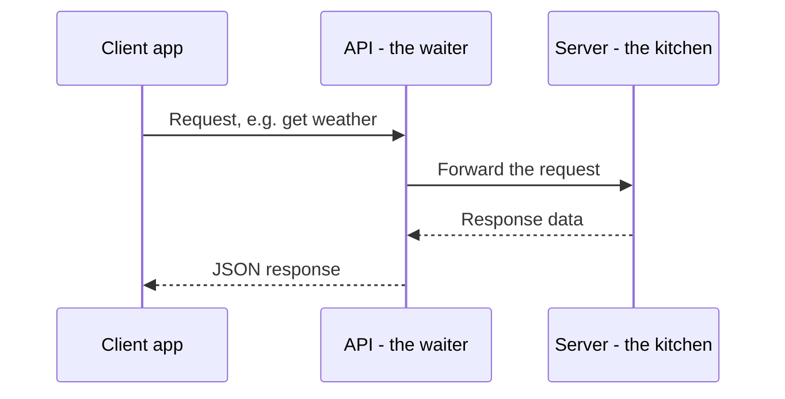
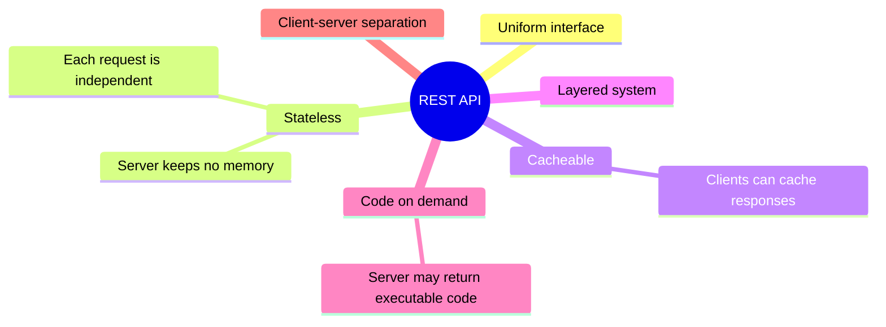

# AWS Restart Program — Lecture Notes
## Cohort 3: Project CloudIgnite — June 15, 2026

> **Session length:** ~177 minutes  
> **Topics covered:** AWS Lambda (serverless concepts) · Amazon Route 53 failover routing (Lab 176) · Lambda + SNS sales-report lab (Lab 178) · REST API fundamentals

> [!NOTE]
> Throughout these notes, sections marked **🎯 CLF-C02 Relevant** map to learning objectives of the **AWS Certified Cloud Practitioner (CLF-C02)** exam. A consolidated exam-mapping table is provided at the end.

---

## Table of Contents
1. [AWS Lambda — Serverless Compute](#1-aws-lambda--serverless-compute)
2. [Amazon Route 53 Failover Routing (Lab 176)](#2-amazon-route-53-failover-routing-lab-176)
3. [Lambda + SNS Sales Report (Lab 178)](#3-lambda--sns-sales-report-lab-178)
4. [REST APIs](#4-rest-apis)
5. [CLF-C02 Exam Relevance Summary](#5-clf-c02-exam-relevance-summary)
6. [Key Terms Glossary](#6-key-terms-glossary)
7. [Action Items & Housekeeping](#7-action-items--housekeeping)

---

## 1. AWS Lambda — Serverless Compute

### 1.1 What "serverless" really means
- **Serverless does NOT mean "no server."** Servers still exist and run the code; you just don't manage them. AWS takes over that responsibility.
- Lambda is a **fully managed serverless compute service**.
- Compared to EC2, one more layer of responsibility shifts to AWS — this makes Lambda closer to **Platform as a Service (PaaS)** rather than **Infrastructure as a Service (IaaS)**.

### 1.2 EC2 vs. Lambda — Responsibility comparison

| Task | Traditional (EC2) | Serverless (Lambda) |
|------|-------------------|---------------------|
| Provision instances | **You** | AWS |
| Update OS / patch servers | **You** | AWS |
| Install application platform/runtime | **You** | AWS |
| Build & deploy application | **You** | **You** |
| Configure auto-scaling & load balancing | **You** | AWS (automatic) |
| Secure & monitor servers | **You** | AWS |
| Monitor & maintain the *application* | **You** | **You** |

> **Bottom line:** With Lambda you only **(1) build & deploy your code** and **(2) monitor/maintain the application**. Everything else is AWS's job.

### 1.3 Key characteristics
- **Event-driven invocation** — functions run in response to events (e.g., a file uploaded to S3, an HTTP request, a scheduled trigger).
- **Sub-second metering / pay-for-use** — you pay **only for execution time**, not idle time.
  - Example: a Lambda "available" 24/7 but only executing 10 minutes/day → you pay for ~10 minutes.
  - Contrast with EC2: you pay for the whole time the instance runs, regardless of 10 users or 500 users.
- **15-minute maximum execution time** per invocation.
  - This is the *per-request processing time*, NOT a daily run limit. The function can be "alive" 24/7; each invocation must finish within 15 min.
  - If a single task (e.g., analyzing a very large PDF) exceeds 15 min, it returns an **error**.
  - Most API/web requests finish in seconds — 15 min is generous for typical workloads.
- **Automatic scaling** — handles 5, 50, or 1,000+ concurrent users with **no scaling configuration** required.
- **Supports multiple programming languages** (e.g., Python, Node.js, etc.).

### 1.4 Typical architecture / flow
```
Write code  →  Upload to AWS Lambda  →  Invoke from:
                                         • Other AWS services
                                         • Mobile apps
                                         • HTTP endpoints
```

#### 📊 Visual: Lambda invocation model
*You upload code once; the function sits idle and only runs when an event invokes it.*



### 1.5 Example use case (image labeling)
1. User captures an image in a property-listing mobile app.
2. App uploads the image to an **Amazon S3** bucket.
3. The upload event **invokes a Lambda function**.
4. Lambda calls **Amazon Rekognition**.
5. Rekognition retrieves the image from S3 and returns labels for detected objects/properties.

#### 📊 Visual: Image-labeling use case (event-driven flow)
*An S3 upload triggers Lambda, which calls Rekognition and returns labels back to the app.*



### 1.6 Steps to develop & deploy a Lambda function
1. **Create a handler** (the entry-point function in your code).
2. **Create the Lambda function** via the AWS Management Console **or** AWS CLI.
3. **Create/assign an IAM role** — Lambda needs an execution role with permissions.
4. **Upload your code** to the function.
5. **Invoke the function** to test it.
6. **Monitor** using **Amazon CloudWatch**.

#### 📊 Visual: Develop & deploy a Lambda function
*The six-step path from writing a handler to monitoring it in production.*



### 1.7 Lambda Layers
- A **layer** packages extra/shared **libraries and dependencies** separately from your function code.
- Benefit: your function code stays clean; dependencies are managed centrally in the layer and reused across functions.
- Use when you need libraries beyond the standard runtime library.

### 1.8 Quotas & limits (as discussed)
- Lambda has quotas for compute/resources, function configuration, deployment, and API requests. Quotas are generally generous, and some can be increased.
- You can deploy a **container image** to Lambda (instructor estimated up to ~10 GB — verify exact figure).
- There is a **monthly free tier** for requests (instructor unsure of exact number — verify; AWS free tier is **1 million requests/month**).

### 1.9 Bonus pattern: Lambda to start/stop EC2
- A scheduled event can invoke a Lambda that has permission to **stop or start EC2 instances** (e.g., shut down instances at night to save cost, start them in the morning).

> #### 🎯 CLF-C02 Relevant — Section 1
> - Lambda as a core **serverless compute** service; difference between IaaS (EC2) and serverless/PaaS models.
> - **Pay-as-you-go / pay-for-value** pricing and cost benefits of serverless.
> - **Shared Responsibility Model** — how responsibility shifts from customer to AWS with managed services.
> - **Elasticity / automatic scaling** as a benefit of the cloud.
> - Service recognition: **Lambda, S3, Rekognition, CloudWatch, IAM roles**.

---

## 2. Amazon Route 53 Failover Routing (Lab 176)

### 2.1 Business scenario
- **Problem (Frank):** The café website went down ~2 days ago; customers couldn't place orders for most of a day → lost revenue and frustrated customers.
- **Need (Sophia):** A solution ensuring the website is **always available** (zero / near-zero downtime).
- **Solution:** Use **Amazon Route 53 DNS failover routing** to automatically redirect traffic to a healthy backup server.

### 2.2 Core concepts
- **Route 53** = AWS's scalable **DNS web service**.
- **Failover routing** = active/passive setup:
  - **Primary server** handles traffic normally.
  - **Secondary (backup) server** takes over automatically if the primary becomes unhealthy.
- **Health checks** continuously monitor the primary; on failure, DNS reroutes to the secondary.
- This provides **high availability / fault tolerance**.
- *Best practice note:* For true fault tolerance, primary and secondary should be in **different Availability Zones** (the lab used the same AZ for simplicity).

#### 📊 Visual: Failover routing (active / passive)
*Route 53 sends everyone to the primary while its health check passes; if it fails, DNS swings traffic to the secondary.*



### 2.3 Lab walkthrough — what was built
**Setup:** Two EC2 instances already running — Cafe Instance 1 (primary, in `us-west-2a`, public subnet 1) and Cafe Instance 2 (secondary, in `us-west-2b`, public subnet 2).

**Task 1 — Test the servers**
- Open each instance's public URL `/cafe` to confirm both work; note their IP addresses and AZs.
- Place a test order on the primary.

**Task 2 — Configure a health check (Route 53)**
- Create a health check named e.g. `Primary Website Health`.
- Endpoint type: monitor by **IP address**, path = `/cafe`.
- Advanced config: **request interval = 10 seconds**, **failover threshold = 2** (it checks twice before declaring unhealthy, to avoid false alarms).

**Task 3 — Create DNS records (Hosted Zone)**
- Create an **A record** (`A` = routes traffic to an **IPv4** address; `AAAA` = IPv6).
  - Record name: `www`
  - Value: **primary** IP address
  - **TTL = 15 seconds** (TTL = "time to live" = how long the record is cached)
  - Routing policy: **Failover** → Failover record type **Primary** → attach the **primary health check**.
- Create a **second A record** for the **secondary**:
  - Value: **secondary** IP address, TTL 15s, Failover type **Secondary**, **no health check**.
- Always include `www` or it won't resolve.

**Task 4 — Test failover**
- Visit `www.<domain>/cafe` → resolves to the **primary** IP by default.
- **Stop** Cafe Instance 1 (primary).
- Wait ≥15s; the health check flips to **Unhealthy** after 2 failed checks.
- Refresh (incognito helps avoid local caching) → traffic now routes to the **secondary** instance (region/IP visibly changes). ✅ Failover works.
- Restarting the primary automatically routes traffic back to it.

#### 📊 Visual: Failover test timeline
*Stopping the primary trips the health check after two failures; traffic moves to the secondary and returns automatically once the primary is healthy again.*



**Task 5 — Email notification (optional in this lab)**
- Create a **CloudWatch alarm** on the health-check status.
- Attach an **SNS topic** + email subscription so an email fires when the instance becomes unhealthy.
- *Note:* Lab instructions for this step were outdated; instructor said it's fine to skip — the **main objective is failover routing**.

### 2.4 Troubleshooting tips from the session
- If you can't see your instances, **check/change your Region** to `us-west-2`.
- Do **not** force `https://` — use plain `http` for the lab URL (browsers may auto-add https).
- Use an **incognito window** to bypass cached DNS/pages when testing.
- Always **Submit** *and* **End** the lab — ending before submitting loses your work.

> #### 🎯 CLF-C02 Relevant — Section 2
> - **Amazon Route 53** as the AWS DNS service (service recognition).
> - **High availability, fault tolerance, and reliability** as cloud design principles.
> - **Availability Zones** and designing across multiple AZs.
> - **Amazon CloudWatch** (monitoring/alarms) and **Amazon SNS** (notifications) — service recognition.
> - Basic understanding of **EC2** instances.

---

## 3. Lambda + SNS Sales Report (Lab 178)

### 3.1 Business scenario
- **Sophia** wants to send a **daily report** to Frank and Martha listing the café's **daily baking needs**, derived from previous orders to plan tomorrow's baking.
- Implementation: a Lambda function reads order data from a database, formats a report, and emails it via **SNS** on a schedule.

#### 📊 Visual: Lab 178 end-to-end architecture
*A scheduled EventBridge rule wakes the Lambda, which reads orders from the database (over port 3306) using credentials from Parameter Store, then publishes the report through SNS to email.*



### 3.2 What was built — step summary

**Step 1 — Review IAM roles**
- Inspect provided roles (`Sales Analysis Report` role and `…DE role`) under **IAM**.
- Their permissions allow CloudWatch Logs actions: **create log group, create log stream, put log events** (i.e., the function can write logs). Observation only — nothing to change.

**Step 2 — Create a Lambda Layer**
- Download the provided files (a layer `.zip` and the extractor code `.zip`).
- In **Lambda → Layers**, create a layer named `pymysql library`, upload the **PyMySQL** `.zip`, and set compatible runtime **Python 3.10** (lab said 3.9, but 3.9 wasn't available — use the closest, 3.10).

**Step 3 — Create the Lambda function (extractor)**
- Author **from scratch**, runtime **Python 3.10**.
- Under **Additional settings**, enable **Use a custom execution role** and select the **Sales Analysis Report DE role** (lab's default-role instruction was outdated).

**Step 4 — Attach layer, set handler, upload code**
- Scroll to **Layers** (bottom of function page) → **Add a layer** → custom layer → the `pymysql` layer, version 1.
- **Runtime settings → Edit handler** to match the provided handler name.
- **Code → Upload from → .zip file** to load the provided extractor code (no "upload form" option — use *Upload from zip*).
- The code holds `dburl`, `dbname`, `dbuser`, `dbpassword`, connects to the DB, runs a `SELECT` query, and returns the order data.

**Step 5 — Configure VPC**
- **Configuration → VPC → Edit**: choose **Cafe VPC**, **Cafe Public Subnet 1**, and **Cafe Security Group**.

**Step 6 — Test & fix the database connection**
- Pull DB values from **Systems Manager Parameter Store** (`cafe/dbUrl`, `cafe/dbName`, `cafe/dbUser`, `cafe/dbPassword`).
- Build a **test event (JSON)** with those key/value pairs and run **Test**.
- First test **times out / errors** — expected. Cause: the **security group has no inbound rule for MySQL port 3306**.
- Fix: **Edit inbound rules → add rule type "MySQL/Aurora" (port 3306)**, source = Anywhere-IPv4 (lab convenience). Re-test → **success** (green), correct output returned.
- Place a real order on the café site, re-run test → the new order now appears in output.

**Step 7 — Create SNS topic & subscription**
- **SNS → Topics → Create topic** → type **Standard** (not FIFO).
- Create a **Subscription**: protocol **Email**, enter your email, then **confirm** via the confirmation email.

**Step 8 — Create the reporting Lambda (CLI) + wire SNS**
- Find the reporting role's **ARN** in **IAM → Roles** (`Sales Analysis Report`).
- Connect to the **CLI host** via **EC2 Instance Connect**; configure the AWS CLI (access key, secret key, region `us-west-2`, output `json`).
- Use a **`lambda create-function` CLI command** (with the correct **role ARN** and **Python 3.10**) to create the reporting Lambda.
  - *Common mistake seen:* students pasted the **SNS topic ARN** where the **IAM role ARN** was required — use the correct ARN for each field.
- Add an **environment variable** `topicARN` = the **SNS topic ARN** (note the exact casing `ARN`; a typo caused failures). *Use your own topic's ARN, not someone else's; and use the **topic** ARN, not the **subscription** ARN.*
- **Test** the function → it emails the sales report via SNS. ✅

**Step 9 — Schedule with a cron trigger (EventBridge)**
- **Configuration → Triggers → Add trigger** → source **EventBridge (CloudWatch Events)** → **Create a new rule** with a **cron expression** (UTC).
- After the scheduled time, the function runs automatically and the **email report arrives**. ✅

### 3.3 Recurring troubleshooting themes
- **Timeout errors** on test are often (a) too-short timeout (raise from 3s under **General settings**) or (b) the missing **3306 inbound rule**.
- **ARN confusion:** IAM role ARN ≠ SNS topic ARN ≠ SNS subscription ARN. Match the right ARN to the right field.
- **Casing matters** for environment variable keys (`topicARN`).
- Lab instructions were partly **outdated** (Python version, custom execution role, upload flow) — adapt accordingly.

#### 📊 Visual: The classic 3306 timeout fix
*The first test almost always times out because the security group is missing the MySQL inbound rule; add port 3306 and re-test.*



> #### 🎯 CLF-C02 Relevant — Section 3
> - **AWS Lambda** event-driven, scheduled execution; **Lambda layers** concept.
> - **Amazon SNS** for notifications / pub-sub messaging (service recognition).
> - **Amazon EventBridge / CloudWatch Events** for scheduling (cron) — service recognition.
> - **IAM roles, execution roles, and ARNs** — identity and access fundamentals; least-privilege idea (the role only allowed logging actions).
> - **AWS Systems Manager Parameter Store** for storing configuration/secrets — service recognition & security best practice (don't hard-code credentials).
> - **Amazon CloudWatch Logs** for monitoring/observability.
> - **VPC, subnets, and security groups (inbound rules / ports)** — core networking & security concepts.
> - **AWS CLI** and **EC2 Instance Connect** as ways to interact with AWS.
> - **AWS Management Console vs. AWS CLI** as management interfaces.

---

## 4. REST APIs

### 4.1 What is an API?
- **API = Application Programming Interface** — a **programmatic** way (not a GUI) for one application to communicate with another.
- Analogy: an API is like a **waiter** carrying requests/responses between you (client) and the kitchen (server).
- API responses are typically **machine-readable JSON** (application-friendly, not designed for direct human reading).
- **Benefit:** lets applications invoke each other's functions **without a graphical user interface**, in a consistent way.
- Example: a weather server exposes an API; a mobile app requests weather data → server returns JSON → app displays it. The user interacts with the app, and the app talks to the server via the API.

#### 📊 Visual: The API as a waiter
*The client never talks to the kitchen directly; the API carries the request over and brings back a JSON response.*



### 4.2 What is a REST API?
- **REST = REpresentational State Transfer.**
- An interface that **two computer systems use to exchange information** over **HTTP**.
- Designed for **loosely coupled**, network-based applications.
- **Exposes resources at specific URLs.**
- **Stateless:** the server does **not** remember previous requests; **every request is independent** and self-contained (no persistent connection maintained between requests).

### 4.3 REST design principles (constraints)
1. **Uniform interface**
2. **Stateless**
3. **Cacheable** (clients can cache responses)
4. **Layered system**
5. **Code on demand** (server may optionally return executable code)

*(The sixth REST constraint, **client–server separation**, is implied by the client/server discussion.)*

#### 📊 Visual: The six REST constraints
*The design principles that make an interface RESTful.*



> #### 🎯 CLF-C02 Relevant — Section 4
> - **Low direct relevance.** REST/API design is general software/web architecture knowledge and is **not** a core CLF-C02 exam objective.
> - **Indirectly useful:** understanding HTTP endpoints helps explain how services like **Lambda** and **Amazon API Gateway** are invoked. API Gateway itself can appear as a service-recognition item on the exam, though it was not covered in this lecture.

---

## 5. CLF-C02 Exam Relevance Summary

| Topic from lecture | CLF-C02 Exam Domain | Relevance |
|---|---|---|
| Lambda serverless model; IaaS vs. PaaS/serverless | Cloud Concepts; Technology | ⭐⭐⭐ High |
| Pay-for-use / pay-as-you-go pricing | Billing, Pricing & Cost Mgmt | ⭐⭐⭐ High |
| Shared Responsibility Model (managed services) | Security & Compliance | ⭐⭐⭐ High |
| Automatic scaling / elasticity | Cloud Concepts | ⭐⭐⭐ High |
| Route 53 (DNS) + failover / high availability | Technology; Cloud Concepts | ⭐⭐⭐ High |
| Availability Zones & multi-AZ fault tolerance | Cloud Concepts; Technology | ⭐⭐⭐ High |
| IAM roles, execution roles, least privilege | Security & Compliance | ⭐⭐⭐ High |
| VPC, subnets, security groups, ports | Technology | ⭐⭐ Medium–High |
| CloudWatch (alarms, logs) monitoring | Technology; Security | ⭐⭐ Medium |
| Amazon SNS notifications | Technology | ⭐⭐ Medium |
| EventBridge / CloudWatch Events scheduling | Technology | ⭐⭐ Medium |
| Systems Manager Parameter Store (config/secrets) | Security; Technology | ⭐⭐ Medium |
| Amazon S3, Rekognition (use-case mentions) | Technology | ⭐⭐ Medium |
| AWS CLI vs. Console; EC2 Instance Connect | Technology | ⭐⭐ Medium |
| Lambda layers, handlers, deployment details | (implementation detail) | ⭐ Low (deeper than CLF-C02) |
| REST API design principles | (general web architecture) | ⭐ Low (not an exam objective) |

**Quick takeaways for CLF-C02 study:**
- Know **what each service does** at a high level (Lambda, S3, Route 53, CloudWatch, SNS, EventBridge, IAM, VPC, Parameter Store, Rekognition) — the exam tests **service recognition**, not hands-on configuration.
- Understand the **value proposition of serverless**: no server management, automatic scaling, pay only for what you use.
- Be solid on **high availability / fault tolerance**, the **Shared Responsibility Model**, and **IAM** fundamentals.
- Hands-on lab details (exact menus, ARNs, cron syntax) are **deeper than the exam requires** but reinforce the concepts.

---

## 6. Key Terms Glossary

| Term | Meaning |
|------|---------|
| **Serverless** | You run code without provisioning/managing servers; AWS manages the infrastructure. |
| **AWS Lambda** | Fully managed, event-driven serverless compute; 15-min max per invocation; pay per execution. |
| **Lambda Layer** | A package of shared libraries/dependencies attached to functions. |
| **Handler** | The function entry point Lambda calls to start execution. |
| **Execution role** | IAM role granting a Lambda its AWS permissions. |
| **ARN** | Amazon Resource Name — a unique identifier for an AWS resource. |
| **Amazon Route 53** | AWS managed DNS service; supports failover and other routing policies. |
| **Failover routing** | Active/passive DNS routing: traffic flows to a secondary if the primary is unhealthy. |
| **Health check** | Monitors endpoint health to drive failover decisions. |
| **TTL (Time To Live)** | How long a DNS record is cached before re-querying. |
| **A record / AAAA record** | DNS records mapping a name to an IPv4 / IPv6 address. |
| **Availability Zone (AZ)** | An isolated datacenter location within an AWS Region. |
| **Amazon CloudWatch** | Monitoring service for metrics, logs, and alarms. |
| **Amazon SNS** | Simple Notification Service — pub/sub messaging & notifications (e.g., email). |
| **Amazon EventBridge** | Event bus / scheduler (cron) that can trigger Lambda. |
| **Security Group** | Virtual firewall controlling inbound/outbound traffic to resources (e.g., port 3306 for MySQL). |
| **Parameter Store** | AWS Systems Manager feature to store configuration/secrets securely. |
| **REST API** | Stateless, HTTP-based interface for application-to-application communication, usually returning JSON. |
| **Stateless** | Each request is independent; the server keeps no memory of prior requests. |

---

## 7. Action Items & Housekeeping
- ✅ **Submit AND End** both labs (176 & 178) — ending before submitting forces a redo.
- 🗓️ **Saturday 2:00 PM** — instructor will re-run Lab 178 (Lambda + SNS) for anyone who needs it.
- 🗓️ **Tomorrow's lab** uses **S3 instead of the cloned DB** and is ~70–80% similar to Lab 178, **but has no instructions** (a challenge lab). Expect to work independently. Plan: topic first, early break (~7:40), then two labs.
- 📌 **Next topic:** **REST APIs / API Gateway** (continues next session).
- ⏳ ~16 labs remain (≈2 labs/day → ~8 days); course may extend slightly into July.

---

*Notes compiled from the June 15, 2026 session transcript for post-lecture review. Where the instructor was unsure of exact figures (e.g., Lambda free-tier request count, container image size limit), verify against current [AWS documentation](https://docs.aws.amazon.com/lambda/).*
