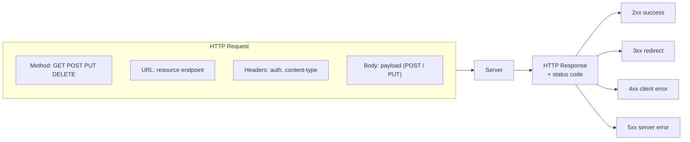
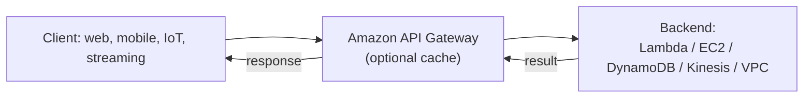
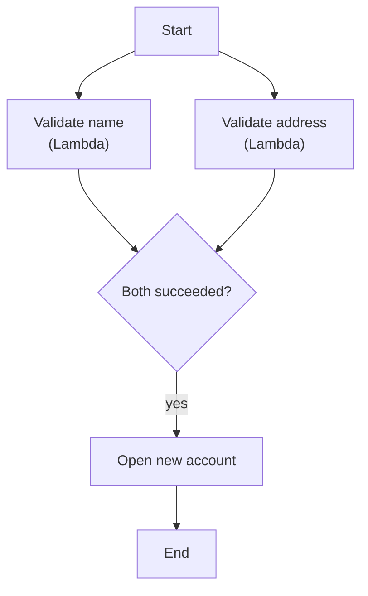
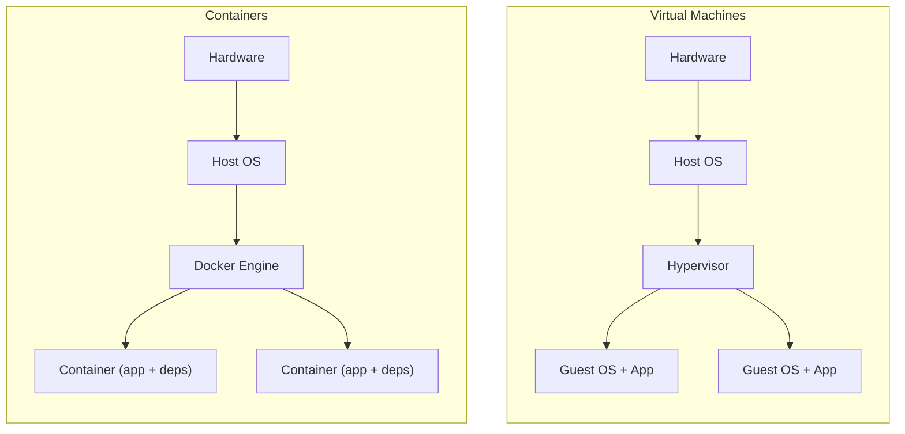
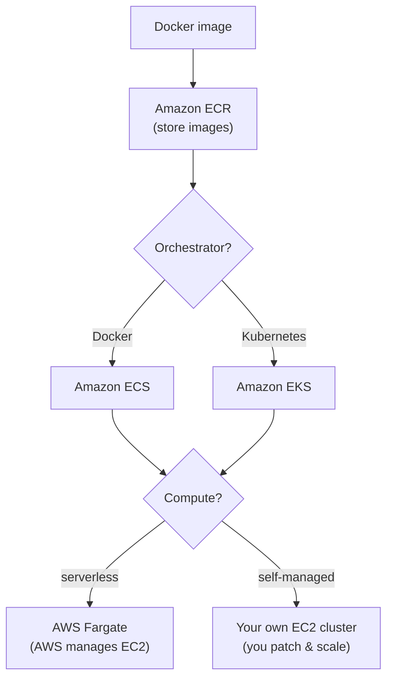
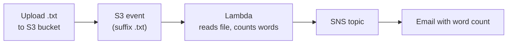
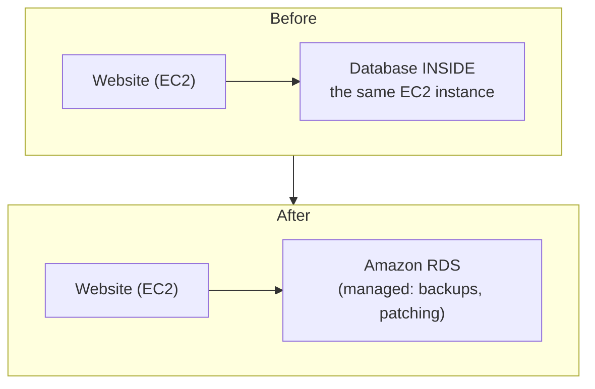
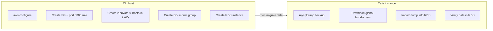

# Lecture Notes — June 16, 2026
**Cohort 3 | Project CloudIgnite**
**Topics:** REST API Requests and HTTP Status Codes, Amazon API Gateway, AWS Step Functions, Containers vs Virtual Machines, Docker, AWS Container Services (ECR, ECS, EKS, Fargate), Lab 177 (S3 to Lambda to SNS), Lab 179 (Migrate Database from EC2 to Amazon RDS)
**Duration:** ~3 hours

---

## Key Takeaways
- **REST = REpresentational State Transfer** — stateless, HTTP-based interface for app-to-app communication, returning JSON
- **HTTP methods:** GET (read), POST (create), PUT (update), DELETE (remove)
- **HTTP status code families:** 1xx info, 2xx success (200 OK, 201 Created), 3xx redirect, 4xx client error (401, 403, 404), 5xx server error (500, 502)
- **Amazon API Gateway** = fully managed service to create, publish, and maintain APIs; commonly pairs with **Lambda** for serverless APIs
- **AWS Step Functions** = serverless orchestration of workflows; in a state machine, a **Task** performs the work and the **state machine** is the workflow (sequential or parallel + join)
- **Container** = app + dependencies in a lightweight, isolated process sharing the host OS kernel (vs. a VM's full guest OS on a hypervisor)
- **AWS container services:** **ECR** stores images, **ECS** orchestrates Docker, **EKS** runs Kubernetes, **Fargate** runs containers without managing EC2 (serverless)
- **S3 → Lambda → SNS** is the canonical event-driven serverless pattern (Lab 177 demonstration)
- **Amazon RDS** is a managed relational database — AWS handles backups, patching, maintenance; migrate from self-managed DB-on-EC2 to reduce operational burden

---

## Table of Contents
1. [REST API Requests, Responses & Status Codes](#1-rest-api-requests-responses--status-codes)
2. [Amazon API Gateway](#2-amazon-api-gateway)
3. [AWS Step Functions](#3-aws-step-functions)
4. [Containers vs. Virtual Machines](#4-containers-vs-virtual-machines)
5. [Docker](#5-docker)
6. [AWS Container Services](#6-aws-container-services)
7. [Lab 177 — S3 → Lambda → SNS (Word Count)](#7-lab-177--s3--lambda--sns-word-count)
8. [Lab 179 — Migrate Database from EC2 to Amazon RDS](#8-lab-179--migrate-database-from-ec2-to-amazon-rds)
9. [CLF-C02 Exam Relevance Summary](#9-clf-c02-exam-relevance-summary)
10. [Key Terms Glossary](#10-key-terms-glossary)
11. [Checkpoint Q&A Recap](#11-checkpoint-qa-recap)
12. [Action Items & Housekeeping](#12-action-items--housekeeping)

---

## 1. REST API Requests, Responses & Status Codes

*(Continuation of the previous session's REST API topic.)*

### 1.1 Anatomy of an HTTP request
- **Method** — the action verb (GET, POST, PUT, DELETE, …).
- **URL** — the resource location/endpoint.
- **Headers** — extra information, e.g. authentication token, cookies, API key, `Content-Type: application/json`. Sometimes optional, sometimes required (e.g., for authentication).
- **Body** — the payload, used mainly with **POST** (create a resource) and **PUT** (update a resource).
- Works over **HTTP (e.g., HTTP/1.1)**.

### 1.2 HTTP method meanings (REST verbs)
| Method | Purpose |
|--------|---------|
| **GET** | Read/retrieve a resource |
| **POST** | **Create** a new resource |
| **PUT** | **Update** an existing resource |
| **DELETE** | Remove a resource |

### 1.3 HTTP status code families
Every status code carries meaning — the first digit tells you the category:

| Range | Category | Meaning |
|-------|----------|---------|
| **1xx** | Informational | Informational response |
| **2xx** | Success | Request succeeded (e.g., `200 OK`, `201 Created`, `202 Accepted`) |
| **3xx** | Redirection | Resource moved / redirected to another URL |
| **4xx** | **Client-side error** | Problem with the request (e.g., `401 Unauthorized`, `403 Forbidden`, `404 Not Found`) |
| **5xx** | **Server-side error** | Server failed (crash, unhandled exception, etc.; e.g., `500`, `502`) |

**Key codes to remember:**
- `200 OK` — success.
- `201 Created` — resource created.
- `401 Unauthorized` — not authenticated/authorized.
- `403 Forbidden` — not allowed.
- `404 Not Found` — requested resource doesn't exist (client-side problem).

#### Visual: The HTTP request / response cycle
*A request carries a method, URL, headers and (sometimes) a body; the response comes back with a status code whose first digit tells you the outcome.*



### 1.4 Testing with cURL
`curl` is a command-line tool to send HTTP requests. Example POST:
```bash
curl -X POST -d @file.json -H "Content-Type: application/json" <URL>
```
- `-X` = HTTP method (e.g., POST)
- `-d` = data/body (here from `file.json`)
- `-H` = header (here `Content-Type: application/json`)

> #### CLF-C02 Relevant — Section 1
> - **Low direct relevance.** HTTP methods/status codes are general web knowledge, not core CLF-C02 objectives.
> - Worth knowing conceptually since AWS services (API Gateway, Lambda, S3) communicate over HTTP.

---

## 2. Amazon API Gateway

- **API Gateway** is a **fully managed AWS service** to **create, publish, and maintain APIs** (including RESTful APIs).
- Commonly paired with **AWS Lambda** to build **serverless APIs** (no servers to manage).
- It provides a **URL endpoint**; a request to that URL can invoke a Lambda function (or other backend) and return the response.
- Can integrate with multiple backends: **Lambda, EC2, DynamoDB, Kinesis**, and resources inside a **VPC**.
- Supports an **API Gateway cache** — on a cache miss, it forwards to the backend resource.

### Typical flow
```
Client (web / mobile / IoT / streaming device)
      → API Gateway (optionally cache)
            → Lambda / EC2 / DynamoDB / Kinesis / VPC resource
      ← response
```

#### Visual: API Gateway request flow
*One managed URL endpoint fronts your backend: the gateway (optionally caching) routes the request and returns the response.*



### Benefits
- Efficient API development
- Performance at any scale (no scaling to manage)
- Cost saving with **tiered pricing**
- Flexible monitoring
- Flexible security controls
- Supports RESTful API implementation

> #### CLF-C02 Relevant — Section 2
> - **Service recognition:** know that **Amazon API Gateway** is a fully managed service for creating/managing APIs, often combined with Lambda for **serverless** apps.
> - Reinforces the **serverless** and **managed-service** value proposition (no server/scaling management, pay-as-you-go).

---

## 3. AWS Step Functions

- **Step Functions** provide **serverless orchestration** — they coordinate multiple tasks/services into a managed **workflow**.
- Most useful when **one task depends on another** (sequencing/dependencies between steps).
- Coordinate existing **AWS Lambda functions** and **microservices** into a single application while keeping **application logic separate from implementation**.

### Why orchestration matters (microservices)
- In a microservice (or multi-Lambda) design, each service/function is **independent**.
- But real apps often need ordering/dependencies (e.g., authenticate **before** fetching data). Step Functions enforce this coordination across 10–15+ functions.

### Workflow building blocks
| Term | Meaning |
|------|---------|
| **State machine** | The Step Function itself (the overall workflow) |
| **State** | A single step in the workflow |
| **Task** | The actual work performed at a state |

### Sequential vs. parallel execution
- **Sequential:** Task 1 → Task 2 → Task 3.
- **Parallel:** Task 1 and Task 2 run at the same time; **Task 3 waits** until both finish.
- Example — **account-opening workflow:** "validate name" and "validate address" run in **parallel** (each a separate Lambda); only when **both** succeed does "open new account" run.

#### Visual: Step Functions — parallel then join (account-opening)
*"Validate name" and "validate address" run in parallel as separate Lambdas; "open new account" only runs once BOTH succeed.*



### Benefits / features
- Productivity, agility, flexibility, resilience
- **Automatic scaling** (no compute to manage)
- **High availability**
- **Pay-per-use**
- Security & compliance

### Use cases
- End-to-end workflows with **dependent components**
- Breaking a business process into a series of steps (e.g., account/order processing)

> #### CLF-C02 Relevant — Section 3
> - **Service recognition:** **AWS Step Functions** = serverless **orchestration** of workflows/Lambda functions.
> - Reinforces serverless benefits: auto-scaling, high availability, pay-per-use.
> - Exam-style fact: in Step Functions, a **Task** performs the work; the **state machine** is the workflow.

---

## 4. Containers vs. Virtual Machines

### 4.1 What is a container?
- A **container** = an **application + its dependencies** packaged to run in a **resource-isolated process**.
- It behaves like a separate, isolated environment but is **not** a full separate OS.

### 4.2 VM vs. Container
| Aspect | Virtual Machine (VM) | Container |
|--------|----------------------|-----------|
| Isolation unit | Full **guest operating system** | Isolated **process/environment** |
| Underlying layer | Runs on a **hypervisor** | Runs on a **container engine (e.g., Docker)** that **shares the host OS kernel** |
| Size | Heavy (often several GB) | **Lightweight**, small, portable |
| Startup | Slower | **Starts in seconds** |
| Density | Fewer per host | Many (tens/hundreds) per host |

**Stack comparison:**
```
VM:        Hardware → Host OS → Hypervisor → [Guest OS + App] × N
Container: Hardware → Host OS → Docker Engine → [Container (app + deps)] × N
```

#### Visual: VM stack vs. container stack
*Each VM ships a full guest OS on a hypervisor (heavy); containers share the host OS kernel through the engine (light, start in seconds).*



**House analogy (from class):** A **VM is like a landed house** (its own plumbing/electricity = full OS); a **container is like an apartment** (isolated, but shares building infrastructure = host OS) — smaller and lighter to scale.

### 4.3 Why containers matter
- **"Works on my machine" problem:** an app may run on your laptop but fail on deployment due to environment/OS differences. A container bundles the environment, so if it works locally it'll likely work anywhere.
- **Conflicting dependencies:** run App A needing **Python 3.7** and App B needing **Python 3.11** side-by-side in **separate containers** — each has its own libs.
  - *Note:* Python `venv` only isolates **packages** while sharing the **same core Python**; containers can use **completely different runtime versions**.

### 4.4 Benefits of containers
- Environment consistency
- Process isolation
- Operational efficiency
- Developer productivity
- **Version control / rollback** (immutable artifacts — rebuild a new version rather than modifying in place)

> #### CLF-C02 Relevant — Section 4
> - **High relevance (conceptual):** understand **containers vs. VMs** and why containers are lightweight, portable, and consistent across environments.
> - Supports the cloud benefit of **portability** and efficient resource use.

---

## 5. Docker

- **Docker** = an application/platform to **create, manage, and run containers**. (The core concept is the **container**; Docker is one tool to work with them.)
- Lets developers **build, test, deploy, and run** containers.
- Benefits: microservice architecture support, stateless & portable, lightweight, **immutable artifacts**, reliable/repeatable deployments.

### Docker components
| Component | Role |
|-----------|------|
| **Dockerfile** | The **blueprint** — defines base OS (Ubuntu/Debian/etc.), apps to install, env variables, etc. (`docker-compose.yml` is related config.) |
| **Docker image** | The built artifact = OS image + tools/app, produced from the Dockerfile |
| **Registry** | Where images are stored/shared (hundreds of thousands of reusable public images) |
| **Container** | A running instance of an image |
| **Host** | The machine Docker runs on |

> **Note:** Docker/containers are **not AWS-specific** — you can install and practice Docker on your own laptop.

> #### CLF-C02 Relevant — Section 5
> - **Service/tool recognition:** know **Docker** is the common tool to build/run containers and that AWS container services support Docker.

---

## 6. AWS Container Services

Once you have containers, AWS provides services to **store, run, and orchestrate** them.

| AWS Service | Purpose | Analogy / Note |
|-------------|---------|----------------|
| **Amazon ECR** (Elastic Container Registry) | Fully managed registry to **store, manage, and deploy** Docker images | Similar to Docker Hub |
| **Amazon ECS** (Elastic Container Service) | AWS-native, highly scalable **container orchestration/management** for Docker containers | Create, launch, run containers |
| **Amazon EKS** (Elastic Kubernetes Service) | Managed service to **run Kubernetes** on AWS without operating your own control plane/cluster | Kubernetes is open-source; portable from laptop to AWS |
| **AWS Fargate** | **Serverless compute engine** for containers (ECS/EKS) — no EC2 to manage | AWS handles instances, scaling, OS patching, load balancing |

### Key relationships
- Containers ultimately **run on EC2 instances under the hood**.
- **Two ways to provide compute** for ECS **or** EKS:
  1. **AWS Fargate** — "serverless"; AWS manages the underlying EC2, scaling, patching. (Behaves like serverless, though servers still exist.)
  2. **Your own EC2 cluster** — cheaper potentially, but **you** manage OS patches, cluster health, and replacing unhealthy nodes.
- **Orchestration choice:** use **Docker → ECS** or **Kubernetes → EKS**; either can run on Fargate or self-managed EC2.
- EKS integrates with: ELB (load balancing), **IAM** (authentication), **Amazon VPC** (isolation), AWS PrivateLink, **CloudTrail** (logging).

#### Visual: Choosing AWS container services
*Store the image in ECR, pick an orchestrator (ECS for Docker, EKS for Kubernetes), then pick compute: serverless Fargate or your own EC2 cluster.*



> #### CLF-C02 Relevant — Section 6
> - **High relevance — service recognition is commonly tested:**
>   - **ECR** = store/manage Docker images (registry).
>   - **ECS** = AWS container orchestration for Docker.
>   - **EKS** = managed Kubernetes on AWS.
>   - **Fargate** = run containers **without managing servers** (serverless compute for containers).
> - Reinforces **managed vs. self-managed** trade-offs and the **serverless** model.

---

## 7. Lab 177 — S3 → Lambda → SNS (Word Count)

**Goal:** When a `.txt` file is uploaded to an S3 bucket, automatically invoke a Lambda that processes the file (word count) and emails the result via SNS. *(This was the "challenge" lab — only short instructions provided.)*

### Architecture / flow
```
Upload .txt to S3 bucket  →  S3 event triggers Lambda  →  Lambda reads file & counts words
                                                       →  Lambda publishes to SNS topic  →  Email
```

#### Visual: Lab 177 event-driven pipeline
*A `.txt` upload fires an S3 event that invokes Lambda, which counts the words and publishes to SNS for email. (Watch the bug: the provided code counted characters — fix with `content.split()`.)*



### Steps
1. **Create SNS topic & subscription**
   - SNS → Topics → **Create topic** → type **Standard** (not FIFO). Name e.g. `S3-event`.
   - **Copy the topic ARN** (needed later).
   - Create a **Subscription**: protocol **Email**, enter your email, then **confirm** via the confirmation email.
   - *(Optional challenge: an SMS subscription — but the account's SNS sandbox couldn't verify a phone number, so email was used.)*
2. **Create an S3 bucket** with a globally unique name (no need to enable public access).
3. **Create the Lambda function**
   - Runtime **Python 3.10**.
   - Enable **Use a custom execution role** → select **lambda access role** (critical — without it the lab fails).
4. **Add the S3 trigger** (configured from the Lambda side)
   - **Add trigger** → source **S3** → select your bucket.
   - Event type: **All object create events**.
   - **Suffix: `.txt`** — don't leave blank, or Lambda may misfire on non-text objects.
5. **Store the topic ARN as an environment variable** (don't hard-code secrets/ARNs)
   - Configuration → Environment variables → key **`topicARN`**, value = the copied SNS topic ARN.
6. **Add the code & deploy**
   - The Python code uses the **boto3 SDK**: creates an **S3 client** and an **SNS client**, reads the uploaded object from the event (bucket + object key), reads its content, computes a count, then `sns.publish(...)` to email the result.
   - *Provided code bug:* it counted **characters**, not words. Fix by splitting on spaces: `words = content.split()` then count, e.g. `len(words)`.
7. **Test** by uploading a `.txt` file to the bucket → receive an email with the count.
   - Re-uploading (even the same/renamed file) triggers a new invocation and email each time.

### Troubleshooting tips
- **No email?** Check **junk/spam**, confirm you're still **subscribed**, and verify the **topic ARN** is correct.
- Check **Lambda → Monitor → Invocations**: if invocations appear, the trigger works even if email didn't arrive (likely subscription/ARN/spam issue).
- **Three ways to interact with AWS** (reinforced here): **Management Console**, **CLI**, and **SDK** (the code used the SDK).
- **Lambda destinations** (aside): on success/failure, Lambda can send result info to another target (e.g., another S3 bucket) — separate from the SNS email.

> #### CLF-C02 Relevant — Section 7
> - **Service recognition & integration:** **S3 event → Lambda → SNS** is a classic **event-driven, serverless** pattern.
> - **IAM execution roles**, storing config in **environment variables** (not hard-coding) = security best practice.
> - **Three ways to access AWS:** Console, CLI, SDK.
> - **CloudWatch monitoring** (invocations) for observability.

---

## 8. Lab 179 — Migrate Database from EC2 to Amazon RDS

### Business scenario
- **Problem (Frank's business):** The café database currently runs **inside an EC2 instance**. Sophia & Nikhil must do **manual weekly backups** (weekend overtime), **verify backups**, and **manually apply patches** — increasing labor cost and effort.
- **Solution:** Migrate to **Amazon RDS** (a **managed database**) so AWS handles backups, patching, and availability.

> Why RDS? It's a **managed relational database** — automated backups, patching, and maintenance are AWS's responsibility, removing the manual burden.

### Architecture change
```
Before:  Website (EC2)  →  Database INSIDE the same EC2 instance
After:   Website (EC2)  →  Database in Amazon RDS (managed)
```
*(Only the **database** moves to RDS. The **website stays on EC2** — stopping the EC2 instance still breaks the site.)*

#### Visual: Lab 179 — what actually changes
*Only the database moves to managed Amazon RDS; the website stays on EC2 (so stopping that EC2 still breaks the site).*



### High-level steps (done mostly via AWS CLI)
1. **Place a test order** on the café site so there's data to verify after migration.
2. **Connect to the CLI host** (EC2 Instance Connect) and run **`aws configure`** (access key, secret key, region **us-west-2**, output **json**).
3. **Create networking & security via CLI:**
   - Create the **Cafe database security group** (in the Cafe **VPC** — needs the **VPC ID**).
   - Add an **inbound rule** allowing **MySQL port 3306** (source = the Cafe security group).
   - Create **two private subnets** in **different AZs** (e.g., `us-west-2a` and `us-west-2b`) with **different CIDR blocks** (e.g., `10.x` ranges) — RDS requires a subnet group spanning ≥2 AZs.
   - Create a **DB subnet group** referencing both private subnets.
4. **Create the RDS DB instance** via CLI (specify AZ, security group, master username/password — remember them for later commands). Creation takes a few minutes; poll status until **available** to get the **endpoint/host DNS**.
5. **Migrate the data (run on the *cafe* instance, not the CLI host):**
   - Take a backup with **`mysqldump`** (creates a backup file of schema + data).
   - Download the required **`.pem`** SSL bundle (`global-bundle.pem`) to connect securely.
   - Restore/import the dump **into the RDS endpoint** (transfers all data to RDS).
6. **Verify:** connect to the RDS database and run `SELECT * FROM product;` — the migrated data should appear.
7. **Repoint the app to RDS:** in **Systems Manager Parameter Store**, update the **`cafe/dbUrl`** (and password if changed) to the **RDS endpoint**. Reload the site → same data, now served from RDS.
8. *(Optional)* **Task 5 – Monitoring:** view RDS metrics in the RDS console.

### Critical gotchas (caused most failures)
- **Run commands on the correct host!** Everything **before Task 3** runs on the **CLI host**; everything **from Task 3 onward** runs on the **cafe instance**. Confirm via the prompt's IP address. Running a command on the wrong instance was a recurring error.
- **VPC ID vs. Security Group ID** — don't mix them: VPC IDs start with `vpc-`, security groups with `sg-`.
- **Wrong/missing security group** — a major failure cause; the DB security group's inbound rule/source must be correct (the right Cafe security group).
- **CIDR block conflicts** — the two subnets need **different** CIDR blocks; if one is wrong, change the block (don't necessarily delete).
- **Don't stop/delete the EC2 instance** — the website still lives there; only the DB moved.
- A failed earlier command cascades: later commands depend on it, so fix the first failing step before continuing.

#### Visual: Which host runs which command?
*The #1 failure was running commands on the wrong instance: provisioning happens on the CLI host; the data dump / restore / verify happens on the cafe instance.*



> #### CLF-C02 Relevant — Section 8
> - **High relevance:**
>   - **Amazon RDS** = managed relational database; AWS handles **backups, patching, maintenance, availability** (Shared Responsibility Model in action).
>   - **Managed service value:** reduces operational/labor cost vs. self-managing a DB on EC2.
>   - **VPC, subnets, multi-AZ, security groups, ports** = core networking/security concepts.
>   - **Parameter Store** for configuration; **AWS CLI** and **EC2 Instance Connect** as management methods.
> - Lab mechanics (exact `mysqldump`/CLI commands) are **deeper than the exam requires**, but the *concept* of migrating to a managed DB is exam-relevant.

---

## 9. CLF-C02 Exam Relevance Summary

| Topic from lecture | CLF-C02 Domain | Relevance |
|---|---|---|
| Amazon RDS as a managed database (backups/patching) | Technology; Cloud Concepts; Billing | High |
| Shared Responsibility Model (managed services) | Security & Compliance | High |
| API Gateway (managed, serverless APIs) | Technology | High |
| Step Functions (serverless orchestration) | Technology | Medium–High |
| Containers vs. VMs (portability, lightweight) | Cloud Concepts; Technology | High |
| ECR / ECS / EKS / Fargate (service recognition) | Technology | High |
| Docker (build/run containers) | Technology | Medium |
| S3 → Lambda → SNS event-driven pattern | Technology; Cloud Concepts | High |
| IAM execution roles / least privilege | Security & Compliance | High |
| Env variables / Parameter Store (don't hard-code) | Security; Technology | Medium |
| VPC, subnets, multi-AZ, security groups, ports | Technology | Medium–High |
| 3 ways to access AWS: Console / CLI / SDK | Technology | Medium |
| CloudWatch monitoring (invocations) | Technology | Medium |
| HTTP methods & status codes (REST) | (general web) | Low (not an exam objective) |
| Lab CLI command mechanics (mysqldump, etc.) | (implementation detail) | Low (deeper than exam) |

**Quick takeaways for CLF-C02 study:**
- **Know what each service does** at a high level: **RDS, API Gateway, Step Functions, ECR, ECS, EKS, Fargate, S3, Lambda, SNS, CloudWatch, VPC, Parameter Store.**
- Understand **managed services** and the **Shared Responsibility Model** — RDS is the textbook example (AWS manages backups/patching).
- Understand **serverless** (Lambda, Fargate, API Gateway, Step Functions): no server management, auto-scaling, pay-per-use.
- Know **containers vs. VMs** at a conceptual level and which AWS service maps to which need.
- Hands-on CLI/HTTP details are useful practice but **beyond exam scope**.

---

## 10. Key Terms Glossary

| Term | Meaning |
|------|---------|
| **REST API** | Stateless, HTTP-based interface for app-to-app communication; resources at URLs. |
| **HTTP methods** | GET (read), POST (create), PUT (update), DELETE (remove). |
| **Status codes** | 1xx info, 2xx success, 3xx redirect, 4xx client error, 5xx server error. |
| **cURL** | CLI tool to send HTTP requests (`-X` method, `-d` data, `-H` header). |
| **Amazon API Gateway** | Managed service to create/maintain APIs; often front-ends Lambda for serverless APIs. |
| **AWS Step Functions** | Serverless orchestration of workflows (state machine = workflow, state = step, task = work). |
| **Container** | App + dependencies in an isolated, lightweight process sharing the host OS. |
| **Virtual Machine** | Full guest OS running on a hypervisor; heavier than a container. |
| **Docker** | Tool/platform to build, manage, and run containers. |
| **Dockerfile** | Blueprint defining a container image (base OS, apps, env vars). |
| **Docker image** | Built, immutable artifact produced from a Dockerfile. |
| **Registry** | Store for container images (e.g., Docker Hub, Amazon ECR). |
| **Amazon ECR** | Managed Docker image registry on AWS. |
| **Amazon ECS** | AWS-native container orchestration for Docker. |
| **Amazon EKS** | Managed Kubernetes on AWS. |
| **AWS Fargate** | Serverless compute for containers (no EC2 to manage). |
| **Kubernetes** | Open-source container orchestration platform. |
| **Amazon RDS** | Managed relational database (automated backups, patching, maintenance). |
| **mysqldump** | MySQL utility that exports a database to a backup file. |
| **DB subnet group** | A set of subnets (across ≥2 AZs) that an RDS instance can use. |
| **CIDR block** | An IP address range for a subnet/VPC. |
| **Security group** | Virtual firewall controlling inbound/outbound traffic (e.g., port 3306 for MySQL). |
| **Parameter Store** | AWS Systems Manager feature for storing config/secrets. |
| **SDK** | Software Development Kit (e.g., boto3) — a programmatic way to call AWS, alongside Console & CLI. |

---

## 11. Checkpoint Q&A Recap

**REST / API**
- *What is an API used for?* To enable communication between two applications/parties.
- *Which protocol do RESTful web services use?* **HTTP/HTTPS.**
- *What does status `200` mean?* **OK / success.**
- *Which method creates a resource?* **POST** (PUT = update).
- *What is API Gateway used for?* Creating API endpoints / RESTful APIs.

**Serverless & Containers KC**
- *Service to run containers without managing servers?* **AWS Fargate.**
- *Service to store/manage/deploy Docker images?* **Amazon ECR.**
- *Service to create/manage/run Docker containers?* **Amazon ECS.**
- *What performs the work in a Step Functions workflow?* **Task.**
- *Service to build & run apps without provisioning servers?* **AWS Lambda.**
- *Two AWS container orchestration tools?* **ECS** and **EKS.**
- *VM vs. container analogy?* VM = landed house (full OS); container = apartment (isolated, shares infrastructure).

---

## 12. Action Items & Housekeeping
- **Lab 177 (S3→Lambda→SNS):** completed — remember to **fix the word-count logic** (`content.split()`), then **Submit & End** the lab.
- **Lab 179 (EC2→RDS migration):** several students hit issues (wrong host, wrong security group). **Submit what you have**; the instructor will **re-run this lab Saturday 2:00 PM** (then yesterday's Lambda lab around 4:00 PM).
- **Tomorrow is a holiday** — next class is **Thursday**.
- **Upcoming topics:** Introduction to Databases, **Amazon Redshift**, **Amazon Aurora** (next sessions).
- Course likely extends slightly into **July**; ~2 labs/day to finish remaining labs (≈end of July). Official program end referenced as **June 27**.

---

*Notes compiled from the June 16, 2026 session transcript for post-lecture review. Lab command specifics are summarized conceptually; always follow the official lab instructions and verify service details against current [AWS documentation](https://docs.aws.amazon.com/).*
