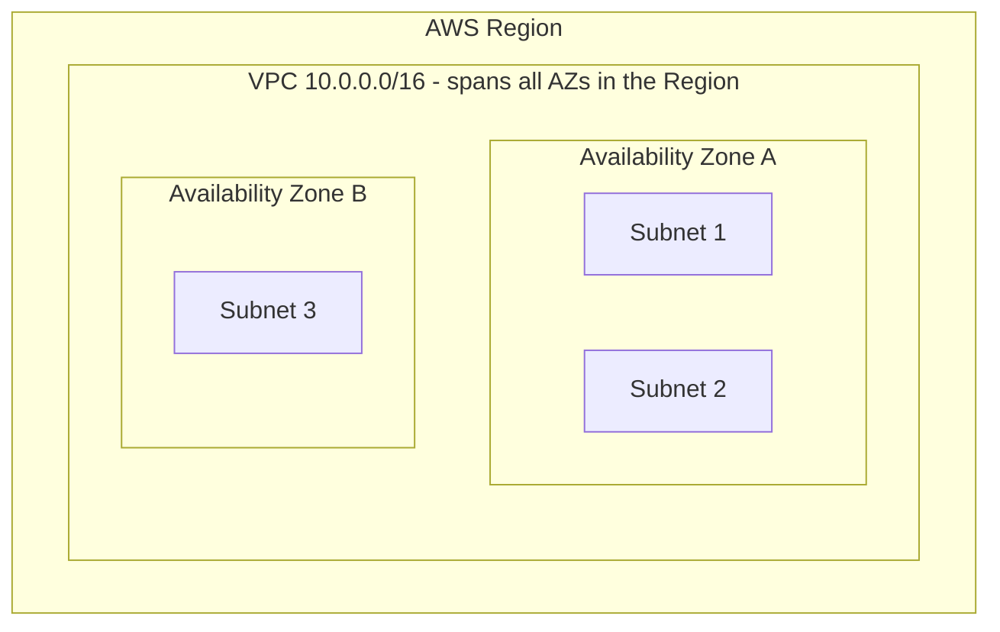
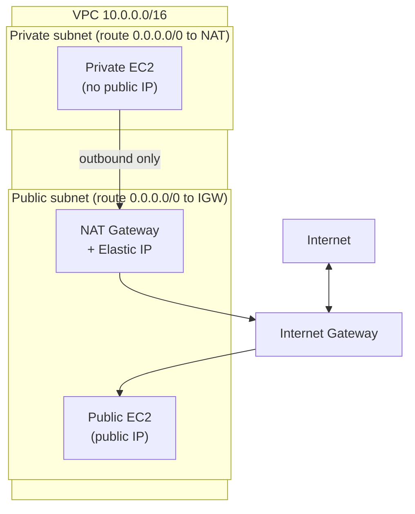
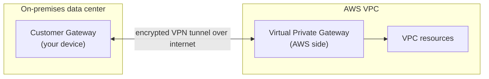
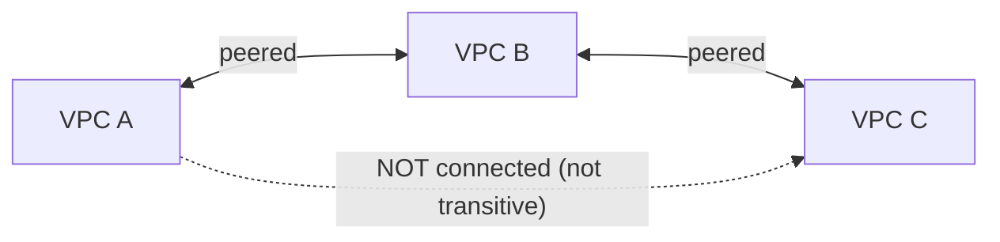
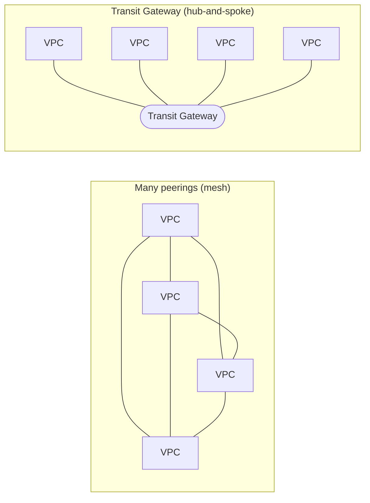
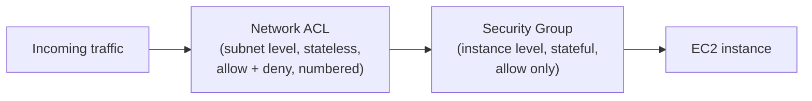
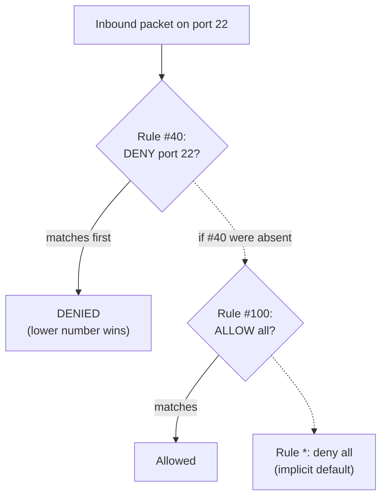
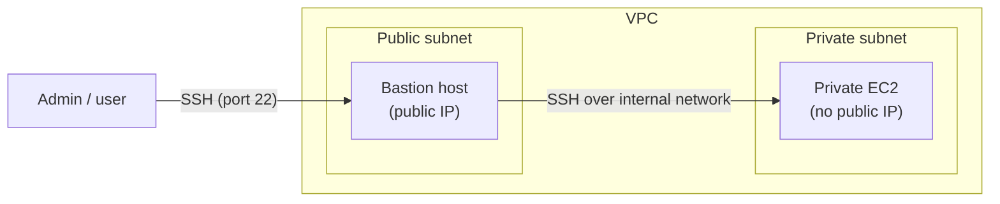
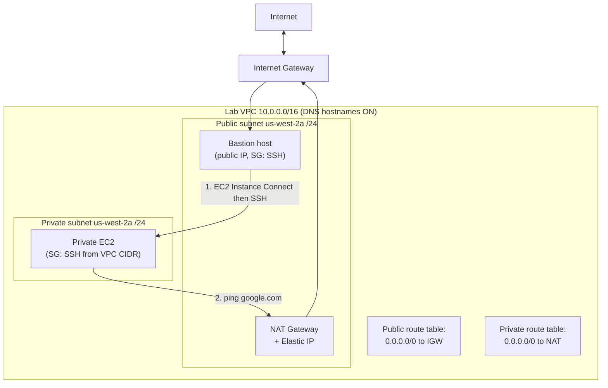
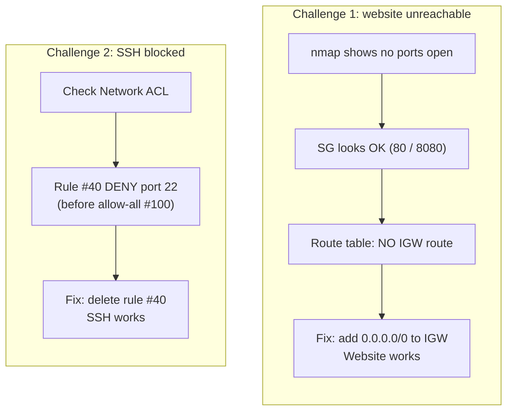

# Lecture Notes — June 18, 2026
**Cohort 3 | Project CloudIgnite**
**Topics:** Amazon VPC, Subnets (Public/Private), Route Tables, Internet Gateway, NAT Gateway, VPC Peering, Transit Gateway, VPC Endpoints/PrivateLink, Site-to-Site VPN, Direct Connect, Security Groups vs Network ACLs, Bastion Hosts, VPC Flow Logs, Lab 180 (Build a VPC from Scratch), VPC Troubleshooting Lab
**Duration:** ~3 hours

---

## Key Takeaways
- **Amazon VPC** = a logically isolated virtual network in AWS; it is **Region-scoped** and can span all **Availability Zones** in that Region, while a **subnet lives in exactly one AZ**
- A VPC CIDR block must be between **/16 and /28** using RFC 1918 private ranges (10.x, 172.16–31.x, 192.168.x); AWS reserves **5 IPs per subnet** (network, VPC router, DNS, future, broadcast)
- **Public subnet** = route table has `0.0.0.0/0 → Internet Gateway`; **private subnet** = no IGW route (uses NAT Gateway for outbound-only)
- **NAT Gateway** must live in a **public subnet**, requires an **Elastic IP**, and supports TCP/UDP/ICMP — deploy across multiple AZs for HA
- **VPC Peering is NOT transitive** — A↔B and B↔C does NOT connect A and C; switch to **Transit Gateway** when you have many VPCs
- **Gateway VPC Endpoint** = free private connection to **S3 and DynamoDB only**; **Interface Endpoint (PrivateLink)** = paid private connection to other AWS services
- **Security Group vs NACL:** SG is **instance-level, stateful, allow-only**; NACL is **subnet-level, stateless, allow + deny, rules evaluated lowest-number-first (first match wins)**
- A **Bastion host** is a public-subnet EC2 used as a secure jump box to reach private-subnet instances over SSH

---

## Table of Contents
1. [VPC Fundamentals](#1-vpc-fundamentals)
2. [IP Addressing & CIDR Blocks](#2-ip-addressing--cidr-blocks)
3. [Core VPC Components](#3-core-vpc-components)
4. [Routing & Gateways](#4-routing--gateways)
5. [VPC Connectivity Options](#5-vpc-connectivity-options)
6. [Network Security: Security Groups vs. Network ACLs](#6-network-security-security-groups-vs-network-acls)
7. [Bastion Hosts](#7-bastion-hosts)
8. [Troubleshooting Connectivity](#8-troubleshooting-connectivity)
9. [DNS Options in a VPC](#9-dns-options-in-a-vpc)
10. [Lab 180 — Build a VPC from Scratch](#10-lab-180--build-a-vpc-from-scratch)
11. [Lab — Troubleshooting a Broken VPC (Café Web Server)](#11-lab--troubleshooting-a-broken-vpc-café-web-server)
12. [Glossary](#12-glossary)
13. [Checkpoint Q&A Recap](#13-checkpoint-qa-recap)
14. [CLF-C02 Exam Relevance Summary](#14-clf-c02-exam-relevance-summary)
15. [Action Items & Housekeeping](#15-action-items--housekeeping)

---

## 1. VPC Fundamentals

**Amazon VPC (Virtual Private Cloud)** = a logically isolated section of the AWS Cloud where you launch AWS resources in a virtual network that you define.

- **This is the single most important definition to remember.**
- A VPC **can span all Availability Zones (AZs) within a single Region**.
- You can create **multiple subnets**, and subnets live **inside a single AZ** (a subnet does not span AZs).
- When you create an AWS account, AWS provisions a **default VPC** for you (with public/private subnets, an internet gateway, etc.). In labs we build our **own custom ("lab") VPC** instead of using the default.

#### Visual: How a VPC fits inside a Region
*A VPC is Region-scoped and can span every Availability Zone; each subnet lives inside exactly one AZ.*

> **CLF-C02 Relevant (High):** Knowing what a VPC is, that it is Region-scoped, spans AZs, and is logically isolated is a core Cloud Technology (Domain 3) concept.

---

## 2. IP Addressing & CIDR Blocks

### CIDR range allowed in a VPC
- A VPC CIDR block must be between **/16 and /28** (defined by RFC 1918 conventions).
- Use **private IP ranges** only: addresses starting with **10.x**, **172.x**, or **192.168.x**.
- Example used in lab: `10.0.0.0/16` → roughly **65,000** addresses.

### How many addresses does a CIDR give you?
- Formula: **2^(32 − CIDR prefix)** total addresses.
  - `/16` → 2^16 ≈ 65,536
  - `/24` → 2^8 = 256 (8 usable bits)
  - `/27` → 2^5 = 32
  - `/28` → 2^4 = 16
  - `/32` → a single fixed address (0 usable bits)
- AWS shows the usable count automatically when you type a CIDR, so manual math is optional.

### 5 reserved IP addresses per subnet
AWS reserves **the first 4 and the last 1** address in every subnet — you cannot use them:

| Reserved address | Purpose |
|---|---|
| 1st | Network address |
| 2nd | Reserved for the VPC router |
| 3rd | Reserved for DNS |
| 4th | Reserved for future use |
| Last | Network broadcast address |

> Example: a `/27` (32 addresses) gives only **27 usable** addresses after subtracting the 5 reserved.

> **Warning:** Subnet CIDRs cannot overlap within the same VPC. In the lab, reusing `/20` then trying `/23` produced an "overlap" error — the fix is to size subnets correctly (e.g., `/24`) so ranges don't collide.

> **CLF-C02 Relevant (Medium):** You don't need to do binary subnetting on the exam, but understanding CIDR notation, private IP ranges, and that AWS reserves addresses per subnet is useful background for the networking domain.

---

## 3. Core VPC Components

| Component | What it does |
|---|---|
| **Subnet** | A smaller network segment carved out of the VPC; lives in one AZ. Public vs. private. |
| **Route table** | Set of rules (routes) controlling where traffic goes. A `local` route lets resources inside the VPC talk to each other. |
| **Internet Gateway (IGW)** | Allows resources in a **public** subnet to reach the internet directly. |
| **NAT Gateway / NAT Instance** | Allows resources in a **private** subnet to reach the internet *outbound only*. |
| **Security Group (SG)** | Instance-level firewall (stateful). |
| **Network ACL (NACL)** | Subnet-level firewall (stateless). |
| **Elastic Network Interface (ENI)** | A virtual network card attached to an instance. Holds private/public IPs. One EC2 can have multiple ENIs. |
| **Router** | Logical component using route tables to direct traffic between subnets. |

**Public vs. private subnet (key distinction):**
- **Public subnet** → its route table has a route to an **Internet Gateway** → direct internet access.
- **Private subnet** → no IGW route → no direct internet; reaches the internet only via a **NAT Gateway**.

#### Visual: Public vs. private subnet routing
*Public subnets route 0.0.0.0/0 to the Internet Gateway; private subnets reach the internet outbound-only, via a NAT Gateway that lives in the public subnet.*

> **CLF-C02 Relevant (High):** Subnets, route tables, internet gateways, and the public/private subnet distinction are frequently tested.

---

## 4. Routing & Gateways

### Internet Gateway (IGW)
- Attaches to a VPC; enables **direct, two-way** internet connectivity for public subnets.
- The public route table needs a route: **destination `0.0.0.0/0` → target = IGW**.
- **Never** add an IGW route to a private route table.

### NAT Gateway (and NAT Instance)
- Lets **private** subnet instances initiate **outbound** internet connections (e.g., software updates) while staying unreachable from the internet.
- **NAT Gateway = AWS-managed** (recommended). **NAT Instance = you manage it yourself.**
- **Must be launched in a *public* subnet.**
- **Requires an Elastic IP address.**
- Supports **TCP, UDP, and ICMP**.
- Has limited built-in redundancy; deploy NAT Gateways in **multiple AZs** for high availability.
- Private route table route: **destination `0.0.0.0/0` → target = NAT Gateway**.

### Virtual Private Gateway (VGW)
- The AWS-side endpoint for a **VPN** connection — used to connect a VPC to an **on-premises** network/data center.

### Customer Gateway (CGW)
- The **customer-side** physical device or software application of the VPN connection.

#### Visual: Connecting a VPC to on-premises (VPN)
*A Site-to-Site VPN links your on-prem Customer Gateway to the AWS-side Virtual Private Gateway over an encrypted tunnel; Direct Connect is the dedicated private-line alternative.*

> **CLF-C02 Relevant (High):** Internet Gateway vs. NAT Gateway (and "NAT must live in a public subnet + needs an Elastic IP") is a classic exam point. Virtual Private Gateway / Customer Gateway appear in VPN questions.

---

## 5. VPC Connectivity Options

| Need | Solution |
|---|---|
| Private subnet → internet (outbound) | **NAT Gateway** or **NAT Instance** |
| Connect **two** VPCs | **VPC Peering** (1-to-1) |
| Connect **many** VPCs (and on-prem) | **Transit Gateway** |
| Connect VPC ↔ on-premises (encrypted) | **Site-to-Site VPN** |
| Connect VPC ↔ on-premises (dedicated, private line) | **AWS Direct Connect** (often combined with VPN) |
| Connect VPC ↔ AWS services privately | **VPC Endpoint** or **AWS PrivateLink** |

### VPC Peering
- A **one-to-one** connection wiring two VPCs together so their instances can communicate privately.
- **NOT transitive:** if A↔B and B↔C are peered, **A and C are NOT automatically connected** — you must peer them manually. *(Exam favorite)*
- A peering request must be **accepted/approved** by the other side (like approving a Bluetooth pairing).
- Gets unwieldy at scale: 5 VPCs need ~20 peering connections; 10 VPCs need ~90. That's when you switch to a Transit Gateway.

#### Visual: VPC Peering is NOT transitive
*Peering is one-to-one; A peered to B and B peered to C does not connect A and C — you must peer them directly.*

### Transit Gateway
- A central hub to connect **multiple VPCs** (and on-premises networks) together — avoids the mesh of many peering connections.
- More setup/effort than peering; use it when you have many VPCs (5, 10, 15+).

#### Visual: Peering mesh vs. Transit Gateway hub
*Direct peering grows into an unwieldy mesh as VPCs multiply; a Transit Gateway is a central hub so each VPC connects just once.*

### Site-to-Site VPN & Direct Connect
- **Use VPN whenever traffic must be *encrypted*** over the internet to on-premises.
- **Direct Connect** = dedicated private network link to AWS (can be paired with VPN for encryption).

### VPC Endpoints & PrivateLink
- **Gateway Endpoint:** connects privately to **only S3 and DynamoDB**, and is **free**.
- **Interface Endpoint (PrivateLink):** connects privately to **other AWS services**, and is **not free**.

> **CLF-C02 Relevant (High):** The instructor explicitly flagged VPC Peering (non-transitive), Transit Gateway, VPN-for-encryption, and Gateway-Endpoint-is-S3/DynamoDB-only as "important for your exam."

---

## 6. Network Security: Security Groups vs. Network ACLs

| Feature | Security Group (SG) | Network ACL (NACL) |
|---|---|---|
| Operates at | **Instance** level | **Subnet** level |
| Stateful? | **Stateful** — if inbound is allowed, the return outbound is automatically allowed | **Stateless** — inbound and outbound rules are evaluated **separately**; each must be explicitly allowed |
| Rules | **Allow only** | **Allow *and* Deny** |
| Rule evaluation | All rules evaluated | Evaluated in **rule-number order**, lowest first; first match wins |
| Default behavior | Default SG: allows all outbound, no inbound | Default NACL: allows all in/out; custom NACL denies all until you add rules |

#### Visual: Two firewall layers — NACL then Security Group
*Traffic crosses the subnet's stateless NACL first, then the instance's stateful Security Group, before it reaches the EC2.*

### NACL details
- Rules are processed by **number, lowest first**. A common rule **#100** that allows all traffic; the implicit **`*` rule at the end denies everything** by default.
- You must **explicitly add an allow rule** (e.g., rule 100) or all traffic is denied.
- In the troubleshooting lab, a **rule #40 denying port 22** blocked SSH even though rule #100 allowed everything — because **40 is evaluated before 100**. Deleting rule 40 restored SSH.

#### Visual: How NACL rules are evaluated (lowest number wins)
*Rules run in number order and stop at the first match, so a deny on rule #40 blocks SSH before the allow-all rule #100 is ever reached — deleting #40 restored SSH.*

### Where to look when something can't connect
- Can't reach a **subnet** → check the **Network ACL**.
- Can't reach a **specific instance** → check the **Security Group**.

> **CLF-C02 Relevant (High):** "SG = stateful/instance-level/allow-only" vs. "NACL = stateless/subnet-level/allow+deny/numbered rules" is one of the most commonly tested security comparisons.

---

## 7. Bastion Hosts

A **Bastion Host** (jump box) is an EC2 instance in a **public subnet** used as a secure relay to reach instances in a **private subnet** (which can't be connected to directly).

- You SSH into the bastion (public), then from the bastion connect to the private instance over the internal VPC network.
- The private instance's security group should **allow SSH (port 22) only from the bastion/public subnet** (not from anywhere).

#### Visual: Bastion host access path
*You SSH into the bastion in the public subnet, then hop to the private instance over the internal VPC network; the private instance allows port 22 only from the bastion.*

> **CLF-C02 Relevant (Medium):** Bastion host as a secure-access pattern for private resources is good architecture/security knowledge.

---

## 8. Troubleshooting Connectivity

**General connectivity — check in this order:**
1. Instance is **up and running** (status checks).
2. **Security group** is associated and allows the required protocol/ports.
3. **Network ACL** allows the traffic.
4. **Route table** / subnet routing (including internet gateway).
5. Verify public IP / Elastic IP / DNS, and that the **IGW is attached** to the VPC.

**SSH not working:**
- Verify instance running and correct IP address.
- Verify credentials (`.pem` / `.ppk` key).
- Check the security group has **port 22** open.
- Use the AWS SSH troubleshooting automation document if needed.

**NAT issues:** verify the route table; for NAT instances, check source/destination check and try restarting the instance.

**VPC peering issues:** make sure the **peering request was accepted**, then re-check security groups and NACLs.

**Four ways to secure resources inside a VPC:** Security Groups, Network ACLs, launching resources in **private subnets**, and using a **Bastion host** for access.

> **CLF-C02 Relevant (Medium):** The exam won't ask you to debug live, but knowing the layers (SG → NACL → route table → IGW) reflects how AWS networking security works.

---

## 9. DNS Options in a VPC

- **Amazon Route 53 Resolver** (the AWS-provided DNS server).
- Your **own custom DNS server**.
- **Route 53 private hosted zone** (vs. public hosted zone).
- **Enable "DNS hostnames"** on the VPC (VPC → Actions → Edit VPC settings). The instructor initially missed this step in the lab and warned it causes issues later if left disabled.

> **CLF-C02 Relevant (Low–Medium):** Recognizing Route 53 as AWS's DNS service is exam-relevant; the specific hosted-zone/hostname settings are deeper than the exam requires.

---

## 10. Lab 180 — Build a VPC from Scratch

**Goal:** Create a VPC with one public subnet, one private subnet, an internet gateway, a NAT gateway, and a bastion host to reach a private EC2 instance.

**High-level steps:**
1. **Create the VPC** ("VPC only"), CIDR `10.0.0.0/16`, default tenancy.
2. **Enable DNS hostnames:** VPC → Actions → Edit VPC settings → enable DNS hostnames. *(Don't skip!)*
3. **Create subnets** in the **lab VPC** (never the default VPC):
   - Public subnet — AZ `us-west-2a`, e.g. `/24` (pick a specific AZ, **not** "No preference").
   - Private subnet — `us-west-2a`, `/24` (avoid CIDR overlap).
4. **Enable auto-assign public IPv4** on the **public** subnet (Subnet → Actions → Edit subnet settings). Leave it **off** for the private subnet.
5. **Create & attach an Internet Gateway** to the lab VPC.
6. **Create route tables:**
   - **Public route table** → add route `0.0.0.0/0` → **Internet Gateway**; associate with the **public** subnet.
   - **Private route table** → **no IGW**; associate with the **private** subnet.
7. **Launch a Bastion host** (EC2) — Amazon Linux 2023, t3.micro, in the **lab VPC + public subnet**, auto-assign public IP, SG allowing SSH.
8. **Create a NAT Gateway** — in the **public** subnet, connectivity type *Public*, auto-allocate an **Elastic IP**. *(Note: needs the right IAM permissions / service-linked role.)*
9. **Add NAT route:** private route table → `0.0.0.0/0` → **NAT Gateway**.
10. **Launch a private EC2 instance** — in the **private** subnet, no public IP, SG allowing SSH **only from the VPC CIDR (`10.0.0.0/x`)**, with the provided user data.
11. **Test:** connect to the bastion via **EC2 Instance Connect** → SSH to the private instance's private IP (password: `lab password`) → run `ping google.com` to confirm the private instance reaches the internet through the NAT Gateway.

#### Visual: Lab 180 — the finished VPC
*Bastion and NAT Gateway sit in the public subnet; the private EC2 sits in the private subnet. The test path SSHes through the bastion and confirms outbound internet via the NAT Gateway.*

> **Common mistakes called out:** selecting the **default VPC** instead of the lab VPC; forgetting to **enable DNS hostnames**; **overlapping subnet CIDRs**; putting the **NAT Gateway in a private subnet** (it must be public); attaching an **IGW route to the private route table**.

---

## 11. Lab — Troubleshooting a Broken VPC (Café Web Server)

**Scenario:** After VPC security changes, customers **can't reach the café website** and **SSH stopped working**. Diagnose and fix using the **CLI host** and **VPC Flow Logs**.

**Setup steps:**
1. Connect to the **CLI host** via EC2 Instance Connect; run `aws configure` (access key, secret key, region `us-west-2`, output `json`).
2. **Create an S3 bucket** for VPC Flow Logs (unique name — append ~6 random digits).
3. Get the **VPC ID** (`describe-vpcs`), then **create VPC Flow Logs** pointing to the S3 bucket. *(The flow-log creation command returns an "unsuccessful" message that the instructions say to ignore — the flow log ID comes from a later command.)*
4. Use `describe-instances` (filtered) to find the café web server's details.

**Troubleshooting Challenge 1 — website unreachable:**
- From the CLI host, install and run **nmap** (`sudo yum install nmap`) against the café server IP → **no ports open**.
- Check the **security group** — looked OK (port 80/8080 present).
- Check the **route table** (`describe-route-tables` filtered by subnet) → **no Internet Gateway route!** ← root cause.
- **Fix:** add a route to the public route table pointing to the Internet Gateway (`create-route` with the route table ID + IGW ID). Returns `true` → website works.

**Troubleshooting Challenge 2 — SSH (port 22) blocked:**
- Check the **Network ACL** (`describe-network-acls`) → found **rule #40 denying TCP port 22**, evaluated **before** the allow-all rule #100.
- **Fix:** delete the deny entry (`delete-network-acl-entry` for rule 40). With only rule #100 (allow all) remaining, SSH works.

**Optional — Analyze VPC Flow Logs:**
- Flow logs are written as **gzip files** in the S3 bucket (path like `AWSLogs/.../vpcflowlogs/us-west-2/.../<date>`).
- Download, unzip, and inspect with Linux tools: `head <file>`, `grep REJECT`, `wc -l` to count rejected connections (e.g., **974** log lines; many **REJECT** entries on port 22).
- A timestamp-to-human-readable conversion was demonstrated for log entries.

#### Visual: Troubleshooting the broken VPC (two root causes)
*Challenge 1 was a missing Internet Gateway route (fixed in the route table); Challenge 2 was a low-numbered NACL deny on port 22 (deleted so the allow-all rule applies).*

> **CLF-C02 Relevant (Medium):** This lab reinforces **VPC Flow Logs** (network monitoring/logging), **route tables + IGW**, and **NACL rule evaluation** — all exam-relevant concepts, even though the CLI mechanics themselves are not tested.

---

## 12. Glossary

| Term | Meaning |
|---|---|
| **VPC** | Virtual Private Cloud — logically isolated virtual network in AWS |
| **Subnet** | A range of IPs within a VPC, in a single AZ; public or private |
| **CIDR block** | Notation for an IP range (e.g., `10.0.0.0/16`); VPC allows `/16`–`/28` |
| **IGW (Internet Gateway)** | Enables direct internet access for public subnets |
| **NAT Gateway** | Managed gateway for outbound-only internet from private subnets; sits in a public subnet, needs an Elastic IP |
| **VGW (Virtual Private Gateway)** | AWS-side VPN endpoint to on-premises |
| **CGW (Customer Gateway)** | Customer-side VPN endpoint |
| **VPC Peering** | One-to-one private connection between two VPCs; non-transitive |
| **Transit Gateway** | Hub connecting many VPCs and on-premises networks |
| **Site-to-Site VPN** | Encrypted tunnel between VPC and on-premises |
| **Direct Connect** | Dedicated private physical link to AWS |
| **VPC Endpoint** | Private connection to AWS services without internet (Gateway = S3/DynamoDB, free; Interface = others, paid) |
| **PrivateLink** | Technology behind interface endpoints for private service access |
| **Security Group** | Stateful, instance-level firewall (allow rules only) |
| **Network ACL (NACL)** | Stateless, subnet-level firewall (allow + deny, numbered rules) |
| **ENI** | Elastic Network Interface — a virtual network card |
| **Bastion Host** | Public-subnet jump box used to reach private instances |
| **Elastic IP** | A static public IPv4 address |
| **VPC Flow Logs** | Capture of IP traffic metadata in/out of network interfaces, stored in S3/CloudWatch |
| **Route 53** | AWS DNS service (resolver, public/private hosted zones) |

---

## 13. Checkpoint Q&A Recap

- **Connect instances in a VPC to on-premises over the internet, encrypted — which solution?** → **Site-to-Site VPN** (encryption ⇒ VPN).
- **Difference between Interface Endpoint and Gateway Endpoint?** → Gateway Endpoint supports **only S3 and DynamoDB** (and is free); Interface Endpoint connects to other services.
- **Why is Transit Gateway preferred for connecting many VPCs/VPNs?** → It avoids the large number of point-to-point peering connections required at scale.
- **Four ways to secure resources inside a VPC?** → Security Groups, NACLs, private subnets, Bastion host.
- **Default security group inbound/outbound behavior?** → Allows **all outbound**, **no inbound** by default; SGs are stateful (allowed inbound auto-allows the return traffic).

---

## 14. CLF-C02 Exam Relevance Summary

| Topic | Exam Relevance | CLF-C02 Domain (approx.) | Notes |
|---|---|---|---|
| VPC definition (isolated, Region-scoped, spans AZs) | **High** | Domain 3 — Cloud Technology | Core networking concept |
| Subnets (public vs. private) | **High** | Domain 3 | Frequently tested |
| Route tables & Internet Gateway | **High** | Domain 3 | Public subnet routing |
| NAT Gateway (public subnet, Elastic IP, outbound) | **High** | Domain 3 | Classic comparison vs. IGW |
| Security Group vs. Network ACL | **High** | Domain 2/3 — Security | Stateful vs. stateless |
| VPC Peering (non-transitive) | **High** | Domain 3 | Explicitly flagged for exam |
| Transit Gateway | **High** | Domain 3 | Connecting many VPCs |
| Site-to-Site VPN / Direct Connect | **High** | Domain 3 | VPN = encrypted to on-prem |
| VPC Endpoints / PrivateLink (Gateway = S3/DynamoDB, free) | **High** | Domain 3 | Explicitly flagged for exam |
| Virtual Private Gateway / Customer Gateway | **Medium** | Domain 3 | VPN components |
| Bastion host (secure private access) | **Medium** | Domain 2 — Security | Architecture/security pattern |
| VPC Flow Logs | **Medium** | Domain 3 — Monitoring | Network logging to S3/CloudWatch |
| Route 53 (DNS) | **Medium** | Domain 3 | Recognize as AWS DNS service |
| Elastic IP / ENI | **Medium** | Domain 3 | Networking building blocks |
| CIDR notation & address math | **Low–Medium** | Domain 3 | Concept yes; binary math no |
| Lab CLI mechanics (nmap, aws cli flags, gzip parsing) | **Low** | — | Practical skill, not on exam |

---

## 15. Action Items & Housekeeping

- [ ] **Submit both labs** before leaving (instructor repeated this multiple times).
- [ ] **Re-do / complete unfinished labs on Saturday** — at least one student couldn't finish the NAT/SSH lab and will continue then.
- [ ] **Knowledge Check (KC):** postponed — instructor will run it **the next day**.
- [ ] **Review VPC connectivity terms** for the exam: peering (non-transitive), Transit Gateway, VPN (encryption), Gateway endpoint (S3/DynamoDB only).
- [ ] **Upcoming topic:** Amazon **Aurora** (was delayed earlier due to AWS Canvas issues) and continued database content.
- [ ] Instructor aims to finish the curriculum quickly; will be available in **July** for topic reviews/questions.

---

*Notes compiled from the June 18, 2026 session transcript for post-lecture review — AWS re/Start, Cohort 3: Project CloudIgnite.*
