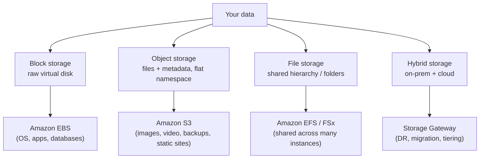
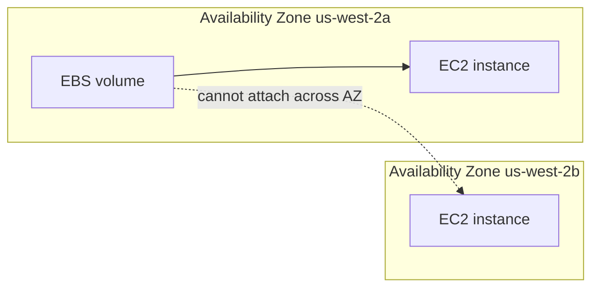
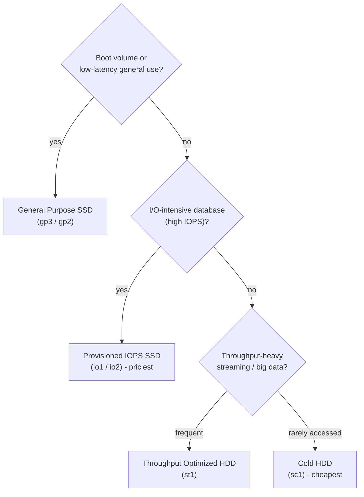
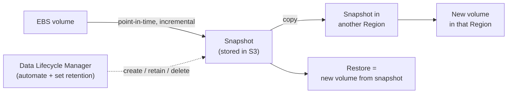
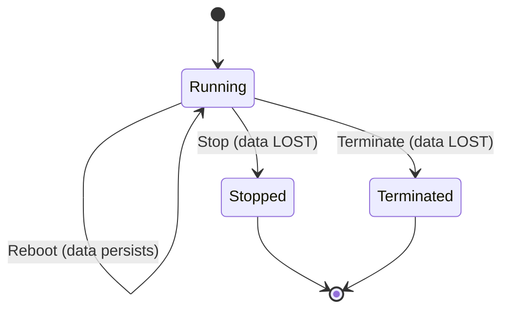
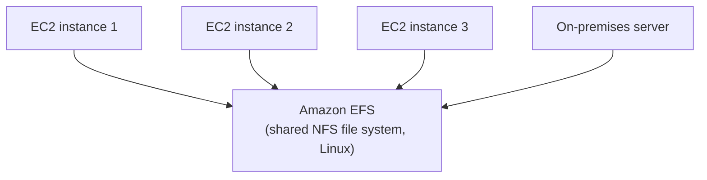
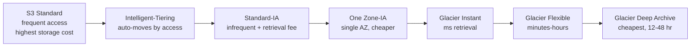
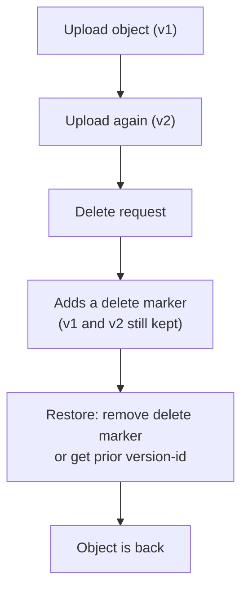
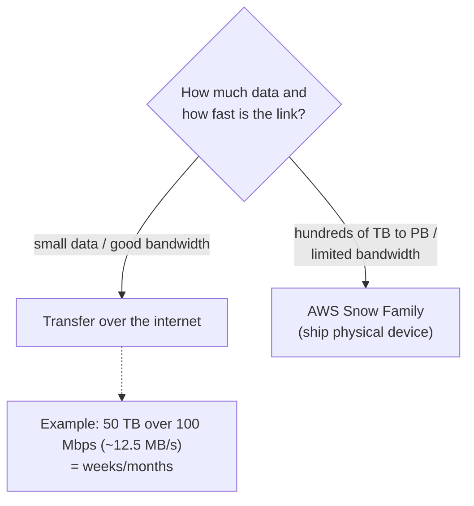
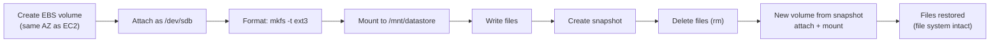

# Lecture Notes — June 19, 2026
**Cohort 3 | Project CloudIgnite**
**Topics:** Cloud Storage Types (Block/Object/File/Hybrid), Amazon EBS, EBS Snapshots, Data Lifecycle Manager (DLM), Instance Store, Amazon EFS, Amazon S3, S3 Storage Classes, S3 Intelligent-Tiering, S3 Versioning, S3 Lifecycle, S3 Object Lock, AWS Storage Gateway, AWS Snow Family, Lab 182 (EBS Volumes & Snapshots), S3 Versioning Lab
**Duration:** ~3 hours

---

## Key Takeaways
- The three core **cloud storage types** are **block (EBS), object (S3), and file (EFS/FSx)**; **CloudFront is NOT storage** — it's a CDN
- **EBS = persistent, single-AZ block storage** attached to EC2; every EC2 needs at least one EBS volume for its boot drive
- **EBS volume types:** SSD (io1/io2 = highest IOPS for databases; gp3/gp2 = general purpose) vs. HDD (st1 = throughput for streaming; sc1 = cheapest cold)
- **EBS snapshots** are point-in-time, **incremental** backups stored in S3, can be **copied cross-Region**, and restored as new volumes; **DLM** automates creation/retention/deletion (always set retention — 24/day = ~720/month otherwise)
- **Instance store = ephemeral** (data lost on stop/terminate; survives reboot); use only for cache/buffers/scratch — never for permanent data
- **EFS = shared, elastic, NFS, Linux-only** file system mounted by many EC2s at once; **FSx** supports both Windows and Linux
- **S3 = object storage** with **11 nines durability**, **strong read-after-write consistency**, and buckets/objects/keys; supports event notifications (S3 → Lambda → SNS pattern)
- **S3 storage classes** trade cost for retrieval: Standard → Intelligent-Tiering → Standard-IA → One Zone-IA → Glacier Instant → Glacier Flexible → Glacier **Deep Archive** (cheapest, 12–48 hr retrieval)
- **S3 Intelligent-Tiering** auto-moves objects between tiers based on access pattern (no manual tracking)
- **S3 versioning** keeps multiple versions; a delete adds a **delete marker** (must be enabled *before* the delete to protect the object)
- **S3 Object Lock (WORM)** supports **retention period** (N days, cannot delete) and **legal hold** (indefinite until removed) — used for compliance/governance
- **Snow Family** = physical devices for offline bulk transfer when bandwidth makes internet transfer impractical (e.g., 50 TB over 100 Mbps ≈ 12.5 MB/s = weeks/months)

---

## Table of Contents
1. [What Is Cloud Storage?](#1-what-is-cloud-storage)
2. [The Three (Plus Hybrid) Storage Types](#2-the-three-plus-hybrid-storage-types)
3. [AWS Storage Services Overview](#3-aws-storage-services-overview)
4. [Amazon EBS (Elastic Block Store)](#4-amazon-ebs-elastic-block-store)
5. [EBS Snapshots & Data Lifecycle Manager (DLM)](#5-ebs-snapshots--data-lifecycle-manager-dlm)
6. [Instance Store (Ephemeral Storage)](#6-instance-store-ephemeral-storage)
7. [Amazon EFS (Elastic File System)](#7-amazon-efs-elastic-file-system)
8. [Amazon S3 (Simple Storage Service)](#8-amazon-s3-simple-storage-service)
9. [S3 Storage Classes & Intelligent-Tiering](#9-s3-storage-classes--intelligent-tiering)
10. [S3 Features: Versioning, Lifecycle, Object Lock, Security](#10-s3-features-versioning-lifecycle-object-lock-security)
11. [AWS Storage Gateway & Snow Family](#11-aws-storage-gateway--snow-family)
12. [Lab 182 — EBS Volumes & Snapshots (Console)](#12-lab-182--ebs-volumes--snapshots-console)
13. [Lab — EBS Snapshots via CLI + S3 Versioning](#13-lab--ebs-snapshots-via-cli--s3-versioning)
14. [Glossary](#14-glossary)
15. [Checkpoint Q&A Recap](#15-checkpoint-qa-recap)
16. [CLF-C02 Exam Relevance Summary](#16-clf-c02-exam-relevance-summary)
17. [Action Items & Housekeeping](#17-action-items--housekeeping)

---

## 1. What Is Cloud Storage?

**Cloud storage** = a service that stores your data on the internet through a cloud provider that manages and operates the underlying storage. Data lives in the provider's data centers and is accessed over an internet connection (not on your local disk).

> **CLF-C02 Relevant (Medium):** Understanding that cloud storage is a managed, internet-accessible service is foundational to Domain 3 (Cloud Technology).

---

## 2. The Three (Plus Hybrid) Storage Types

| Type | What it stores | AWS service | Best for |
|---|---|---|---|
| **Block storage** | Raw blocks (like a virtual hard drive) | **EBS** | OS boot volumes, applications, databases |
| **Object storage** | Objects (files + metadata) in a flat namespace | **S3** | Files, images, video, audio, backups, static websites |
| **File storage** | A shared file system (folders/hierarchy) | **EFS** / FSx | Shared access across many instances |
| **Hybrid storage** | Mix of on-premises + cloud | **Storage Gateway** | Disaster recovery, migration, tiering |

- **Block (EBS):** suitable for operating systems, applications, and databases. Every EC2 instance needs at least one EBS volume (its "C: drive").
- **Object (S3):** stores any file *as an object*. Not the same as "file storage."
- **File (EFS / FSx):** a true shared file system.
- **CDN (CloudFront) is NOT storage** — it's a content delivery service (a common point of confusion).

#### Visual: The three storage types (plus hybrid)
*The three core storage types and the AWS service each maps to.*

> **CLF-C02 Relevant (High):** Knowing **block vs. object vs. file** storage and mapping them to **EBS / S3 / EFS** is a very common exam question.

---

## 3. AWS Storage Services Overview

| Service | Category | Notes |
|---|---|---|
| **Amazon S3** | Object | Durable, highly available; "infinite" storage |
| **Amazon S3 Glacier** | Object (archive) | Low-cost, long-term archive/backup |
| **Amazon EBS** | Block | Persistent block storage for EC2; **single-AZ** |
| **Instance Store** | Block (ephemeral) | Temporary; tied to instance lifecycle |
| **Amazon EFS** | File | Shared NFS file system — **Linux only** |
| **Amazon FSx** | File | Multi-purpose — **Windows and Linux** |
| **Amazon File Cache** | File | High-speed cache for file data |
| **AWS Storage Gateway** | Hybrid | Connects on-premises to AWS storage |
| **AWS Snow Family** | Data transfer | Physical devices for large/offline migrations |

> **Important:** Frequently-asked distinction: **EFS is Linux-only**, while **FSx supports both Windows and Linux**.

---

## 4. Amazon EBS (Elastic Block Store)

- **Persistent block storage** attached to EC2 (survives stop/start, unlike instance store).
- **EBS is a single-AZ (zonal) service** — NOT regional. A volume can only attach to an EC2 instance in the **same Availability Zone**.
- Can **scale size up/down within minutes** (e.g., 8 GB → 20 GB).
- Supports **encryption at rest** and **snapshots**.
- Common use cases: **boot volumes** (OS), data storage with a file system, and **database hosting** (RDS uses EBS under the hood).

#### Visual: EBS is single-AZ (zonal)
*An EBS volume can attach only to an EC2 instance in the same Availability Zone.*

### EBS volume types

| Category | Type | Best for | Notes |
|---|---|---|---|
| **SSD** | **io2 Block Express / Provisioned IOPS (io1/io2)** | I/O-intensive workloads (SQL/NoSQL **databases**) | Highest IOPS (up to 256,000), most expensive |
| **SSD** | **General Purpose (gp3/gp2)** | Boot volumes, virtual desktops, low-latency apps, dev/test | gp3 ~1,000 MB/s; gp2 ~250 MB/s |
| **HDD** | **Throughput Optimized (st1)** | Streaming, big data, data warehouse, log processing | Speed-based; **not** a boot volume |
| **HDD** | **Cold (sc1)** | Infrequently accessed large volumes | Lowest cost; **not** a boot volume |

- **Cost decreases left-to-right**: io2 (most expensive) → gp → st1 → sc1 (cheapest).
- **IOPS vs. Throughput:** **IOPS** = number of read/write *operations* per second (matters for databases); **Throughput** = amount of *data* per second (matters for streaming large files).

#### Visual: Choosing an EBS volume type
*SSD for IOPS/boot, HDD for throughput or cheap bulk; cost falls io2 → gp → st1 → sc1.*

> **CLF-C02 Relevant (High):** "EBS is block storage, single-AZ, persistent" and "SSD = IOPS/databases, HDD = throughput/streaming & cheap" are exam favorites.

---

## 5. EBS Snapshots & Data Lifecycle Manager (DLM)

### Snapshots
- A **snapshot** = a point-in-time backup of an EBS volume, **stored in S3** (managed by AWS).
- **Incremental:** only changed blocks are saved after the first snapshot — saves space/cost.
- You can **copy a snapshot to another Region**, then **create a new volume** from it there — useful for deploying the same data/EC2 in a different Region.
- **Restore** = create a new volume from a snapshot (like restoring from backup).

### Data Lifecycle Manager (DLM)
- A service to **automate creation, retention, and deletion** of EBS snapshots (e.g., one every hour).
- **Snapshots cost money** — automating without deletion can produce 24/day = ~720/month and a surprise bill. **Always set retention** (e.g., keep only the last 2–3).
- Uses **tags** to identify volumes and a **lifecycle policy** to define retention.
- **Requires an IAM role** — specifically the **AWS Data Lifecycle Manager default role** (`aws dlm create-default-role`).

#### Visual: EBS snapshot lifecycle
*Snapshots are incremental, S3-backed backups you can copy cross-Region or restore into a new volume; DLM automates creation and retention.*

> **CLF-C02 Relevant (High):** Snapshots as S3-backed, incremental, cross-Region-copyable backups — plus DLM automation and the cost/retention message — align with reliability and cost-optimization themes.

---

## 6. Instance Store (Ephemeral Storage)

- **Temporary, non-persistent block storage** physically attached to the host of the EC2 instance → **very fast, low latency**.
- **Bound to the instance lifecycle:** **stop or terminate → data is lost**. A **reboot is OK** (data persists).
- Cannot be detached/managed independently of the instance (unlike EBS).
- Availability and size depend on the **instance type** (not available on all types).
- Must be **mounted** before use (auto or manual on Linux).
- **Use cases:** **caching, buffers, scratch/temporary data**, and data replicated across a fleet (e.g., a load-balanced pool of web servers). Never for permanent data, OS, or important files.

#### Visual: Instance store lifecycle
*Instance-store data survives a reboot but is lost on stop or terminate — use it only for cache, buffers, and scratch data.*

> **CLF-C02 Relevant (Medium):** "Instance store = ephemeral, lost on stop/terminate, good for cache/temp" vs. "EBS = persistent" is a known comparison.

---

## 7. Amazon EFS (Elastic File System)

- A **scalable, fully managed, elastic network file system (NFS)** — **petabyte-scale, low latency**.
- **Shared:** one EFS file system can be **mounted by many EC2 instances at once** (block storage like EBS is *not* shared). Acts like a network drive ("a big Samba share").
- **Linux only** (uses the **NFS** protocol). Can also connect to on-premises servers.
- **Auto-scales:** grows and shrinks automatically as files are added/removed — no capacity management.

### EFS storage classes & performance
- **EFS Standard** → frequent access.
- **EFS Standard-Infrequent Access (IA)** → cheaper for rarely-accessed files.
- **EFS One Zone** → cheapest; single AZ; use only for **reproducible** data (data lost if the zone fails).
- **Performance modes:** General Purpose, Max I/O.
- **Throughput modes:** Elastic, Bursting (baseline + burst), Provisioned (fixed).
- **Use cases:** home directories, enterprise app file systems, app testing/deployment, database backups, content management, media workflows, big data analytics.
- **To use:** create the EFS file system → create a **mount target** → mount it on EC2 → use like a network drive.

#### Visual: EFS is a shared file system
*One EFS file system can be mounted by many EC2 instances (and on-prem servers) at once — unlike EBS, which attaches to a single instance.*

> **CLF-C02 Relevant (Medium–High):** "EFS = shared, elastic, NFS, Linux-only file system" — and that **multiple EC2s** can mount it concurrently — is commonly tested.

---

## 8. Amazon S3 (Simple Storage Service)

- **Object storage** service — secure, durable, highly available; effectively **unlimited** capacity.
- Famous for **eleven 9s (99.999999999%) of durability**.
- Store/retrieve any amount of data, anytime, from anywhere.
- **Strong read-after-write consistency.**

### Core concepts
- **Bucket** = a container for objects; **created in a specific Region**.
- **Object** = the stored item; identified by a **key** that must be **unique within the bucket**.
- Supports **event notifications** that can trigger **SQS, SNS, or Lambda** (e.g., the S3 → Lambda → SNS pattern from a previous lecture).
- **CLI commands:** `aws s3 ls`, `cp` (upload/download), `sync` (with/without `--delete`), `rm`, `mb` (make bucket).

> **CLF-C02 Relevant (High):** S3 as durable (11 nines) object storage, buckets/objects/keys, Region scope, and event integration are core exam material.

---

## 9. S3 Storage Classes & Intelligent-Tiering

| Storage class | Best for | Notes |
|---|---|---|
| **S3 Standard** | Frequently accessed data | Highest storage cost, no retrieval fee |
| **S3 Intelligent-Tiering** | Unknown/changing access patterns | **Auto-moves** objects between tiers based on access — no manual work |
| **S3 Standard-IA** | Infrequently accessed | Cheaper storage, **retrieval fee** |
| **S3 One Zone-IA** | Reproducible, infrequent data | Single AZ (~99.5% availability); lost if AZ fails |
| **S3 Glacier Instant Retrieval** | Archive needing **immediate** access | Milliseconds retrieval |
| **S3 Glacier Flexible Retrieval** | Archive, occasional access | Minutes–hours retrieval |
| **S3 Glacier Deep Archive** | Long-term archive (e.g., audits) | Cheapest; **12–48 hr** retrieval |
| **S3 Outposts** | On-premises (hybrid) | S3 on AWS hardware in your location |

### Intelligent-Tiering (most-emphasized topic)
- Monitors each object's **access pattern** and **automatically moves** it: frequently accessed → Standard; less accessed → Standard-IA; rarely accessed → Glacier. No manual tracking.

### Cost model reminder
- IA / Glacier classes charge **less for storage per GB** but **more for access/retrieval**. Frequent access to an IA/Glacier object can cost **more** than Standard.
- **Archive tip:** don't archive many tiny files — **zip them into one file** to reduce per-access cost.

#### Visual: S3 storage classes — cost vs. retrieval
*Storage cost drops left → right while retrieval gets slower; Intelligent-Tiering auto-moves objects so you don't have to.*

> **CLF-C02 Relevant (High):** The instructor flagged storage classes — especially **Intelligent-Tiering**, **One Zone-IA**, and the **Glacier tiers** (including Deep Archive's 12–48 hr retrieval) — as among the most frequently asked exam topics.

---

## 10. S3 Features: Versioning, Lifecycle, Object Lock, Security

### Versioning
- Keeps **multiple versions** of an object. Deleting an object adds a **delete marker** instead of erasing it — you can **restore previous versions**.
- **Not enabled by default**; states are **Disabled / Enabled / Suspended**.
- Versioning only protects objects deleted **after** it's enabled (lesson learned in the lab).

### Lifecycle management
- Automatically transition objects between tiers or delete them on a schedule (e.g., after 30 days → IA, after 60 days → Glacier, then delete). Can be automatic (Intelligent-Tiering) or a manual lifecycle policy.

### Object Lock (WORM — compliance/governance)
- **Retention period:** lock a file so it **cannot be deleted for N days** (e.g., 30 days).
- **Legal hold:** lock a file **indefinitely** until the hold is removed.
- Important for **compliance and governance**.

### Security & access
- Objects are **private by default**; you can grant **public access** or **block public access** (account/bucket level).
- **Pre-signed URLs:** grant temporary, time-limited access to a private object.
- **CORS** (cross-origin resource sharing): needed when S3 hosts a **static website**.

#### Visual: S3 versioning & restore
*With versioning on, S3 keeps every version and a delete only adds a delete marker — so you can restore a prior version (it must be enabled before the delete to protect that object).*

> **CLF-C02 Relevant (High):** Versioning, lifecycle policies, Object Lock (compliance), block-public-access, and pre-signed URLs are all exam-relevant S3 security/management features.

---

## 11. AWS Storage Gateway & Snow Family

### AWS Storage Gateway (Hybrid)
- Connects an **on-premises data center** with **AWS storage** so both are used together (not a one-time migration/replication). Use cases: **disaster recovery, tiering, migration**.

### AWS Snow Family (Physical Data Transfer)
- Physical devices AWS ships to you; you copy data onto them and ship them back to an AWS data center.
- **Why not just use the internet?** Large transfers take too long. Example: **50 TB over a 100 Mbps link** — since 100 Mbps ≈ **12.5 MB/s**, this would take weeks/months. Snow devices are faster for hundreds of TB to PB.
- Device size scales with data volume (up to truck-scale for petabytes).

#### Visual: Snow Family vs. internet transfer
*When bandwidth makes an internet transfer take weeks (e.g., 50 TB over 100 Mbps), ship the data physically with the Snow Family.*

> **CLF-C02 Relevant (Medium):** Recognize Storage Gateway (hybrid) and Snow Family (offline bulk migration when bandwidth is insufficient) as the right tools for those scenarios.

---

## 12. Lab 182 — EBS Volumes & Snapshots (Console)

**Goal:** Create an EBS volume, attach/mount it to EC2, write data, snapshot it, delete the data, and restore from the snapshot — all via the **Management Console** + Linux CLI on the instance.

**Key steps:**
1. Note the running EC2 instance's **Availability Zone** (EC2 → Networking) — e.g., `us-west-2a`.
2. **Create an EBS volume** (gp2, 1 GB) **in the same AZ** as the instance. *(Different AZ → cannot attach.)*
3. **Attach** the volume (Actions → Attach volume) as device `/dev/sdb`.
4. Connect via **EC2 Instance Connect**; run `df` to view disks (EBS shows as `/dev/nvme...`).
5. **Create a file system:** `mkfs -t ext3 /dev/sdb` (a raw volume isn't usable until formatted — like formatting a USB drive with FAT32/NTFS; Linux uses **ext3/ext4**).
6. **Mount it:** create `/mnt/datastore`, then `sudo mount /dev/sdb /mnt/datastore`. Confirm with `df`.
7. Create files in the mounted folder (data now lives on the new volume).
8. **Create a snapshot** (Volumes → Actions → Create snapshot).
9. **Delete** the files (`rm *.txt`), then **restore**: create a new volume from the snapshot (same AZ), attach as `/dev/sdc`, mount to `/mnt/datastore2`.
10. The restored volume **keeps the same file system** (no reformat needed) and the original files are back.

#### Visual: Lab 182 — EBS volume & snapshot workflow
*Create, attach, format, mount, snapshot, delete, then restore a new volume from the snapshot with the file system and data intact.*

> Instructor: "This lab was a lot easier than the others." The **next** lab does the same thing via **AWS CLI**.

---

## 13. Lab — EBS Snapshots via CLI + S3 Versioning

**Part A — EBS snapshots via AWS CLI:**
1. Attach an **instance profile / IAM role** ("S3 bucket access") to the EC2 instances (Actions → Security → Modify IAM role) so they can reach S3.
2. Connect to the **command host** via EC2 Instance Connect.
3. `describe-instances` / `describe-volumes` to find the **volume ID** and **instance ID**.
4. Because the target EBS is a **root volume**, **stop the instance** before snapshotting it (`stop-instances`), confirm it's stopped, take the **snapshot**, then **start** it again.
5. **Scheduled snapshots without stopping:** use a **cron job** to run a snapshot command **every minute** — demonstrating snapshots piling up fast.
6. Run a **Python (boto3) script** (`snapshotter.py`) that lists/sorts snapshots by start time and **keeps only the last 2**, deleting older ones — reinforcing the cost/retention lesson. *(Requires installing the `boto3` module; run with `python3.8`.)*

**Part B — S3 versioning challenge:**
1. **Create an S3 bucket** (globally unique name).
2. Download and `unzip` sample files (file1, file2, file3) on the **processor** instance.
3. **Enable versioning** on the bucket **before** uploading.
4. `aws s3 sync` the files up to the bucket; verify with `aws s3 ls`.
5. **Delete** a file locally and `sync --delete` → S3 shows a **delete marker** (object still exists as a prior version).
6. **Restore** the deleted object using its **version ID** (`get-object` with `--version-id`), then `sync` (without `--delete`) to put it back.

> **Warning:** A student couldn't restore file1 because versioning was enabled **after** the file was first deleted — only file2 (deleted after versioning was on) could be restored. **Enable versioning first.**

> **CLF-C02 Relevant (Medium):** The labs reinforce **EBS snapshots**, **automation/cost control**, **IAM roles for service access**, **the AWS SDK (boto3)**, and **S3 versioning + restore** — all exam-relevant concepts (the CLI mechanics themselves are not tested).

---

## 14. Glossary

| Term | Meaning |
|---|---|
| **Block storage** | Raw virtual-disk storage (EBS); for OS, apps, databases |
| **Object storage** | Files stored as objects with metadata (S3) |
| **File storage** | Shared hierarchical file system (EFS/FSx) |
| **Hybrid storage** | On-premises + cloud combined (Storage Gateway) |
| **EBS** | Elastic Block Store — persistent, single-AZ block storage for EC2 |
| **Snapshot** | Point-in-time, incremental backup of an EBS volume (stored in S3) |
| **DLM** | Data Lifecycle Manager — automates snapshot creation/retention/deletion |
| **Instance Store** | Ephemeral block storage tied to an instance; lost on stop/terminate |
| **EFS** | Elastic File System — shared, elastic, Linux-only NFS file system |
| **FSx** | Managed file system for Windows and Linux workloads |
| **S3** | Simple Storage Service — durable (11 nines) object storage |
| **Bucket / Object / Key** | Container / stored item / unique object identifier |
| **Intelligent-Tiering** | S3 class that auto-moves objects between tiers by access pattern |
| **Glacier / Deep Archive** | Low-cost S3 archive tiers (Deep Archive: 12–48 hr retrieval) |
| **Versioning** | Keeps multiple object versions; delete adds a delete marker |
| **Object Lock** | WORM protection: retention period or indefinite legal hold |
| **Pre-signed URL** | Time-limited URL granting temporary access to a private object |
| **IOPS vs. Throughput** | Operations/sec vs. data/sec |
| **Storage Gateway** | Connects on-premises storage to AWS (hybrid) |
| **Snow Family** | Physical devices for large offline data transfer |
| **Mount / File system (ext3/ext4)** | Making a volume usable in Linux after formatting |

---

## 15. Checkpoint Q&A Recap

- **Low-cost, long-term archive/backup storage?** → **S3 Glacier**.
- **Which service is block storage?** → **EBS**.
- **Archived data that needs *immediate* access?** → **S3 Glacier Instant Retrieval**.
- **Volume type for additional storage on a virtual desktop?** → **gp3 (General Purpose SSD)** (or HDD if not a boot volume).
- **Prevent latency after restoring a volume from a snapshot / automate backups?** → use **DLM** for automatic creation, retention, and deletion.
- **IAM role needed before using DLM?** → the **AWS Data Lifecycle Manager default role**.
- **Three components of cloud storage?** → client device, internet, data center.
- **Logical network segment in a VPC within a single AZ?** → **Subnet** (carryover review).
- **Which file system protocol does EFS use?** → **NFS**.
- **Prevent objects from being deleted?** → **Object Lock**.
- **S3 versioning states?** → Disabled, Enabled, Suspended.

---

## 16. CLF-C02 Exam Relevance Summary

| Topic | Exam Relevance | CLF-C02 Domain (approx.) | Notes |
|---|---|---|---|
| Block vs. object vs. file storage (EBS/S3/EFS) | **High** | Domain 3 — Cloud Technology | Core comparison |
| EBS: persistent, **single-AZ**, volume types | **High** | Domain 3 | SSD=IOPS/db, HDD=throughput/cheap |
| EBS snapshots (incremental, S3-backed, cross-Region) | **High** | Domain 3 | Backup/reliability |
| DLM snapshot automation + cost/retention | **Medium–High** | Domain 4 — Billing/Cost | Cost optimization theme |
| Instance store (ephemeral, lost on stop) | **Medium** | Domain 3 | Contrast with EBS |
| EFS (shared, elastic, NFS, Linux-only) | **Medium–High** | Domain 3 | Multi-EC2 shared access |
| FSx (Windows + Linux) | **Medium** | Domain 3 | Contrast with EFS |
| S3 durability (11 nines), buckets/objects/keys | **High** | Domain 3 | Foundational |
| S3 storage classes & **Intelligent-Tiering** | **High** | Domain 3/4 | Most frequently asked |
| Glacier tiers (incl. Deep Archive 12–48 hr) | **High** | Domain 3/4 | Archive cost/retrieval trade-offs |
| S3 versioning & lifecycle | **High** | Domain 3 | Data protection/management |
| S3 Object Lock (compliance/governance) | **Medium–High** | Domain 2 — Security | WORM, legal hold |
| S3 security (block public access, pre-signed URLs, CORS) | **Medium–High** | Domain 2 | Access control |
| Storage Gateway (hybrid) | **Medium** | Domain 3 | On-prem + cloud |
| Snow Family (offline bulk transfer) | **Medium** | Domain 3 | Bandwidth-limited migration |
| IAM roles / instance profiles for service access | **High** | Domain 2 | Recurring security concept |
| AWS SDK (boto3) as an access method | **Low–Medium** | Domain 3 | Console/CLI/SDK |
| Lab CLI/Linux mechanics (mkfs, mount, cron) | **Low** | — | Practical skill, not on exam |

---

## 17. Action Items & Housekeeping

- [ ] **Submit both labs** before leaving (instructor repeated this).
- [ ] **Optional (0-point) lessons:** complete the **interview preparation** guideline and the cloud-storage lesson (recommended, ~10 min each).
- [ ] **Complete the S3 versioning challenge** on your own if not finished in class.
- [ ] **Upcoming topics (Monday):** S3 Glacier, Storage Gateway, more work with Amazon S3, an **S3 challenge**, and the **Snow Family**.
- [ ] **Schedule note:** ~6 class days remain; a **lab session Saturday 2–6 PM**; some content slips to **July**; instructor will attend the **graduation ceremony**.

---

*Notes compiled from the June 19, 2026 session transcript for post-lecture review — AWS re/Start, Cohort 3: Project CloudIgnite.*
