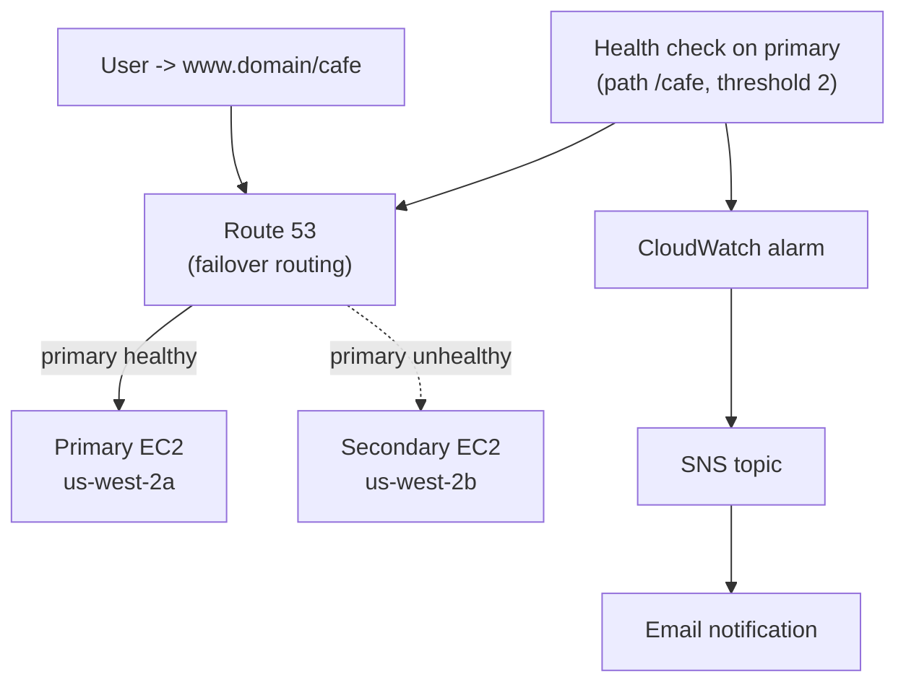
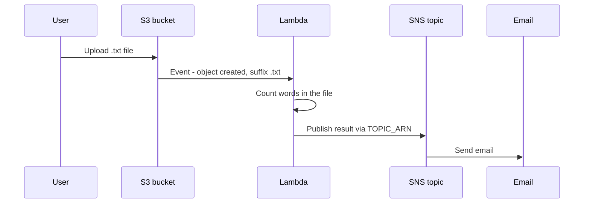
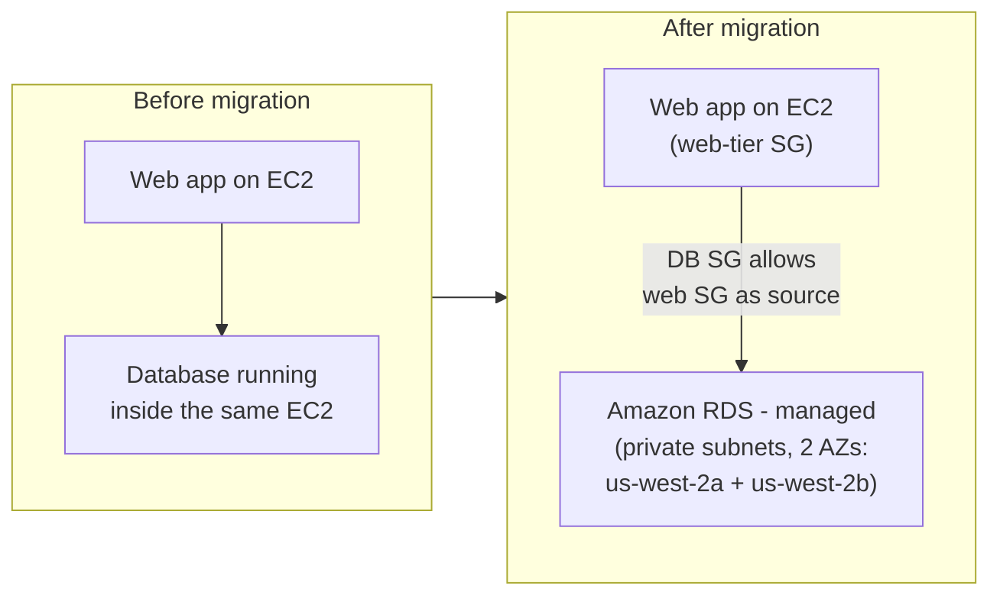
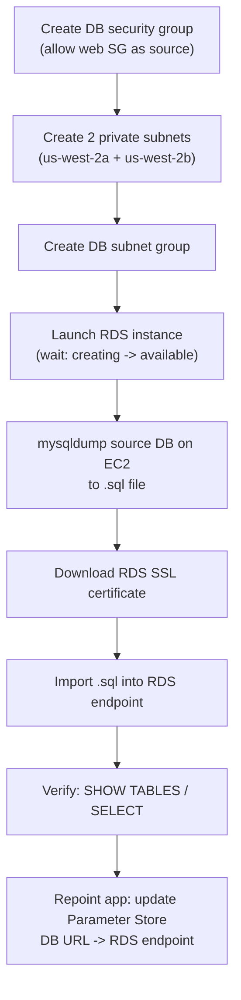
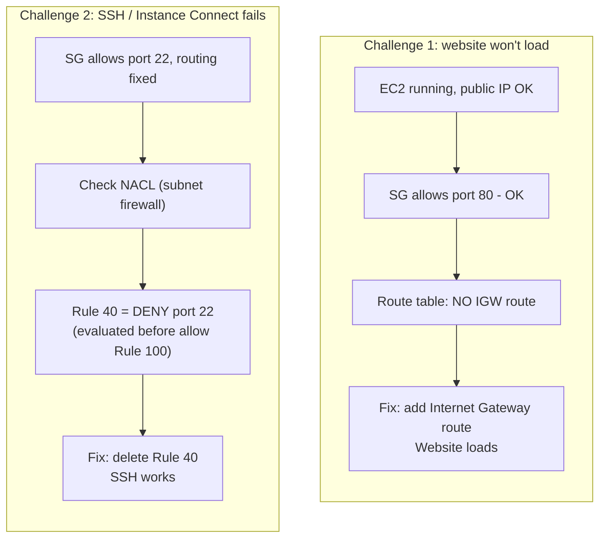
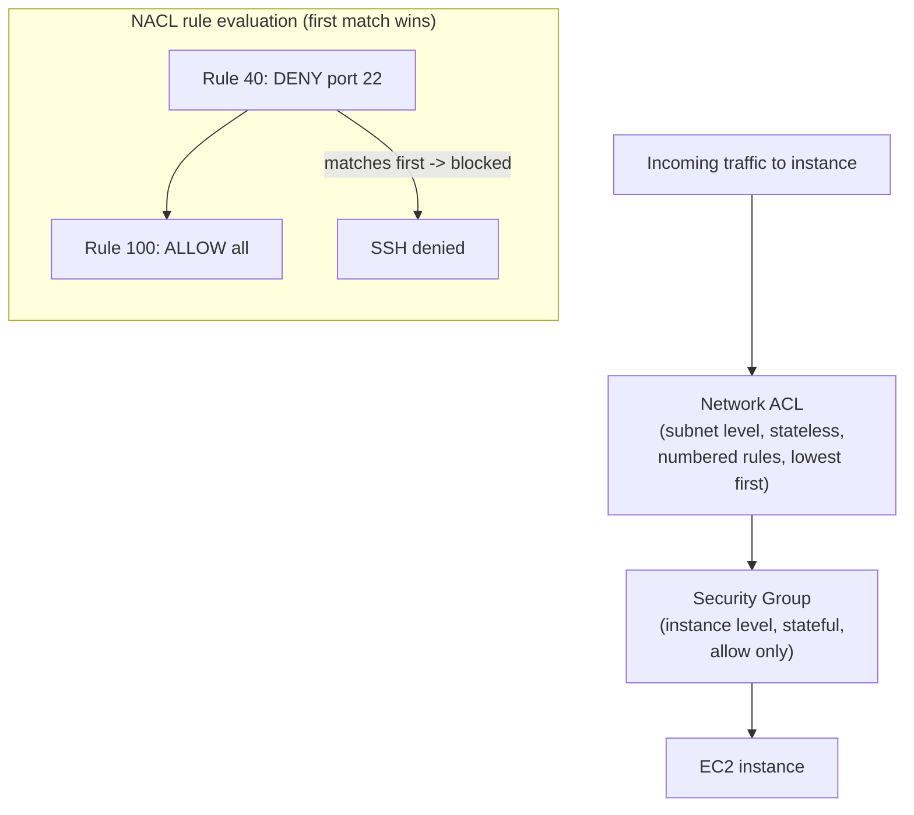
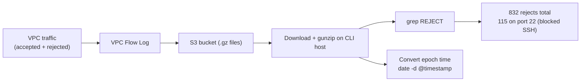

# Lecture Notes — June 20, 2026
**Cohort 3 | Project CloudIgnite**
**Topics:** Lab 176 (Route 53 Failover Routing), Lab 177 (Lambda + S3 Event-Driven Word Counter), Lab 179 (Migrate Database from EC2 to Amazon RDS), Lab 181 (VPC Troubleshooting + VPC Flow Logs)
**Duration:** ~3 hours

---

## Key Takeaways
- **Route 53 failover routing** = active/passive DNS; a **primary** record handles traffic while its **health check** passes; on failure Route 53 switches to the **secondary** record (place primary and secondary in different AZs for resilience)
- A **short TTL** (e.g., 15 seconds) lets DNS-based failover take effect quickly; long TTLs keep clients using the stale failed record
- **Lambda** triggered by an **S3 event** is the canonical serverless pipeline: `S3 (.txt upload) → Lambda (process) → SNS topic → Email`
- **Lambda creation gotcha:** choosing "no permissions" tries to **create a new IAM role** and fails with "not authorized to perform create role…" — fix = **use an existing IAM role**
- **S3 object keys must NOT contain spaces** — a space splits the key into two arguments and causes `NoSuchKey` errors; escape or rename files
- **SNS subscriptions can auto-deactivate** for non-business email domains — re-confirm if emails stop arriving
- **Amazon RDS** is **managed**: AWS handles backups, patching, maintenance, availability; place the DB in a **DB Subnet Group spanning ≥2 AZs** and a **private subnet**
- The **DB security group** should allow the **web-tier security group as source** (not an IP) so only the app can reach the DB
- **`order` is a SQL reserved word** — `SELECT * FROM order` fails; use `cafedb.order` (or another non-reserved name)
- **VPC troubleshooting layers** (check in order): instance running → Security Group → NACL → Route Table → IGW attached
- **NACL rules are evaluated lowest-number-first, first match wins** — a low-numbered **DENY** (e.g., rule #40) overrides a higher-numbered **ALLOW** (e.g., rule #100); delete the deny rule to restore traffic
- **VPC Flow Logs** capture all accepted/rejected IP traffic to S3 (gzipped); use `gunzip` (not `unzip`) and `grep REJECT` to spot blocked traffic; timestamps are in **Unix epoch** (convert with `date -d @<timestamp>`)
- The **three ways to access AWS:** **Management Console** (GUI), **AWS CLI** (terminal), **AWS SDK** (programmatic, e.g., `boto3` for Python)

---

## Table of Contents
1. [Lab 176 — Route 53 Failover Routing](#1-lab-176--route-53-failover-routing)
2. [Lab 177 — Lambda Triggered by S3 (Event-Driven Word Counter)](#2-lab-177--lambda-triggered-by-s3-event-driven-word-counter)
3. [Lab 179 — Migrating a Database to Amazon RDS](#3-lab-179--migrating-a-database-to-amazon-rds)
4. [Lab 181 — VPC Troubleshooting + VPC Flow Logs](#4-lab-181--vpc-troubleshooting--vpc-flow-logs)
5. [CLF-C02 Exam Relevance — Consolidated Map](#5-clf-c02-exam-relevance--consolidated-map)
6. [Glossary](#6-glossary)
7. [Checkpoint Q&A Recap](#7-checkpoint-qa-recap)
8. [Action Items & Housekeeping](#8-action-items--housekeeping)

---

## 1. Lab 176 — Route 53 Failover Routing

**Goal:** Build a highly available setup where a **primary website** automatically **fails over** to a **secondary website** if the primary goes down.

### Concept
- **Failover routing** is a Route 53 routing policy. You define a **primary** record and a **secondary** record. Route 53 sends traffic to the primary while it is healthy, and automatically switches to the secondary if a **health check** on the primary fails.
- In this lab: primary EC2 ran in **us-west-2a**, secondary EC2 ran in **us-west-2b** (different AZs for resilience).

### Workflow
1. **Test both endpoints** — confirm the primary and secondary websites both respond, and place a test order.
2. **Create a Route 53 health check** for the primary:
   - Endpoint = primary website IP address, path = `/cafe`.
   - Set **failover threshold** to `2` (default is 3) — number of failed checks before marked unhealthy.
   - Status starts as *unknown*, then becomes *healthy* after a few minutes.
3. **Create a CloudWatch alarm** on the health-check status:
   - Add a **notification** via a new **SNS topic** + email subscription (must confirm the subscription email).
4. **Create DNS records** in the hosted zone (`www`):
   - **Primary record:** routing policy = *Failover*, type = *Primary*, attach the health check, short TTL (15s).
   - **Secondary record:** routing policy = *Failover*, type = *Secondary*, no health check needed.
5. **Test failover:** browse to `www.<domain>/cafe` → served by primary (us-west-2a). **Stop the primary EC2 instance** → after the TTL/health check refreshes, traffic automatically moves to the secondary (us-west-2b). **Restart primary** → traffic returns to primary.

#### Visual: Failover routing + alerting
*Route 53 sends traffic to the healthy primary and auto-switches to the secondary when the health check fails; CloudWatch + SNS email alert a human that failover happened.*



> **Note:** A **short TTL** (e.g., 15 seconds) lets DNS-based failover take effect quickly. Long TTLs cause clients to keep using the stale (failed) record longer.

> **Tip:** Route 53 health checks + failover routing = a classic pattern for **high availability** and **disaster recovery**. CloudWatch + SNS adds the *alerting* layer so a human is notified when failover happens.

### CLF-C02 Relevant
- **Route 53** as AWS's managed DNS service and its **routing policies** (failover, plus simple/weighted/latency/geolocation — know they exist).
- **High availability** via multi-AZ design and automatic failover.
- **CloudWatch alarms** + **SNS** notifications as the monitoring/alerting combo.
- These map to the **Technology** and **Reliability/Well-Architected** themes of the exam.

---

## 2. Lab 177 — Lambda Triggered by S3 (Event-Driven Word Counter)

**Goal:** Build a **serverless, event-driven** pipeline: uploading a `.txt` file to an S3 bucket triggers a **Lambda** function that processes the file and sends a result via **SNS** email.

### Architecture
```
S3 (object created, .txt)  →  Lambda (word counter)  →  SNS topic  →  Email
```

#### Visual: Event-driven word-counter pipeline
*A `.txt` upload to S3 fires the Lambda, which counts words and publishes the result to SNS for email delivery.*



### Workflow
1. **Create an S3 bucket** (globally unique name; default block-public-access is fine).
2. **Create an SNS topic** (standard) + an **email subscription** (confirm via email link).
3. **Create a Lambda function** (Python runtime):
   - **IAM execution role gotcha:** creating with "no permissions" failed with *"not authorized to perform create role…"*. Fix = **use an existing IAM role** that already has permission, instead of letting Lambda create a new one.
4. **Add an S3 trigger** to the Lambda:
   - Source = the S3 bucket, event = *all object create*, **suffix = `.txt`** (only fires for text files).
   - Acknowledge the **recursive-invocation** warning.
5. **Add the function code**, then **Deploy** (status goes from *undeployed* → deployed).
6. **Set an environment variable** `TOPIC_ARN` = the SNS topic ARN (so the code knows where to publish).
7. **Test:** upload a `.txt` file to the bucket → check the Lambda **Monitor** tab for invocations → receive the SNS email.

### Debugging lessons (real issues hit in class)
> **Warning:**
> - **Filenames with spaces break things.** The object key with a space caused *"specified key does not exist"* / *"NoSuchKey"*. In Linux/CLI a space splits into two arguments unless escaped with a backslash (`\`). **Never put spaces in file/object names.**
> - **SNS subscriptions can auto-deactivate.** Because the test emails came from a non-business domain, the subscription got auto-unsubscribed and no email arrived → **re-subscribe** and reconfirm.
> - Use a Lambda **destination** (on-failure → SNS) to capture failed invocations for debugging.

### The challenge
The starter code counted **characters**, not **words**. Students modified the indicated line to split text and count words instead — practicing reading/modifying Lambda code.

### CLF-C02 Relevant
- **AWS Lambda** = serverless compute; **event-driven** execution; **pay only when it runs** (no servers to manage).
- **S3 event notifications** triggering downstream services (Lambda/SNS/SQS).
- **Amazon SNS** = pub/sub notifications (email/SMS/HTTP).
- **IAM execution roles** — services need a role with the right permissions to act on your behalf.
- This is a core **serverless** story the exam loves: S3 + Lambda + SNS.

---

## 3. Lab 179 — Migrating a Database to Amazon RDS

**Goal:** Move a database that currently runs **inside an EC2 instance** to a **managed Amazon RDS** database, then repoint the application to RDS.

### Why migrate to RDS?
RDS is a **managed relational database** — AWS handles patching, backups, and availability, and you place it in **private subnets** for security instead of running a DB on a self-managed EC2 instance.

#### Visual: Database migration to RDS (before / after)
*Migration moves only the database off the EC2 into managed RDS, placed in private subnets across two AZs, with the DB security group allowing the web tier's SG as the only source.*



### Workflow (done via AWS CLI on a CLI host)
1. **Connect to the CLI host** (EC2 Instance Connect) and run `aws configure` (access key, secret key, region `us-west-2`, output `json`).
2. **Create the DB security group** for the RDS instance.
3. **Add a security-group rule** allowing the **web server's security group** as the *source* (so only the app tier can reach the DB). *Careful which SG is "current" vs "source".*
4. **Create two private subnets** in **different AZs** (us-west-2a and us-west-2b) — RDS requires at least two AZs for a **DB subnet group**.
5. **Create the DB subnet group** from those two subnets.
6. **Launch the RDS instance** (e.g., `db.t3.micro`), specifying the AZ, the DB security group, and the subnet group. Poll status until it changes from *creating* → *available*; then fetch its **endpoint**.
7. **Dump the source database** from the EC2 instance to a `.sql` file (a `mysqldump`-style export that recreates schema + inserts data).
8. **Download the RDS public SSL certificate** for a secure connection.
9. **Import the dump into RDS** using the RDS endpoint → all tables/data recreated in RDS.
10. **Verify** by connecting with the MySQL client and running `SHOW TABLES;` / `SELECT * FROM product;` etc.
11. **Repoint the app:** update the **Parameter Store** `DB URL` value from the EC2 address to the **RDS endpoint** → the website now reads from RDS.
12. **Proof:** dropping the old database on EC2 and confirming the site still works proved the data now lives in RDS. Monitor CPU, connections, and free storage in the RDS console.

#### Visual: RDS migration workflow
*Stand up the DB security group, subnet group, and RDS instance, dump the EC2 database, import it into RDS, verify, then repoint the app via Parameter Store.*



> **Note:** `SELECT * FROM order` failed because **`order` is a SQL reserved word** — it needed qualification (`cafedb.order`). A good real-world reminder about reserved keywords.

### CLF-C02 Relevant
- **Amazon RDS** = managed relational database (reduced operational burden vs self-managed DB on EC2).
- **Multi-AZ / subnet groups** and placing databases in **private subnets** = security + availability best practice.
- **Security groups referencing other security groups** as the source (tier-to-tier access control).
- **Systems Manager Parameter Store** for storing configuration/connection strings.
- **Shared Responsibility Model:** with RDS, AWS manages more of the stack than with a DB on EC2.

---

## 4. Lab 181 — VPC Troubleshooting + VPC Flow Logs

**Goal:** Diagnose and fix a broken web server in a custom VPC, then use **VPC Flow Logs** to inspect network traffic. Two challenges: (1) the website won't load, (2) SSH/EC2 Instance Connect fails.

### Setup
1. Connect to the **CLI host** and `aws configure`.
2. **Create an S3 bucket** (needed a unique name — collided because others used "prime number" names!).
3. **Create a VPC Flow Log** targeting the VPC, delivering captured traffic logs to the S3 bucket. Flow Logs capture **all network activity** (accepted + rejected) in the VPC.

### Challenge 1 — Website not loading (missing route)
- Server **is running** (verified the EC2 instance state + checked the public IP).
- **Security group:** port 80 and port 22 are open → **not the problem**.
- **Route table:** filtered the route table for the subnet → **no Internet Gateway route present**.
- **Fix:** add a route to the **Internet Gateway** in the public route table → website loads.

### Challenge 2 — SSH / EC2 Instance Connect failing (NACL)
- Used `nmap` to scan ports → couldn't connect.
- Security group already allows port 22, routing is now fixed → must be the other firewall layer.
- **Two firewalls in AWS:**
  - **Security Group** = *instance-level*, stateful.
  - **Network ACL (NACL)** = *subnet-level*, stateless, rules evaluated **lowest number first**.
- **Inspected NACL rules:** **Rule 40 was a DENY on port 22**. Because NACLs evaluate **lowest-numbered rule first**, Rule 40 blocked SSH *before* the higher allow rule (Rule 100) could be reached.
- **Fix:** delete the blocking Rule 40 → EC2 Instance Connect / SSH works.

#### Visual: Two-challenge VPC troubleshooting
*The two root causes — a missing Internet Gateway route (fixed in the route table) and a low-numbered NACL deny on port 22 (deleted so the allow rule applies).*



> **Warning:** NACL rules are processed in ascending rule-number order, and the **first match wins**. A low-numbered **DENY** overrides a higher-numbered **ALLOW**. Always check rule numbering when a NACL seems to "allow" traffic that's still blocked.

#### Visual: Two firewall layers — NACL then Security Group
*Traffic crosses the subnet's stateless NACL before the instance's stateful Security Group; NACL rules run lowest-number-first, so Rule 40's deny blocks SSH before Rule 100's allow is reached.*



### Exploring VPC Flow Logs
- Downloaded the log files from S3 to the CLI host, then `gunzip` (not `unzip`) the `.gz` files.
- Each log line includes the **ENI (network interface), source IP, timestamp, port, and action (ACCEPT/REJECT)**.
- Filtered for `REJECT` → **832 total rejects**, of which **115 were on port 22** (the blocked SSH attempts).
- Timestamps are stored as **Unix epoch** (machine-readable); converted to human-readable time with `date -d @<timestamp>`.

#### Visual: VPC Flow Logs analysis
*Flow Logs capture every accepted/rejected packet to S3; downloading and grepping for REJECT surfaced 832 rejects (115 on port 22 — the blocked SSH attempts).*



### CLF-C02 Relevant
- **Security Groups vs Network ACLs** — the single most exam-relevant point here: instance-level (stateful) vs subnet-level (stateless), and NACL **rule ordering / lowest-number-first**.
- **Internet Gateway + route tables** — how a subnet becomes "public."
- **VPC Flow Logs** — network traffic visibility for **monitoring, security, and troubleshooting**.
- **Amazon S3** as a log destination.
- Maps directly to the exam's **networking and security** content.

---

## 5. CLF-C02 Exam Relevance — Consolidated Map

| Topic from today | Service(s) | Exam relevance | Why it matters for CLF-C02 |
|---|---|---|---|
| Failover routing | **Route 53** | High | Managed DNS + routing policies; HA/DR design |
| Health checks + alerting | **CloudWatch + SNS** | High | Monitoring and notification concepts |
| Serverless event processing | **Lambda + S3 events** | High | Core serverless model; pay-per-use compute |
| Pub/sub notifications | **SNS** | High | Decoupled messaging |
| Managed relational DB | **Amazon RDS** | High | Managed vs self-managed; shared responsibility |
| Instance vs subnet firewall | **Security Groups vs NACLs** | High | Frequently tested security distinction |
| Public connectivity | **Internet Gateway + Route Tables** | High | How VPC subnets reach the internet |
| Network visibility | **VPC Flow Logs** | Medium | Monitoring/security tooling |
| Service permissions | **IAM roles (execution role)** | Medium | Services assume roles to act |
| Config/secrets storage | **Parameter Store (SSM)** | Medium | Good-to-recognize service |
| Multi-AZ / subnet groups | **RDS / VPC** | Medium | Reliability and availability |
| Log destination | **Amazon S3** | Medium | Durable storage for logs |
| CLI mechanics, mysqldump, gunzip, nmap, epoch time | Linux/CLI tooling | Low | Lab skill, not on the exam |

**Legend:** High = expect direct questions · Medium = good to recognize · Low = lab practice, not exam content

---

## 6. Glossary

| Term | Meaning |
|---|---|
| **Failover routing** | Route 53 policy that sends traffic to a primary record and switches to a secondary when the primary's health check fails. |
| **Health check** | Route 53 monitor that pings an endpoint/path and marks it healthy/unhealthy based on a failure threshold. |
| **TTL (Time To Live)** | How long DNS resolvers cache a record; shorter TTL = faster failover propagation. |
| **SNS topic / subscription** | Pub/sub channel; subscribers (e.g., email) receive published messages after confirming. |
| **Lambda execution role** | The IAM role Lambda assumes to access other AWS services. |
| **S3 event notification** | A bucket event (e.g., object created) that triggers Lambda/SNS/SQS. |
| **Recursive invocation** | When a Lambda writes back into the same bucket that triggers it, causing a loop — must be acknowledged/avoided. |
| **Amazon RDS** | Managed relational database service (handles patching, backups, HA). |
| **DB subnet group** | A collection of subnets (in ≥2 AZs) where RDS can place database instances. |
| **mysqldump / .sql dump** | A file of SQL statements that recreates schema and data; used to migrate databases. |
| **Parameter Store** | AWS Systems Manager feature for storing configuration values/secrets like a DB URL. |
| **Internet Gateway (IGW)** | VPC component that enables internet access for public subnets (needs a route table entry). |
| **Route table** | Rules that decide where subnet traffic goes (e.g., to an IGW). |
| **Security Group** | Instance-level, **stateful** firewall. |
| **Network ACL (NACL)** | Subnet-level, **stateless** firewall; numbered rules evaluated lowest-first, first match wins. |
| **VPC Flow Logs** | Records of accepted/rejected IP traffic in a VPC, deliverable to S3/CloudWatch. |
| **ENI** | Elastic Network Interface — a virtual NIC attached to an instance. |
| **Epoch time** | Seconds since Jan 1 1970 UTC; machine-readable timestamp. |

---

## 7. Checkpoint Q&A Recap

**Q1. What happens to traffic when the primary instance is stopped under failover routing?**
Route 53's health check marks the primary unhealthy and automatically routes requests to the **secondary** instance (here, us-west-2b). When the primary is restarted, traffic returns to it.

**Q2. Why did Lambda creation fail with a "create role" error, and how was it fixed?**
The default option tried to **create a new IAM role**, but the user lacked that permission. Fix = select an **existing IAM role** that already has the needed permissions.

**Q3. Why did the S3-triggered Lambda report "NoSuchKey"?**
The uploaded filename contained a **space**, which split the object key. Solution: avoid spaces in file/object names (or escape them). Also, the SNS subscription had auto-deactivated and needed re-confirmation.

**Q4. Why must an RDS database use at least two subnets in different AZs?**
A **DB subnet group** requires subnets in **multiple Availability Zones** to support high availability/Multi-AZ deployment.

**Q5. The website wouldn't load even though the EC2 instance was running and the security group allowed port 80. What was wrong?**
The route table had **no Internet Gateway route** — adding the IGW route fixed it.

**Q6. SSH still failed after fixing routing and confirming the SG allows port 22. Why?**
A **NACL** (subnet-level firewall) had a low-numbered **DENY rule (Rule 40) on port 22**. Because NACLs evaluate lowest-number-first, it blocked SSH before the allow rule. Deleting Rule 40 fixed it.

**Q7. What are the two firewall layers in a VPC and how do they differ?**
**Security Groups** = instance-level, stateful. **Network ACLs** = subnet-level, stateless, with numbered ordered rules.

---

## 8. Action Items & Housekeeping

- [ ] **Submit/end all labs:** 176 (Route 53 failover), 177 (Lambda + S3), 179 (RDS migration), 181 (VPC troubleshooting).
- [ ] **Lab 177 challenge:** finish modifying the Lambda to count **words** instead of characters.
- [ ] **Review the SG vs NACL distinction** and **NACL rule ordering** — high-yield exam material.
- [ ] **Remember the gotchas:** no spaces in file/object names; re-confirm SNS subscriptions; reserved SQL words like `order`; use `gunzip` for `.gz`.
- [ ] **Next session: Monday** (per instructor sign-off).

---

*Notes compiled from the June 20, 2026 session transcript for post-lecture review. This file sits alongside the June 15, 16, 18, and 19 notes for the AWS re/Start CLF-C02 study set.*
