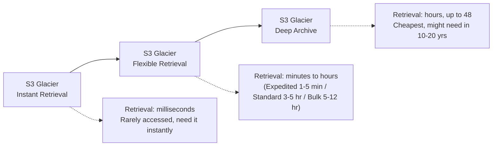
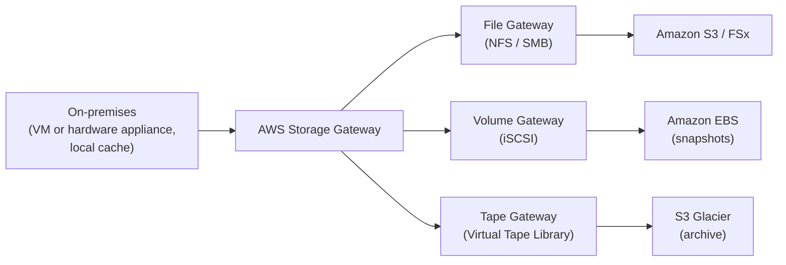
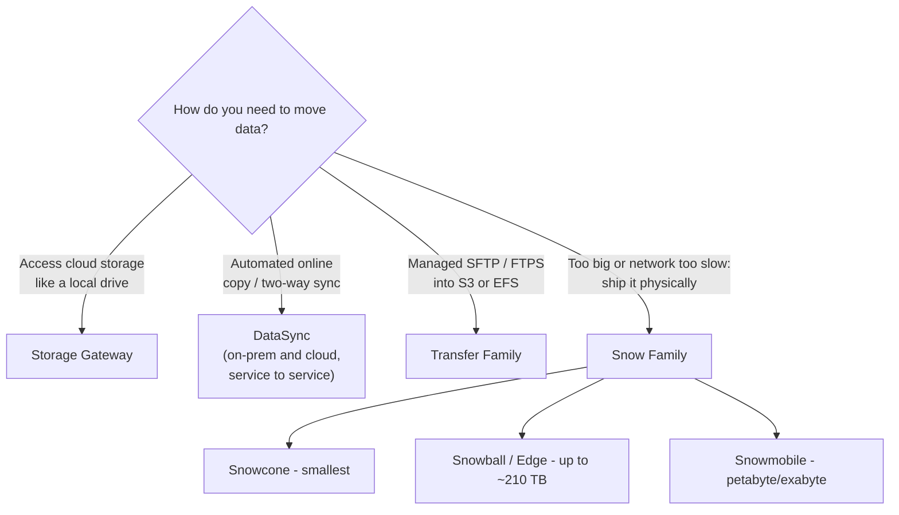
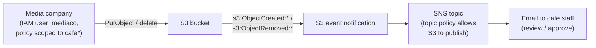
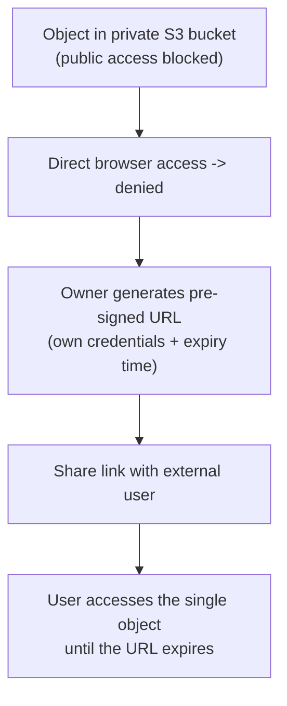
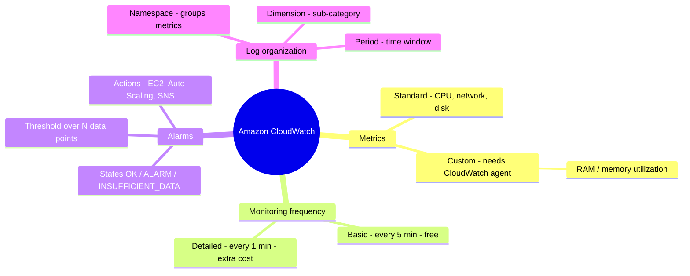
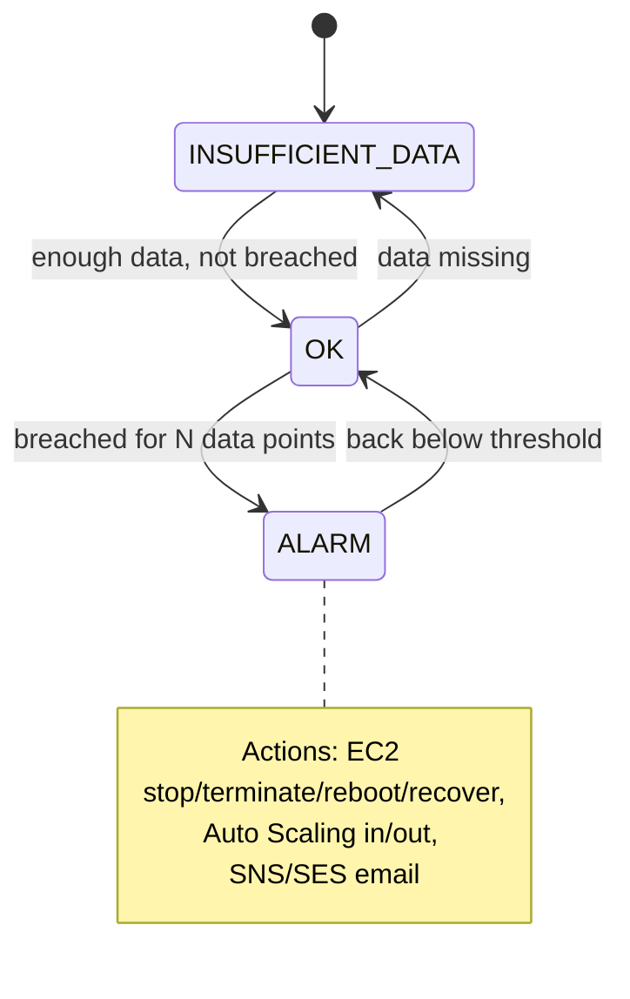

# Lecture Notes — June 22, 2026
**Cohort 3 | Project CloudIgnite**
**Topics:** S3 Glacier Archive Storage, AWS Storage Gateway, Data Transfer & Migration Services (Transfer Family, DataSync, Snow Family), Lab 185 S3 Secure File Sharing + Notifications, Lab 186 S3 via CLI, Amazon CloudWatch Intro
**Duration:** ~3 hours

---

## Key Takeaways
- **S3 Glacier** is for archival data (cheap storage, expensive retrieval): Instant Retrieval = milliseconds, Flexible Retrieval = minutes to hours (standard = 3-5 hrs), Deep Archive = up to 48 hours (cheapest)
- **Glacier vocabulary:** Vault = container, Archive = stored item, Job = retrieval operation; encryption enabled by default
- **Storage Gateway** connects on-premises to AWS cloud storage: File Gateway → S3/FSx (NFS/SMB), Volume Gateway → EBS (iSCSI), Tape Gateway → S3 Glacier (archive)
- **DataSync** = automated online sync (on-prem ↔ cloud, service ↔ service); **Transfer Family** = managed SFTP/FTPS into S3/EFS; **Snow Family** = physical devices for petabyte-scale offline transfer
- **Snow Family sizing:** Snowcone (smallest, tens of TB), Snowball/Edge (up to ~210 TB, Edge adds compute), Snowmobile (petabyte/exabyte scale truck)
- **Lab 185 workflow:** S3 bucket + SNS topic + event notification (ObjectCreated/Removed) → email alerts; IAM scoped policies (prefix-based); access keys shown once, download CSV immediately
- **Pre-signed URLs** grant temporary authenticated access to a single S3 object without making the bucket public
- **CloudWatch** monitors AWS resources: standard metrics (CPU, network, disk) vs custom metrics (RAM requires CloudWatch agent); basic monitoring = 5-min, detailed = 1-min

---

## Table of Contents

1. [Amazon S3 Glacier (Archive Storage)](#1-amazon-s3-glacier-archive-storage)
2. [AWS Storage Gateway (Hybrid Storage)](#2-aws-storage-gateway-hybrid-storage)
3. [Data Transfer & Migration Services](#3-data-transfer--migration-services)
4. [Lab 185 — Working with S3 (Secure File Sharing + Notifications)](#4-lab-185--working-with-s3-secure-file-sharing--notifications)
5. [Lab 184 — S3 via CLI (Upload, Access, Pre-Signed URLs)](#5-lab-184--s3-via-cli-upload-access-pre-signed-urls)
6. [Amazon CloudWatch (Monitoring)](#6-amazon-cloudwatch-monitoring)
7. [CLF-C02 Exam Relevance — Consolidated Map](#clf-c02-exam-relevance--consolidated-map)
8. [Glossary](#glossary)
9. [Checkpoint Q&A Recap](#checkpoint-qa-recap)
10. [Action Items & Housekeeping](#action-items--housekeeping)

---

## 1. Amazon S3 Glacier (Archive Storage)

**What it is:** A low-cost storage service purpose-built for **data archiving** — data you rarely access but can't afford to delete (e.g., compliance records you might need in 10–20 years).

### Core idea: cost follows access pattern
- **S3 Standard:** you pay the same whether you access data once a year or thousands of times a minute — storage is comparatively expensive, retrieval is cheap.
- **Glacier:** **storing is cheap, retrieving is expensive.** Only use it when access is infrequent; frequent access can cost *more* than Standard.

### The three Glacier storage classes
| Class | Retrieval speed | Best for |
|---|---|---|
| **S3 Glacier Instant Retrieval** | Milliseconds (instant) | Rarely accessed data you still need *immediately* when you do access it |
| **S3 Glacier Flexible Retrieval** | Minutes to hours (asynchronous) | Archives accessed ~1–2×/year where some wait is acceptable |
| **S3 Glacier Deep Archive** | Hours (lowest cost) | "Might need it in 10–20 years" — cheapest, longest retrieval |

### Retrieval options (Flexible Retrieval)
- **Expedited:** 1–5 minutes (costs extra).
- **Standard:** 3–5 hours.
- **Bulk:** 5–12 hours (cheapest).
- Deep Archive can take **up to 48 hours**.

### Glacier vocabulary vs S3 Standard
| S3 Standard | Glacier | Meaning |
|---|---|---|
| Bucket | **Vault** | Container with a unique name/URL |
| Object | **Archive** | The stored item |
| — | **Job** | You must run a *retrieval job* to restore data before accessing it; can trigger an SNS/email notification when complete |

### Other Glacier facts
- **Encryption is enabled by default** (unlike S3 Standard, where it's optional). Supports IAM policies + AWS KMS keys.
- **Vault access policies** define who can do what (e.g., only `root` can upload/initiate multipart).
- S3 Standard billing = charges for PUT/GET/COPY/POST/LIST requests; Glacier billing = mainly **upload + retrieval** costs.
- Access via Console, Glacier API, SDK, or **S3 Lifecycle policies** (no direct CLI mentioned).

#### 📊 Visual: Glacier retrieval-speed spectrum
*Cost and retrieval speed trade off across the three Glacier classes — cheaper storage to the right, but slower and pricier retrieval.*

> [!TIP]
> **Never archive many tiny files.** Zip them into one large file first — fewer retrieval operations means lower cost. A single Glacier archive can be very large (up to ~40 TB), vs a 5 TB max per S3 object.

#### 🎯 CLF-C02 Relevant
- **Glacier storage classes and their retrieval times** are frequently tested (especially "standard retrieval = 3–5 hours").
- Matching a **use case to the right storage class** (immediate vs. cheap-and-slow) is a classic exam skill.
- **Encryption by default**, lifecycle policies, and the cost trade-off (cheap storage / expensive retrieval) are core cost-optimization concepts.

---

## 2. AWS Storage Gateway (Hybrid Storage)

**What it is:** A **hybrid storage** service that connects an **on-premises** data center to **AWS cloud storage**. Your compute stays on-premises, but data is stored in the cloud. Deployed on-premises as a **virtual machine or hardware appliance**, with local caching for low-latency access.

**Use cases:** backup & archiving, disaster recovery, cloud data processing, storage tiering, and migration.

### The three gateway types
| Gateway type | Protocol | Backs onto | Notes |
|---|---|---|---|
| **File Gateway** | NFS / SMB | **S3** (and **FSx** for file shares) | Use it like a network/Google Drive; supports lifecycle transition to S3-IA or Glacier Flexible Retrieval (**not** Deep Archive). FSx supports Windows; NFS is Linux. |
| **Volume Gateway** | iSCSI | **EBS** | Acts like a local disk/drive; commonly stores **EBS snapshots**; always over secure HTTPS. |
| **Tape Gateway** | Virtual Tape Library (VTL) | **S3 Glacier** | For **archive**; virtual tapes stored in S3 / S3 Glacier Flexible Retrieval. |

#### 📊 Visual: Storage Gateway types and their backends
*Storage Gateway runs on-premises and maps each gateway type to an AWS storage backend: File to S3/FSx, Volume to EBS, Tape to S3 Glacier.*

> [!NOTE]
> Quick mapping to remember: **File → S3/FSx**, **Volume → EBS**, **Tape → S3 Glacier**. For "archive on-premise logs at lowest cost," the answer is **Tape Gateway**.

#### 🎯 CLF-C02 Relevant
- **Storage Gateway as the hybrid-cloud storage solution** and the **three gateway types** are exam-relevant.
- Recognizing which gateway maps to which AWS storage service (S3/FSx/EBS/Glacier) is a common question format.

---

## 3. Data Transfer & Migration Services

Three ways (besides Storage Gateway) to move data into/around AWS.

### AWS Transfer Family
- Managed **file transfer** into/out of **S3** or **EFS** using **FTP, SFTP, and FTPS**.
- Integrates with IAM and Route 53 (DNS routing) and lets you keep existing transfer workflows.

### AWS DataSync
- **Online data transfer + sync** service (fully managed).
- Accelerates moving data between **on-premises storage and AWS**, and **between AWS services** (e.g., EFS ↔ S3, FSx ↔ S3).
- Supports **two-way sync** — changes in the cloud can sync back on-premises.
- Uses a **DataSync agent** and connects over the internet (VPN) or **Direct Connect**; NFS/SMB protocols.

> [!TIP]
> **Storage Gateway = access cloud storage like a local drive** (a persistent connection). **DataSync = actively copy/sync data** from A to B. If the question emphasizes *automated replication/migration between storage systems*, the answer is **DataSync**.

### AWS Snow Family (physical data transfer devices)
| Device | Capacity | Notes |
|---|---|---|
| **Snowcone** | Smallest (~tens of TB) | Small, portable device |
| **Snowball / Snowball Edge** | Up to ~210 TB | Snowball Edge adds **on-board compute** (like a small EC2) |
| **Snowmobile** | **Petabyte / exabyte scale** | A literal shipping-container truck |

- Physical devices with strong **end-to-end encryption**; AWS ships the device, you load data, and ship it back to an AWS data center.
- Use when data is too large / network too slow for online transfer; also for remote locations, sensors/IoT, media & entertainment.

#### 📊 Visual: Which migration service?
*Pick the migration service by how you need to move data — local-drive access, automated online sync, managed SFTP, or physical shipping for huge datasets.*

#### 🎯 CLF-C02 Relevant
- **Snow Family** (which device for which data size) is frequently tested — especially "petabyte-scale = Snowmobile," "smallest = Snowcone."
- **DataSync** (online, automated replication) vs. **Snow Family** (offline/physical) vs. **Transfer Family** (SFTP/FTPS) is a common "pick the right migration service" question.
- **SFTP** as the secure transfer protocol.

---

## 4. Lab 185 — Working with S3 (Secure File Sharing + Notifications)

**Business scenario:** The café hired an external media company to deliver product photos. They need a **secure, convenient location** to upload images and want an **email notification** whenever files are uploaded (or deleted) so staff can review/approve. **Solution = S3 + SNS.**

### Workflow
1. **Configure AWS CLI** on the CLI host (`aws configure` — access key, secret key, region, output).
2. **Create an S3 bucket** (needs a globally unique name — add random letters/numbers).
3. **Upload initial images**, then run the **summarize** command to see total object count + total size.
4. **Explore IAM users & policies:** two users (`awsstudent`, `mediaco`) with policies allowing `ListAllMyBuckets`, `GetBucketLocation`, `ListBucket` (prefix `cafe*`), `PutObject`, `GetObject`.
5. **Create an access key** for a user (Security Credentials → Create access key → for CLI). **Download the CSV immediately** — the secret key is shown only once. This mirrors how you obtain credentials in real life.
6. **Create an SNS topic** + confirm an **email subscription**.
7. **Edit the SNS topic access policy** to allow the S3 bucket to **publish** events to the topic (insert the topic ARN + bucket name).
8. **Create an S3 event notification** (a JSON config) so the bucket sends `s3:ObjectCreated:*` and `s3:ObjectRemoved:*` events to the SNS topic.
9. **Test:** upload a file → email notification arrives; delete a file → another notification arrives. ✅

#### 📊 Visual: Lab 185 — S3 + SNS secure sharing
*A scoped IAM user uploads to S3, which fires an event notification to an SNS topic that emails café staff to review.*

> [!WARNING]
> **Real debugging lessons from class:**
> - A malformed **SNS access policy** (an extra character / stray angle bracket in the resource ARN) caused *"Unable to validate the following destination configuration."* The fix was removing the extra character in the policy JSON.
> - **IAM permission propagation delay:** the `mediaco` user couldn't access S3 immediately even with a correct policy — permissions weren't updated yet on AWS's side. The instructor skipped that sub-step and continued with the working user.
> - Always use the exact **console sign-in URL** for the IAM user; clicking the wrong link can lock you out of your current session (use an incognito window to test a second user).

#### 🎯 CLF-C02 Relevant
- **S3 + SNS event notifications** — event-driven, decoupled architecture.
- **IAM users, policies, and access keys** — identity and least-privilege permissions (prefix-scoped `cafe*`).
- **Access keys are secret and downloaded once** — credential-handling best practice.
- **Resource policies** (SNS topic policy allowing S3 to publish) — resource-based permissions.

---

## 5. Lab 184 — S3 via CLI (Upload, Access, Pre-Signed URLs)

**Goal (small lab):** Create a bucket, upload objects, and access an object — then make a *single object* accessible without making the whole bucket public.

### Workflow
1. Connect to the CLI host and create an S3 bucket (unique name).
2. **Upload objects** using `aws s3 sync` (or `aws s3 cp`) from the local `images` folder — mind your working directory (`cd` into the right folder first).
3. **Try to access the object via web browser:** fails when public access is blocked / permissions are denied.
4. **The challenge — make the *object* publicly accessible, not the bucket.** Since the lab user lacked permission to change object ACLs (`PutObject` ACL denied), the instructor solved it with a **pre-signed URL** instead.

#### 📊 Visual: Lab 184 — pre-signed URL sharing
*Instead of making the object public, generate a pre-signed URL (your credentials + an expiry) so only link holders can access it until it expires.*

> [!TIP]
> A **pre-signed URL** grants **temporary, authenticated access** to a specific object using your credentials + an **expiry time** — anyone with the link can access it until it expires. It's the secure alternative to making an object public.

5. **List objects:** `aws s3 ls s3://<bucket>` — use `--recursive` to traverse nested folders and list every object (shows date, time, size, name).

#### 🎯 CLF-C02 Relevant
- **Pre-signed URLs** for temporary, secure object sharing — a recognized S3 feature.
- **Public access vs. object-level permissions** — S3 security and the principle of not exposing whole buckets.
- General **S3 object operations** (upload, list, access).

---

## 6. Amazon CloudWatch (Monitoring)

**What it is:** AWS's **monitoring** service for AWS resources, on-premises servers, and applications. It answers questions like *"Is my app healthy?", "Is CPU higher than expected?", "When should I launch more EC2 instances?"*

#### 📊 Visual: CloudWatch at a glance
*Standard vs. agent-collected custom metrics, monitoring frequency, alarm states/actions, and how logs are organized.*

### Metrics
- **Standard metrics** (no setup): CPU utilization, network, disk utilization, etc.
- **Custom metrics** (require the **CloudWatch agent**): e.g., **memory (RAM) utilization** and disk-space details that AWS can't see from outside the instance.

> [!NOTE]
> **Frequently asked:** **RAM / memory utilization is NOT a standard metric** — you must install the **CloudWatch agent** to collect it as a custom metric.

### Monitoring frequency
- **Basic monitoring:** every **5 minutes** (default, free).
- **Detailed monitoring:** every **1 minute** (extra cost).

### Alarms
- Trigger when a metric crosses a **threshold** for a configured number of **data points** (e.g., "CPU > 60% for 3 data points"). This prevents a single momentary spike from firing an alarm.
- **Three alarm states:**
  - **OK** (green) — threshold not breached.
  - **ALARM** (red) — threshold breached.
  - **INSUFFICIENT_DATA** (gray) — not enough data to decide yet.
- **Alarm actions:** EC2 actions (stop/terminate/reboot/recover), EC2 **Auto Scaling** (scale in/out), or **SNS/SES** notifications (email).

#### 📊 Visual: CloudWatch alarm state machine
*An alarm moves between OK, ALARM, and INSUFFICIENT_DATA; it fires only after the threshold is breached for the configured number of data points, then can trigger EC2, Auto Scaling, or SNS actions.*

### Log organization
- **Namespace:** groups logs/metrics (e.g., all EC2-related).
- **Dimension:** sub-categorizes within a namespace (e.g., CPU vs. RAM vs. disk).
- **Period:** how long metrics/logs are collected/aggregated (1 minute, 1 day, etc.).
- CloudWatch can also **create logs** and export them to S3 for analysis (can be automated).

> [!TIP]
> CloudWatch is the metric source behind **EC2 Auto Scaling** — Auto Scaling launches/terminates instances *based on* CloudWatch metrics like CPU utilization.

#### 🎯 CLF-C02 Relevant
- **CloudWatch = monitoring/observability** for AWS resources — core exam service.
- **Standard vs. custom metrics** (RAM = custom via agent) is a frequently tested detail.
- **Alarms, thresholds, and alarm actions** (with SNS notifications and Auto Scaling) tie monitoring to automation.
- **Basic (5-min) vs. detailed (1-min) monitoring** is a recognizable distinction.

---

## CLF-C02 Exam Relevance — Consolidated Map

| Topic from today | Service(s) | Exam relevance | Why it matters for CLF-C02 |
|---|---|---|---|
| Archive storage classes & retrieval times | **S3 Glacier** (Instant / Flexible / Deep Archive) | 🟢 High | Match use case to class; "standard retrieval = 3–5 hrs" |
| Unknown/changing access pattern | **S3 Intelligent-Tiering** | 🟢 High | Instructor flagged as frequently asked |
| Hybrid storage & gateway types | **Storage Gateway** (File/Volume/Tape) | 🟢 High | Connect on-prem to S3/FSx/EBS/Glacier |
| Physical bulk data transfer | **Snow Family** | 🟢 High | Snowcone (smallest) → Snowmobile (petabyte) |
| Online replication/sync | **DataSync** | 🟢 High | Automated on-prem ↔ cloud & service ↔ service |
| Secure file transfer | **Transfer Family** (SFTP/FTPS) | 🟡 Medium | Managed FTP into S3/EFS |
| Monitoring & alarms | **CloudWatch** | 🟢 High | Standard vs custom metrics; alarm states/actions |
| Memory metric requires agent | **CloudWatch agent** | 🟢 High | RAM = custom metric (frequently asked) |
| Identity, policies, access keys | **IAM** | 🟢 High | Least privilege; secret keys shown once |
| Event-driven notifications | **S3 events + SNS** | 🟢 High | Decoupled architecture |
| Temporary secure object access | **S3 pre-signed URLs** | 🟡 Medium | Share without making buckets public |
| Encryption by default / KMS | **Glacier + KMS** | 🟡 Medium | Data protection basics |
| Temporary EC2 storage | **Instance Store** | 🟢 High | Caching / temporary data (quiz item) |
| Highest IOPS volume | **EBS Provisioned IOPS (io)** | 🟢 High | vs gp3 general purpose (quiz item) |
| CLI mechanics (sync/cp, recursive, vim/JSON editing) | Linux/CLI tooling | 🔴 Low | Lab skill, not exam content |

Legend: 🟢 High = expect direct questions · 🟡 Medium = good to recognize · 🔴 Low = lab practice, not exam content

---

## ��� Glossary

| Term | Meaning |
|---|---|
| **S3 Glacier** | Low-cost S3 storage tier family for archival data. |
| **Vault** | Glacier's container for archives (analogous to an S3 bucket). |
| **Archive** | A stored item in Glacier (analogous to an S3 object). |
| **Retrieval job** | The process to restore Glacier data before you can access it; can notify via SNS on completion. |
| **Expedited / Standard / Bulk** | Glacier Flexible Retrieval speeds: 1–5 min / 3–5 hrs / 5–12 hrs. |
| **Glacier Deep Archive** | Cheapest, slowest tier (retrieval up to ~48 hrs). |
| **Storage Gateway** | Hybrid service linking on-prem systems to AWS storage; File/Volume/Tape types. |
| **File / Volume / Tape Gateway** | Back onto S3+FSx (NFS/SMB) / EBS (iSCSI) / S3 Glacier (virtual tape). |
| **Transfer Family** | Managed FTP/SFTP/FTPS transfers into S3/EFS. |
| **DataSync** | Managed online data transfer & two-way sync (on-prem ↔ cloud, service ↔ service). |
| **Snow Family** | Physical devices for offline bulk transfer: Snowcone, Snowball(+Edge), Snowmobile. |
| **Pre-signed URL** | Time-limited, authenticated link to a specific S3 object without making it public. |
| **Access key / Secret key** | IAM credentials for programmatic/CLI access; secret shown only once at creation. |
| **SNS topic policy** | Resource-based policy allowing a service (e.g., S3) to publish to the topic. |
| **S3 event notification** | Config that sends bucket events (object created/removed) to SNS/SQS/Lambda. |
| **CloudWatch** | Monitoring service for metrics, logs, and alarms. |
| **Standard vs custom metric** | Built-in (CPU, network, disk) vs agent-collected (e.g., RAM). |
| **Basic vs detailed monitoring** | 5-minute vs 1-minute metric resolution. |
| **Alarm states** | OK / ALARM / INSUFFICIENT_DATA. |
| **Data points** | Number of consecutive breaching readings needed to trigger an alarm. |
| **Namespace / Dimension / Period** | How CloudWatch groups, sub-categorizes, and time-scopes metrics/logs. |

---

## Checkpoint Q&A Recap

**Q1. A sysadmin wants to archive on-premise database log files to AWS at lowest cost. Which Storage Gateway type?**
**Tape Gateway** — it archives to S3 Glacier.

**Q2. What are the two ways to deploy the on-premises component of a Storage Gateway?**
As a **virtual machine** or a **hardware appliance**.

**Q3. Which storage provides temporary storage for an EC2 instance (e.g., caching)?**
**EC2 Instance Store** (ephemeral).

**Q4. Which S3 storage class fits an unknown/changing access pattern?**
**S3 Intelligent-Tiering.**

**Q5. Which EBS volume type gives the highest performance for frequent read/write (high IOPS)?**
**Provisioned IOPS (io)** — not gp3 (gp3 is general purpose, not I/O-optimized).

**Q6. How long does S3 Glacier *standard* retrieval take?**
**3–5 hours.**

**Q7. Which service automates and accelerates replicating data between on-premise storage and AWS (and between AWS services)?**
**AWS DataSync.**

**Q8. Which protocol transfers data securely over the internet (Transfer Family)?**
**SFTP** (Secure File Transfer Protocol).

**Q9. Which Snow Family member is the smallest? Which is for petabyte-scale?**
Smallest = **Snowcone**; petabyte-scale = **Snowmobile**.

**Q10. Is RAM/memory utilization a standard CloudWatch metric?**
**No** — it requires the **CloudWatch agent** as a **custom metric**.

---

## Action Items & Housekeeping

- [ ] **Submit/end all labs:** 185 (Working with S3) and 184 (S3 CLI). Don't forget to click **submit** before ending.
- [ ] **Lab 185 note:** if your IAM `mediaco` user couldn't access S3 (task 3 / steps 87–88), skip only those two steps and continue task 4 with your working user; use the **lab access key** if needed.
- [ ] **Review high-yield storage picks:** Glacier retrieval times, Storage Gateway types, Snow Family sizing, DataSync vs Transfer Family.
- [ ] **Remember the gotchas:** access/secret keys are shown once (download the CSV); watch for stray characters in policy JSON; IAM permission changes can take time to propagate; zip small files before archiving.
- [ ] **Next session:** CloudWatch lab **before break**, then a second lab after break, and possibly a review of previous-topic case questions.
- [ ] **Course timeline:** class extended into **mid-July** due to holidays; reaching ≥90% of labs + KCs changes status to *graduated*; graduation ceremony noted for **June 27**; missed labs can be caught up in July.

---

