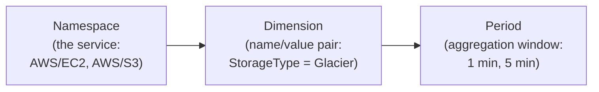
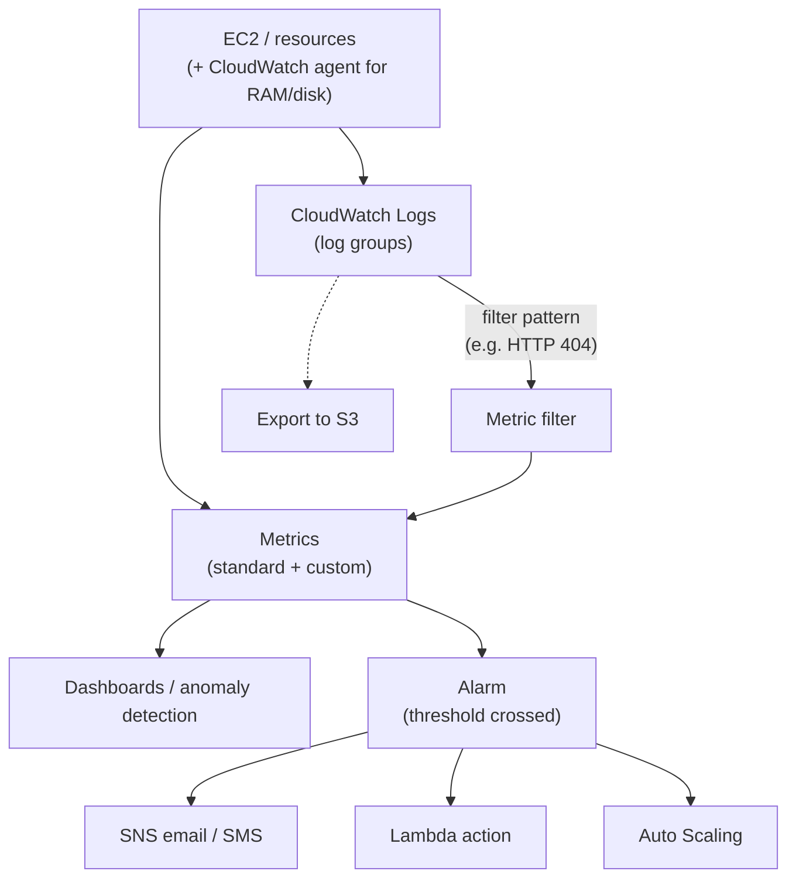
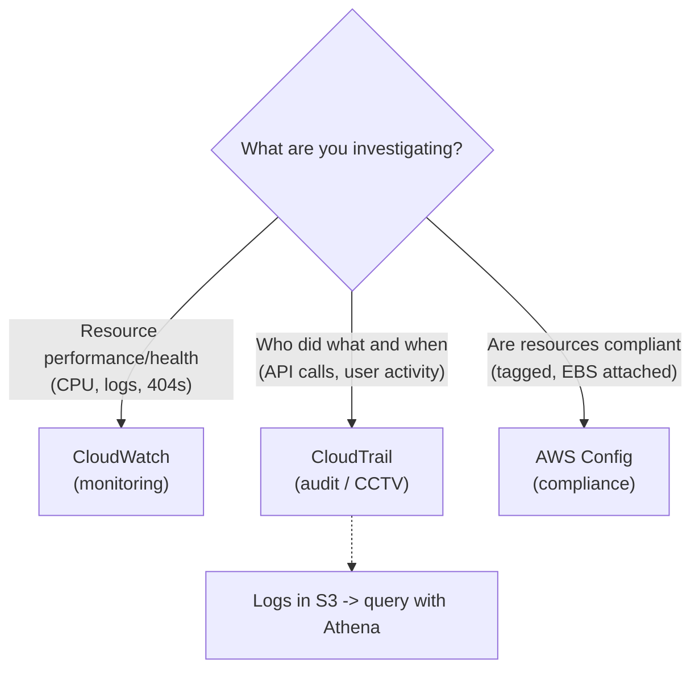
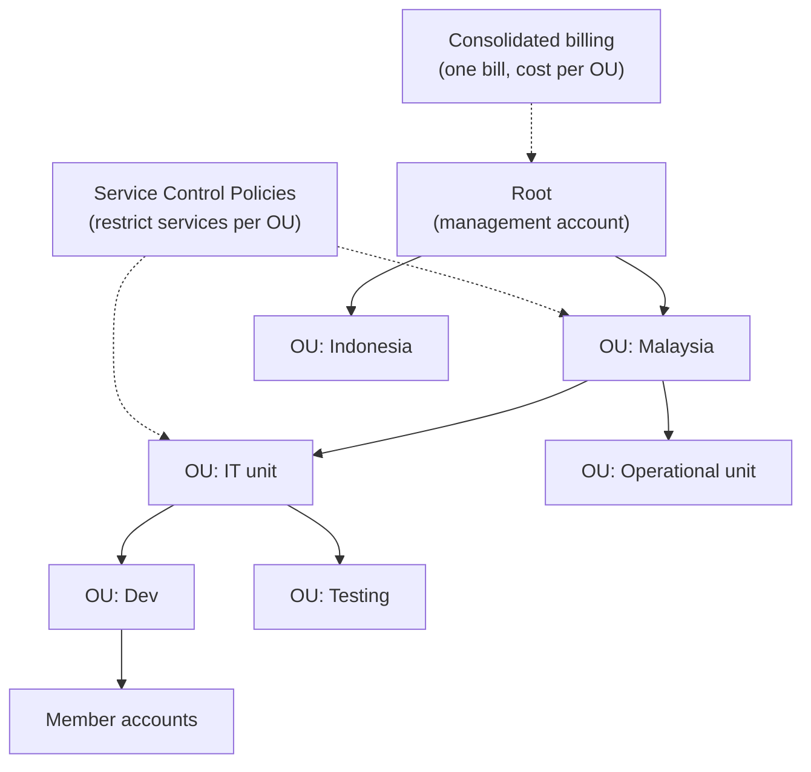
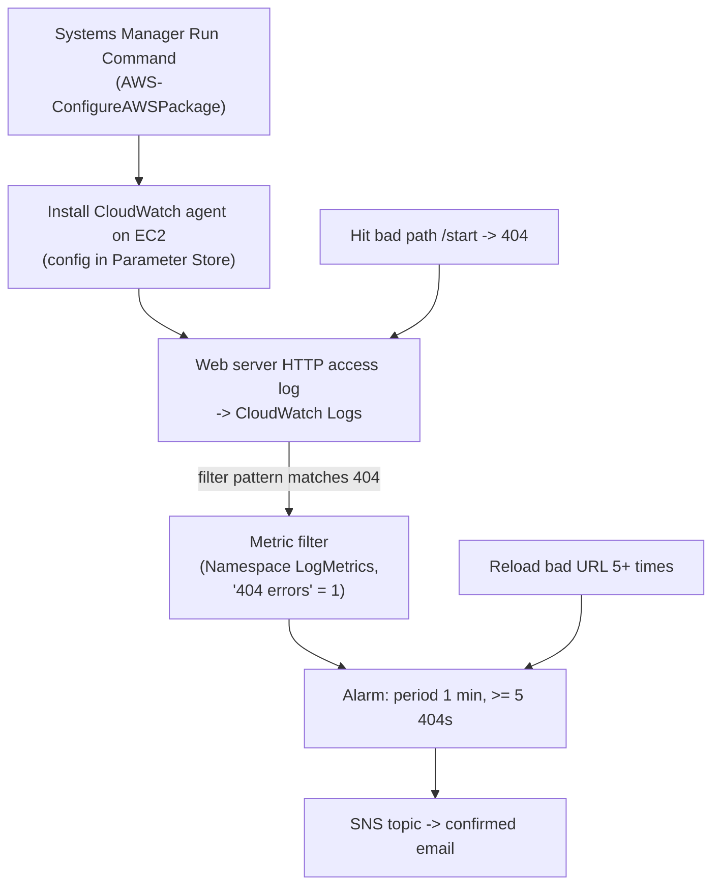
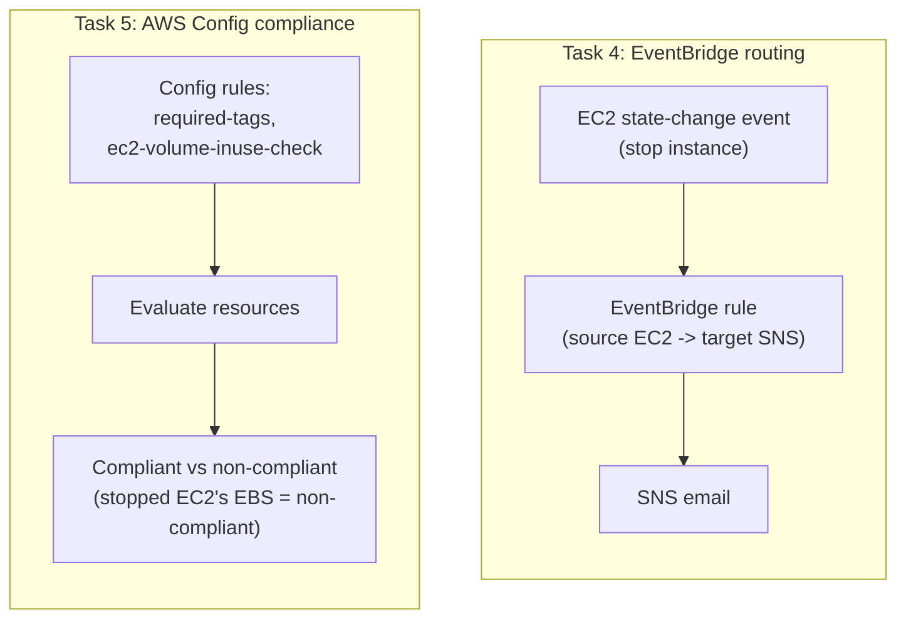
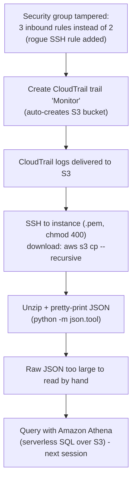

# Lecture Notes — June 23, 2026
**Cohort 3 | Project CloudIgnite**
**Topics:** CloudWatch Deep Dive, AWS CloudTrail, AWS Organizations, Lab 186 Monitoring Infrastructure with CloudWatch, Catch the Hacker Lab (CloudTrail + Athena)
**Duration:** ~3 hours

---

## Key Takeaways
- **CloudWatch** organizes metrics via Namespace (service), Dimension (name/value pair that identifies a metric), and Period (aggregation window)
- **Memory/RAM utilization is NOT a standard metric** — it requires the CloudWatch agent to collect as a custom metric (frequently tested on exam)
- **Basic monitoring = 5-min data points (free); detailed monitoring = 1-min data points (extra cost)**
- **CloudWatch Alarms** have three states (OK, ALARM, INSUFFICIENT_DATA); fire after threshold breached for N consecutive data points; actions include SNS, Lambda, Auto Scaling
- **CloudTrail = audit log of API activity (who did what, when)** — use it to investigate user actions; CloudWatch = resource performance/health monitoring
- **CloudTrail logs stored in S3 and queried with Athena** (serverless SQL over S3) — far easier than grepping raw JSON
- **AWS Organizations** centrally manages multiple accounts with consolidated billing, Service Control Policies (SCPs) to restrict services per OU, and up to 5 nested OU levels
- **AWS Config** tracks resource compliance against rules (e.g., required tags, EBS attached, min password length) and reports compliant vs non-compliant resources

---

## Table of Contents

1. [Amazon CloudWatch (Deep Dive)](#1-amazon-cloudwatch-deep-dive)
2. [AWS CloudTrail](#2-aws-cloudtrail)
3. [AWS Organizations](#3-aws-organizations)
4. [Lab 186 — Monitoring Your Infrastructure with CloudWatch](#4-lab-186--monitoring-your-infrastructure-with-cloudwatch)
5. [Lab — "Catch the Hacker" (CloudTrail + Athena)](#5-lab--catch-the-hacker-cloudtrail--athena)
6. [CLF-C02 Exam Relevance Summary](#6-clf-c02-exam-relevance-summary)
7. [Glossary](#7-glossary)
8. [Checkpoint Q&A Recap (Knowledge Checks)](#8-checkpoint-qa-recap-knowledge-checks)
9. [Action Items & Housekeeping](#9-action-items--housekeeping)

---

## 1. Amazon CloudWatch (Deep Dive)

CloudWatch is AWS's **monitoring** service for resources (and on-premise). We finished the topic started the previous day.

### Metric structure (how CloudWatch organizes data)

| Component | Meaning | Example |
|---|---|---|
| **Namespace** | The service the metric belongs to | `AWS/S3`, `AWS/EC2`, `AWS/RDS` |
| **Dimension** | A name/value pair that categorizes a metric | `StorageType = Glacier`, `BucketName = <name>` |
| **Period** | How long data is collected/aggregated | 1 min, 5 min |

#### 📊 Visual: CloudWatch metric structure
*CloudWatch's filing system — a Namespace groups metrics by service, a Dimension is the name/value pair that identifies a specific metric, and the Period is the aggregation window.*

> [!TIP]
> Think of it as a filing system: **Namespace → Dimension → Period**. It exists so that among thousands of logs/metrics you can still find the specific one you want. **Dimension** is the *name/value pair* used to identify a metric (this exact wording came up in a Knowledge Check).

### Standard vs. Custom metrics

- **Standard metrics** — collected automatically by CloudWatch, no setup needed (e.g. **CPU**, **network**, **disk** on EC2).
- **Custom metrics** — require installing the **CloudWatch agent** on the EC2 instance to collect extra data such as **RAM/memory utilization** and **disk space**.

> [!WARNING]
> **Memory/RAM utilization is NOT a standard metric.** It needs the CloudWatch agent (a custom metric). The instructor repeatedly flags this as a frequently-tested point.

### Monitoring frequency

- **Basic monitoring** = **5-minute** data points (free tier default).
- **Detailed monitoring** = **1-minute** data points (higher frequency, extra cost).

### Other CloudWatch capabilities discussed

- **Dashboards** — real-time graphs; both default and custom metrics can be displayed.
- **Anomaly detection** — spot suspicious behaviour (e.g. CPU normally ~50% suddenly sustained >70%).
- **CloudWatch Logs** — collect logs (e.g. from EC2), aggregate into **log groups**, store elsewhere (e.g. **S3**), and analyze to make informed decisions (e.g. predict load and drive **Auto Scaling**).
- **Metric filters** — filter for specific log entries (e.g. only **HTTP 404** errors) using a **filter pattern**, then turn matches into a metric.
- **CloudWatch Alarms** — fire when a metric crosses a threshold; can send **SNS** email/SMS or invoke a **Lambda** function.
- **Log formatting / filter patterns** — logs can be structured into fields such as host, identity, user, timestamp, request line, HTTP status, and object size.

#### 📊 Visual: CloudWatch observability & alerting flow
*Logs and metrics (including agent-collected custom ones) feed dashboards and alarms; a metric filter turns matching log lines like HTTP 404 into a metric, and alarms fire SNS, Lambda, or Auto Scaling actions.*

> [!NOTE]
> **CloudWatch Events is deprecated / renamed to Amazon EventBridge.** The old CloudWatch Events UI no longer exists; we use **EventBridge** (source → target event routing) instead, which we do hands-on in Lab 186.

### 🎯 CLF-C02 Relevant
> - CloudWatch = **resource/performance monitoring**; metrics, dashboards, alarms, logs.
> - **Standard vs. custom metrics**; **RAM/memory needs the CloudWatch agent** (custom).
> - **Basic (5-min) vs. detailed (1-min)** monitoring.
> - Alarms → **SNS** notifications and can trigger actions (incl. Auto Scaling).
> - **EventBridge** is the current name for CloudWatch Events (event-driven routing).

---

## 2. AWS CloudTrail

**CloudTrail records user/account activity — the "who did what" audit log.**

> [!TIP]
> Simple rule from class:
> - **Resource** looks suspicious → check **CloudWatch** (resource logs).
> - **Human/user** looks suspicious → check **CloudTrail** (activity logs).
> CloudTrail is like a **CCTV** for your AWS account.

- Records API activity / actions: who terminated an instance, who changed a security group, who created an IAM user, activity from unknown IPs, actions denied due to lack of permissions, etc.
- Logs can be **stored in S3** and later **queried with Amazon Athena** (used in the "catch the hacker" lab).

#### 📊 Visual: CloudWatch vs. CloudTrail vs. Config
*The classic "which service?" split — CloudWatch watches resource health, CloudTrail audits who did what, and AWS Config checks resource compliance.*

### 🎯 CLF-C02 Relevant
> - **CloudTrail = governance/audit** of **API calls & user activity** (accountability, who did what/when).
> - Contrast with **CloudWatch** (performance/resource monitoring) — a very common exam distinction.
> - CloudTrail logs commonly stored in **S3** and analyzed with **Athena**.

---

## 3. AWS Organizations

A service to **centrally manage many AWS accounts** — meant for **large organizations** (not small ones).

### Key components

| Component | Description |
|---|---|
| **Root** | The management/root account at the top of the hierarchy |
| **Organizational Unit (OU)** | A group of accounts; can be nested (e.g. by country → team → function) |
| **Member account** | An individual AWS account inside the org |
| **Service Control Policy (SCP)** | A policy that restricts which services/actions an OU or account can use |

### Benefits

- **Policy-based management** across multiple accounts.
- **Consolidated billing** — one bill for the whole org, with the ability to view cost **per OU/unit** separately.
- **Centralized policy control** across accounts (e.g. restrict an OU from using EC2).
- **Automated account creation & management** (via console, CLI, SDK, or HTTPS query API).

### Security layers

- **IAM** (identity/permissions), **resource policies**, and **SCP** (service control at the org/OU level).

### Example hierarchy

- Root → OU "Malaysia" + OU "Indonesia" → within Malaysia split into **IT unit** / **Operational unit** → within IT split into **Dev** / **Testing**, etc. Each unit can have its own compliance policy.

### Naming rules / limits mentioned

- One **root** account.
- Up to **5 levels** of nested OUs.
- Limits on number of accounts per OU, number of policies (~1000), SCP document size, accounts created concurrently (~5), account creation per day (~20).

#### 📊 Visual: AWS Organizations hierarchy
*Organizations groups member accounts under a root via nested OUs (up to 5 levels); SCPs restrict which services each OU can use, and consolidated billing rolls everything into one bill with per-OU cost views.*

> [!NOTE]
> AWS Organizations is **not** the same as Windows Server Active Directory — it's about grouping/governing AWS **accounts**, not directory services.

### 🎯 CLF-C02 Relevant
> - **AWS Organizations** = centrally manage multiple accounts; **consolidated billing**; **SCPs** to restrict services; grouping via **OUs**.
> - Know **Root, OU, Member account, SCP** as the key components.
> - Consolidated billing (volume discounts + single bill) is a frequently tested benefit.

---

## 4. Lab 186 — Monitoring Your Infrastructure with CloudWatch

**Goal:** Install the CloudWatch agent, capture web-server logs, create a metric filter + alarm for **HTTP 404** errors, route EC2 state-change events via **EventBridge → SNS**, and set up **AWS Config** compliance rules. (~100 steps.)

### Task 1 — Install the CloudWatch agent (via Systems Manager)

1. Go to **Systems Manager → Run Command**.
2. Run **`AWS-ConfigureAWSPackage`** (works for Windows/Linux/macOS) — Action = **Install**, package name = the CloudWatch agent, version = **latest**.
3. Choose **Instances Manually** → select your EC2 instance → **Run**.
4. Check **Targets and Outputs**: Output 1 may be *skipped* (Windows step — expected on a Linux instance); Output 2 should succeed.
5. Create a **Parameter Store** parameter (name + description + value = the agent config). Watch for stray newline/whitespace characters when pasting.
6. Run a second command to install the required tooling that collects the **extra (custom) metrics** — search by **document prefix**, select it, choose your instance, provide the config **location** (a common miss = forgetting to specify the config), and **Run** until success.

> [!WARNING]
> If the log never appears, the usual cause is a **wrong Parameter Store parameter** (extra space / bad value). Fix the parameter and re-run the command. Also allow ~1 minute and refresh.

### Task 2 — Generate and log a 404 event, then filter it

7. Hit the web server with a bad path (e.g. `/start`) to intentionally generate a **404 Not Found** (expected).
8. In **CloudWatch → Logs → Log Management** (UI is outdated in the instructions), open **HTTP access log** and confirm the `GET ... 404` entry appears (refresh / try incognito if missing).
9. **Actions → Create metric filter** with the given **filter pattern** (fields: IP, ID, user, timestamp, request, status, code) matching **404**. Test the pattern against your instance's log.
10. Filter name = `404 errors`; **Namespace** = `LogMetrics`; **Metric name** = `404 errors`; **Metric value** = `1`. (These must be exact — the alarm depends on them.)

### Task 2 (cont.) — Create the alarm

11. From the metric filter, **Create alarm**: **Period = 1 minute**, condition **≥ 5** (fires when there are 5+ 404s).
12. Create a **new SNS topic**, subscribe your **email**, and **confirm the subscription** email.
13. Name the alarm (`404 errors`), add a description, **preview → Create** (through ~step 56).
14. Generate several 404s (reload the bad URL 5+ times) → alarm goes into **In alarm** state → you receive the SNS email.

#### 📊 Visual: Lab 186 — 404 detection pipeline
*Install the agent via Systems Manager, capture the web server's 404s into CloudWatch Logs, convert them to a metric with a filter, and alarm to an SNS email when 5+ occur in a minute.*

### Task 3 — View collected metrics

15. **EC2 → your instance → Monitoring** shows CloudWatch graphs (CPU, network, etc.).
16. **CloudWatch → All metrics** shows the **CloudWatch agent** namespace collecting disk/host data; you can select which to add to a dashboard. (No required action — exploration only.)

### Task 4 — Route EC2 events with EventBridge → SNS

> [!NOTE]
> The lab instructions reference "rules" that no longer exist there — you must use **EventBridge** instead.

17. **EventBridge → Create rule** with an event pattern.
18. Source = **EC2**; Target = **SNS topic** (drag/drop source and target).
19. **Uncheck** the "Use execution role (recommended)" **permissions** option under the target (otherwise creation fails); select your existing SNS topic.
20. Name and **create** the rule.
21. **Stop** the EC2 instance → an EC2 state-change event fires → you receive an email via SNS.

### Task 5 — AWS Config (compliance rules)

22. Open **AWS Config → Get started → Next/Confirm** to create the default configuration recorder.
23. **Add rule** → **`required-tags`** (managed rule); set the required tag key (e.g. `project`).
24. **Add rule** → **`ec2-volume-inuse-check`** ("EC2 volume unused") to flag unattached EBS volumes.
25. Because the EC2 instance was stopped, its EBS volume shows as **non-compliant** — Config shows **compliant vs. non-compliant** resources.

> [!TIP]
> **AWS Config** = continuous **compliance/governance**: define rules (all resources tagged, EBS attached to EC2, IAM min password length ≥ 8, etc.) and see which resources violate them.

#### 📊 Visual: Lab 186 — EventBridge routing & AWS Config
*The lab's governance tracks — EventBridge routes an EC2 stop event to an SNS email, while AWS Config evaluates resources against rules and flags non-compliant ones (like the detached EBS volume).*

### 🎯 CLF-C02 Relevant
> - **CloudWatch agent** required for custom metrics (RAM/disk).
> - **CloudWatch Logs → metric filter → alarm → SNS** is the classic monitoring/alerting flow.
> - **EventBridge** for event-driven routing (EC2 state change → SNS).
> - **AWS Config** = resource **compliance auditing** (know it vs. CloudTrail vs. CloudWatch).
> - **Systems Manager (Run Command, Parameter Store)** for managing instances at scale.

---

## 5. Lab — "Catch the Hacker" (CloudTrail + Athena)

**Goal:** A security group was tampered with (an extra SSH rule was added by a "hacker"); use **CloudTrail** logs + **Amazon Athena** to find who did it. *Started but not finished — to be completed next session.*

Steps covered before running out of time:

1. **Task 1** — EC2 → your web server → Security group → add an inbound **SSH** rule restricted to **"My IP"** (do **not** use `0.0.0.0/0`), keeping the existing HTTP rule.
2. **Task 2** — Confirm the café website loads (public IP `/cafe`; try incognito to bypass cache). The site appears defaced/changed = evidence of the "hack."
3. Inspect the security group's **inbound rules**: there are now **three** rules instead of two — someone added an extra rule. Goal: find who.
4. **Create a CloudTrail trail** named `Monitor`, letting it auto-create an **S3 bucket** for the logs.
5. **Connect to the instance via SSH** (using the `.pem` key) — EC2 Instance Connect wasn't usable for this step.
6. Download the CloudTrail logs from the S3 bucket:
   - `mkdir CtrailLogs` → `cd` into it
   - `aws s3 ls` to find the bucket, then `aws s3 cp s3://<bucket>/ . --recursive` to download all logs
   - Navigate into the dated log folder and **unzip** the log files
7. Inspect a log file (e.g. pipe through `python -m json.tool` to pretty-print JSON) — but the raw logs are large and hard to search by hand, which motivates using **Athena** (the main focus, to be done next session).

#### 📊 Visual: "Catch the Hacker" investigation flow
*A tampered security group is traced by turning on a CloudTrail trail, shipping logs to S3, downloading them via CLI, and (next session) querying them with Athena instead of reading raw JSON.*

> [!WARNING]
> **Common gotchas seen in class:**
> - **Delete any previous `.pem` key file** before downloading a new one, or SSH fails.
> - Key file permissions must be **`400`** (not `40`) — otherwise "permission denied" / password prompt.
> - Windows users must use the correct SSH tooling (`icacls` for permissions); some Linux-style commands won't work on Windows.
> - Manually reading CloudTrail JSON is impractical — this is exactly what **Athena** is for.

### 🎯 CLF-C02 Relevant
> - **CloudTrail** for **auditing who changed what** (e.g. who modified a security group) — accountability & security investigation.
> - **CloudTrail logs stored in S3, queried with Athena** (serverless SQL over S3 data).
> - **Security group** basics: restrict SSH to a specific IP, never `0.0.0.0/0`.

---

## 6. CLF-C02 Exam Relevance Summary

| Topic | Why it matters for CLF-C02 | Relevance |
|---|---|---|
| **CloudWatch** (metrics, alarms, logs, dashboards) | Core monitoring service | 🔴 High |
| **Standard vs. custom metrics / CloudWatch agent** | RAM/memory needs the agent (frequently tested) | 🔴 High |
| **Basic (5-min) vs. detailed (1-min) monitoring** | Common detail question | 🟠 Medium |
| **CloudTrail** | Audit of user/API activity; contrast with CloudWatch | 🔴 High |
| **CloudWatch vs. CloudTrail vs. Config** | Classic "which service?" distinction | 🔴 High |
| **AWS Organizations (OUs, SCPs, consolidated billing)** | Multi-account management & billing | 🔴 High |
| **AWS Config** | Resource compliance auditing | 🟠 Medium |
| **Amazon EventBridge** | Event-driven routing (formerly CloudWatch Events) | 🟠 Medium |
| **Amazon SNS** | Notifications from alarms/events | 🟠 Medium |
| **Amazon Athena** | Serverless SQL queries over S3 (e.g. CloudTrail logs) | 🟠 Medium |
| **Systems Manager (Run Command, Parameter Store)** | Managing instances at scale | 🟢 Lower |
| **Security groups (restrict SSH to My IP)** | Networking/security fundamentals | 🟠 Medium |
| Lab CLI mechanics (`aws s3 cp --recursive`, pem/`chmod 400`, unzip, `json.tool`) | Hands-on practice, deeper than exam needs | 🟢 Lower |

---

## 7. Glossary

- **Namespace** — a container that groups metrics by service (e.g. `AWS/EC2`).
- **Dimension** — a name/value pair that uniquely identifies/categorizes a metric.
- **Period** — the length of time over which a metric is collected/aggregated.
- **Standard metric** — metric collected automatically by CloudWatch (CPU, network, disk).
- **Custom metric** — metric requiring the CloudWatch agent (e.g. RAM, disk space).
- **CloudWatch agent** — software installed on an instance to send custom metrics/logs.
- **Metric filter** — a rule that turns matching log entries (e.g. 404s) into a metric.
- **Alarm** — watches a metric and takes action (SNS, Lambda, EC2/Auto Scaling) on a threshold.
- **EventBridge** — event bus that routes events from a source to a target (renamed CloudWatch Events).
- **CloudTrail** — records account/API activity (who did what, when) for auditing.
- **AWS Config** — evaluates resources against compliance rules and reports compliant/non-compliant.
- **AWS Organizations** — centrally manage multiple AWS accounts.
- **OU (Organizational Unit)** — a group of accounts within an organization; can be nested.
- **SCP (Service Control Policy)** — org/OU-level policy restricting available services/actions.
- **Consolidated billing** — a single bill across all accounts in an organization.
- **Athena** — serverless service to query data in S3 using SQL.
- **Systems Manager Run Command** — run commands on instances without SSH.
- **Parameter Store** — Systems Manager store for configuration values/secrets.

---

## 8. Checkpoint Q&A Recap (Knowledge Checks)

> [!NOTE]
> KCs run in class this day. Paraphrased:

1. **Which AWS service monitors a metric and sends an alert when the metric changes?** → **Amazon CloudWatch**.
2. **Which service can be used with AWS CloudTrail to store logs?** → **Amazon S3**.
3. **Which parameter indicates a change in the AWS environment when creating an event in CloudWatch Events?** → (Legacy question — CloudWatch Events is now **EventBridge**.)
4. **What is the name/value pair used for identifying metrics in CloudWatch?** → **Dimension** (not "namespace").
5. **Which type of data/logs can be queried with Amazon Athena?** → data stored in **S3**.

---

## 9. Action Items & Housekeeping

- [ ] **Before next class:** open **Lab 316**, attempt the steps, then **submit** it (it's known to be broken/outdated) so the next section unlocks. **Enable exam preparation.**
- [ ] Complete the **"catch the hacker" (CloudTrail + Athena)** lab next session — instructor starts **promptly at 7 PM**; **don't be late**, and **don't submit** it yet.
- [ ] Delete any old **`.pem`** key file before the SSH lab step.
- [ ] Finish the **Machine Learning / Generative AI** module — required to unlock **Exam Prep** cases.
- [ ] Complete the **portfolio exercise** (self-guided; not a KC and not a graduation requirement).

> [!TIP]
> **Graduation plan:** Target is **~90–95% of KCs and ~90–95% of labs by Thursday** to reach **Graduated** status. There are **13 KCs** total — ~5 done today, ~4–5 more tomorrow, and the rest (exam-prep cases) entered on Thursday. Missing up to ~4 labs (some are broken) should still be fine for graduation. Remaining sections after today: labs **186/187** plus the exam-prep KC section; makeup labs/reviews continue into July.
