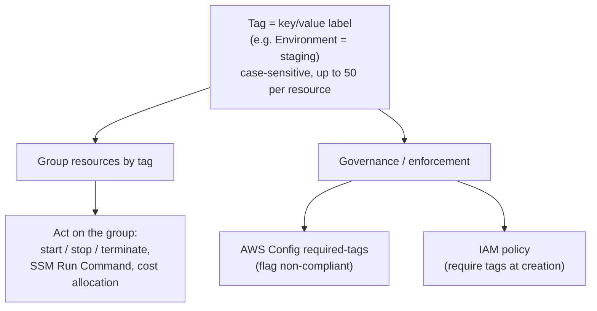
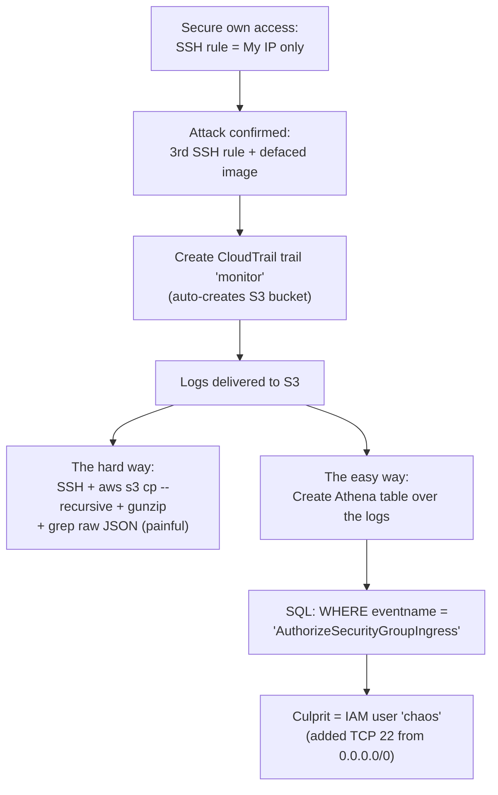
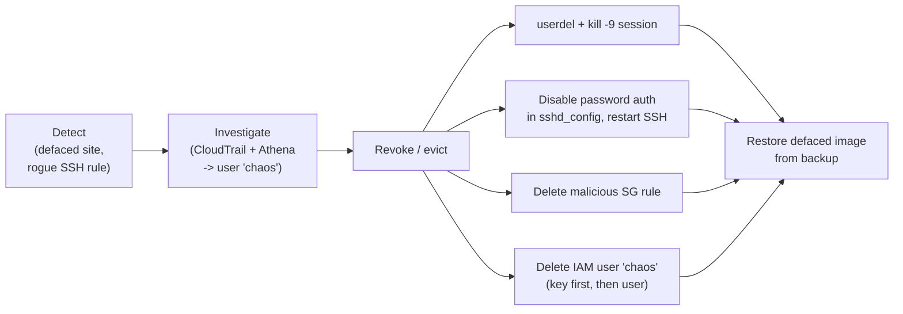
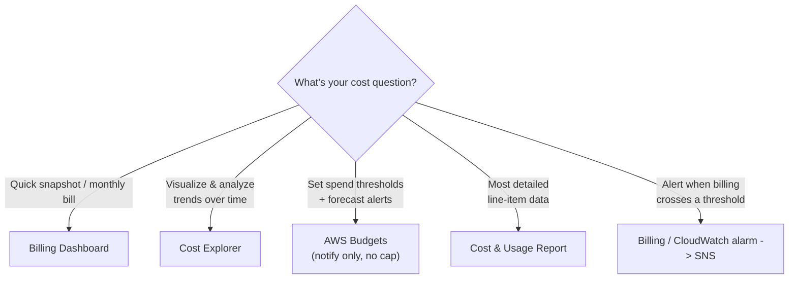
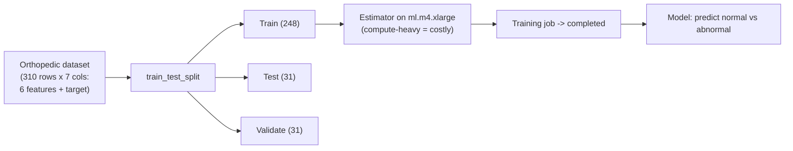
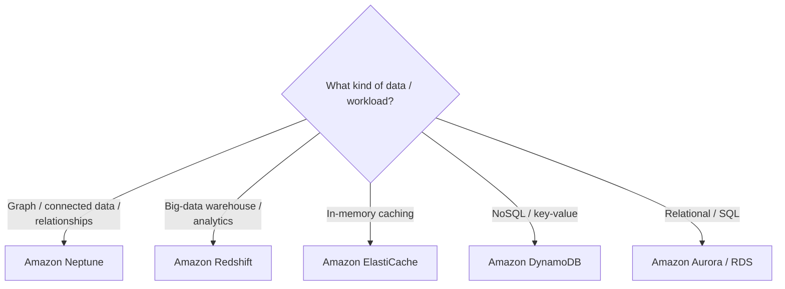

# Lecture Notes — June 24, 2026
**Cohort 3 | Project CloudIgnite**
**Topics:** Resource Tagging, CloudTrail + Athena Hacker Investigation Lab, Cost Management Intro, SageMaker ML Lab, Exam-Scenario Knowledge Checks
**Duration:** ~3 hours

---

## Key Takeaways
- **Tags are key/value labels** (up to 50 per resource, case-sensitive) that enable cost allocation, access control, automation, and organization
- **AWS Config** enforces required tags via compliance rules; **IAM policies** can require tags at resource creation time
- **CloudTrail** records API activity (who did what, when) — the audit trail for security investigations; logs are stored in **S3** and analyzed with **Athena**
- **Athena** is a serverless SQL query service over S3 data — far easier than grepping raw JSON logs manually
- **Pre-signed URLs** grant temporary, authenticated access to a single S3 object without making the whole bucket public
- **Cost Explorer** visualizes trends; **AWS Budgets** sets thresholds with forecast alerts (notify-only, doesn't stop resources); **Pricing Calculator** estimates costs before deploying
- **Amazon SageMaker** is the managed service to build, train, and deploy ML models; training uses compute-heavy instance types (e.g., ml.m4.xlarge)
- **Database keyword shortcuts:** graph/connected → Neptune, big-data warehouse → Redshift, caching → ElastiCache, NoSQL → DynamoDB, relational → Aurora/RDS

---

## Table of Contents

1. [Resource Tagging](#1-resource-tagging)
2. [Lab 187 — "Catch the Hacker" (CloudTrail + Athena)](#2-lab-187--catch-the-hacker-cloudtrail--athena)
3. [Cost Management (Intro)](#3-cost-management-intro)
4. [Lab 316 — Machine Learning with Amazon SageMaker](#4-lab-316--machine-learning-with-amazon-sagemaker)
5. [Exam-Scenario Knowledge Check Recap](#5-exam-scenario-knowledge-check-recap)
6. [CLF-C02 Exam Relevance Summary](#6-clf-c02-exam-relevance-summary)
7. [Glossary](#7-glossary)
8. [Action Items & Housekeeping](#8-action-items--housekeeping)

---

## 1. Resource Tagging

**Tags** are descriptive key/value labels attached to AWS resources to help you **categorize, manage, automate, and track cost**.

### Why tags matter (the class example)

If you have 50 EC2 instances (e.g. 10 testing, 20 development, 30 production) and want to terminate just the testing ones, tags let you group and act on them. You can start/stop/terminate all instances with `Environment = staging`, install software on tagged instances via **Systems Manager Run Command**, etc.

### Key characteristics

| Property | Detail |
|---|---|
| **Name is a tag** | The instance "Name" is itself just a tag |
| **Max tags** | Up to **50 tags** per resource |
| **Case sensitivity** | Tag keys **and** values are **case-sensitive** (`Env` ≠ `env`) |
| **Not unique** | Multiple resources can share the same tag value (that's how you group them) |
| **Applied after creation** | Tagging is a separate action after the resource exists |
| **Propagation** | Some services (e.g. CloudFormation) auto-add default tags |
| **Applies broadly** | EC2, EBS, and most resource types can be tagged |

### Managing & enforcing tags

- **AWS Config** — create a **`required-tags`** rule to periodically verify all resources carry required tags and flag non-compliant ones (you can even script auto-deletion of untagged resources).
- **IAM policies** — enforce tagging at creation time (e.g. a policy condition requiring `Department`/`CostCenter` tags on `CreateVolume`).
- **AWS CLI** — `create-tags` to add tags; filter/query instances by tag (`--filters`) to find and act on matching resources.

### Tagging best practices

- Group tags by **technical, business, and security** dimensions.
- Prefer **more tags** over too few.
- Use a **standardized, case-consistent** naming format (don't mix `UpperCamel` and `lowerCamel`).
- Use **automation** (scripts / bash / Python) to manage resources by tag.

#### 📊 Visual: Tagging — group & govern
*Tags are key/value labels that let you group resources and act on the whole group (start/stop, patch, allocate cost), while AWS Config and IAM enforce that required tags are present.*

### 🎯 CLF-C02 Relevant
> - **Tags** enable **cost allocation/tracking**, access control, automation, and organization — a core billing/governance concept.
> - **AWS Config** verifies tag compliance; **IAM** can enforce tag usage.
> - Remember tags are **case-sensitive** and capped at **50 per resource**.

---

## 2. Lab 187 — "Catch the Hacker" (CloudTrail + Athena)

**Scenario:** The café website was defaced (a "monkey" image appeared) and an **extra inbound SSH rule** was added to the web security group by an unknown actor. Use **CloudTrail** logs + **Amazon Athena** to identify and remove the culprit, then fix everything. *This was one of the biggest labs of the course (~150 steps, ~2 hours across two sessions).*

### Task 1 — Secure your own access

1. **EC2 → web server → Security group** → add an inbound **SSH (22)** rule with **Source = My IP** (never `0.0.0.0/0`). You should end up with two rules: **80 (HTTP)** and **22 (SSH, My IP)**.
2. Confirm the website loads at `<public-IP>/cafe`.

### Task 2 — Enable auditing with CloudTrail

3. **CloudTrail → Create trail** named `monitor`, letting it create a new **S3 bucket** for logs (KMS encryption is optional — skip to keep it simple).
4. Wait a few minutes, then refresh the security group's inbound rules — a **third (unrecognized) rule** appears and the site shows the **hacked monkey image** = confirmation of the attack.

> [!TIP]
> If you only see the monkey in **incognito**, that's just **browser caching** of the old static files — not an AWS problem. Also: "security groups" (the list) vs. the **inbound rules** *inside* the web security group — check the rules, not the group count.

### Task 3 — Download & inspect the logs (the hard way)

5. **Delete any old `.pem` key**, download the new key, and **connect via SSH** (EC2 Instance Connect is not permitted here; Windows → PowerShell + `icacls`, Mac/Linux → Terminal, key perms **`400`**).
6. `mkdir CtrailLogs` → `cd` in → `aws s3 ls` (two buckets: café images + the log bucket) → `aws s3 cp s3://<log-bucket>/ . --recursive` (the trailing **`.`** = current folder).
7. Navigate into the dated folder (`cd` + repeated **Tab** autocomplete) → **`gunzip`** the `.gz` file → `ls` to confirm it now ends in `.json`.
8. Pretty-print with `cat <full-path> | python -m json.tool`, then try `grep` on the server IP / security-group ID. **Conclusion:** raw JSON + grep is painful and not human-readable → motivation for Athena.

> [!WARNING]
> Common failures: wrong bucket name (`monitor` vs `monitoring` → *NoSuchBucket*); forgetting to `gunzip` before `cat`; not `cd`-ing into the exact dated folder before searching; using the *relative* path instead of the **full path** to the log file.

### Task 4/5 — Analyze with Athena, then remediate

9. In **CloudTrail → Event history**, use **Create Athena table** (schema auto-derived from the JSON; point it at the log S3 bucket).
10. In **Athena → Query settings**, set a **query result location** (e.g. `s3://<bucket>/result`).
11. Query the table with SQL, e.g.:
    - `SELECT * FROM <table> LIMIT 100;`
    - Select `useridentity`, `eventname`, `eventsource`, etc., then filter: `WHERE eventname LIKE '%Security%'` or `WHERE eventname = 'AuthorizeSecurityGroupIngress'`.
12. The offending event **`AuthorizeSecurityGroupIngress`** (adds inbound TCP 22 from `0.0.0.0/0`) traces to user **`chaos`** → the hacker identified.

#### 📊 Visual: Lab 187 — tracing the hacker
*Grepping raw CloudTrail JSON is painful, so an Athena table over the S3 logs lets a single SQL query pin the AuthorizeSecurityGroupIngress event on user 'chaos'.*

> [!NOTE]
> **Why Athena instead of grep?** Athena is a **serverless** SQL query service over S3 — no infrastructure to manage, results are formatted/readable, and it works even if the attacker never used the EC2 instance itself (all API activity is in CloudTrail).

**Remediation steps:**
- Check logged-in OS users (`chaos` still logged in) → `sudo userdel` and `sudo kill -9 <pid>` to force it off.
- Edit `sshd_config`: **disable password authentication** (uncomment `PasswordAuthentication no`, comment the `yes` line), then **restart the SSH service** (the hacker logged in via password, not a key).
- **Delete the malicious inbound SSH rule** from the security group.
- **Restore the defaced image** from the backup copy.
- **Delete the IAM user `chaos`** (deactivate/delete its access key first, then delete the user).
- **Submit the lab *before* ending it.**

#### 📊 Visual: Lab 187 — incident-response arc
*Detect, investigate, revoke the attacker's access (evict the OS session, disable password auth, delete the rogue rule and IAM user), then restore the defaced site.*

### 🎯 CLF-C02 Relevant
> - **CloudTrail** = the audit trail of API activity (who changed the security group).
> - **Athena** = serverless SQL analysis of logs in **S3** — know this pairing.
> - **Security group** hygiene: restrict SSH to a specific IP; disabling password auth.
> - **IAM** user/access-key lifecycle (revoke compromised credentials).
> - Incident-response flow: detect → investigate → revoke → restore.

---

## 3. Cost Management (Intro)

Started the cost topic (to be continued next session). Key tools:

| Tool | Purpose |
|---|---|
| **AWS Billing Dashboard** | Overall cost & usage snapshot; per-service breakdown; monthly bill |
| **AWS Cost Explorer** | **Visualize/analyze** cost & usage over time (graphs by service, region, tag, department); spot patterns & anomalies |
| **AWS Budgets** | Set spend/usage budgets with **threshold alerts** (e.g. email at 80%) *and* **forecasted** alerts; does **not** stop resources |
| **AWS Cost & Usage Report (CUR)** | Most detailed line-item cost/usage report per service |
| **Billing/CloudWatch billing alarm** | Trigger email/SMS via SNS when billing crosses a threshold |

#### 📊 Visual: Which cost management tool?
*Pick the cost tool by the question — a snapshot (Billing Dashboard), trend analysis (Cost Explorer), threshold + forecast alerts (Budgets, notify-only), granular line items (CUR), or a billing alarm to SNS.*

> [!TIP]
> **AWS Budgets** was the instructor's favorite: you can set **multiple thresholds** (50%/70%/80%), get **forecasted** overspend warnings (e.g. "$5 budget but forecast is $15"), but it only **notifies** — it does not cap or stop usage.

Cost-reduction ideas mentioned: pay only for what you use, shut down non-prod/test environments after hours, use tags to attribute cost by service/region/department to find optimization targets.

### 🎯 CLF-C02 Relevant
> - **Cost Explorer** (analyze/visualize), **AWS Budgets** (alerts + forecasts, doesn't stop usage), **Cost & Usage Report** (detailed line items), **Billing Dashboard**, and **billing alarms** are all high-value **Billing & Pricing** pillar topics.
> - Tags feed **cost allocation** reporting.

---

## 4. Lab 316 — Machine Learning with Amazon SageMaker

**Goal (quick lab to unlock the Exam Prep section):** Train an ML model on an orthopedic biomechanical dataset to predict whether a patient is **normal or abnormal**.

1. Open **Amazon SageMaker AI** (not plain "SageMaker") → **Notebooks** → **Open JupyterLab** → open the provided notebook.
2. Add the extra install line at the top, then **run cells one by one**:
   - Install required libraries (e.g. missing `boto3`/`scipy` bits).
   - Load & unzip the dataset (310 rows × 7 columns — 6 biomechanical features + target).
   - Build a DataFrame; move the target column; **split into 3 datasets** (train **248** / test **31** / validate **31**) using `train_test_split`.
   - Configure the estimator — note the training instance type **`ml.m4.xlarge`** (a large, more expensive instance because ML training is compute-heavy).
   - Launch the **training job** and wait for "training job completed."
3. Submit the lab once training completes (no access to test the deployed model in this environment — it's a workflow demo).

#### 📊 Visual: Lab 316 — SageMaker ML workflow
*Load the dataset, split it into train/test/validate, configure an estimator on a compute-heavy ml.m4.xlarge instance, and run the training job to produce a normal-vs-abnormal classifier.*

### 🎯 CLF-C02 Relevant
> - **Amazon SageMaker** = AWS's managed service to **build, train, and deploy ML models** — know it as *the* ML service.
> - ML training uses **larger/compute-heavy EC2 instance types** (cost awareness).
> - Distinguishing SageMaker (build-your-own ML) from higher-level AI services is enough for the exam.

---

## 5. Exam-Scenario Knowledge Check Recap

> [!NOTE]
> The instructor ran the **"Scenario test / strategy practice"** KC (9 questions, exam-style). Paraphrased Q&A:

1. **EC2 first launch step (single region, new to AWS)?** → Determine the **AMI** (Amazon Machine Image) to use.
2. **Bank needs to graph connected customer/financial data?** → **Amazon Neptune** (graph database). *Keyword → service:* "graph / connected data / social relationships" → **Neptune**; ElastiCache = caching (not a DB), DynamoDB = NoSQL, Aurora = relational.
3. **After creating a NAT gateway, what must be set so operators can connect securely?** → Update the **route table**, associate an **Elastic IP**, and create it in a **public subnet** (a second NAT gateway is only for redundancy/fault tolerance, not required).
4. **SysOps verifying the CloudWatch agent is running — CLI output?** → (agent status output confirming it's running).
5. **Maximum size of an SCP document?** → **5120** characters (remove whitespace outside quotes to shrink it).
6. **Data must be archived and kept 10+ years for audit?** → **Amazon Redshift** for the big-data warehouse portion (and Glacier-type archival for long-term storage) — not S3/EBS/ElasticSearch.
7. **Data sovereignty (Germany) with auditors in two regions?** → provide auditor access aligned to each region's data-residency rules.
8. **CloudFormation WaitCondition + CreationPolicy** → used to track configuration process status and EC2 instance configuration (CloudFormation is an upcoming topic).

#### 📊 Visual: "Which database?" keyword map
*The database keyword shortcuts the instructor drilled — graph to Neptune, warehouse to Redshift, caching to ElastiCache, NoSQL to DynamoDB, relational to Aurora/RDS.*

> [!TIP]
> Keyword → service shortcuts to memorize: **graph/connected → Neptune**, **big-data warehouse → Redshift**, **caching → ElastiCache**, **NoSQL → DynamoDB**, **relational → Aurora/RDS**.

---

## CLF-C02 Exam Relevance Summary

| Topic | Why it matters for CLF-C02 | Relevance |
|---|---|---|
| **Tagging** (cost allocation, organization) | Core billing/governance concept; 50-tag limit, case-sensitive | 🔴 High |
| **AWS Config** (tag/compliance rules) | Governance & compliance auditing | 🟠 Medium |
| **CloudTrail + Athena** | Audit of API activity; serverless SQL over S3 logs | 🔴 High |
| **Cost Explorer / Budgets / CUR / billing alarms** | Billing & Pricing pillar essentials | 🔴 High |
| **AWS Budgets specifics** (alerts + forecast, doesn't stop usage) | Frequently tested nuance | 🔴 High |
| **Amazon SageMaker** | The managed ML service | 🟠 Medium |
| **Neptune / Redshift / DynamoDB / Aurora / ElastiCache** | "Which database?" keyword matching | 🔴 High |
| **NAT gateway** (route table, Elastic IP, public subnet) | Networking fundamentals | 🟠 Medium |
| **SCP max size (5120)** & Organizations | Governance detail | 🟠 Medium |
| **Security groups / IAM credential revocation** | Security fundamentals | 🔴 High |
| Lab CLI mechanics (`gunzip`, `aws s3 cp --recursive`, `python -m json.tool`, `userdel`, `sshd_config`) | Hands-on practice, deeper than exam needs | 🟢 Lower |

---

## Glossary

- **Tag** — a key/value label attached to a resource for organization, automation, and cost tracking.
- **AWS Config** — evaluates resources against rules (e.g. required tags) and reports compliance.
- **CloudTrail** — records account/API activity (who did what, when).
- **Amazon Athena** — serverless service to query data in S3 with SQL.
- **AuthorizeSecurityGroupIngress** — the API call that adds an inbound security-group rule (the "hack" event).
- **`sshd_config` / PasswordAuthentication** — SSH server config; disabling password auth forces key-based login.
- **AWS Cost Explorer** — visualize and analyze cost/usage over time.
- **AWS Budgets** — set spend/usage thresholds with alerts and forecasts (notify-only).
- **Cost & Usage Report (CUR)** — the most detailed AWS cost/usage data.
- **Amazon SageMaker** — managed service to build, train, and deploy ML models.
- **`ml.m4.xlarge`** — a SageMaker training instance type (compute-heavy = higher cost).
- **Amazon Neptune** — managed **graph** database (connected data, relationships).
- **Amazon Redshift** — managed data-warehouse for big-data analytics.
- **NAT gateway** — lets private-subnet resources reach the internet outbound; needs an Elastic IP and a public subnet.
- **SCP (Service Control Policy)** — org/OU-level policy restricting services/actions (max 5120 chars).

---

## Action Items & Housekeeping

- [ ] **Submit Lab 187** (catch-the-hacker) *before* ending it — don't end early.
- [ ] **Submit Lab 316** (SageMaker) once the training job completes → this **unlocks the Exam Prep section**.
- [ ] Explore the **Exam Prep KC** cases — the big one has **49 questions** (a full exam scenario) and is best saved for last; the 9-question scenario KCs are exam-representative.
- [ ] KCs are **unlimited attempts**; most **labs allow ~20 attempts**.

> [!TIP]
> **Progress notes:** The exam has **65 questions**; the practice bank is ~200 questions across the KCs — mastering them should be enough to pass. Remaining: ~**2 more topic sections** (incl. **cost management** — resuming at slide 12 next session — and **CloudFormation**), plus the exam-prep KCs. **Cloud computing** scenario KC deferred to next session. Graduation still targeted around Thursday for those keeping pace.
