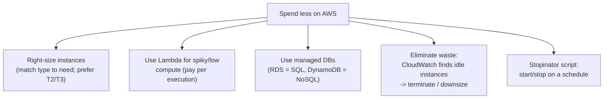
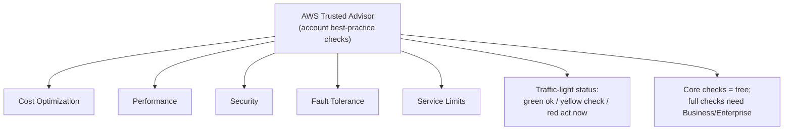
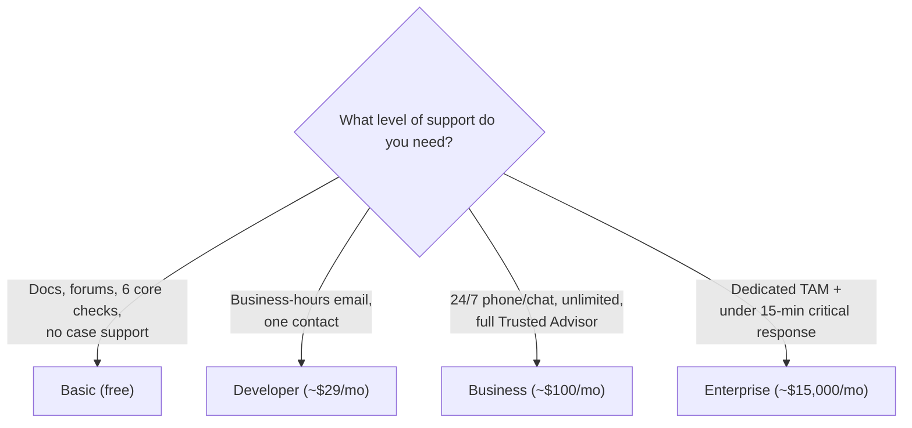
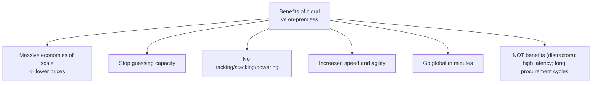
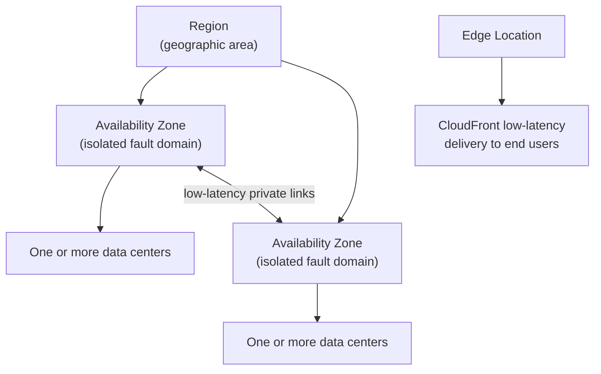
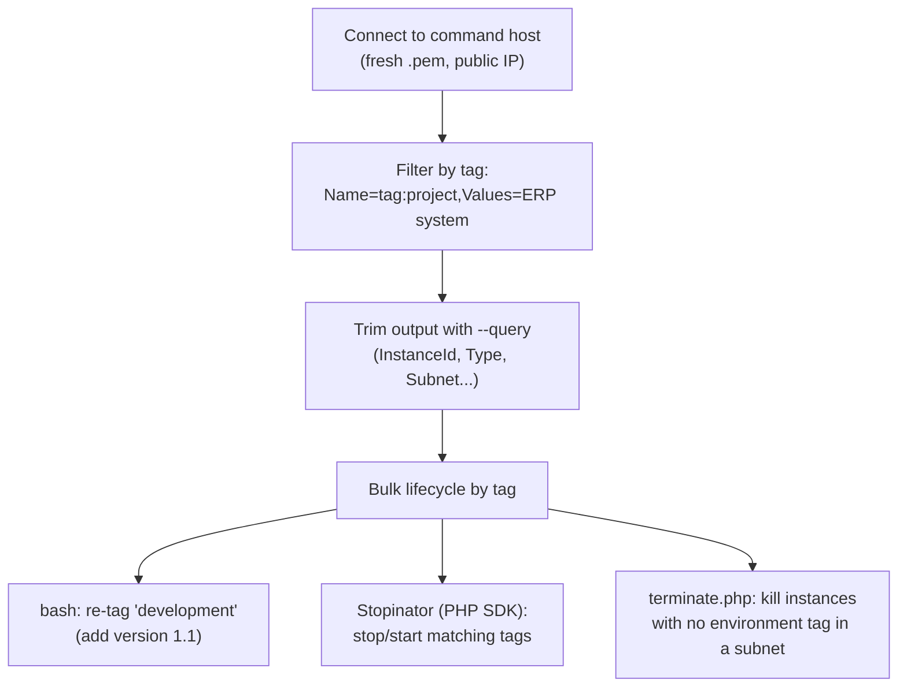
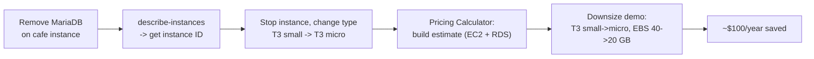

# Lecture Notes — June 25, 2026
**Cohort 3 | Project CloudIgnite**
**Topics:** Cost Optimization, AWS Trusted Advisor, AWS Support Plans, Whitepapers & Documentation, Knowledge Checks (Cost Management, Cloud Computing, Global Infrastructure), Lab 188 Tagging Resources, Lab 189 Cost Optimization & Pricing Calculator
**Duration:** ~3 hours

---

## Key Takeaways
- **AWS Budgets** sets spend/usage thresholds with alerts (including forecasted alerts when predicted to exceed); it only notifies, does NOT stop resources
- **Cost-optimization techniques:** right-size instances (match type to need, prefer T2/T3), use Lambda for spiky/low-volume workloads, use managed databases (RDS/DynamoDB), eliminate idle resources via CloudWatch metrics, Stopinator script for scheduled start/stop
- **Trusted Advisor** checks five pillars (Cost Optimization, Performance, Security, Fault Tolerance, Service Limits); core checks are free, full checks require Business or Enterprise support
- **Support plan key facts:** Basic = no technical cases; Developer = business-hours email, one contact; Business = 24/7 phone/chat, unlimited contacts, full Trusted Advisor; Enterprise = dedicated TAM, <15-min critical response
- **Cloud benefits over on-premises:** economies of scale → lower prices, stop guessing capacity, no racking/stacking/powering, increased speed & agility, go global in minutes (NOT: high latency or long procurement cycles)
- **Global infrastructure:** CloudFront uses Edge Locations for low latency; Region = geographic area with 2+ AZs; AZ = isolated fault domain with 1+ data centers; AZs linked by low-latency private connections
- **Tags** are case-sensitive key/value labels (up to 50 per resource) for cost allocation, automation, and organization; enforced via AWS Config (compliance) and IAM (creation-time requirement)

---

## Table of Contents

1. [Cost Optimization Strategies](#1-cost-optimization-strategies)
2. [AWS Trusted Advisor](#2-aws-trusted-advisor)
3. [AWS Support Plans](#3-aws-support-plans)
4. [AWS Whitepapers & Documentation](#4-aws-whitepapers--documentation)
5. [Knowledge Check — Cost Management](#5-knowledge-check--cost-management)
6. [Knowledge Check — Cloud Computing (Exam Prep)](#6-knowledge-check--cloud-computing-exam-prep)
7. [Knowledge Check — Global Infrastructure (Exam Prep)](#7-knowledge-check--global-infrastructure-exam-prep)
8. [Lab 188 — Tagging AWS Resources (CLI)](#8-lab-188--tagging-aws-resources-cli)
9. [Lab 189 — Cost Optimization & Pricing Calculator](#9-lab-189--cost-optimization--pricing-calculator)
10. [CLF-C02 Exam Relevance — Consolidated Map](#-clf-c02-exam-relevance--consolidated-map)
11. [Glossary](#-glossary)
12. [Checkpoint Q&A Recap](#-checkpoint-qa-recap)
13. [Action Items & Housekeeping](#-action-items--housekeeping)

---

## 1. Cost Optimization Strategies

This continued the Cost Management topic from June 24 (picking up around slide 12). The day was mostly about *how to spend less on AWS*.

### Quick recap: AWS Budgets
- Lets you **set a budget** (e.g. $10/month) and **get notified** when a threshold of that budget is reached (e.g. 50%, 70%, 80%).
- **Does NOT shut resources down** — it only *notifies* you.
- Supports **forecasted-cost alerts**: if AWS predicts your month-end cost will exceed the budget, you get alerted early even if actual spend is still low.

### Core cost-optimization techniques

| Technique | What it means |
|---|---|
| **Right-size instances** | Match instance type to actual need. Don't run a 16 GB / GPU box for a 2 GB workload. Prefer **T2 / T3** general-purpose types when you don't need GPU/compute-heavy hardware. |
| **Use Lambda for unpredictable/low compute** | For spiky or low-volume workloads (e.g. 5 requests/day, 1 min each), Lambda charges only for the compute you use (~5 min). EC2 bills for the full 24 h regardless. |
| **Use managed databases** | **RDS** for SQL/relational; **DynamoDB** for NoSQL. Managed = less operational cost/overhead. |
| **Find & eliminate waste** | Use **CloudWatch metrics** to spot long-running **idle instances** doing nothing → terminate or downsize them. |
| **Stopinator script** | A script to **start/stop EC2 on a schedule** (e.g. start 10 AM, stop 11 PM) so you don't pay for hours nobody uses. |

#### 📊 Visual: Cost-optimization techniques
*The main levers for spending less on AWS — right-size, go serverless for spiky loads, use managed databases, hunt idle resources, and schedule start/stop.*



> [!NOTE]
> **Free tier reminder from the instructor:** a `t3.micro` with EBS + other services runs roughly **$10–$13/month** once outside the free tier. Idle-but-running resources still cost money after free tier ends.

> [!TIP]
> **EC2 vs Lambda cost logic** — EC2 = pay for uptime (24/7). Lambda = pay per execution time. Bursty/low-traffic workloads are almost always cheaper on Lambda.

### 🎯 CLF-C02 Relevant
- **Cost-optimization pillar** of the Well-Architected Framework: right-sizing, serverless (Lambda) for variable demand, managed services, eliminating idle resources.
- Knowing **which billing/cost tool does what** (Budgets = alerts only, Cost Explorer = visualize, CloudWatch = metrics/idle detection) is a common exam theme.

---

## 2. AWS Trusted Advisor

**Trusted Advisor** inspects your account and gives recommendations across **five pillars**:

1. **Cost Optimization** (e.g. idle load balancers, unused Elastic IPs, underused instances)
2. **Performance**
3. **Security**
4. **Fault Tolerance**
5. **Service Limits**

- **Free tier** includes a limited set of **core checks** (the instructor referenced ~6 core checks); **full/advanced checks** require a **Business or Enterprise Support plan**.
- Uses the familiar **traffic-light status**: 🟢 **Green** = no action needed · 🟡 **Yellow** = worth checking / possible optimization · 🔴 **Red** = critical, take immediate action.

#### 📊 Visual: Trusted Advisor at a glance
*Trusted Advisor checks your account across five pillars and reports a traffic-light status; only core checks are free, full checks need Business/Enterprise support.*



### 🎯 CLF-C02 Relevant
- **High.** Trusted Advisor and its **five check categories** are frequently tested. Remember: *full checks need Business/Enterprise support*.

---

## 3. AWS Support Plans

AWS support is tiered. Higher tiers add faster response SLAs, more contacts, and a Technical Account Manager (TAM).

| Plan | Rough cost | Access | Cases / Contacts | Notable |
|---|---|---|---|---|
| **Basic** | Free | Docs, whitepapers, forums, Personal Health Dashboard, 6 core Trusted Advisor checks | **No technical case support** | Everyone gets this |
| **Developer** | From ~$29/mo | **Business-hours** email | One primary contact, unlimited cases | Entry-level technical support |
| **Business** | From ~$100/mo | **24/7** email, chat & phone | Unlimited contacts & cases | Full Trusted Advisor; production workloads |
| **Enterprise** | From ~$15,000/mo | 24/7 + **dedicated TAM** | Unlimited contacts & cases | Concierge; fastest SLAs |

### Response-time tiers (by severity)

| Severity | Developer | Business | Enterprise |
|---|---|---|---|
| General guidance | 24 h | 24 h | 24 h |
| System impaired | 12 h | 12 h | 12 h |
| Production impaired | — | 4 h | 4 h |
| Production system down | — | 1 h | 1 h |
| Business/mission-critical down | — | — | **< 15 min** |

> [!WARNING]
> **Basic Support has NO technical case support** — only documentation, whitepapers, forums, the Personal Health Dashboard, and the 6 core Trusted Advisor checks.

#### 📊 Visual: Which support plan?
*Pick the tier by what you need — free docs/forums (Basic), business-hours email (Developer), 24/7 support + full Trusted Advisor (Business), or a dedicated TAM and fastest SLA (Enterprise).*



### 🎯 CLF-C02 Relevant
- **Very high.** Support-plan comparison is a classic exam topic. Key facts to memorize:
  - **TAM** (Technical Account Manager) = **Enterprise only**.
  - **< 15-min** critical response = **Enterprise only**.
  - **24/7 phone/chat** starts at **Business**.
  - **Full Trusted Advisor** requires **Business or Enterprise**.

---

## 4. AWS Whitepapers & Documentation

- **Whitepapers** are collections of **technical documents** covering topics like architecting best practices, security best practices, cloud economics, and serverless architecture.
- Available to **everyone (including Basic)** — a free knowledge/documentation resource.

### 🎯 CLF-C02 Relevant
- Knowing that whitepapers/documentation are **free self-service resources** (not gated behind paid support) is useful for support/resource questions.

---

## 5. Knowledge Check — Cost Management

Key Q&A from the cost-management KC:

| Question | Answer |
|---|---|
| Which service provides **consolidated billing** and account management for multiple accounts? | **AWS Organizations** |
| Which service **defines and enforces required tags**? | **AWS Config** |
| Which cost tool lets you **set a spend limit and alerts** when exceeded? | **AWS Budgets** |
| Which action **reduces cost** for AWS services? | **Stopinator script** (schedule start/stop) |
| Which service **allows or denies access** for individual accounts / groups of accounts / OUs in an Organization? | **SCP (Service Control Policy)** |

> [!NOTE]
> Watch for the classic mix-up: **AWS Config** enforces *tags/compliance*, while **SCP** controls *permissions/access* across accounts and OUs.

### 🎯 CLF-C02 Relevant
- **High.** Consolidated billing (Organizations), Config (tag enforcement), Budgets (spend alerts), and SCPs (access guardrails) are all core exam services.

---

## 6. Knowledge Check — Cloud Computing (Exam Prep)

The instructor noted these exam-prep questions closely mirror the real exam. Highlights:

- **Pricing model** = customers **pay for resources on an as-needed basis** (pay-as-you-go).
- **Benefits of cloud over on-premises:** massive economies of scale, stop guessing capacity, no racking/stacking/powering servers, **increased speed & agility**, go global in minutes.
- **NOT benefits (trick answers):** **high latency**, and **multiple/long procurement cycles**.
- **Economies of scale** = *hundreds of thousands of customers aggregated in the cloud* → AWS buys in bulk → passes savings on as **lower prices**.
- **True/False:** "You own the network-connected hardware" → **False** (AWS owns/manages the hardware).
- Cloud provides speed/agility, fault tolerance, disposable & temporary resources, and high availability.

#### 📊 Visual: Cloud benefits vs distractors
*The real benefits of cloud over on-premises — and the two classic trick answers (high latency, long procurement cycles) that are NOT benefits.*



### 🎯 CLF-C02 Relevant
- **Very high** — this maps almost 1:1 to the exam's *Cloud Concepts* domain (benefits of cloud, economies of scale, pay-as-you-go, agility).

---

## 7. Knowledge Check — Global Infrastructure (Exam Prep)

| Concept | Key point |
|---|---|
| **CloudFront** low-latency delivery | Uses **Edge Locations** |
| **Reduce latency to end users** | Run workloads in a **Region** near them |
| **Availability Zone** | Designed to be **isolated from failures** in other AZs; made up of **one or more data centers** |
| **Region** | A **geographic area** hosting **two or more AZs**; each Region is in a **separate geographic area** |
| **Redundancy vs elasticity** | Built-in component redundancy = **fault tolerance**; resources auto-adjusting capacity = **elastic / scalable** |
| AZ connectivity | AZs within a Region are connected via **low-latency (high-speed private) links** |
| Data center ↔ AZ | A single data center is **not** shared across multiple AZs |
| Best practice | AWS recommends provisioning compute **across multiple AZs** |

#### 📊 Visual: Global infrastructure hierarchy
*How the pieces nest — a Region holds 2+ isolated AZs (each one or more data centers) linked by low-latency private links, while Edge Locations serve CloudFront closer to users.*



> [!TIP]
> Exam mnemonic: **Edge Location → CloudFront/latency**, **Region → geography (2+ AZs)**, **AZ → isolated fault domain (1+ data centers)**.

### 🎯 CLF-C02 Relevant
- **Very high** — Regions, AZs, and Edge Locations are guaranteed exam material in the *Technology / Global Infrastructure* domain.

---

## 8. Lab 188 — Tagging AWS Resources (CLI)

**Goal:** Use tags + the AWS CLI to filter, query, and bulk-manage (retag / stop / start / terminate) EC2 instances. (~45 min; steps 21–56, earlier steps pre-done.)

### Connecting
- **Windows → PowerShell**, **Mac/Linux → Terminal** (same as prior labs).
- **Delete your previous `.pem` file first**, then download the fresh one — otherwise the connection fails (`Permission denied` = wrong/old key).
- Connect to the **command host** using its **public IP** (many instances have only private IPs; pick the one with a public IP).

### Filtering & querying with the CLI
- **Filter by tag:**
  ```bash
  aws ec2 describe-instances --filters "Name=tag:project,Values=ERP system"
  ```
- **Query specific fields** (trim noisy output) with `--query`, e.g. return only Instance ID, Instance Type, Subnet ID, Image ID, AZ:
  ```bash
  aws ec2 describe-instances --query "Reservations[].Instances[].[InstanceId,InstanceType,SubnetId]"
  ```
- Tag filters **must use the `Name=tag:<key>,Values=<value>` format** — `Name=project` alone won't work.

### Bulk tag / lifecycle scripts
- A **bash script** re-tagged resources (added a `version` tag, e.g. bumped to `1.1`) **only for instances tagged `development`**.
- **Stopinator script** (written in **PHP**, uses the **AWS SDK for PHP**): stops/starts EC2 instances **matching a set of tags**.
  - Example: stop instances where `project = ERP system` **AND** `environment = development`. It scans all regions, then acts only on matching instances.
  - Add `-s` to **start** instead of stop. Instances without the target tags (e.g. the command host) are left untouched.
- **Terminate script** (`terminate...php`): **terminates all EC2 instances that do NOT have an `environment` tag** within a **specific subnet** (you supply the **private subnet ID**).

#### 📊 Visual: Lab 188 — tag-driven CLI management
*Connect, filter instances by tag, trim output with --query, then bulk-manage by tag — re-tag, Stopinator start/stop, or terminate untagged instances.*



> [!WARNING]
> The lifecycle scripts act on instances **based purely on their tags** — an untagged or mis-tagged production box could be wrongly stopped/terminated. Tag discipline directly affects safety here.

> [!NOTE]
> Gotcha from the session: a missing **semicolon** in the PHP command caused "no EC2 instance found" until it was corrected. Instructor noted Python would be far easier than the PHP syntax used.

### 🎯 CLF-C02 Relevant
- **Medium.** The *concept* of tags for cost tracking, automation, and bulk resource management is exam-relevant. The exact CLI/PHP mechanics are hands-on skill, not exam content.

---

## 9. Lab 189 — Cost Optimization & Pricing Calculator

**Goal:** Downsize/right-size resources via CLI and estimate/compare costs with the **AWS Pricing Calculator**. (Nominally 50 min, mostly exploration.)

### Setup — two instances at once
- Connect to **both** the **CLI host** and the **cafe instance** using **two separate PowerShell windows** (reuse the **same PEM key** — just change the IP in the connect command).
- Confirm you're on the right host: the prompt shows `ec2-user@CLI-host` vs the cafe/web server. If it shows your Windows path (`user\Downloads`), you're **not connected**.

### Steps
1. **From cafe instance:** stop and **remove MariaDB** (`stop` then remove the server).
2. **From CLI host:** `describe-instances` to get the instance ID.
3. **Stop the instance by ID**, then **change its instance type** to downsize (e.g. **T3 small → T3 micro**) — smaller type = lower cost.
4. **Explore Cost Explorer** and the **Pricing Calculator**.

### AWS Pricing Calculator
- No login required → **Create estimate** → pick **Region** → add services.
- Configured **EC2** (shared, Linux, chosen instance type, EBS storage) and **RDS** (MariaDB, 20 GB, `db.t3.micro`), then **viewed the summary** (yearly cost).
- **Optimization demo:** dropping the EC2 type (**T3 small → T3 micro**) and EBS (**40 GB → 20 GB**) cut the yearly estimate by **~$100**.

> [!NOTE]
> **RDS storage minimum is 20 GB** — you can't go lower. Also, the live AWS UI is newer than the lab instructions, so some steps look outdated.

#### 📊 Visual: Lab 189 — right-size & estimate
*Remove the unused DB, downsize the instance type, then use the Pricing Calculator to compare estimates — dropping the type and EBS size cut ~$100/year.*



### 🎯 CLF-C02 Relevant
- **High.** The **AWS Pricing Calculator** (estimate costs *before* deploying) and **right-sizing to reduce cost** are directly testable cost-management concepts. RDS vs self-managed DB and EBS sizing also appear.

---

## CLF-C02 Exam Relevance — Consolidated Map

| Topic | Exam Domain | Relevance |
|---|---|---|
| Cost optimization (right-sizing, Lambda for variable load, managed DBs, idle cleanup) | Billing, Pricing & Support | 🔴 High |
| AWS Budgets (alerts + forecasted alerts, notify-only) | Billing, Pricing & Support | 🔴 High |
| AWS Pricing Calculator | Billing, Pricing & Support | 🔴 High |
| Trusted Advisor (5 pillars; full checks need Business/Enterprise) | Billing/Support + Security | 🔴 High |
| AWS Support Plans (Basic → Enterprise, TAM, response SLAs) | Billing, Pricing & Support | 🔴 High |
| AWS Organizations — consolidated billing | Billing + Security | 🔴 High |
| SCPs (access guardrails across accounts/OUs) | Security & Compliance | 🔴 High |
| AWS Config (enforce required tags) | Security & Compliance | 🔴 High |
| Cloud benefits & economies of scale, pay-as-you-go | Cloud Concepts | 🔴 High |
| Global Infrastructure (Regions, AZs, Edge Locations) | Technology & Services | 🔴 High |
| RDS vs DynamoDB (SQL vs NoSQL) | Technology & Services | 🟠 Medium |
| Whitepapers & documentation (free resources) | Billing, Pricing & Support | 🟠 Medium |
| Tagging for cost/automation/management | Technology + Billing | 🟠 Medium |
| CLI mechanics, PHP Stopinator/terminate scripts, PEM handling | (hands-on skill) | ⚪ Low |

---

## Glossary

- **AWS Budgets** — Set cost/usage budgets and receive alerts (including forecasted alerts). Notifies only; does not stop resources.
- **Cost Explorer** — Visualize and analyze cost/usage over time.
- **AWS Pricing Calculator** — Estimate the cost of a proposed architecture *before* deploying.
- **Trusted Advisor** — Automated best-practice checks across cost, performance, security, fault tolerance, and service limits.
- **Technical Account Manager (TAM)** — Dedicated AWS contact; **Enterprise Support** only.
- **AWS Organizations** — Central management of multiple accounts with **consolidated billing**.
- **Service Control Policy (SCP)** — Organization-level guardrail that allows/denies actions across accounts and OUs.
- **AWS Config** — Tracks resource configuration/compliance; can enforce **required tags**.
- **Right-sizing** — Matching instance type/size to actual workload demand to avoid waste.
- **Stopinator** — Script that starts/stops EC2 instances (by schedule or tag) to cut idle costs.
- **Edge Location** — CloudFront cache point close to users for low-latency delivery.
- **Availability Zone (AZ)** — One or more isolated data centers within a Region.
- **Region** — A geographic area containing two or more AZs.
- **Economies of scale** — Aggregated cloud demand lets AWS lower prices as usage grows.

---

## Checkpoint Q&A Recap

1. **Does AWS Budgets stop your resources when exceeded?** → No. It only **notifies** (and can send **forecasted** alerts).
2. **Best compute choice for 5 low-duration requests/day?** → **Lambda** (pay per execution) rather than an always-on EC2 instance.
3. **Which tool recommends across cost, performance, security, fault tolerance, and service limits?** → **Trusted Advisor**.
4. **Which support plan includes a dedicated TAM and < 15-min critical response?** → **Enterprise**.
5. **Which service gives consolidated billing across accounts?** → **AWS Organizations**.
6. **Which service enforces required tags?** → **AWS Config**. **Which controls access across accounts/OUs?** → **SCP**.
7. **What does CloudFront use for low-latency delivery?** → **Edge Locations**.
8. **Region vs AZ?** → Region = geographic area with **2+ AZs**; AZ = **1+ isolated data centers**.
9. **Is "high latency" a benefit of cloud?** → No — it's a distractor. Real benefits: economies of scale, agility, no hardware ownership.

---

## Action Items & Housekeeping

- [ ] **Submit AND end** each lab (Lab 188, Lab 189) before moving on.
- [ ] Work through the **remaining KC cases** over the next days (~10 questions / ~10 min each); a shared link with all case answers is available for review.
- [ ] Try KC cases in the **Exam Preparation** section — these mirror the real exam.
- [ ] Continue right-sizing practice in the **Pricing Calculator** (compare T3 small vs micro, EBS 40 vs 20 GB).
- **Schedule:** **No class Saturday** and none the following day (instructor at the AWS office) — **next class is Monday**.
- **Progress note:** the big/"chaotic" labs are mostly done; ~4–5 smaller labs remain. At-risk dashboard showed ~1,040 students green and ~63 yellow.

---


