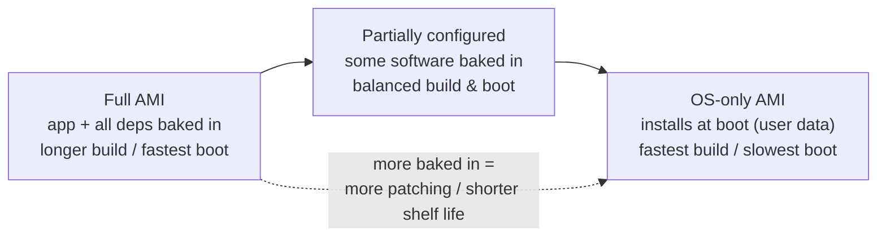
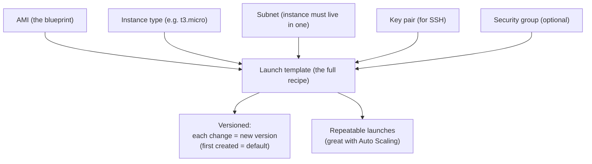
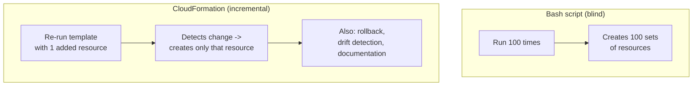
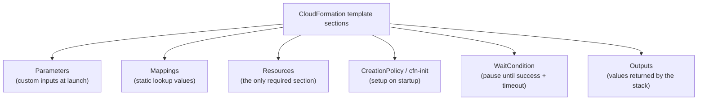
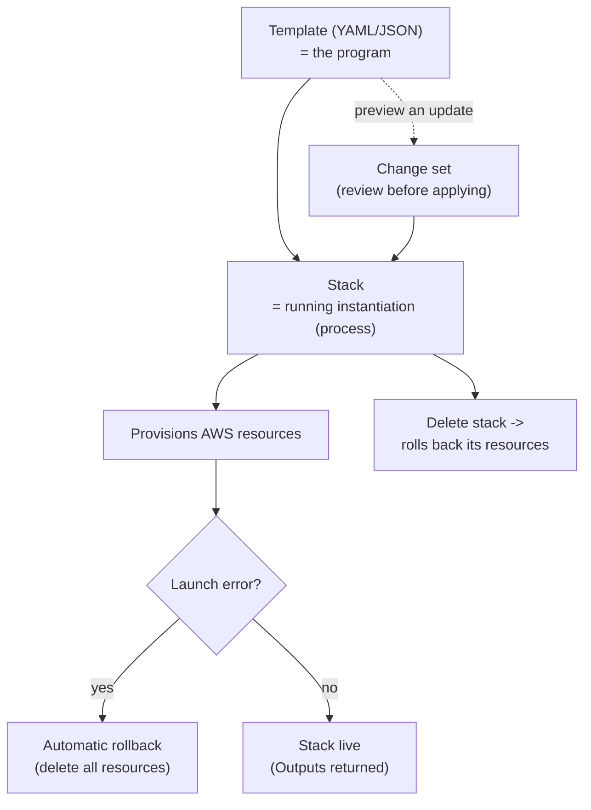
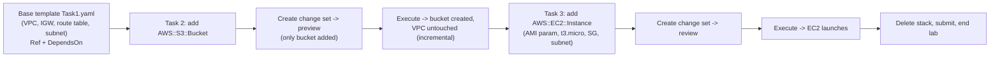

# Lecture Notes — June 29, 2026
**Cohort 3 | Project CloudIgnite**
**Topics:** Amazon Machine Images (AMIs), Launch Templates, Infrastructure as Code, JSON vs YAML, AWS CloudFormation Deep Dive, Lab 190 CloudFormation Change Sets
**Duration:** ~3 hours

---

## Key Takeaways
- **AMI (Amazon Machine Image)** is a blueprint/snapshot to launch EC2 instances; it's **region-scoped** (must copy to use in another region)
- **AMI build-time vs boot-time trade-off:** fuller AMIs boot faster but take longer to build and require more patching (shorter shelf life)
- **Launch template** is the full recipe (AMI + instance type + subnet + key pair + security group) with versioning support
- **Infrastructure as Code (IaC)** via CloudFormation enables repeatable, incremental deployments with automatic rollback and drift detection (vs bash scripts that blindly recreate everything)
- **CloudFormation key terms:** template = code (program), stack = running instantiation (process), change set = preview of what an update would change
- **Never embed credentials in CloudFormation templates** — a core security best practice
- **YAML for config readability:** use spaces (never tabs), 2-space indentation; missing colon or extra space = syntax error
- **CloudFormation auto-rolls back on error** by default; use `--on-failure DO_NOTHING` to keep failed resources for debugging

---

## Table of Contents

1. [Amazon Machine Images (AMIs)](#1-amazon-machine-images-amis)
2. [Launch Templates](#2-launch-templates)
3. [Infrastructure as Code (IaC)](#3-infrastructure-as-code-iac)
4. [JSON vs YAML](#4-json-vs-yaml)
5. [AWS CloudFormation — Deep Dive](#5-aws-cloudformation--deep-dive)
6. [Lab 190 — CloudFormation (Change Sets, S3, EC2)](#6-lab-190--cloudformation-change-sets-s3-ec2)
7. [CLF-C02 Exam Relevance — Consolidated Map](#-clf-c02-exam-relevance--consolidated-map)
8. [Glossary](#-glossary)
9. [Checkpoint Q&A Recap](#-checkpoint-qa-recap)
10. [Action Items & Housekeeping](#-action-items--housekeeping)

---

## 1. Amazon Machine Images (AMIs)

An **AMI is a blueprint (template/snapshot) used to launch EC2 instances**. The lecture focused on the trade-offs of *how much* you bake into an AMI.

### Build time vs boot time

When designing an AMI you balance three things: **build time**, **boot time**, and **shelf life / maintenance**.

| AMI type | What's baked in | Build time | Boot time |
|---|---|---|---|
| **Full AMI** | Application + all dependencies pre-installed | Longer | **Shortest** (boots fast) |
| **Partially configured AMI** | Some key software pre-installed; rest configured later | Balanced | Balanced |
| **OS-only AMI** | Just the OS; everything installed at boot (e.g. via user data) | **Shortest** | Longer (installs during boot) |

- Usual priority = **reduce boot time** so instances can stop/start quickly → favors fuller AMIs.
- **Shelf life / security risk:** the more software you pre-install, the more you must **patch and update** it. A stale AMI that isn't regularly updated becomes a security liability.

### Key AMI facts

- **Regional service** — an AMI is tied to its region. To use it elsewhere you must **copy it** to the target region (e.g. `us-east-1` → `ap-northeast-1`).
- **Automatic reboot** — by default, creating an AMI **reboots the source instance once** to ensure a consistent image (can be disabled).
- **EBS volumes captured** — attached EBS volume config is captured as part of the AMI; you can specify the **root device name** (e.g. `/dev/sda1`).
- **Create via CLI:** `aws ec2 create-image --instance-id <id> --name <name>` (get the instance ID from the console or `aws ec2 describe-instances`).
- **Windows AMIs** need **Sysprep** first (`EC2Launch` on Server 2016+/newer, `EC2Config` on older). Sysprep phases: **Generalize** (strip machine-specific info — SID, computer name, event logs) → **Specialize** (add new name/SID/commands) → **OOBE** (Out-of-Box Experience setup). *Course focus stays on Linux.*

#### 📊 Visual: AMI build-time vs boot-time trade-off
*The core AMI decision — the more you bake in, the faster instances boot but the longer they take to build and the more you must patch (shorter shelf life).*

> [!TIP]
> Exam framing: **AMI = blueprint/snapshot to launch EC2**; **user data = script that installs/configures the environment at launch**.

### 🎯 CLF-C02 Relevant
- **Medium–High.** Know what an AMI is, that it's **region-scoped (copy to move regions)**, and the AMI-vs-user-data distinction. Sysprep/build-vs-boot detail is deeper than the exam requires.

---

## 2. Launch Templates

A **launch template** captures the *full recipe* for launching an EC2 instance — more than just the AMI.

- Analogy used: **AMI = the blueprint; launch template = the whole recipe** (step-by-step to build the instance).
- To launch an instance you need more than an AMI: also an **instance type** (e.g. `t3.micro`/`t3.small`), a **subnet** (an instance must live in a subnet), and a **key pair** (for SSH). A security group is optional but common.
- **Versioning:** each set of changes (e.g. add a security group, change the AMI or instance type) creates a **new version**. The **first version created is the default**.

#### 📊 Visual: Launch template = the full recipe
*An AMI is just the blueprint; a launch template bundles the AMI with the instance type, subnet, key pair, and optional security group into a versioned, repeatable recipe.*

### 🎯 CLF-C02 Relevant
- **Medium.** Understand that a launch template standardizes/repeats instance configuration and supports versioning — useful with Auto Scaling.

---

## 3. Infrastructure as Code (IaC)

**IaC = defining and provisioning infrastructure through code/templates** rather than clicking in the console. On AWS this primarily means **CloudFormation**.

### Cloud deployment challenges IaC solves
- Rolling out across multiple geographic locations
- **Rolling back** to a working version when something breaks
- Debugging deployments and **documenting all changes**
- Updating live servers and **managing dependencies** between systems/subsystems
- Deploying **repeatable, identical environments**

### Bash script vs CloudFormation
- A **bash script** re-runs blindly: run it 100 times → it creates 100 sets of resources.
- **CloudFormation is incremental:** re-running the same template with one added resource **detects the change** and only creates that resource — it won't recreate the VPC/other existing resources.
- CloudFormation also enables **rollback**, **change detection** (spots manual drift), and easy **documentation** of changes.

#### 📊 Visual: Bash script vs CloudFormation
*Why IaC wins — a bash script blindly recreates everything each run, while CloudFormation detects changes and only adds what's new, plus rollback and drift detection.*

### 🎯 CLF-C02 Relevant
- **High.** IaC and the *why* of CloudFormation (repeatable, incremental, rollback, dependency management) are core exam themes.

---

## 4. JSON vs YAML

CloudFormation templates can be written in **JSON or YAML** (both are just text files).

| | **JSON** | **YAML** |
|---|---|---|
| Structure | `{ }` objects (unordered key‑value pairs), `[ ]` arrays | Indentation-based (Python-like) |
| Syntax | Keys `:` values, values separated by `,` | Keys `:` + space; lists via `-`; `[ ]` inline lists allowed |
| Readability | More verbose (brackets/quotes) | **More human-readable**, less punctuation |
| Comments | Not supported | **Supported** (native comments) |
| Adoption | Widely used, easy to generate/parse | Portable across many languages (C, Java, Perl, Python, Ruby…) |

> [!WARNING]
> **YAML uses spaces, never tabs.** Indentation is significant (like Python) — **two spaces** per level is standard, and an extra/misplaced space (or a missing colon) is a **syntax error**. A missing colon between `S3` and `Bucket` broke the lab template until it was fixed.

- **Serialization** = converting an in-memory object into a flat **string** so it can be sent over a network or stored, then reconstructed ("stringify" ↔ "objectify").
- Rule of thumb: JSON is common for **transporting** data; YAML is preferred for **configuration** (readability).

### 🎯 CLF-C02 Relevant
- **Low–Medium.** Knowing CloudFormation supports **both JSON and YAML** is worth remembering; deep syntax is hands-on skill.

---

## 5. AWS CloudFormation — Deep Dive

**CloudFormation models and provisions AWS infrastructure** from a template, supporting create/update/delete and drift detection across most AWS services.

### Core components

| Component | Meaning |
|---|---|
| **Template** | The code (YAML or JSON) describing resources — like a *program*. |
| **Stack** | A running instantiation of a template — like a *process*. A stack is a collection of AWS resources; deleting the stack rolls back (deletes) its resources. |
| **Change set** | A preview of what an update *would* change, so you can review before applying. Enables **incremental** updates. |

> Analogy: **template : stack :: program : process.**

### Template sections

- **Parameters** — custom input values passed at launch (e.g. a VPC name or CIDR block), like function arguments.
- **Mappings** — static/constant lookup values.
- **Resources** — the AWS resources to create (the only required section).
- **CreationPolicy / cfn-init** — run custom setup on startup.
- **WaitCondition** — pause until a resource signals success (resources otherwise launch in parallel). Has a **timeout** (the instructor was unsure whether the value shown was seconds or ms; if seconds, `3600` = wait up to 1 hour).
- **Outputs** — values returned by the stack (e.g. a URL, username, or resource name).

#### 📊 Visual: CloudFormation template anatomy
*The sections of a template — Parameters feed inputs, Mappings hold constants, Resources is the only required section, and Outputs return values (WaitCondition/CreationPolicy handle startup timing).*

### Behavior & safety

- Launch via **Console, CLI, or API**.
- **Automatic rollback:** if any error occurs during launch, **all resources roll back by default** (transaction-like).
- **Termination protection** can be enabled to guard a stack from deletion.
- **DependsOn** lets you enforce ordering (e.g. VPC before subnet before EC2).
- A **drag-and-drop designer** exists, but the course uses code.

### CloudFormation best practices

- **Organize stacks by lifecycle and ownership**; keep resource order sensible (VPC → subnet → EC2).
- **Reuse templates** across dev/test/prod.
- **Verify service limits** for resource types before deploying.
- **Never embed credentials/secrets/passwords** in a template.
- **Create a change set before updating** a stack (preview, don't blind-apply).
- Use **stack policies**, **code reviews**, and **revision control** for templates.
- Use **AWS CloudTrail** to log CloudFormation API calls.

#### 📊 Visual: CloudFormation lifecycle
*How it fits together — a template (program) instantiates a stack (process) that provisions resources; a change set previews updates, and any launch error rolls everything back by default.*

> [!TIP]
> Exam-ready summary: *CloudFormation provisions infrastructure predictably & repeatably; the two key terms are **templates** and **stacks**; errors roll back by default; parameters feed custom input into a template.*

### 🎯 CLF-C02 Relevant
- **Very high.** CloudFormation, its templates/stacks/change sets, automatic rollback, and "no credentials in templates" are frequently tested IaC topics.

---

## 6. Lab 190 — CloudFormation (Change Sets, S3, EC2)

**Goal:** Start from a base CloudFormation template (VPC stack) and use **change sets** to incrementally add an **S3 bucket** and then an **EC2 instance**. (Loads instantly because no resources exist until the stack runs.)

### Exploring `Task1.yaml` (~127 lines)
Walked through a real YAML template section by section:
- **Version** + **Description**.
- **Parameters** — `LabVpcCidrBlock` and `PublicSubnetCidrBlock` (with default values usable if none supplied at launch).
- **Resources** built with `Ref` and `DependsOn`:
  - **VPC** (`AWS::EC2::VPC`) referencing the CIDR parameter; DNS support/hostnames enabled; tagged `LabVPC`.
  - **Internet Gateway** (`AWS::EC2::InternetGateway`), then a **VPC Gateway Attachment** with `DependsOn: [InternetGateway, LabVPC]`.
  - **Public Route Table** (`DependsOn: LabVPC`), a route to the IGW, a **public subnet** (auto-assign public IP, CIDR from parameter, AZ index 0).
- Key idea reinforced: **`Ref` pulls an ID from another resource**, and **`DependsOn` (an array, written with `-` hyphens) enforces that prerequisites are ready first**.

### Task 2 — Add an S3 bucket via a change set
1. Edit the YAML to add an `AWS::S3::Bucket` resource (properties optional; a bucket name can be set but was commented out).
2. In the console: **Update stack → Create change set → Replace existing template → upload the file**.
3. The change set **previews** that only the S3 bucket will be added; **Execute change set** → it creates *just* the bucket, leaving the VPC and other resources untouched (incremental).

> [!NOTE]
> Two live gotchas: a **missing colon** (`S3Bucket` properties) caused *"member must satisfy regular expression pattern"*, and **YAML indentation** required exactly **two leading spaces** before the resource. Both are pure syntax issues.

### Task 3 — Add an EC2 instance
1. Add an **AMI parameter** (2-space indentation) to select the image.
2. Under **Resources**, add `MyEC2Instance` with `Type: AWS::EC2::Instance` and properties:
   - `ImageId: !Ref` the AMI parameter (Amazon Linux AMI)
   - `InstanceType: t3.micro`
   - `SecurityGroupIds:` (an array → `- !Ref <SecurityGroup>`)
   - `SubnetId: !Ref <PublicSubnet>`
   - `Tags:` array (`- Key: Name`, `Value: App Server`)
3. Upload as another **change set**, review, and **execute** → EC2 instance launches. Verify in the EC2 console.
4. **Delete the stack, submit, and end the lab.**

#### 📊 Visual: Lab 190 — incremental change sets
*The lab flow — start from the base VPC template, then use two change sets to add an S3 bucket and an EC2 instance, each previewed and executed without touching existing resources.*

### 🎯 CLF-C02 Relevant
- **High** for the concepts (change sets = incremental/reviewable updates; `Ref`/`DependsOn`; parameters). The exact YAML authoring is hands-on skill, not exam content.

---

## CLF-C02 Exam Relevance — Consolidated Map

| Topic | Exam Domain | Relevance |
|---|---|---|
| CloudFormation (templates, stacks, change sets, rollback) | Technology & Services / IaC | 🔴 High |
| Infrastructure as Code concept (repeatable, incremental, rollback) | Technology & Services | 🔴 High |
| "No credentials in templates" / CFN best practices | Security & Compliance | 🔴 High |
| CloudTrail logging of CloudFormation API calls | Security & Compliance | 🔴 High |
| AMI = blueprint to launch EC2; regional (copy to move) | Technology & Services | 🟠 Medium–High |
| User data vs AMI (configure at launch vs baked in) | Technology & Services | 🟠 Medium |
| Launch templates (standardize + version instance config) | Technology & Services | 🟠 Medium |
| CloudFormation supports JSON **and** YAML | Technology & Services | 🟠 Medium |
| AMI build-vs-boot trade-offs, Sysprep, YAML syntax mechanics | (hands-on / design detail) | ⚪ Low |

---

## Glossary

- **AMI (Amazon Machine Image)** — A blueprint/snapshot (OS + optional software + EBS config) used to launch EC2 instances. Region-scoped.
- **User data** — A script run at instance launch to install/configure software.
- **Sysprep** — Windows tool to generalize an image (remove machine-specific IDs) before making an AMI.
- **Launch template** — A reusable, versioned definition of how to launch an instance (AMI + instance type + subnet + key pair + optional SG).
- **Infrastructure as Code (IaC)** — Provisioning infrastructure from code/templates for repeatability and version control.
- **CloudFormation** — AWS IaC service that provisions resources from JSON/YAML templates.
- **Template** — The CloudFormation code describing resources (the "program").
- **Stack** — A deployed instance of a template (the "process"); a collection of managed resources.
- **Change set** — A preview of the changes an update would make before applying them.
- **Ref** — CloudFormation function that references a parameter or another resource's value/ID.
- **DependsOn** — Declares that a resource must wait for named prerequisites.
- **WaitCondition** — Pauses stack creation until a success signal or timeout.
- **Serialization** — Converting an object into a flat string for storage/transport (and back).

---

## Checkpoint Q&A Recap

1. **What is an AMI?** → A blueprint/snapshot used to launch EC2 instances.
2. **Purpose of user data?** → To install/configure the environment while the instance launches.
3. **AMI made in `us-east-1`, copied to `us-east-2`, but the launch script fails — why?** → The **AMI name/ID differs between regions**; the script still references the old name (also check region/subnet/IP ranges).
4. **Why CloudFormation over a bash script?** → It's **incremental** (won't recreate existing resources), supports **rollback**, drift detection, and documentation; a bash script recreates resources every run.
5. **Two key CloudFormation terms?** → **Template** (code) and **Stack** (running instantiation).
6. **What happens on a launch error?** → Resources **roll back by default**.
7. **How do you preview an update safely?** → Create a **change set** before executing.
8. **JSON vs YAML for config — which is preferred and why?** → **YAML** (more readable, supports comments); remember **spaces, not tabs**.
9. **Where should credentials go in a template?** → **Nowhere** — never embed secrets in templates.

---

## Action Items & Housekeeping

- [ ] **Lab 190:** finish adding the EC2 instance, then **delete the stack, submit, and end** the lab.
- [ ] (Optional) Watch the provided **launch template / AMI demonstration videos** when time allows.
- [ ] **KC deferred:** no Knowledge Check today — it moves to tomorrow.
- **Tomorrow's plan:** *no new slides/topics* — **lab before the break, then another lab + the KC after the break** (KC prioritized so it isn't missed). Tomorrow's lab covers **WaitCondition**.
- If a lab won't load, **clear browser cache** and retry.

---

