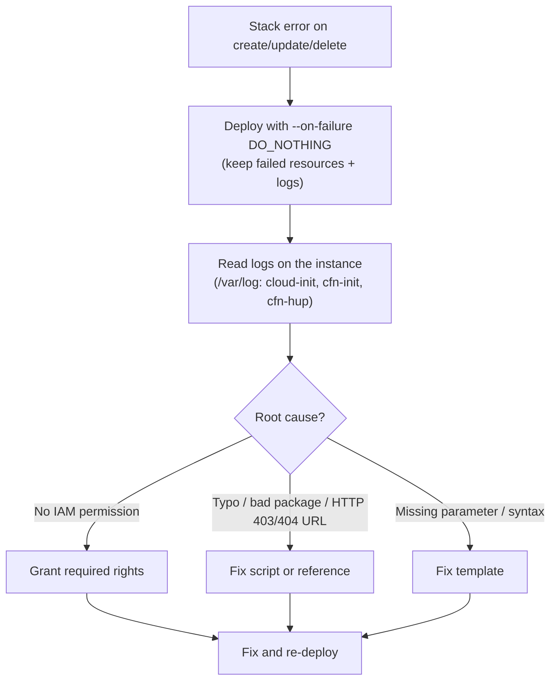
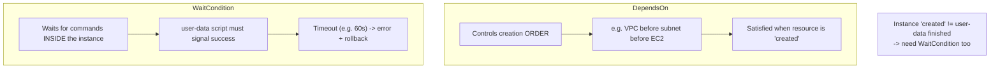
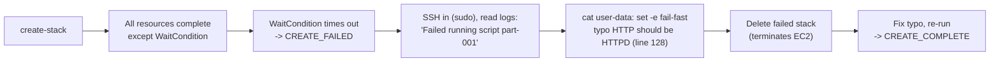
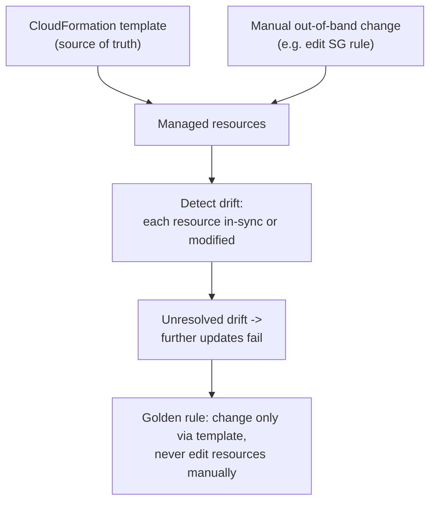
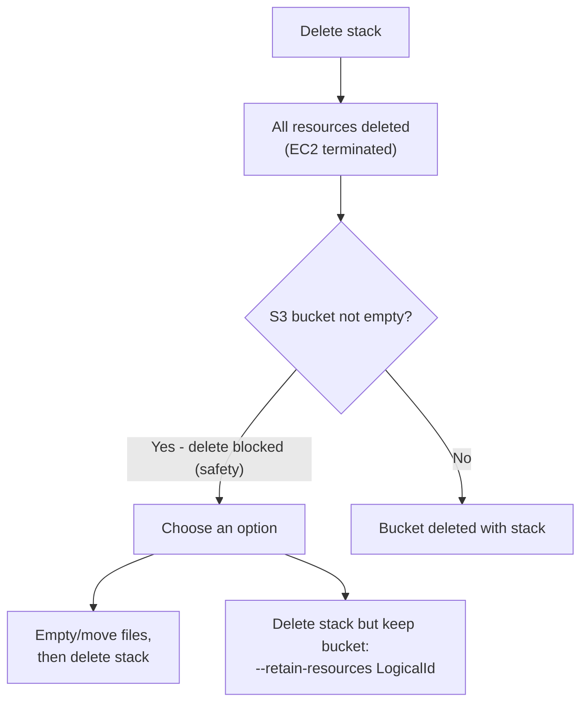
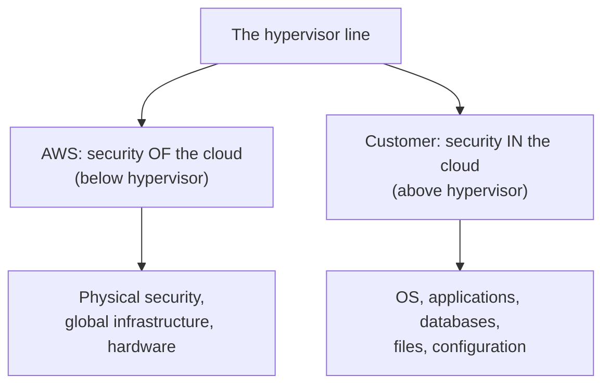
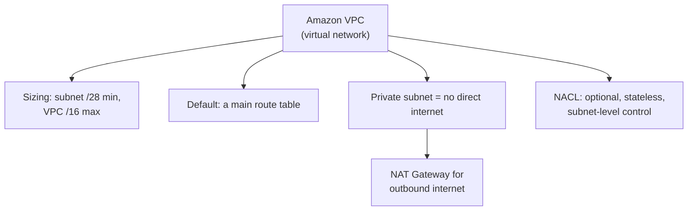

# Lecture Notes — June 30, 2026
**Cohort 3 | Project CloudIgnite**
**Topics:** CloudFormation Troubleshooting, Debugging Failed Stacks Lab, Drift Detection, Stack Deletion & Resource Retention, Exam-Prep Knowledge Checks (Compute, IAM, Risk & Compliance, VPC, Storage)
**Duration:** ~3 hours

---

## Key Takeaways
- **CloudFormation auto-rolls back on failure by default** (deletes broken resources); use `--on-failure DO_NOTHING` to keep failed resources so you can read logs
- **User-data and cfn-init errors** live in logs under `/var/log/` (Linux) — read cloud-init, cfn-init, and cfn-hup logs to debug
- **DependsOn controls creation order** (e.g., VPC before subnet); **WaitCondition waits for in-instance commands** to signal success (timeout → rollback)
- **Drift** occurs when resources are manually changed out-of-band; unresolved drift blocks further stack updates — always manage via the template, never manually
- **Deleting a stack deletes its resources**; non-empty S3 buckets block deletion (safety) — either empty first or use `--retain-resources LogicalId`
- **Shared Responsibility Model:** AWS secures OF the cloud (below hypervisor: physical, infrastructure), customer secures IN the cloud (above: OS, apps, data)
- **IAM best practices:** use groups, enable MFA, never use root after setup, access keys = programmatic/CLI (NOT Console login), STS = temporary credentials
- **VPC sizing:** subnet minimum /28, VPC maximum /16; **NAT Gateway** for private-subnet internet egress; **NACL** is optional stateless subnet-level control

---

## Table of Contents

1. [CloudFormation Troubleshooting (Theory)](#1-cloudformation-troubleshooting-theory)
2. [Lab — Debugging a Failed CloudFormation Stack](#2-lab--debugging-a-failed-cloudformation-stack)
3. [Drift Detection](#3-drift-detection)
4. [Deleting Stacks & Retaining Resources](#4-deleting-stacks--retaining-resources)
5. [Portfolio Project Suggestion](#5-portfolio-project-suggestion)
6. [Knowledge Check — Compute](#6-knowledge-check--compute)
7. [Knowledge Check — IAM & Shared Responsibility](#7-knowledge-check--iam--shared-responsibility)
8. [Knowledge Check — Risk & Compliance](#8-knowledge-check--risk--compliance)
9. [Knowledge Check — VPC](#9-knowledge-check--vpc)
10. [Knowledge Check — Storage](#10-knowledge-check--storage)
11. [CLF-C02 Exam Relevance — Consolidated Map](#-clf-c02-exam-relevance--consolidated-map)
12. [Glossary](#-glossary)
13. [Checkpoint Q&A Recap](#-checkpoint-qa-recap)
14. [Action Items & Housekeeping](#-action-items--housekeeping)

---

## 1. CloudFormation Troubleshooting (Theory)

What do you do when CloudFormation hits an error while it **creates, updates, or deletes** a stack? Work through it systematically.

### Resources for troubleshooting
- **AWS CloudFormation Troubleshooting Guide** and the **error messages** shown in the console.
- **Log files** on the instance (for user-data / init failures).
- Templates should reference a **valid S3 bucket** — it's common practice to store templates in S3, and when you upload a template the console **auto-uploads it to S3 first**. This gives you a template history.

### Common reasons a stack fails
- **Missing IAM permission** (e.g. no rights to create an EC2 instance).
- **Typo / nonexistent package** in an init or user-data script.
- **Missing required parameter.**
- **Syntax error** in the template (YAML/JSON).
- A **referenced URL** (script, MSI, etc.) returning **HTTP 403 / 404**.

### Where the logs live
- User-data and cfn-init errors are written to logs: **cloud-init log**, **cfn-init log**, **cfn-hup (“wire”) log**.
- **Linux:** under **`/var/log/`**. **Windows:** a separate log folder.
- You can use **CloudWatch Logs** to automatically ship these logs (e.g. to an S3 bucket).

### Rollback vs. keeping the instance for debugging
- **By default, a failed stack rolls back** to the last working version — which *deletes the broken instance and its logs*, so you lose your debugging evidence.
- Use **`--on-failure DO_NOTHING`** so the failed resources are **kept** — then you can log in and read the logs to find the root cause.

### WaitCondition troubleshooting
- A **WaitCondition** behaves like a function that must return a **success signal within a timeout**. If it times out (or returns a non-success/non-zero result), the stack **fails** and rolls back.

#### 📊 Visual: CloudFormation troubleshooting method
*The systematic approach — deploy so failed resources survive, read the instance logs, classify the root cause, then fix and re-deploy.*

> [!TIP]
> When a stack fails, the console tells you *that* it failed and *which resource* failed — but you still have to open the logs to find *why*. Set `--on-failure DO_NOTHING` first so the evidence survives.

### 🎯 CLF-C02 Relevant
- **High.** Understanding that CloudFormation **auto-rolls back on failure**, stores templates in **S3**, and that failures commonly stem from **permissions / parameters / syntax** are exam-worthy IaC concepts.

---

## 2. Lab — Debugging a Failed CloudFormation Stack

**Goal:** Run a template that fails, diagnose it via logs, fix a typo, and re-deploy successfully. (~83 steps — larger than usual.)

### Setup
- Connect to the EC2 instance (**Windows → `icacls`** on the key; **delete your previous key** first). Confirm region (`us-west-2`) via the lab's step 29.
- **Configure the CLI** with access key + secret key. Output formats supported: **JSON, table, text** (**YAML is not** a CLI output format).
- Use a **JSON `--query`** to filter the CLI's large output down to specific fields.

### Reading the template (`template1.yml`)
- Open with **`vi`/`view`** for **syntax highlighting**, and **`:set number`** to show line numbers.
- Template contents: **parameters** (VPC CIDR, private subnet CIDR, Amazon Linux AMI, default lab key); **resources** (VPC → IGW → attachment → public route table → public subnet → association → EC2 `t3.micro` → **web security group** allowing ports 80 & 22); **user data** (via `Fn::Base64`) that sets the hostname and installs a simple **HTTPD** web server; a **CreationPolicy/CFN signal + WaitHandle + WaitCondition**; and **outputs** (bucket name, instance ID, public IP).

### 🔑 DependsOn vs WaitCondition (key concept)
- **`DependsOn`** controls **resource creation order** (e.g. VPC before subnet).
- **`WaitCondition`** waits for **commands running *inside* the instance** (the user-data script) to **finish and signal success**.
- Why both? An EC2 instance being “created” only satisfies `DependsOn` — it does **not** mean the user-data script finished. `WaitCondition` (here **timeout 60s**) bridges that gap; on timeout it errors and rolls back.

#### 📊 Visual: DependsOn vs WaitCondition
*The key distinction — DependsOn only orders resource creation, while WaitCondition waits for the in-instance user-data script to actually signal success.*

### The failure and the fix
1. `aws cloudformation create-stack ...` → watch resource progress. Everything completes **except the WaitCondition**, which stays *in progress* then the stack goes **`CREATE_FAILED`**.
2. Connect to the instance and read the logs (need **`sudo`**): found **“Failed running script part-001.”** `cat` the user-data script to inspect it.
3. `set -e` in the script = **fail fast** (any failed line returns non-zero). Debugging those few lines revealed a **typo: `HTTP` should be `HTTPD`** (line 128).
4. **Delete the failed stack** (this terminates the EC2 instance), fix the typo, and **re-run** → stack reaches **`CREATE_COMPLETE`**.

#### 📊 Visual: The lab's debug journey
*The failure story — everything builds except the WaitCondition, which times out; the logs point to a fail-fast user-data typo (HTTP vs HTTPD), fixed on re-deploy.*

> [!WARNING]
> A separate learner hit **“YAML not well formed” at line 134** — an indentation error. Fix: remove stray spaces and use exactly **two spaces**. Note the reported error line (134) wasn't the real culprit (128) — CloudFormation often points near, not exactly at, the problem.

> [!NOTE]
> The template file lives **on the EC2 instance** (read-only when connected as a normal user) — if you corrupt it you must fix it in place or get a copy from a classmate; you can't just re-download it.

### 🎯 CLF-C02 Relevant
- **Medium.** The *concepts* (WaitCondition, rollback-on-failure, reading logs) matter; the exact CLI/`vi` mechanics are hands-on skill.

---

## 3. Drift Detection

- **Drift** = when a CloudFormation-managed resource is changed **manually** (out-of-band), so it no longer matches the template.
- CloudFormation can **detect drift**, marking each resource **in sync** or **modified** (e.g. a manually edited security group rule).
- While a stack has **unresolved drift**, further **updates fail** (“no updates to be performed” / validation error) because the live resources don't match the template.
- **Golden rule:** manage resources **only through CloudFormation** — don't edit them manually. To change something, edit the **template**.

#### 📊 Visual: How drift happens
*Drift is a manual out-of-band change that makes live resources diverge from the template — it blocks further updates until resolved, so always change via the template.*

### 🎯 CLF-C02 Relevant
- **Medium–High.** Knowing that manual changes cause drift and that IaC-managed resources should be changed via the template is a solid exam concept.

---

## 4. Deleting Stacks & Retaining Resources

- **Deleting a stack deletes all of its resources** (the EC2 instance gets terminated).
- **But an S3 bucket delete fails if the bucket is not empty** — a deliberate safety precaution so you don't accidentally destroy sensitive files. This is **not** a drift issue.
- Two ways to handle it:
  1. **Move/empty the files** to another bucket, then delete the stack; **or**
  2. **Delete the stack while retaining** the bucket: `--retain-resources <LogicalId>`.
- Find the bucket's **logical ID** with `aws cloudformation describe-stack-resources` + a `--query` filtering on `ResourceType = AWS::S3::Bucket`. (You must pass the **logical ID**, and the resource must not already be in `DELETE_COMPLETE` state.)

#### 📊 Visual: Deleting a stack & retaining resources
*Deleting a stack removes its resources, but a non-empty S3 bucket blocks deletion — either empty it first or delete the stack while retaining the bucket by logical ID.*

> [!TIP]
> Retaining resources on delete is how you tear down a stack **without losing** a stateful resource (like an S3 bucket or database).

### 🎯 CLF-C02 Relevant
- **Medium.** The idea that deleting a stack removes its resources (with retention as an option, and non-empty S3 buckets blocking deletion) is useful exam context.

---

## 5. Portfolio Project Suggestion

The instructor recommended a **GitHub portfolio project**: write a CloudFormation template that stands up a **complete web server** — VPC, subnets, internet gateway, **RDS in a private subnet**, and an **EC2 instance in a public subnet** (like the “cafe” website) — so that running the stack yields a visitable site. Bonus: replicate the same thing with a **bash script** or **Python** and publish all of it.

---

## 6. Knowledge Check — Compute

| Question | Answer |
|---|---|
| Managed VPS with pre-configured instances for WordPress / LAMP / Node.js? | **Amazon Lightsail** |
| Cost comparison of On-Demand vs Reserved for steady workloads | Running On-Demand *consistently* is **more expensive** than Reserved (Reserved wins for steady use) |
| What must be specified when launching a **Windows** EC2 instance? | Instance type + AMI (options 1 and 3) |
| Why is AWS more economical for **varying** compute workloads? | You pay only for what you use (elastic, no over-provisioning) |

### 🎯 CLF-C02 Relevant
- **High.** **Lightsail** (simple managed hosting), and **On-Demand vs Reserved** pricing are common exam topics.

---

## 7. Knowledge Check — IAM & Shared Responsibility

### Shared Responsibility Model
- **AWS = “security OF the cloud”** → physical security, the global infrastructure, and everything **below the hypervisor**.
- **Customer = “security IN the cloud”** → OS, applications, databases, files, and configuration **above the hypervisor**.
- **True/False:** “AWS is responsible for everything *above* the hypervisor” → **False** (that's the customer's side).

#### 📊 Visual: Shared Responsibility Model
*The dividing line is the hypervisor — AWS secures everything below it (OF the cloud), the customer secures everything above it (IN the cloud).*

### IAM facts & best practices
- **STS** provides **temporary security credentials** for trusted users.
- **Use IAM groups** to manage permissions (recommended).
- **Enable MFA** to add a login-security layer to the Management Console.
- **Don't use the root user** after initial setup.
- **Access key + secret key are for programmatic/CLI/API access — NOT for Console login** (Console uses username/password).
- Two access types an IAM policy can grant: **programmatic access** and **Management Console access**.
- IAM is **not** appropriate for **OS / application authentication** (→ False).

### 🎯 CLF-C02 Relevant
- **Very high.** The **Shared Responsibility Model** and **IAM best practices** (groups, MFA, root-user hygiene, STS, keys vs Console) are guaranteed exam material in the *Security & Compliance* domain.

---

## 8. Knowledge Check — Risk & Compliance

- Covered the components of the **AWS Risk and Compliance Program** and the **AWS Assurance Program** (controlled environment, information-security risk management, physical security, etc.).
- These map to how AWS demonstrates compliance — the artifacts/reports customers can rely on (e.g. via **AWS Artifact**).

### 🎯 CLF-C02 Relevant
- **Medium.** Compliance programs and where to find compliance reports (**AWS Artifact**) appear in the *Security & Compliance* domain.

---

## 9. Knowledge Check — VPC

| Concept | Answer |
|---|---|
| Service to create a virtual network in AWS | **Amazon VPC** |
| **Minimum** subnet size | **/28** |
| **Maximum** VPC IPv4 size | **/16** |
| Give a **private subnet** internet access | **NAT Gateway** |
| Do private subnets have direct internet access? | **No** |
| CloudFront low-latency delivery uses… | **Edge Locations** |
| **Optional** security control at the **subnet** layer | **Network ACL (NACL)** |
| What's created by default with a new VPC? | A **main route table** |
| Multiple VPCs per region with full network control? | **True** |

#### 📊 Visual: VPC exam essentials
*The frequently-tested VPC facts — sizing limits, the default main route table, NAT Gateway for private-subnet egress, and NACL as an optional subnet-level control.*

### 🎯 CLF-C02 Relevant
- **High.** VPC sizing (**/28 min, /16 max**), NAT Gateway for private-subnet egress, NACL as an optional subnet-level control, and the default route table are frequently tested.

---

## 10. Knowledge Check — Storage

- **S3:** disabling “block public access” does **not** by itself make an entire bucket public (that framing was **False**).
- **EBS features:** correct options were 1 and 4 (e.g. persistent block storage attachable to EC2, snapshot-backed).

### 🎯 CLF-C02 Relevant
- **Medium.** S3 access controls and EBS characteristics are standard *Technology & Services* topics.

---

## CLF-C02 Exam Relevance — Consolidated Map

| Topic | Exam Domain | Relevance |
|---|---|---|
| Shared Responsibility Model (OF vs IN the cloud) | Security & Compliance | 🔴 High |
| IAM best practices (groups, MFA, root, STS, keys vs Console) | Security & Compliance | 🔴 High |
| CloudFormation troubleshooting, rollback, templates-in-S3 | Technology / IaC | 🔴 High |
| Drift detection & “manage only via CloudFormation” | Technology / IaC | 🔴 High |
| VPC sizing (/28 min, /16 max), NAT Gateway, NACL, route table | Technology & Services | 🔴 High |
| On-Demand vs Reserved pricing | Billing & Pricing | 🔴 High |
| Amazon Lightsail (managed VPS) | Technology & Services | 🟠 Medium–High |
| Stack deletion / retain resources / non-empty S3 blocks delete | Technology / IaC | 🟠 Medium |
| Risk & Compliance / Assurance programs (AWS Artifact) | Security & Compliance | 🟠 Medium |
| S3 public access & EBS features | Technology & Services | 🟠 Medium |
| WaitCondition vs DependsOn, `--on-failure`, `vi`/CLI mechanics | (hands-on / design detail) | ⚪ Low–Medium |

---

## Glossary

- **CloudFormation stack** — A deployed collection of resources created from a template.
- **Change set** — A preview of the changes an update would make before applying.
- **WaitCondition** — Pauses stack creation until an in-instance success signal arrives (or a timeout fails it).
- **DependsOn** — Enforces creation *order* between resources.
- **`--on-failure DO_NOTHING`** — Keeps failed resources instead of rolling back, so logs can be inspected.
- **Drift** — Divergence between a stack's template and the actual (manually changed) resources.
- **Retain resources** — Deleting a stack while keeping specific resources (by logical ID).
- **Shared Responsibility Model** — AWS secures *of* the cloud (infrastructure); customer secures *in* the cloud (OS, apps, data).
- **STS (Security Token Service)** — Issues temporary security credentials.
- **Amazon Lightsail** — Managed VPS with pre-configured stacks (WordPress, LAMP, Node.js).
- **NACL (Network ACL)** — Optional, stateless security control at the subnet level.
- **NAT Gateway** — Lets private-subnet resources reach the internet outbound.
- **AWS Artifact** — Self-service portal for AWS compliance reports.

---

## Checkpoint Q&A Recap

1. **A stack fails to create — how do you keep the logs for debugging?** → Deploy with **`--on-failure DO_NOTHING`** (default behavior rolls back and deletes the evidence).
2. **Where are user-data/cfn-init logs on Linux?** → Under **`/var/log/`** (cloud-init, cfn-init, cfn-hup logs).
3. **DependsOn vs WaitCondition?** → DependsOn = creation *order*; WaitCondition = wait for in-instance commands to **signal success**.
4. **Why did the stack fail in the lab?** → A **typo** in the user-data script (`HTTP` instead of `HTTPD`).
5. **What is drift, and can you still delete a drifted stack?** → Manual out-of-band change; you **can still delete**, but you **can't update** until drift is resolved.
6. **Why won't the stack delete an S3 bucket?** → The **bucket isn't empty** (safety) — empty it or use **retain resources**.
7. **Who secures the OS and application on an EC2 instance?** → The **customer** (security *in* the cloud).
8. **What are access keys used for?** → **Programmatic/CLI/API** access — **not** Console login.
9. **Min subnet and max VPC size?** → **/28** minimum subnet, **/16** maximum VPC.
10. **How do private-subnet resources reach the internet?** → Via a **NAT Gateway**.

---

## Action Items & Housekeeping

- [ ] **Submit and end** the CloudFormation troubleshooting lab.
- [ ] **(Portfolio)** Build a CloudFormation template that launches a full web server (VPC + subnets + IGW + RDS + EC2) and push it to **GitHub** (optionally also a bash/Python version).
- [ ] Finish the **remaining KCs tomorrow** — 4 more cases plus 1 large KC (“worth ~4 KCs”).
- **Tomorrow's plan:** the **last lab is a challenge** — it will be **self-directed** (you start it and work through it; instructor stands by to help), then the remaining KCs after.
- **Timing:** class runs **7:45–10:45**; the instructor won't start a KC before **9:15** (to accommodate late arrivals). Today wrapped up around **9:58**.

---
