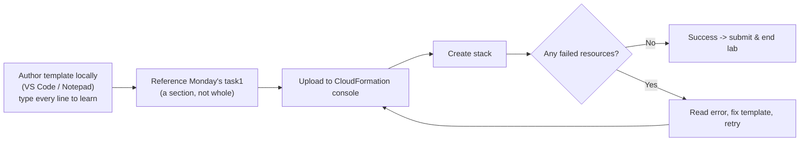
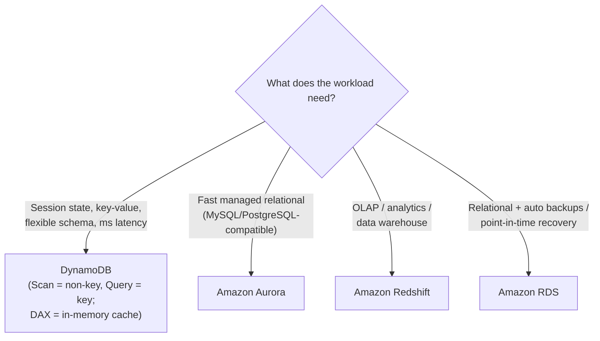
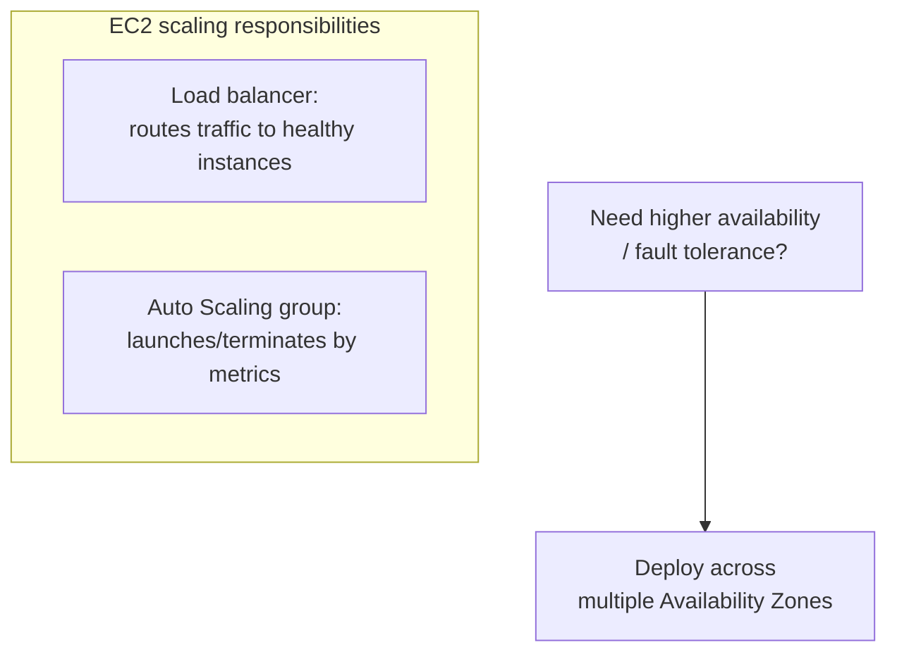
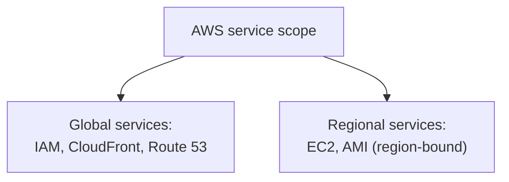
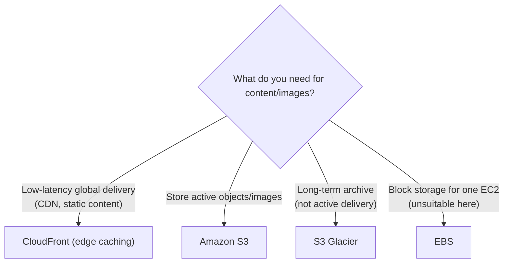
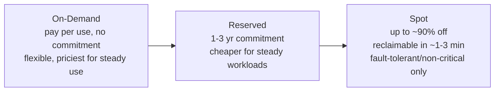

# Lecture Notes — July 01, 2026
**Cohort 3 | Project CloudIgnite**
**Topics:** Self-Directed CloudFormation Challenge Lab, Database Services, Billing & Support Review, Cloud Architecting & Well-Architected Framework, Certification-Prep Assessment, Spot Instances
**Duration:** ~3 hours

---

## Key Takeaways
- **CloudFormation validation shortcut:** the fastest way to validate a template is to create the stack — if no resources fail, the template is correct
- **DynamoDB** is the default choice for session state, key-value storage, and flexible-schema workloads; use **Scan** for non-key attributes and **Query** for primary key lookups
- **Aurora** is 5× faster than MySQL and 3× faster than PostgreSQL; **Redshift** is for OLAP/analytics (data warehouse)
- **TAM (Technical Account Manager)** and **< 15-min critical response** are **Enterprise support only**; **24/7 phone/chat** starts at **Business**
- **Global services:** IAM, CloudFront, Route 53 are global; EC2 and AMIs are **regional** (must copy AMI to use in another region)
- **CloudFront** delivers static content globally with low latency (CDN); **S3** stores objects; **Glacier** archives (not for active delivery)
- **Multi-AZ deployment** is the answer for **availability and fault tolerance** questions; **ELB routes to healthy instances** while **Auto Scaling launches/terminates** based on metrics
- **User data runs at initialization** (after instance creation); **Spot Instances** offer ~90% discount but are reclaimable on ~1-3 min notice (fault-tolerant workloads only)

---

## Table of Contents

1. [Self-Directed CloudFormation Challenge Lab](#1-self-directed-cloudformation-challenge-lab)
2. [Knowledge Check — Databases](#2-knowledge-check--databases)
3. [Knowledge Check — Billing & Support](#3-knowledge-check--billing--support)
4. [Knowledge Check — Cloud Architecting / Well-Architected](#4-knowledge-check--cloud-architecting--well-architected)
5. [Certification-Prep Assessment (59-Question Scenario KC)](#5-certification-prep-assessment-59-question-scenario-kc)
6. [Spot Instances (cost aside)](#6-spot-instances-cost-aside)
7. [CLF-C02 Exam Relevance — Consolidated Map](#-clf-c02-exam-relevance--consolidated-map)
8. [Glossary](#-glossary)
9. [Checkpoint Q&A Recap](#-checkpoint-qa-recap)
10. [Action Items & Housekeeping](#-action-items--housekeeping)

---

## 1. Self-Directed CloudFormation Challenge Lab

**Goal:** Build a CloudFormation template **on your own** that stands up a working web server (VPC → subnet → internet gateway → route table → EC2 with user-data web server), then create the stack.

### Ground rules
- **Do it independently.** You may use an LLM (ChatGPT/Gemini) or docs for **specific questions** (e.g. “how do I create a route table?”) — but **don't ask for the full solution**.
- You may reference **Monday's `task1` template** and copy a **specific section** to understand/modify — but **don't copy-paste the whole thing**.
- **Author the template on your computer** (VS Code / Notepad), then **upload it to the CloudFormation console** and create a stack. You don't have to use the terminal — console upload is fine.

### Instructor's learning philosophy
- **Type every line** when learning, and try to understand each one — copy-pasting a block often *feels* understood but isn't.
- You're **not expected to memorize everything**. The real skill is: *given access to information (Google, docs, an LLM), can you accomplish the task and build the template?*
- **Validation shortcut:** the best way to know your template is correct is to **upload it and create the stack**. If CloudFormation shows the resources running with **no failed state**, everything is fine — submit and end the lab.

### Environment gotchas observed
- The lab shell was **Ubuntu** (older kernel), with **no `sudo`** and copy-paste behavior that varied by OS — another reason to prepare the template locally and just upload it.
- Use the **same template format version** as the reference template if unsure.

#### 📊 Visual: Challenge-lab workflow
*The self-directed loop — author the template locally, upload it to the console, create the stack, and treat "no failed resources" as your validation that it's correct.*

### 🎯 CLF-C02 Relevant
- **Medium.** Reinforces CloudFormation as declarative IaC (template → stack, success = no failed resources). The exam tests concepts, not template authoring.

---

## 2. Knowledge Check — Databases

| Question | Answer |
|---|---|
| Best DB to hold **session state** for hundreds of thousands of users | **DynamoDB** (key-value, low latency) |
| Find a DynamoDB item by a **non-primary-key attribute** | **Scan** (vs. Query on the key) |
| Best service for **online analytic processing (OLAP)** | **Amazon Redshift** |
| A DynamoDB **attribute** is… | a **fundamental data element** |
| Creating a DynamoDB table — what must you specify? | Table name **+ primary key** |
| ~5× faster than MySQL, ~3× faster than PostgreSQL | **Amazon Aurora** |
| DB needing extremely fast performance + **flexible schema** | **DynamoDB** |
| RDS automatically backs up and supports **point-in-time recovery** | **True** |

#### 📊 Visual: Which database?
*Match the workload to the service — DynamoDB for key-value/flexible schema, Aurora for fast relational, Redshift for analytics, and RDS when you need automated backups and point-in-time recovery.*

### 🎯 CLF-C02 Relevant
- **High.** DynamoDB (NoSQL, key-value, flexible schema), Aurora (fast managed relational), Redshift (OLAP/data warehouse), and RDS automated backups/PITR are all core *Technology & Services* topics.

---

## 3. Knowledge Check — Billing & Support

- **Four support plans:** **Basic, Developer, Business, Enterprise.**
- **Basic plan:** **no** technical support cases (account/billing only).
- **Technical Account Manager (TAM):** **Enterprise only.**
- **24/7 phone & chat:** available on **Business and Enterprise**.
- **Enterprise urgent (business-critical) response:** **≤ 1 hour** (fastest tier, mission-critical, is even faster).
- **Support cases have 5 severity levels.**
- **AWS Trusted Advisor** — gives recommendations to **save money, improve performance, improve availability/fault tolerance, and close security gaps**. (Select-3 answer: single-region risk, unused/idle resources, and how the infrastructure is performing.)
- The online tool for cost savings + availability + performance + security recommendations = **Trusted Advisor**.

### 🎯 CLF-C02 Relevant
- **Very high.** Support-plan tiers/features, **TAM = Enterprise**, response-time SLAs, and **Trusted Advisor's checks** are staple *Billing, Pricing & Support* exam questions.

---

## 4. Knowledge Check — Cloud Architecting / Well-Architected

- **Performance Efficiency pillar** areas = **Selection, Review, Monitoring, Trade-offs**. **“Traceability” is NOT one** of them.
- **EC2 scaling responsibilities:**
  - **Load balancer** → sends traffic to **healthy** instances.
  - **Auto Scaling group** → **launches/terminates** instances based on metrics.
  - (So “send traffic to healthy instances” is **not** an Auto Scaling responsibility.)
- **Increase availability of a web farm** → deploy across **multiple Availability Zones**.
  > 🔑 Exam heuristic: whenever a question says **availability / fault tolerance**, the answer almost always involves **multiple AZs**.
- **Performance efficiency design principle** → **use serverless architectures**.
- **AWS Marketplace** → find, buy, and immediately start using **software solutions**.
- **Physical data center security** is typically considered at the **perimeter**.
- **Instance metadata** is retrieved from **`http://169.254.169.254`**.
  > ⚠️ Exam trap: options often keep this number but **swap digits** — memorize **169.254.169.254**.

#### 📊 Visual: ELB vs Auto Scaling (and multi-AZ)
*Two distinct jobs — the load balancer routes traffic to healthy instances while the Auto Scaling group adds/removes instances; for availability, spread across multiple AZs.*

### 🎯 CLF-C02 Relevant
- **High.** Well-Architected pillars, **ELB vs Auto Scaling** roles, **multi-AZ for availability**, serverless as an efficiency principle, and Marketplace are frequently tested.

---

## 5. Certification-Prep Assessment (59-Question Scenario KC)

A long, **scenario-based** assessment designed to mirror the real practitioner exam (worked through ~25 of 59; the rest continue tomorrow). Key takeaways:

> [!TIP]
> **Exam logistics reminder:** the real **CLF-C02 is 65 questions in 2 hours 10 minutes (~2 min/question)**. Scoring **≥ 90%** on this practice set is a good readiness signal.

#### 📊 Visual: Global vs regional services
*A classic exam distinction — IAM, CloudFront, and Route 53 are global, while EC2 and AMIs are region-bound.*

### Concepts drilled
- **Data sovereignty** → prioritize **data governance & legal requirements** (data can't leave a region; auditors in both regions).
- **Global vs regional services:** **Global** = **IAM, CloudFront, Route 53**. **Regional** = **EC2, AMI** (AMIs are region-bound).
- **Reduce global image-load latency** → **CloudFront** (CDN for static content: images, video, text files).
- **Store the website's images** → **Amazon S3** (Glacier = *archive*, not active delivery; EBS unsuitable).
- **Most human-readable CLI output** → **table** format.
- **Check permissions without executing an action** → **`--dry-run`**.
- **Real-time customer notifications (no client polling)** → **SNS** (+ **Lambda** to process/trigger the message).
- **When does user data run?** → at **initialization** — *after* the instance is already **created** (common trick: “creation” is wrong).
- **IAM policy types:** **identity-based** (attached to a user/role/group) and **resource-based** (attached to a resource).
- **DynamoDB selection rationale (select 3):** supports **document + key-value**, uses an **unordered collection**, and provides **single-digit-millisecond latency**. (It has **no read replicas** — that's RDS — and **no BI tools**.)
- **Data-structure/notation mapping:** **curly braces `{}` = map/dictionary/object**, **brackets `[]` = list/array**, **parentheses `()` = tuple**.
- **Store customer profiles indefinitely / mobile + web, high request volume** → **DynamoDB** (use **RDS/Aurora** only when it says *relational / transactional / ACID*).
- **Track monthly session data with fast repeat reads** → **DynamoDB + DAX** (in-memory cache, reads served without hitting the table).
- **Securely connect two VPCs / private subnets** → **VPC Peering**.
- **Ingress-traffic / connectivity failure (permissions already verified)** → check **NACL or Security Group**.

#### 📊 Visual: Deliver vs store vs archive
*The content decision — CloudFront delivers static content with low latency, S3 stores active objects, Glacier archives, and EBS is block storage for a single instance (not for this).*

### 🎯 CLF-C02 Relevant
- **Very high** — this section *is* exam practice. Especially: global vs regional services, CloudFront/S3/Glacier use cases, SNS+Lambda notifications, user-data timing, IAM policy types, DynamoDB/DAX, VPC peering, and NACL/SG troubleshooting.

---

## 6. Spot Instances (cost aside)

Came up while discussing cost-effective compute:
- **Spot Instances** offer up to a **~90% discount**, but AWS can **reclaim (terminate) them on short notice (~1–3 minutes)**.
- Use only for **fault-tolerant / non-critical / backup** workloads where an interruption won't hurt the business.
- Pair with **Lambda** (always available) to keep costs low while covering the work Spot can't guarantee.

#### 📊 Visual: EC2 pricing models
*The cost-vs-commitment spectrum — On-Demand is flexible, Reserved is cheaper for steady workloads, and Spot is deeply discounted but reclaimable, so use it only for interruptible work.*

### 🎯 CLF-C02 Relevant
- **High.** Spot vs On-Demand vs Reserved pricing and appropriate Spot use cases are common *Billing & Pricing* questions.

---

## CLF-C02 Exam Relevance — Consolidated Map

| Topic | Exam Domain | Relevance |
|---|---|---|
| DynamoDB (key-value, flexible schema, Scan vs Query, DAX) | Technology & Services | 🔴 High |
| Aurora / Redshift / RDS backups & PITR | Technology & Services | 🔴 High |
| Support plans, TAM (Enterprise), response SLAs | Billing, Pricing & Support | 🔴 High |
| Trusted Advisor checks (cost/perf/availability/security) | Billing, Pricing & Support | 🔴 High |
| Global vs regional services (IAM/CloudFront/Route 53 vs EC2/AMI) | Technology & Services | 🔴 High |
| CloudFront (CDN) vs S3 vs Glacier use cases | Technology & Services | 🔴 High |
| SNS + Lambda for real-time notifications | Technology & Services | 🔴 High |
| Multi-AZ for availability / fault tolerance | Well-Architected / Reliability | 🔴 High |
| ELB vs Auto Scaling responsibilities | Technology & Services | 🔴 High |
| Spot vs On-Demand vs Reserved pricing | Billing & Pricing | 🔴 High |
| IAM policy types (identity- vs resource-based) | Security & Compliance | 🟠 Medium–High |
| Well-Architected Performance Efficiency pillar | Cloud Concepts | 🟠 Medium–High |
| VPC Peering; NACL/SG connectivity troubleshooting | Technology & Services | 🟠 Medium–High |
| User-data runs at *initialization* (post-creation) | Technology & Services | 🟠 Medium |
| CLI `--dry-run`; table = most readable output | Technology & Services | 🟠 Medium |
| Instance metadata IP `169.254.169.254` | Technology & Services | 🟠 Medium |
| AWS Marketplace; data-center perimeter security | Cloud Concepts | 🟠 Medium |
| CloudFormation template authoring mechanics | (hands-on) | ⚪ Low |

---

## Glossary

- **DynamoDB** — Managed NoSQL key-value/document DB; flexible schema; single-digit-ms latency.
- **DAX (DynamoDB Accelerator)** — In-memory cache for DynamoDB; serves hot reads without hitting the table.
- **Scan vs Query** — *Scan* reads the whole table (used for non-key attributes); *Query* uses the primary key.
- **Aurora** — AWS's high-performance managed relational DB (MySQL/PostgreSQL-compatible).
- **Redshift** — Managed data warehouse for OLAP/analytics.
- **CloudFront** — Global CDN that caches static content at edge locations to cut latency.
- **VPC Peering** — Private network connection between two VPCs so resources can communicate securely.
- **Spot Instance** — Deeply discounted EC2 capacity that AWS can reclaim on short notice.
- **Trusted Advisor** — Advisory service checking cost, performance, availability, and security.
- **TAM (Technical Account Manager)** — Dedicated support contact; Enterprise plan only.
- **Identity-based policy** — IAM policy attached to a user/group/role. **Resource-based policy** — attached to a resource.
- **User data** — Startup script that runs at instance **initialization** (after creation).
- **Instance metadata** — Instance info at `http://169.254.169.254`.
- **`--dry-run`** — CLI flag that checks permissions without performing the action.

---

## Checkpoint Q&A Recap

1. **Fastest way to validate your CloudFormation template?** → Upload it and **create the stack** — no failed resources = success.
2. **Find a DynamoDB item by a non-key attribute?** → **Scan**.
3. **Service for OLAP/analytics?** → **Redshift**.
4. **Which plan includes a TAM?** → **Enterprise** only.
5. **What does Trusted Advisor check?** → Cost, performance, availability/fault tolerance, and security.
6. **Which services are global?** → **IAM, CloudFront, Route 53** (EC2/AMI are regional).
7. **Reduce global image latency vs. store the images?** → **CloudFront** to deliver; **S3** to store (not Glacier).
8. **Real-time push notifications without polling?** → **SNS** (often with **Lambda**).
9. **When does user data run?** → At **initialization**, after the instance is created.
10. **Increase availability?** → Deploy across **multiple Availability Zones**.
11. **Connectivity/ingress problem after maintenance?** → Check **NACL / Security Group**.
12. **Connect two private VPCs securely?** → **VPC Peering**.

---

## Action Items & Housekeeping

- [ ] **Finish the CloudFormation challenge lab** — create the stack, confirm no failed resources, then **submit and end**.
- [ ] **(Optional resume)** When continuing the long assessment KC tomorrow, **press “Yes” to resume** — pressing “No” restarts it from the beginning (24 questions remain).
- **Going forward:** the course is now in **exam-prep / catch-up mode** — the instructor will first help everyone **complete missing labs and KCs**, then focus on **practicing for the exam**. (~120 students were on track; others get catch-up help.)
- **Exam facts to remember:** CLF-C02 = **65 questions / 2h10m**; target **≥ 90%** on practice assessments.
- **Timing:** class runs **7:45–10:45**; KCs won't start before ~**9:15**; a short break offered mid-KC (after ~30 questions). **Lab 316 is confirmed done.**

---

